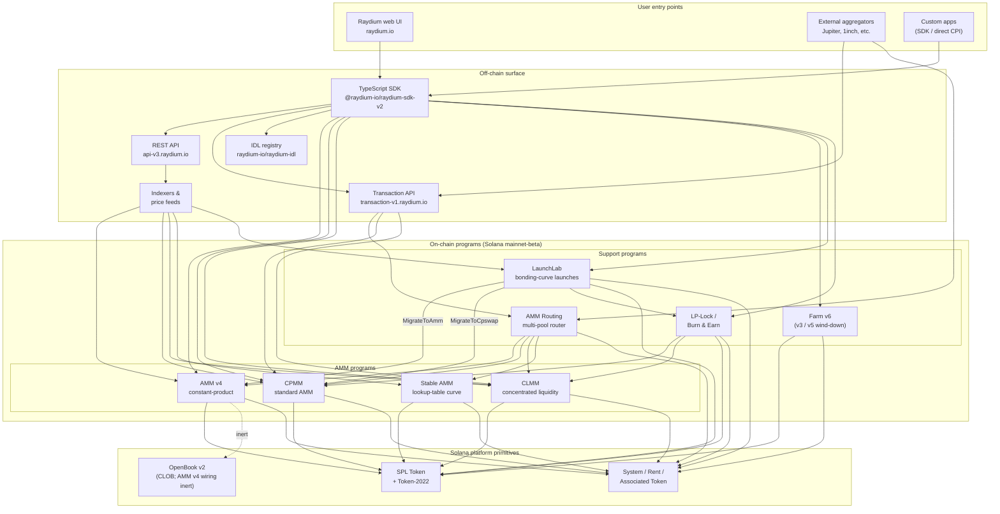

<Info>
  **هذه الصفحة هي مخطط العمارة الأساسي الوحيد للمستندات.** كل فصل آخر يرتبط بها بدلاً من إعادة رسم النظام. معرّفات البرامج لا تُضمّن في هذه الصفحة — بل توجد في [`reference/program-addresses`](/ar/reference/program-addresses) حتى يمكن تحديثها في مكان واحد فقط.
</Info>

<Info>
  **هذه الصفحة مُترجَمة آليًا بواسطة الذكاء الاصطناعي. النسخة الإنجليزية هي المرجع المعتمد.**

  [عرض النسخة الإنجليزية →](/protocol-overview/architecture)
</Info>

## ما هو Raydium بالفعل

Raydium **ليس برنامجًا واحدًا**. بل هو مجموعة من برامج Solana المستقلة على السلسلة التي تشترك في سطح موحد خارج السلسلة (REST API، TypeScript SDK، سجل IDL) وعدد قليل من الاتفاقيات (سلطات PDAs، حسابات إعدادات الرسوم، multisig إداري). أي تفاعل من المستخدم — مبادلة، إيداع، حصاد مزرعة — يتم توجيهه إلى برنامج واحد بالضبط من تلك البرامج؛ السطح خارج السلسلة هو ما يجعلها تبدو كمنتج واحد.

البصمة على السلسلة تُقسّم إلى أربعة أنواع من البرامج:

1. **برامج AMM** — أربعة برامج تجمع منفصلة، كل منها بصيغته الخاصة وحسابات التسعير:
   - **AMM v4** — AMM الناتج الثابت الأصلي. في الأصل كان تصميمًا هجينًا يعكس المنحنى على سوق OpenBook (المعروف سابقًا باسم Serum)؛ تم إلغاء تفعيل التكامل مع OpenBook منذ ذلك الحين والتجمعات الآن تعمل كـ AMMs بحتة مقابل المنحنى. لا يزال أعمق مكان لعديد من الأزواج الرئيسية.
   - **CPMM** — AMM ناتج ثابت عادي (`x · y = k`) مبني بشكل أصلي على Solana، مع دعم من الدرجة الأولى لـ Token-2022. **البرنامج الموصى به للتجمعات الجديدة ذات الناتج الثابت.**
   - **CLMM** — AMM السيولة المركزة بأسلوب Uniswap v3. يتم توفير السيولة في نطاقات سعرية؛ الرسوم تتراكم لكل موضع؛ الحالة منظمة حول ticks و `sqrt_price_x64`.
   - **Stable AMM** — برنامج أسلوب StableSwap رقيق السيولة (فرع من AMM v4 بمنحنى تسعير جدول البحث) يستخدمه الموجّه لأزواج العملات المستقرة المرتبطة. غير معروض كخيار إنشاء تجمع من الدرجة الأولى في واجهة المستخدم اليوم.
2. **توزيع المكافآت** — **Farm** (v3 / v5 / v6، مع v6 كالجيل النشط؛ v3/v5 للإيقاف فقط).
3. **إطلاق الرموز** — **LaunchLab**، برنامج منحنى الارتباط. الإطلاقات الناجحة **تتخرج** إلى تجمع AMM v4 أو تجمع CPMM حسب إعدادات الإطلاق، مع لف الـ LP من خلال برنامج LP-Lock.
4. **أوليات السيولة** — **AMM Routing** (الموجّه متعدد التجمع على السلسلة الذي يُجري CPI إلى برامج AMM الأربعة في معاملة واحدة) و **LP-Lock / Burn & Earn** (يقفل مواضع LP مع إبقاء مطالبات الرسوم مفتوحة).

كل شيء آخر في المكدس — REST APIs، Transaction API، TypeScript SDK، واجهة المستخدم — هو بنية تحتية خارج السلسلة تؤلف هذه البرامج فوق Solana و SPL Token / Token-2022. سطح Perps هو تكامل منفصل فوق شبكة Orderly وليس برنامجًا على السلسلة من Raydium؛ يتم استبعاده من هذا المخطط.

## المخطط الأساسي

الثوابت الرئيسية التي يعكسها هذا المخطط:

- **برامج AMM متساوية.** CPMM لا يستدعي CLMM؛ CLMM لا يستدعي AMM v4؛ Stable AMM هو برنامجه الخاص. المبادلة المباشرة على تجمع واحد تلمس برنامج AMM واحد بالضبط. البرنامج الوحيد الذي يؤلف عدة AMMs في معاملة واحدة هو **AMM Routing**، الذي يُجري CPI إلى AMM v4 / CPMM / CLMM / Stable AMM حسب الحاجة عندما تتقاطع المسار مع أنواع التجمع.
- **SDK و Transaction API هما طبقات تكوين، وليست برامج.** عندما تبني واجهة المستخدم أو محرك تجميع معاملة "مبادلة من خلال ثلاثة تجمعات"، فإن SDK (من جانب العميل) أو Transaction API (من جانب الخادم) يخيط التعليمات معًا باستخدام عروض أسعار مجلوبة من REST API. السلسلة ترى معاملة Solana واحدة مع N تعليمات — لا برنامج منسق يملك التدفق كله.
- **وصلات OpenBook في AMM v4 غير نشطة.** كان AMM v4 البرنامج الوحيد الذي تم ربطه بـ OpenBook، لكن التكامل تم إلغاء تفعيله — التجمعات لا تشارك بعد الآن السيولة مع OpenBook، لم يعد `MonitorStep` مشغّلاً بشكل دوري، وانقطاع OpenBook ليس له تأثير على حركة المبادلة الحالية. تبقى حسابات السوق على `AmmInfo` للتوافق العكسي لكنها تشير إلى حالة غير مستخدمة. CPMM و CLMM و Stable AMM لم يكن لديهم أبدًا تبعية CLOB.
- **LaunchLab يتخرج إلى أحد برنامجي AMM.** إطلاق ناجح يستدعي `MigrateToAmm` (الهدف: AMM v4) أو `MigrateToCpswap` (الهدف: CPMM) حسب `migrate_type` الخاص به؛ إطلاقات Token-2022 تهاجر دائمًا إلى CPMM. الـ LP بعد التخرج ينقسم عبر `PlatformConfig` وشرائح المنشئ/المنصة ملفوفة من خلال برنامج LP-Lock كـ Fee Key NFTs (نمط Burn & Earn).
- **LP-Lock هو غلاف، وليس خامس AMM.** يحتفظ بمواضع LP نيابة عن المنشئين تحت PDA حتى يمكن المطالبة بالرسوم الأساسية دون فتح القدرة على سحب السيولة. يؤلف فوق تجمعات CPMM و CLMM.
- **الأسطح خارج السلسلة تكمل بعضها البعض.** REST API يحتوي على قراءة فقط مع التخزين المؤقت؛ Transaction API يبني معاملات جاهزة للتوقيع من جانب الخادم؛ SDK يبنيها من جانب العميل. جميعها تعتمد على نفس سجل IDL كمصدر حقيقة الأسكيما.

## تدفق البيانات: مبادلة CPMM، من البداية إلى النهاية

لجعل الصورة واضحة، إليك ما يحدث عندما يبادل المستخدم USDC → RAY على تجمع CPMM من واجهة Raydium. (AMM v4 و CLMM يختلفان في الحسابات التي يحتاجان إليها، وليس في الشكل العام.)

1. **طلب عرض السعر (خارج السلسلة).** واجهة المستخدم تستدعي `GET https://api-v3.raydium.io/compute/swap-base-in` مع الـ mint للإدخال، والـ mint للإخراج، والمبلغ، وتسامح الانزلاق. API تستشير الفهرس الخاص بها، واختيار المسار (ربما من خلال تجمعات متعددة)، وتعيد عرض سعر بالإضافة إلى قائمة معرّفات البرامج، ومعرّفات التجمع، وحسابات الرسوم التي سيحتاجها العميل.
2. **بناء المعاملة (عميل + SDK).** العميل يمرر عرض السعر إلى `raydium-sdk-v2`. SDK يحل كل PDA الذي يحتاجه (سلطة PDA، حالة التجمع، الملاحظة، الأقبية — انظر [`products/cpmm/accounts`](/ar/products/cpmm/accounts))، يحقن حسابات الرموز المرتبطة بالمستخدم (ينشئها مع برنامج Associated Token إذا كانت مفقودة)، ويصدر `Transaction` غير موقعة.
3. **توقيع المحفظة.** محفظة المستخدم توقع المعاملة. لا شيء محدد لـ Raydium هنا؛ هذا هو تدفق محفظة Solana القياسي.
4. **التنفيذ على السلسلة.** المعاملة الموقعة تصل إلى برنامج Raydium **CPMM**، الذي (أ) يتحقق من حالة التجمع، (ب) يطبق منحنى الناتج الثابت مع إعداد الرسوم في التجمع، (ج) ينقل الرموز بين ATAs المستخدم وأقبية التجمع عبر CPI إلى SPL Token / Token-2022، (د) يحدّث حساب `observation` لـ TWAP، و (هـ) يعود.
5. **استيعاب الفهرس.** RPC Solana بعد عدة مسافات يكشف سجلات البرنامج. فهرس Raydium يحللها، يحدّث احتياطيات التجمع، حجم 24 ساعة، و APR، ويخدم القيم المحدثة لطلب `/pools/info/ids` التالي.

جميع الخطوات 2–4 تحدث ضمن معاملة Solana واحدة. API متورط فقط في **الخطوة 1** (عرض السعر) و **الخطوة 5** (الفهرسة للمرة التالية). إذا كان API معطلاً، عميل لديه SDK مباشر و Solana RPC يمكنه التعامل برغم ذلك — لكنه يجب أن يحسب المسار بنفسه.

## البنية التحتية المشتركة

عدة أوليات تستخدمها كل منتج وجديرة بالتسمية مرة واحدة حتى يمكن للفصول اللاحقة الإشارة إليها بدون إعادة تعريف. التفاصيل موجودة في [`protocol-overview/shared-infrastructure`](/ar/protocol-overview/shared-infrastructure)؛ هذا هو الفهرس.

| الأولى | ما هي | حيث يتم تعريفها |
|-----------|------------|---------------------|
| **Authority PDA** | موقّع مملوك من البرنامج يتحكم فعلاً في أقبية الرموز. المستخدمون لا يملكون أبدًا سلطة الأقبية. | لكل برنامج؛ CPMM يستخدم `vault_and_lp_mint_auth_seed` — انظر [`products/cpmm/accounts`](/ar/products/cpmm/accounts). |
| **حسابات الإعدادات** | حسابات لكل برنامج تحتفظ بمعدلات الرسوم، مفاتيح المسؤول، وجهات الصندوق/المنشئ. مفهرسة بـ `u16` في CPMM (`amm_config[index]`). | [`reference/program-addresses`](/ar/reference/program-addresses) تسرد نقاط نهاية API التي تعيدها. |
| **تقسيم رسوم البروتوكول/الصندوق/المنشئ** | رسم تجارة واحد ينقسم ثلاث طرق (أحيانًا أربع) عند التسوية. نفس النمط في CPMM و CLMM، مفاتيح مختلفة. | [`reference/fee-comparison`](/ar/reference/fee-comparison) |
| **حساب الملاحظة** | حلقة ذاكرة التخزين المؤقت من عينات الأسعار المستخدمة لـ TWAP. مكتوب على كل مبادلة. | [`products/cpmm/accounts`](/ar/products/cpmm/accounts)، [`products/clmm/accounts`](/ar/products/clmm/accounts) |
| **REST API (`api-v3.raydium.io`)** | واجهة القراءة العامة الوحيدة لبيانات تعريف التجمع، المواضع، حالة المزرعة، وحسابات عرض السعر. | [`sdk-api/rest-api`](/ar/sdk-api/rest-api) |
| **سجل IDL** | Anchor IDLs لكل برنامج، مُعكوس في [`github.com/raydium-io/raydium-idl`](https://github.com/raydium-io/raydium-idl). SDK و CPI المتكاملون يفكّون الترميز مقابل هذه. | [`sdk-api/anchor-idl`](/ar/sdk-api/anchor-idl) |

## السطح خارج السلسلة: API مقابل SDK مقابل IDL

هذه الثلاثة غالبًا ما يتم الخلط بينها. تفعل أشياء مختلفة:

- **REST API** (`api-v3.raydium.io`) هو **عرض مقروء في الغالب، مخزن مؤقتًا** لحالة السلسلة بالإضافة إلى **محرك عرض السعر**. تخبرك بأي تجمعات موجودة، ما احتياطياتها، كيف تبدو APRs، وما أفضل مسار للمبادلة. لا **تبني** المعاملات.
- **TypeScript SDK** (`@raydium-io/raydium-sdk-v2`) هو **منشئ معاملات**. يعرف تخطيط حساب وتنسيق تعليمات كل برنامج. يجلب الحالة الطازجة من RPC (وليس من API) قبل تكوين تعليمة، حتى يمكنه توقيع معاملات دقيقة. يتحدث إلى API فقط عندما يحتاج إلى عرض سعر.
- **سجل IDL** هو **الأسكيما** التي تعتمد عليها كلتاهما. إذا كنت تكتب Rust CPIs إلى برنامج Raydium، فإن IDL هو العقد؛ إذا كنت تكتب تكامل TS، فأنت تستخدم IDLs بشكل غير مباشر من خلال SDK.

## حيث يناسب كل فصل

المخطط أعلاه يتكرر — بشكل مختصر — في جميع المستندات. إليك حيث يعيش العلاج الكامل لكل جزء حتى تتمكن من الغوص:

- **برامج على السلسلة:** فصل واحد لكل منتج تحت [`products/`](/ar/products). كل فصل يتبع نفس القالب (نظرة عامة → حسابات → رياضيات → تعليمات → رسوم → عروض توضيحية للكود).
- **أوليات مشتركة عابرة للبرنامج:** [`protocol-overview/shared-infrastructure`](/ar/protocol-overview/shared-infrastructure) و [`algorithms/`](/ar/algorithms) للرياضيات التي تتكرر (ناتج ثابت، سيولة مركزة، تسعير منحنى).
- **السطح خارج السلسلة:** [`sdk-api/`](/ar/sdk-api) لديها مرجع SDK و REST API الكامل، بالإضافة إلى [`sdk-api/anchor-idl`](/ar/sdk-api/anchor-idl) و [`sdk-api/rust-cpi`](/ar/sdk-api/rust-cpi).
- **تدفقات على مستوى المستخدم (إنشاء تجمع، مبادلة، LP، مطالبة المكافآت، إطلاق رمز):** [`user-flows/`](/ar/user-flows).
- **أنماط التكامل للفرق الأخرى (محركات التجميع، المحافظ، الروبوتات):** [`integration-guides/`](/ar/integration-guides).
- **سطح الأمان، مفاتيح المسؤول، المخاطر المعروفة، عمليات التدقيق:** [`security/`](/ar/security).
- **التغييرات المصدّرة وقصة الهجرة من AMM v4 → CPMM / Farm v3 → v6:** [`protocol-overview/versions-and-migration`](/ar/protocol-overview/versions-and-migration).

## ما لا يقصده هذا المخطط

عدة حذف مقصود، حتى لا يقرأ أحد أكثر مما هو موجود:

- **لا أوراق أسعار.** Raydium لا يعتمد على Pyth، Switchboard، أو أي أوراق أسعار خارجية لتسعير AMM الأساسي. عروض الأسعار تأتي من الاحتياطيات على السلسلة. حساب `observation` موجود حتى تتمكن **البرامج الأخرى** من قراءة Raydium TWAP — Raydium نفسه لا يحتاجه.
- **لا برنامج تصويت رمز على السلسلة.** الإجراءات الإدارية مثل تحديثات إعدادات الرسوم وترقيات البرنامج يتم تنفيذها بواسطة multisig. مفاتيح multisig وسياسة التدوير موجودة في [`security/admin-and-multisig`](/ar/security/admin-and-multisig).
- **لا جسور.** Raydium محلي على Solana. تدفقات عابرة للسلاسل هي مشكلة المتكامل وتعيش خارج هذا المخطط.

المصادر:

- [`reference/program-addresses`](/ar/reference/program-addresses) لمعرّفات البرامج الأساسية المشار إليها في جميع أنحاء هذه الصفحة
- [github.com/raydium-io/raydium-sdk-V2](https://github.com/raydium-io/raydium-sdk-V2)
- [github.com/raydium-io/raydium-idl](https://github.com/raydium-io/raydium-idl)
