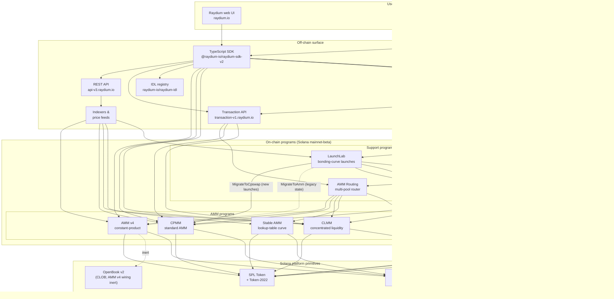

<Info>
  **هذه الصفحة هي مخطط العمارة الموثوق الوحيد للتوثيق.** تربط كل فصل آخر هنا بدلاً من إعادة رسم النظام. معرفات البرامج لا تُضمّن في هذه الصفحة — فهي موجودة في [`reference/program-addresses`](/ar/reference/program-addresses) حتى يمكن تحديثها في مكان واحد فقط.
</Info>

## ما هو Raydium فعلاً

Raydium **ليس برنامجاً واحداً**. إنها مجموعة من برامج Solana المستقلة على السلسلة التي تشترك في سطح موحد خارج السلسلة (REST API، TypeScript SDK، سجل IDL) وعدد قليل من الاتفاقيات (PDAs السلطة، حسابات إعدادات الرسوم، multisig الإدارة). يتم توجيه تفاعل المستخدم — مبادلة، إيداع، حصاد المزرعة — إلى برنامج واحد بالضبط من تلك البرامج؛ السطح خارج السلسلة هو ما يجعلها تبدو كمنتج واحد.

تنقسم البصمة على السلسلة إلى أربعة أنواع من البرامج:

1. **برامج AMM** — أربعة برامج مجموعة منفصلة، لكل منها صيغتها الخاصة وحسابات التسعير:
   - **AMM v4** — AMM ثابت الحاصل الأصلي. في الأصل تصميم هجين عكس المنحنى على سوق OpenBook (سابقاً Serum)؛ تم إلغاء تفعيل تكامل OpenBook منذ ذلك الحين والآن تعمل المجموعات كـ AMMs نقية ضد المنحنى. لا تزال أعمق مكان لعديد من الأزواج الرئيسية.
   - **CPMM** — AMM ثابت الحاصل عادي (`x · y = k`) مبني بشكل أصلي على Solana، مع دعم من الدرجة الأولى لـ Token-2022. **البرنامج الموصى به للمجموعات الجديدة ذات الحاصل الثابت.**
   - **CLMM** — AMM بسيولة مركزة بأسلوب Uniswap v3. يتم توفير السيولة في نطاقات الأسعار؛ تتراكم الرسوم لكل مركز؛ يتم تنظيم الحالة حول ticks و `sqrt_price_x64`.
   - **Stable AMM** — برنامج StableSwap بسيولة رقيقة (مشتق من AMM v4 مع منحنى تسعير جدول البحث) يستخدمه الموجه للأزواج المرتبطة بالعملات المستقرة. لم يتم عرضه كخيار إنشاء مجموعة من الدرجة الأولى في الواجهة اليوم.
2. **توزيع المكافآت** — **Farm** (v3 / v5 / v6، مع v6 كالجيل النشط؛ v3/v5 للإيقاف فقط).
3. **إطلاق الرموز** — **LaunchLab**، برنامج منحنى الربط. تتخرج الإطلاقات المهيأة حديثاً **إلى CPMM**. تبقى تعليمات الترحيل AMM v4 القديمة للحالة الموجودة.
4. **بدائل السيولة** — **AMM Routing** (موجه المجموعات المتعددة على السلسلة الذي يقوم بـ CPI إلى برامج AMM الأربعة في معاملة واحدة) و **LP-Lock / Burn & Earn** (يقفل مراكز LP مع الحفاظ على مطالبات الرسوم مفتوحة).

كل شيء آخر في المكدس — REST APIs، Transaction API، TypeScript SDK، الواجهة — هو بنية تحتية خارج السلسلة تؤلف هذه البرامج فوق Solana و SPL Token / Token-2022. سطح Perps هو تكامل منفصل فوق Orderly Network وليس برنامج Raydium على السلسلة؛ يتم استبعاده من هذا المخطط.

## المخطط الموثوق

```mermaid
flowchart TB
  subgraph user ["User entry points"]
    UI["Raydium web UI<br/>raydium.io"]
    AGG["External aggregators<br/>Jupiter, 1inch, etc."]
    CUST["Custom apps<br/>(SDK / direct CPI)"]
  end

  subgraph offchain ["Off-chain surface"]
    API["REST API<br/>api-v3.raydium.io"]
    TXAPI["Transaction API<br/>transaction-v1.raydium.io"]
    SDK["TypeScript SDK<br/>@raydium-io/raydium-sdk-v2"]
    IDL["IDL registry<br/>raydium-io/raydium-idl"]
    IDX["Indexers &<br/>price feeds"]
  end

  subgraph onchain ["On-chain programs (Solana mainnet-beta)"]
    subgraph amms ["AMM programs"]
      direction TB
      AMM4["AMM v4<br/>constant-product"]
      CPMM["CPMM<br/>standard AMM"]
      CLMM["CLMM<br/>concentrated liquidity"]
      STABLE["Stable AMM<br/>lookup-table curve"]
    end

    subgraph support ["Support programs"]
      direction TB
      ROUTE["AMM Routing<br/>multi-pool router"]
      FARM["Farm v6<br/>(v3 / v5 wind-down)"]
      LAUNCH["LaunchLab<br/>bonding-curve launches"]
      LOCK["LP-Lock /<br/>Burn & Earn"]
    end
  end

  subgraph solana ["Solana platform primitives"]
    TOKEN["SPL Token<br/>+ Token-2022"]
    OB["OpenBook v2<br/>(CLOB; AMM v4 wiring inert)"]
    SYS["System / Rent /<br/>Associated Token"]
  end

  %% Client paths
  UI --> SDK
  CUST --> SDK
  AGG --> TXAPI
  AGG --> ROUTE

  %% Off-chain composition
  SDK --> API
  SDK --> TXAPI
  SDK --> IDL
  SDK --> AMM4
  SDK --> CPMM
  SDK --> CLMM
  SDK --> FARM
  SDK --> LAUNCH
  SDK --> LOCK

  TXAPI --> ROUTE
  TXAPI --> CPMM
  TXAPI --> CLMM

  API --> IDX
  IDX --> AMM4
  IDX --> CPMM
  IDX --> CLMM
  IDX --> STABLE
  IDX --> LAUNCH

  %% Routing → AMM programs (CPI)
  ROUTE --> AMM4
  ROUTE --> CPMM
  ROUTE --> CLMM
  ROUTE --> STABLE

  %% LaunchLab graduation paths
  LAUNCH -- "MigrateToCpswap (new launches)" --> CPMM
  LAUNCH -. "MigrateToAmm (legacy state)" .-> AMM4
  LAUNCH --> LOCK

  %% LP-Lock wraps LP from CPMM / CLMM pools
  LOCK --> CPMM
  LOCK --> CLMM

  %% Programs → SPL Token / Token-2022
  AMM4 --> TOKEN
  CPMM --> TOKEN
  CLMM --> TOKEN
  STABLE --> TOKEN
  FARM --> TOKEN
  LAUNCH --> TOKEN
  LOCK --> TOKEN

  %% AMM v4's historical OpenBook wiring is inert
  AMM4 -. "inert" .-> OB

  %% Programs → System / Rent / ATA
  AMM4 --> SYS
  CPMM --> SYS
  CLMM --> SYS
  STABLE --> SYS
  FARM --> SYS
  LAUNCH --> SYS
  LOCK --> SYS
  ROUTE --> SYS
```

الثوابت الرئيسية التي يلتقطها هذا المخطط:

- **برامج AMM متساوية.** CPMM لا يستدعي CLMM؛ CLMM لا يستدعي AMM v4؛ Stable AMM هو برنامجه الخاص. المبادلة المباشرة على مجموعة واحدة تلمس برنامج AMM واحد بالضبط. البرنامج الوحيد الذي يؤلف عدة AMMs في معاملة واحدة هو **AMM Routing**، الذي يقوم بـ CPI إلى AMM v4 / CPMM / CLMM / Stable AMM حسب الحاجة عندما تعبر المسار أنواع المجموعات.
- **SDK و Transaction API هما طبقات تكوين، وليسا برامج.** عندما تبني الواجهة الويب أو المجمع "مبادلة عبر ثلاث مجموعات"، يقوم SDK (من جانب العميل) أو Transaction API (من جانب الخادم) بخياطة التعليمات معاً باستخدام الاقتباسات المجلوبة من REST API. السلسلة ترى معاملة Solana واحدة مع N تعليمات — لا يمتلك برنامج منسق التدفق بأكمله.
- **توصيل OpenBook في AMM v4 خامل.** كان AMM v4 هو AMM الوحيد المرتبط بـ OpenBook، لكن التكامل تم إلغاء تفعيله — لا تشارك المجموعات السيولة مع OpenBook بعد الآن، لم يعد `MonitorStep` مشغلاً، وانقطاع OpenBook ليس له تأثير على حركة المبادلة الحالية. تبقى حسابات السوق على `AmmInfo` للمجموعة للتوافق العكسي لكنها تشير إلى حالة غير مستخدمة. CPMM و CLMM و Stable AMM لم يكن لديهم أبداً اعتماد CLOB.
- **مجموعات LaunchLab الجديدة تتخرج إلى CPMM.** الآن يتطلب التهيئة `migrate_type = CPSWAP`. يبقى `MigrateToAmm` للحالة القديمة الموجودة. قبل ترقية 2026-08-14، كان ترحيل CPMM يقفل `creator_scale` بشكل منفصل للمنشئ. الترحيلات المنفذة بعد ذلك تجمع بينه وبين `platform_scale` في مركز LP مقفول واحد مملوك للمنصة. مفاتيح الرسوم السابقة تبقى دون تغيير.
- **LP-Lock هو غلاف، وليس AMM خامس.** يحتفظ بمراكز LP نيابة عن المنشئين تحت PDA حتى يمكن لا تزال مطالبة الرسوم الأساسية دون فتح القدرة على سحب السيولة. يؤلف فوق مجموعات CPMM و CLMM.
- **الأسطح خارج السلسلة تكمل بعضها البعض.** REST API للقراءة فقط مع التخزين المؤقت؛ Transaction API ينشئ معاملات جاهزة للتوقيع من جانب الخادم؛ SDK ينشئها من جانب العميل. تعتمد جميعها على نفس سجل IDL كمصدر الحقيقة للمخطط.

## تدفق البيانات: مبادلة CPMM، من البداية إلى النهاية

لجعل الصورة واضحة، إليك ما يحدث عندما يقوم المستخدم بمبادلة USDC → RAY على مجموعة CPMM من واجهة Raydium. (AMM v4 و CLMM يختلفان في الحسابات التي يحتاجانها، وليس في الشكل العام.)

1. **طلب الاقتباس (خارج السلسلة).** تستدعي الواجهة `GET https://api-v3.raydium.io/compute/swap-base-in` مع mint الإدخال، mint الإخراج، المبلغ، وتسامح الانزلاق. تستشير API فهرسها، تختار مسار (ربما عبر مجموعات متعددة)، وتعيد اقتباس بالإضافة إلى قائمة معرفات البرامج، معرفات المجموعات، وحسابات الرسوم التي سيحتاجها العميل.
2. **بناء المعاملة (عميل + SDK).** يمرر العميل الاقتباس إلى `raydium-sdk-v2`. يحل SDK كل PDA يحتاجه (PDA السلطة، حالة المجموعة، الملاحظة، الأقبية — انظر [`products/cpmm/accounts`](/ar/products/cpmm/accounts))، يحقن حسابات الرموز المرتبطة بالمستخدم (ينشئها مع برنامج الرموز المرتبطة إذا كانت مفقودة)، ويصدر `Transaction` غير موقعة.
3. **توقيع المحفظة.** توقع محفظة المستخدم المعاملة. لا شيء خاص بـ Raydium هنا؛ هذا هو تدفق محفظة Solana القياسي.
4. **التنفيذ على السلسلة.** تصل المعاملة الموقعة إلى برنامج Raydium **CPMM**، الذي (أ) يتحقق من حالة المجموعة، (ب) يطبق منحنى الحاصل الثابت مع إعدادات رسوم المجموعة، (ج) ينقل الرموز بين ATAs المستخدم وأقبية المجموعة عبر CPI إلى SPL Token / Token-2022، (د) يحدث حساب `observation` لـ TWAP، و (هـ) يعود.
5. **استيعاب الفهرس.** يكشف RPC Solana بعد بضع فتحات عن سجلات البرنامج. يحلل فهرس Raydium السجلات، يحدث احتياطيات المجموعة، حجم 24 ساعة، و APR، ويخدم القيم المحدثة لطلب `/pools/info/ids` التالي.

تحدث جميع الخطوات 2–4 ضمن معاملة Solana واحدة. API متورط فقط في **الخطوة 1** (اقتباس) و **الخطوة 5** (الفهرسة للمرة التالية). إذا كانت API معطلة، يمكن للعميل الذي لديه SDK حي و RPC Solana أن يتعامل بشكل طبيعي — فقط يتعين عليه حساب المسار بنفسه.

## البنية التحتية المشتركة

يتم استخدام عدة بدائل من قبل كل منتج وتستحق التسمية مرة واحدة حتى تتمكن الفصول اللاحقة من الإشارة إليها دون إعادة تعريف. التفاصيل موجودة في [`protocol-overview/shared-infrastructure`](/ar/protocol-overview/shared-infrastructure)؛ هذا هو الفهرس.

| البدائل | ما هي | حيث يتم تعريفها |
|-----------|------------|---------------------|
| **Authority PDA** | موقّع مملوك للبرنامج يتحكم فعلاً في أقبية الرموز. لا يمتلك المستخدمون سلطة القبو. | لكل برنامج؛ CPMM يستخدم `vault_and_lp_mint_auth_seed` — انظر [`products/cpmm/accounts`](/ar/products/cpmm/accounts). |
| **حسابات الإعدادات** | حسابات لكل برنامج تحتفظ بمعدلات الرسوم، مفاتيح الإدارة، وجهات الصندوق/المنشئ. مفهرسة بـ `u16` في CPMM (`amm_config[index]`). | [`reference/program-addresses`](/ar/reference/program-addresses) يسرد نقاط نهاية API التي تعيدها. |
| **تقسيم رسوم البروتوكول/الصندوق/المنشئ** | يتم تقسيم رسوم التجارة الواحدة ثلاث (أحياناً أربع) طرق عند التسوية. نفس النمط في CPMM و CLMM، أزرار مختلفة. | [`reference/fee-comparison`](/ar/reference/fee-comparison) |
| **حساب الملاحظة** | حلقة دائرية من عينات الأسعار المستخدمة لـ TWAP. مكتوب على كل مبادلة. | [`products/cpmm/accounts`](/ar/products/cpmm/accounts)، [`products/clmm/accounts`](/ar/products/clmm/accounts) |
| **REST API (`api-v3.raydium.io`)** | API القراءة العامة الوحيدة لبيانات وصف المجموعة، المراكز، حالة المزرعة، وحساب الاقتباس. | [`sdk-api/rest-api`](/ar/sdk-api/rest-api) |
| **سجل IDL** | Anchor IDLs لكل برنامج، معكوس في [`github.com/raydium-io/raydium-idl`](https://github.com/raydium-io/raydium-idl). يقوم SDK و CPI المدمجون بفك التسلسل ضدها. | [`sdk-api/anchor-idl`](/ar/sdk-api/anchor-idl) |

## السطح خارج السلسلة: API مقابل SDK مقابل IDL

هذه الثلاثة يتم الخلط بينها بشكل روتيني. يفعلون أشياء مختلفة:

- **REST API** (`api-v3.raydium.io`) هو **عرض مخزن مؤقت، في الغالب للقراءة** من حالة على السلسلة بالإضافة إلى **محرك الاقتباس**. يخبرك بأي مجموعات موجودة، ما هي احتياطياتها، كيف تبدو APRs، وما هو أفضل مسار للمبادلة. إنه **لا** ينشئ معاملات.
- **TypeScript SDK** (`@raydium-io/raydium-sdk-v2`) هو **منشئ معاملات**. يعرف تخطيط الحساب وتنسيق التعليمات لكل برنامج. يجلب حالة طازجة من RPC (وليس من API) قبل تكوين تعليمة، حتى يتمكن من توقيع معاملات دقيقة. يتحدث إلى API فقط عندما يحتاج إلى اقتباس.
- **سجل IDL** هو **المخطط** الذي يعتمد عليه كلاهما. إذا كنت تكتب Rust CPIs إلى برنامج Raydium، فإن IDL هو العقد؛ إذا كنت تكتب تكامل TS، فأنت تستخدم IDLs بشكل غير مباشر عبر SDK.

## حيث يناسب كل فصل

يتكرر المخطط أعلاه — بشكل مختزل — في جميع أنحاء التوثيق. إليك حيث يعيش العلاج الكامل لكل جزء حتى تتمكن من الحفر:

- **برامج على السلسلة:** فصل واحد لكل منتج تحت [`products/`](/ar/products). يتبع كل فصل نفس القالب (نظرة عامة → حسابات → رياضيات → تعليمات → رسوم → عروض توضيحية للكود).
- **بدائل مشتركة عبر البرامج:** [`protocol-overview/shared-infrastructure`](/ar/protocol-overview/shared-infrastructure) و [`algorithms/`](/ar/algorithms) للرياضيات التي تتكرر (ثابت الحاصل، سيولة مركزة، تسعير المنحنى).
- **السطح خارج السلسلة:** [`sdk-api/`](/ar/sdk-api) لديها مرجع SDK و REST API الكامل، بالإضافة إلى [`sdk-api/anchor-idl`](/ar/sdk-api/anchor-idl) و [`sdk-api/rust-cpi`](/ar/sdk-api/rust-cpi).
- **تدفقات على مستوى المستخدم (إنشاء مجموعة، مبادلة، LP، مطالبة المكافآت، إطلاق رمز):** [`user-flows/`](/ar/user-flows).
- **أنماط التكامل للفرق الأخرى (المجمعات، المحافظ، الروبوتات):** [`integration-guides/`](/ar/integration-guides).
- **سطح الأمان، مفاتيح الإدارة، المخاطر المعروفة، التدقيقات:** [`security/`](/ar/security).
- **التغييرات المصدرة وقصة الترحيل AMM v4 → CPMM / Farm v3 → v6:** [`protocol-overview/versions-and-migration`](/ar/protocol-overview/versions-and-migration).

## أهداف غير محققة لهذا المخطط

بعض الحذف المتعمد، حتى لا يقرأ أحد أكثر مما هو موجود:

- **لا توجد أوراكل أسعار.** Raydium لا تعتمد على Pyth أو Switchboard أو أي أوراكل خارجي لتسعير AMM الأساسي. تأتي الاقتباسات من الاحتياطيات على السلسلة. حساب `observation` موجود حتى **تتمكن العقود الأخرى** من قراءة Raydium TWAP — Raydium نفسها لا تحتاجه.
- **لا يوجد برنامج تصويت رموز على السلسلة.** يتم تنفيذ الإجراءات الإدارية مثل تحديثات إعدادات الرسوم وترقيات البرنامج بواسطة multisig. مفاتيح multisig وسياسة الدوران موجودة في [`security/admin-and-multisig`](/ar/security/admin-and-multisig).
- **لا توجد جسور.** Raydium أصلية على Solana. تدفقات عبر السلاسل هي مشكلة المدمج وتعيش خارج هذا المخطط.

المصادر:

- [`reference/program-addresses`](/ar/reference/program-addresses) لمعرفات البرامج الموثوقة المشار إليها في جميع أنحاء هذه الصفحة
- [github.com/raydium-io/raydium-sdk-V2](https://github.com/raydium-io/raydium-sdk-V2)
- [github.com/raydium-io/raydium-idl](https://github.com/raydium-io/raydium-idl)
