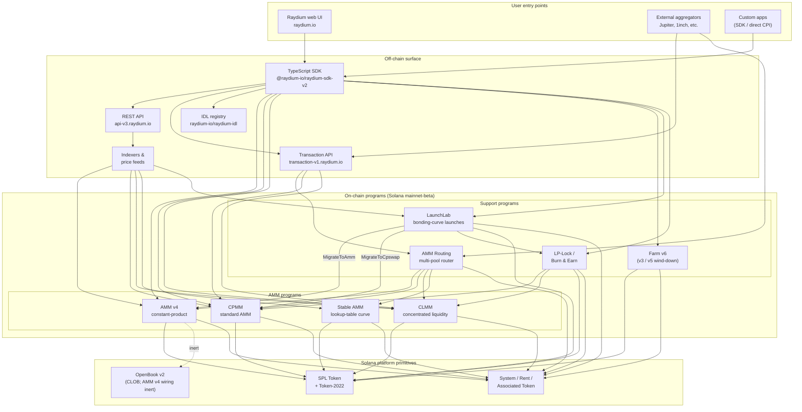

<Info>
  **Diese Seite wurde mit KI automatisch übersetzt. Maßgeblich ist stets die englische Version.**

  [Englische Version ansehen →](/protocol-overview/architecture)
</Info>

<Info>
  **Diese Seite ist das einzige kanonische Architektur-Diagramm der Dokumentation.** Alle anderen Kapitel verlinken hierher, statt das System neu zu zeichnen. Programm-IDs sind nicht in diese Seite eingebettet — sie befinden sich in [`reference/program-addresses`](/de/reference/program-addresses), damit sie genau an einer Stelle aktualisiert werden können.
</Info>

## Was Raydium wirklich ist

Raydium ist **nicht ein Programm**. Es ist eine Reihe unabhängiger On-Chain-Solana-Programme, die eine gemeinsame Off-Chain-Oberfläche (REST-API, TypeScript SDK, IDL-Registry) und einige wenige Konventionen (Authority-PDAs, Fee-Config-Konten, Admin-Multisig) teilen. Eine Benutzerinteraktion — ein Swap, eine Einzahlung, ein Farm-Harvest — wird in genau eines dieser Programme geroutet; die Off-Chain-Oberfläche ist das, was sie wie ein einzelnes Produkt wirken lässt.

Der On-Chain-Footprint gliedert sich in vier Arten von Programmen:

1. **AMM-Programme** — vier separate Pool-Programme, jedes mit eigenem Format und Preismodell:
   - **AMM v4** — das ursprüngliche Constant-Product-AMM. Ursprünglich ein Hybrid-Design, das die Kurve auf einem OpenBook (ehemals Serum) Markt spiegelte; die OpenBook-Integration wurde seitdem deaktiviert und Pools funktionieren nun als reine AMMs gegen die Kurve. Immer noch die tiefste Venue für viele große Paare.
   - **CPMM** — ein einfaches Constant-Product-AMM (`x · y = k`), nativ auf Solana gebaut, mit First-Class-Token-2022-Unterstützung. **Das empfohlene Programm für neue Constant-Product-Pools.**
   - **CLMM** — ein Concentrated-Liquidity-AMM im Uniswap-v3-Stil. Liquidität wird in Preisbereiche bereitgestellt; Gebühren fallen pro Position an; der Status ist um Ticks und `sqrt_price_x64` organisiert.
   - **Stable AMM** — ein dünnflüssiges StableSwap-ähnliches Programm (geforkt von AMM v4 mit einer Lookup-Table-Preiskurve), das der Router für stablecoin-korrelierte Paare nutzt. Wird heute in der UI nicht als First-Class-Create-Pool-Option angeboten.
2. **Reward-Verteilung** — **Farm** (v3 / v5 / v6, wobei v6 die aktive Generation ist; v3/v5 sind nur für die Abwicklung).
3. **Token-Launch** — **LaunchLab**, ein Bonding-Curve-Programm. Erfolgreiche Launches **graduieren** in einen AMM-v4-Pool oder einen CPMM-Pool, je nach der Konfiguration des Launches, wobei der LP durch das LP-Lock-Programm umhüllt wird.
4. **Liquidity-Primitive** — **AMM Routing** (der On-Chain-Multi-Pool-Router, der per CPI in die vier AMM-Programme in einer einzigen Transaktion aufruft) und **LP-Lock / Burn & Earn** (sperrt LP-Positionen, während Fee-Claims offen bleiben).

Alles andere im Stack — die REST-APIs, die Transaction API, das TypeScript SDK, die UI — ist Off-Chain-Infrastruktur, die diese Programme auf Solana und SPL Token / Token-2022 komponiert. Die Perps-Oberfläche ist eine separate Integration auf Orderly Network und ist kein On-Chain-Raydium-Programm; sie ist aus diesem Diagramm ausgenommen.

## Kanonisches Diagramm

Schlüssel-Invarianten, die dieses Diagramm zeigt:

- **AMM-Programme sind ebenbürtig.** CPMM ruft nicht in CLMM auf; CLMM ruft nicht in AMM v4 auf; Stable AMM ist sein eigenes Programm. Ein direkter Swap in einem Pool berührt genau ein AMM-Programm. Das einzige Programm, das mehrere AMMs in einer einzigen Transaktion komponiert, ist **AMM Routing**, das per CPI in AMM v4 / CPMM / CLMM / Stable AMM aufruft, wenn eine Route Pool-Typen kreuzt.
- **Das SDK und die Transaction API sind Kompositionsschichten, keine Programme.** Wenn die Web-UI oder ein Aggregator eine „Swap durch drei Pools"-Transaktion zusammenbaut, näht das SDK (clientseitig) oder die Transaction API (serverseitig) die Instruktionen zusammen, indem es Quotes von der REST-API abruft. Die Chain sieht eine einzige Solana-Transaktion mit N Instruktionen — kein Orchestrator-Programm besitzt den ganzen Flow.
- **Die OpenBook-Verdrahtung von AMM v4 ist inert.** AMM v4 war das einzige AMM, das je an OpenBook gebunden war, aber die Integration wurde deaktiviert — Pools teilen Liquidität nicht mehr mit OpenBook, `MonitorStep` wird nicht mehr cranked, und ein OpenBook-Ausfall hat keine Auswirkungen auf den aktuellen Swap-Traffic. Die Market-Konten bleiben auf der `AmmInfo` des Pools für Rückwärtskompatibilität, referenzieren aber ungenutzten Status. CPMM, CLMM und Stable AMM hatten nie eine CLOB-Abhängigkeit.
- **LaunchLab graduiert in eines von zwei AMM-Programmen.** Ein erfolgreicher Launch ruft `MigrateToAmm` (Ziel: AMM v4) oder `MigrateToCpswap` (Ziel: CPMM) auf, je nach seinem `migrate_type`; Token-2022-Launches migrieren immer zu CPMM. Der LP nach der Graduierung wird via `PlatformConfig` geteilt und die Creator/Platform-Slices werden durch das LP-Lock-Programm als Fee-Key-NFTs umhüllt (das Burn & Earn-Muster).
- **LP-Lock ist ein Wrapper, kein fünftes AMM.** Er hält LP-Positionen im Namen von Creatorn unter einer PDA, sodass die zugrunde liegenden Gebühren immer noch eingefordert werden können, ohne die Möglichkeit zu exponieren, Liquidität abzuziehen. Er komponiert über CPMM- und CLMM-Pools.
- **Off-Chain-Oberflächen ergänzen sich gegenseitig.** Die REST-API ist read-only mit Caching; die Transaction API erstellt ready-to-sign-Transaktionen serverseitig; das SDK erstellt sie clientseitig. Alle drei hängen von der gleichen IDL-Registry als Schemawahrheitsquelle ab.

## Datenfluss: ein CPMM Swap, durchgehend

Um das Bild konkret zu machen, hier ist, was passiert, wenn ein Benutzer USDC → RAY in einem CPMM-Pool von der Raydium-UI swapped. (AMM v4 und CLMM unterscheiden sich in den Konten, die sie benötigen, nicht in der High-Level-Form.)

1. **Quote-Anfrage (Off-Chain).** Die UI ruft `GET https://api-v3.raydium.io/compute/swap-base-in` mit dem Input-Mint, Output-Mint, Betrag und Slippage-Toleranz auf. Die API konsultiert ihren Indexer, wählt eine Route (möglicherweise über mehrere Pools) und gibt ein Quote plus die Liste der Programm-IDs, Pool-IDs und Fee-Konten zurück, die der Client benötigt.
2. **Transaction-Erstellung (Client + SDK).** Der Client übergibt das Quote an `raydium-sdk-v2`. Das SDK löst jede benötigte PDA auf (Authority PDA, Pool State, Observation, Vaults — siehe [`products/cpmm/accounts`](/de/products/cpmm/accounts)), injiziert die Associated Token Accounts des Benutzers (erstellt sie mit dem Associated Token Program, falls fehlend) und gibt eine unsignierte `Transaction` aus.
3. **Wallet-Signatur.** Das Wallet des Benutzers signiert die Transaktion. Nichts Raydium-Spezifisches hier; dies ist der Standard-Solana-Wallet-Flow.
4. **On-Chain-Ausführung.** Die signierte Transaktion trifft das Raydium-**CPMM-Programm**, das (a) den Pool-Status validiert, (b) die Constant-Product-Kurve mit der Fee-Config des Pools anwendet, (c) Tokens zwischen den ATAs des Benutzers und den Pool-Vaults per CPI in SPL Token / Token-2022 verschiebt, (d) das `observation`-Konto für das TWAP aktualisiert und (e) zurückkehrt.
5. **Indexer-Aufnahme.** Der Solana RPC exponiert ein paar Slots später die Programmprotokolle. Der Raydium-Indexer parst diese, aktualisiert die Reserves, 24h-Volume und APR des Pools und serviert die aktualisierten Werte zur nächsten `/pools/info/ids`-Anfrage.

Alle vier Schritte 2–4 finden innerhalb einer einzigen Solana-Transaktion statt. Die API ist nur in **Schritt 1** (Quote) und **Schritt 5** (Indexierung für das nächste Mal) beteiligt. Wenn die API ausfällt, kann ein Client mit einem live SDK und einem Solana RPC immer noch eine Transaktion durchführen — er muss nur die Route selbst berechnen.

## Gemeinsame Infrastruktur

Mehrere Primitive werden von jedem Produkt verwendet und sind es wert, einmal genannt zu werden, damit spätere Kapitel darauf verweisen können, ohne sie neu zu definieren. Details befinden sich in [`protocol-overview/shared-infrastructure`](/de/protocol-overview/shared-infrastructure); dies ist der Index.

| Primitive | Was es ist | Wo es definiert ist |
|-----------|------------|---------------------|
| **Authority PDA** | Ein Programm-eigenes Signer, das tatsächlich die Token-Vaults kontrolliert. Benutzer halten nie Vault-Authority. | Pro-Programm; CPMM nutzt `vault_and_lp_mint_auth_seed` — siehe [`products/cpmm/accounts`](/de/products/cpmm/accounts). |
| **Config-Konten** | Pro-Programm-Konten, die Fee-Raten, Admin-Schlüssel und Fund/Creator-Ziele halten. Indexiert durch ein `u16` in CPMM (`amm_config[index]`). | [`reference/program-addresses`](/de/reference/program-addresses) listet die API-Endpunkte auf, die sie zurückgeben. |
| **Protokoll/Fund/Creator-Fee-Split** | Eine einzelne Trade-Fee wird drei (manchmal vier) Wege bei Abwicklung geteilt. Gleiches Muster in CPMM und CLMM, verschiedene Regler. | [`reference/fee-comparison`](/de/reference/fee-comparison) |
| **Observation-Konto** | Ring-Buffer von Preismustern, die für das TWAP verwendet werden. Geschrieben bei jedem Swap. | [`products/cpmm/accounts`](/de/products/cpmm/accounts), [`products/clmm/accounts`](/de/products/clmm/accounts) |
| **REST API (`api-v3.raydium.io`)** | Die einzelne öffentliche Read-API für Pool-Metadaten, Positionen, Farm-Status und Quote-Berechnung. | [`sdk-api/rest-api`](/de/sdk-api/rest-api) |
| **IDL-Registry** | Anchor IDLs für jedes Programm, gespiegelt unter [`github.com/raydium-io/raydium-idl`](https://github.com/raydium-io/raydium-idl). Das SDK und CPI-Integrierer deserialisieren gegen diese. | [`sdk-api/anchor-idl`](/de/sdk-api/anchor-idl) |

## Off-Chain-Oberfläche: API vs SDK vs IDL

Diese drei werden routinemäßig verwechselt. Sie machen verschiedene Dinge:

- **REST API** (`api-v3.raydium.io`) ist eine **read-mostly, gecachte Ansicht** des On-Chain-Status plus die **Quote-Engine**. Sie sagt Ihnen, welche Pools existieren, wie ihre Reserves aussehen, wie APRs aussehen und was die beste Route für einen Swap ist. Sie **erstellt nicht** Transaktionen.
- **TypeScript SDK** (`@raydium-io/raydium-sdk-v2`) ist ein **Transaction-Builder**. Er kennt das Account-Layout und Instruktionsformat jedes Programms. Er holt frischen Status von einem RPC ab (nicht von der API), bevor er eine Instruktion komponiert, damit er genaue Transaktionen signieren kann. Er spricht nur mit der API, wenn er ein Quote benötigt.
- **IDL-Registry** ist das **Schema**, auf das beide Oben angewiesen sind. Wenn Sie Rust-CPIs in ein Raydium-Programm schreiben, ist das IDL der Vertrag; wenn Sie eine TS-Integration schreiben, nutzen Sie IDLs indirekt über das SDK.

## Wo jedes Kapitel passt

Das obige Diagramm taucht — in reduzierter Form — in der ganzen Dokumentation auf. Hier ist, wo die volle Behandlung jedes Teils lebt, damit Sie sich einarbeiten können:

- **On-Chain-Programme:** ein Kapitel pro Produkt unter [`products/`](/de/products). Jedes Kapitel folgt der gleichen Vorlage (Übersicht → Konten → Mathematik → Instruktionen → Gebühren → Code-Demos).
- **Gemeinsame programmübergreifende Primitive:** [`protocol-overview/shared-infrastructure`](/de/protocol-overview/shared-infrastructure) und [`algorithms/`](/de/algorithms) für die Mathematik, die auftaucht (Constant-Product, Concentrated-Liquidity, Curve Pricing).
- **Off-Chain-Oberfläche:** [`sdk-api/`](/de/sdk-api) hat die vollständige SDK- und REST-API-Referenz, plus [`sdk-api/anchor-idl`](/de/sdk-api/anchor-idl) und [`sdk-api/rust-cpi`](/de/sdk-api/rust-cpi).
- **Benutzer-Level-Flows (Pool erstellen, Swap, LP, Belohnungen einfordern, Token launchen):** [`user-flows/`](/de/user-flows).
- **Integrationsmuster für andere Teams (Aggregatoren, Wallets, Bots):** [`integration-guides/`](/de/integration-guides).
- **Sicherheitsoberfläche, Admin-Schlüssel, bekannte Risiken, Audits:** [`security/`](/de/security).
- **Versionierte Änderungen und die AMM-v4 → CPMM / Farm-v3 → v6 Migrationsstory:** [`protocol-overview/versions-and-migration`](/de/protocol-overview/versions-and-migration).

## Nicht-Ziele dieses Diagramms

Ein paar absichtliche Auslassungen, damit niemand mehr hineinliest, als da ist:

- **Keine Preisrorakel.** Raydium hängt nicht von Pyth, Switchboard oder einem externen Orakel für seine Kern-AMM-Preisfeststellung ab. Quotes kommen von On-Chain-Reserves. Das `observation`-Konto existiert, damit **andere** Verträge ein Raydium TWAP lesen können — Raydium selbst benötigt es nicht.
- **Kein On-Chain-Token-Voting-Programm.** Admin-Aktionen wie Fee-Config-Aktualisierungen und Programm-Upgrades werden von einem Multisig ausgeführt. Die Multisig-Schlüssel und Rotationsrichtlinie befinden sich in [`security/admin-and-multisig`](/de/security/admin-and-multisig).
- **Keine Bridges.** Raydium ist Solana-nativ. Cross-Chain-Flows sind das Problem des Integrators und liegen außerhalb dieses Diagramms.

Quellen:

- [`reference/program-addresses`](/de/reference/program-addresses) für die kanonischen Programm-IDs, auf die auf dieser Seite verwiesen wird
- [github.com/raydium-io/raydium-sdk-V2](https://github.com/raydium-io/raydium-sdk-V2)
- [github.com/raydium-io/raydium-idl](https://github.com/raydium-io/raydium-idl)
