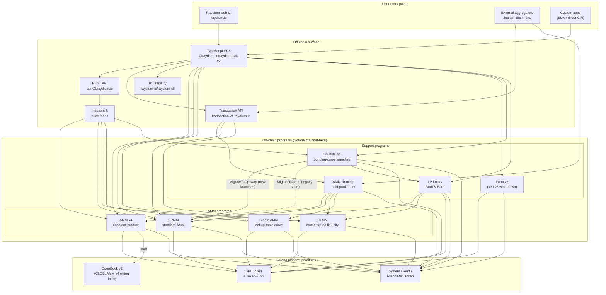

<Info>
  **Diese Seite wurde mit KI automatisch übersetzt. Maßgeblich ist stets die englische Version.**

  [Englische Version ansehen →](/protocol-overview/architecture)
</Info>

<Info>
  **Dies ist das einzige kanonische Architektur-Diagramm der Dokumentation.** Jedes andere Kapitel verweist hierher, anstatt das System neu zu zeichnen. Programm-IDs sind nicht in diese Seite eingebettet — sie befinden sich in [`reference/program-addresses`](/de/reference/program-addresses), damit sie an genau einer Stelle aktualisiert werden können.
</Info>

## Was Raydium wirklich ist

Raydium ist **nicht ein Programm**. Es ist eine Reihe unabhängiger On-Chain-Solana-Programme, die eine gemeinsame Off-Chain-Oberfläche (REST-API, TypeScript-SDK, IDL-Registry) und einige Konventionen (Authority-PDAs, Fee-Config-Konten, Admin-Multisig) teilen. Eine Benutzerinteraktion — ein Swap, eine Einzahlung, eine Farm-Ernte — wird in genau eines dieser Programme geleitet; die Off-Chain-Oberfläche macht sie wie ein einzelnes Produkt wirken.

Der On-Chain-Fußabdruck gliedert sich in vier Arten von Programmen:

1. **AMM-Programme** — vier separate Pool-Programme, jedes mit eigenem Format und Pricing-Modell:
   - **AMM v4** — das ursprüngliche Constant-Product-AMM. Ursprünglich ein Hybrid-Design, das die Kurve auf einen OpenBook-Markt (ehemals Serum) spiegelte; die OpenBook-Integration wurde seitdem deaktiviert und Pools funktionieren nun als reine AMMs gegen die Kurve. Immer noch der tiefste Handelsplatz für viele große Paare.
   - **CPMM** — ein einfaches Constant-Product-AMM (`x · y = k`), nativ auf Solana gebaut, mit erstklassiger Token-2022-Unterstützung. **Das empfohlene Programm für neue Constant-Product-Pools.**
   - **CLMM** — ein konzentriertes Liquiditäts-AMM im Uniswap-v3-Stil. Liquidität wird in Preisbereiche bereitgestellt; Gebühren fallen pro Position an; der Zustand ist um Ticks und einen `sqrt_price_x64` organisiert.
   - **Stable AMM** — ein dünnes Liquiditäts-StableSwap-ähnliches Programm (abgeleitet von AMM v4 mit einer Lookup-Table-Preiskurve), das der Router für stablecoin-korrelierte Paare verwendet. Wird heute in der UI nicht als erstklassige Create-Pool-Option angeboten.
2. **Reward-Verteilung** — **Farm** (v3 / v5 / v6, mit v6 als aktive Generation; v3/v5 nur im Abbau).
3. **Token-Launch** — **LaunchLab**, ein Bonding-Curve-Programm. Neu initialisierte Launches **graduieren** zu CPMM. Die Legacy-AMM-v4-Migrationsinstruktion bleibt für bestehenden Launch-Zustand erhalten.
4. **Liquiditäts-Primitive** — **AMM Routing** (der On-Chain-Multi-Pool-Router, der CPIs in die vier AMM-Programme in einer einzigen Transaktion ausführt) und **LP-Lock / Burn & Earn** (sperrt LP-Positionen, während Gebührenansprüche offen bleiben).

Alles andere im Stack — die REST-APIs, die Transaction-API, das TypeScript-SDK, die UI — ist Off-Chain-Infrastruktur, die diese Programme auf Solana und SPL Token / Token-2022 zusammensetzt. Die Perps-Oberfläche ist eine separate Integration auf Orderly Network und ist kein On-Chain-Raydium-Programm; sie ist aus diesem Diagramm ausgeschlossen.

## Kanonisches Diagramm

```mermaid
flowchart TB
  subgraph user ["User entry points"]
    UI["Raydium web UI<br/>raydium.io"]
    AGG["External aggregators<br/>Jupiter, 1inch, etc."]
    CUST["Custom apps<br/>(SDK / direct CPI)"]
  end

  subgraph offchain ["Off-chain surface"]
    API["REST API<br/>api-v3.raydium.io"]
    TXAPI["Transaction API<br/>transaction-v1.raydium.io"]
    SDK["TypeScript SDK<br/>@raydium-io/raydium-sdk-v2"]
    IDL["IDL registry<br/>raydium-io/raydium-idl"]
    IDX["Indexers &<br/>price feeds"]
  end

  subgraph onchain ["On-chain programs (Solana mainnet-beta)"]
    subgraph amms ["AMM programs"]
      direction TB
      AMM4["AMM v4<br/>constant-product"]
      CPMM["CPMM<br/>standard AMM"]
      CLMM["CLMM<br/>concentrated liquidity"]
      STABLE["Stable AMM<br/>lookup-table curve"]
    end

    subgraph support ["Support programs"]
      direction TB
      ROUTE["AMM Routing<br/>multi-pool router"]
      FARM["Farm v6<br/>(v3 / v5 wind-down)"]
      LAUNCH["LaunchLab<br/>bonding-curve launches"]
      LOCK["LP-Lock /<br/>Burn & Earn"]
    end
  end

  subgraph solana ["Solana platform primitives"]
    TOKEN["SPL Token<br/>+ Token-2022"]
    OB["OpenBook v2<br/>(CLOB; AMM v4 wiring inert)"]
    SYS["System / Rent /<br/>Associated Token"]
  end

  %% Client paths
  UI --> SDK
  CUST --> SDK
  AGG --> TXAPI
  AGG --> ROUTE

  %% Off-chain composition
  SDK --> API
  SDK --> TXAPI
  SDK --> IDL
  SDK --> AMM4
  SDK --> CPMM
  SDK --> CLMM
  SDK --> FARM
  SDK --> LAUNCH
  SDK --> LOCK

  TXAPI --> ROUTE
  TXAPI --> CPMM
  TXAPI --> CLMM

  API --> IDX
  IDX --> AMM4
  IDX --> CPMM
  IDX --> CLMM
  IDX --> STABLE
  IDX --> LAUNCH

  %% Routing → AMM programs (CPI)
  ROUTE --> AMM4
  ROUTE --> CPMM
  ROUTE --> CLMM
  ROUTE --> STABLE

  %% LaunchLab graduation paths
  LAUNCH -- "MigrateToCpswap (new launches)" --> CPMM
  LAUNCH -. "MigrateToAmm (legacy state)" .-> AMM4
  LAUNCH --> LOCK

  %% LP-Lock wraps LP from CPMM / CLMM pools
  LOCK --> CPMM
  LOCK --> CLMM

  %% Programs → SPL Token / Token-2022
  AMM4 --> TOKEN
  CPMM --> TOKEN
  CLMM --> TOKEN
  STABLE --> TOKEN
  FARM --> TOKEN
  LAUNCH --> TOKEN
  LOCK --> TOKEN

  %% AMM v4's historical OpenBook wiring is inert
  AMM4 -. "inert" .-> OB

  %% Programs → System / Rent / ATA
  AMM4 --> SYS
  CPMM --> SYS
  CLMM --> SYS
  STABLE --> SYS
  FARM --> SYS
  LAUNCH --> SYS
  LOCK --> SYS
  ROUTE --> SYS
```

Wichtige Invarianten, die dieses Diagramm erfasst:

- **AMM-Programme sind gleichberechtigt.** CPMM ruft nicht in CLMM auf; CLMM ruft nicht in AMM v4 auf; Stable AMM ist sein eigenes Programm. Ein direkter Swap auf einem Pool berührt genau ein AMM-Programm. Das einzige Programm, das mehrere AMMs in einer einzigen Transaktion zusammensetzt, ist **AMM Routing**, das CPIs in AMM v4 / CPMM / CLMM / Stable AMM ausführt, wenn eine Route Pool-Typen kreuzt.
- **Das SDK und die Transaction-API sind Kompositionsebenen, keine Programme.** Wenn die Web-UI oder ein Aggregator eine „Swap durch drei Pools"-Transaktion erstellt, näht das SDK (Client-seitig) oder die Transaction-API (Server-seitig) die Anweisungen zusammen, indem Quotes von der REST-API abgerufen werden. Die Chain sieht eine einzelne Solana-Transaktion mit N Anweisungen — kein Orchestrator-Programm besitzt den gesamten Flow.
- **AMM v4s OpenBook-Verdrahtung ist inert.** AMM v4 war das einzige AMM, das jemals an OpenBook gebunden war, aber die Integration wurde deaktiviert — Pools teilen keine Liquidität mehr mit OpenBook, `MonitorStep` wird nicht mehr ausgelöst, und ein OpenBook-Ausfall hat keine Auswirkungen auf den aktuellen Swap-Verkehr. Die Market-Konten bleiben auf dem `AmmInfo` des Pools aus Gründen der Rückwärtskompatibilität, verweisen aber auf ungenutzten Zustand. CPMM, CLMM und Stable AMM hatten nie eine CLOB-Abhängigkeit.
- **Neue LaunchLab-Pools graduieren zu CPMM.** Die Initialisierung erfordert nun `migrate_type = CPSWAP`. `MigrateToAmm` bleibt für bestehenden Legacy-Zustand erhalten. Vor dem Upgrade vom 14.08.2026 sperrte die CPMM-Migration `creator_scale` separat für den Creator. Migrationen, die danach ausgeführt wurden, kombinieren es mit `platform_scale` in eine einzelne plattformeigene gesperrte LP-Position. Frühere Fee Keys bleiben unverändert.
- **LP-Lock ist ein Wrapper, kein fünftes AMM.** Es hält LP-Positionen im Namen von Creatorn unter einer PDA, damit die zugrunde liegenden Gebühren noch beansprucht werden können, ohne die Möglichkeit zum Abheben von Liquidität freizulegen. Es setzt sich über CPMM- und CLMM-Pools zusammen.
- **Off-Chain-Oberflächen ergänzen sich gegenseitig.** Die REST-API ist schreibgeschützt mit Caching; die Transaction-API erstellt Server-seitig signaturfertige Transaktionen; das SDK erstellt sie Client-seitig. Alle drei hängen von derselben IDL-Registry als Schemawahrheitsquelle ab.

## Datenfluss: ein CPMM-Swap, von Ende zu Ende

Um das Bild konkret zu machen, hier ist, was passiert, wenn ein Benutzer USDC → RAY auf einem CPMM-Pool von der Raydium-UI aus tauscht. (AMM v4 und CLMM unterscheiden sich in den Konten, die sie benötigen, nicht in der übergeordneten Form.)

1. **Quote-Anfrage (Off-Chain).** Die UI ruft `GET https://api-v3.raydium.io/compute/swap-base-in` mit dem Input-Mint, Output-Mint, Betrag und einer Slippage-Toleranz auf. Die API konsultiert ihren Indexer, wählt eine Route (möglicherweise durch mehrere Pools) und gibt ein Quote plus die Liste der Programm-IDs, Pool-IDs und Fee-Konten zurück, die der Client benötigt.
2. **Transaktionserstellung (Client + SDK).** Der Client übergibt das Quote an `raydium-sdk-v2`. Das SDK löst jeden PDA auf, den es benötigt (Authority-PDA, Pool-Zustand, Observation, Vaults — siehe [`products/cpmm/accounts`](/de/products/cpmm/accounts)), injiziert die Associated-Token-Konten des Benutzers (erstellt sie mit dem Associated-Token-Programm, falls fehlend) und gibt eine unsignierte `Transaction` aus.
3. **Wallet-Signatur.** Die Wallet des Benutzers signiert die Transaktion. Nichts Raydium-Spezifisches hier; dies ist der Standard-Solana-Wallet-Flow.
4. **On-Chain-Ausführung.** Die signierte Transaktion trifft das Raydium-**CPMM-Programm**, das (a) den Pool-Zustand validiert, (b) die Constant-Product-Kurve mit der Fee-Config des Pools anwendet, (c) Token zwischen den ATAs des Benutzers und den Pool-Vaults über CPI in SPL Token / Token-2022 verschiebt, (d) das `observation`-Konto für den TWAP aktualisiert und (e) zurückkehrt.
5. **Indexer-Aufnahme.** Die Solana-RPC ein paar Slots später legt die Programm-Logs offen. Der Raydium-Indexer analysiert sie, aktualisiert die Reserves des Pools, das 24h-Volumen und die APR und bedient die aktualisierten Werte für die nächste `/pools/info/ids`-Anfrage.

Alle vier Schritte 2–4 finden innerhalb einer einzigen Solana-Transaktion statt. Die API ist nur in **Schritt 1** (Quote) und **Schritt 5** (Indexierung für nächstes Mal) beteiligt. Wenn die API ausfällt, kann ein Client mit einem Live-SDK und einer Solana-RPC immer noch transagieren — er muss nur die Route selbst berechnen.

## Gemeinsame Infrastruktur

Mehrere Primitive werden von jedem Produkt verwendet und sind es wert, einmal benannt zu werden, damit spätere Kapitel ohne Neudefinition darauf verweisen können. Details befinden sich in [`protocol-overview/shared-infrastructure`](/de/protocol-overview/shared-infrastructure); dies ist der Index.

| Primitive | Was es ist | Wo es definiert ist |
|-----------|------------|---------------------|
| **Authority PDA** | Ein programmgesteuerter Signer, der die Token-Vaults tatsächlich kontrolliert. Benutzer halten niemals Vault-Authority. | Pro Programm; CPMM verwendet `vault_and_lp_mint_auth_seed` — siehe [`products/cpmm/accounts`](/de/products/cpmm/accounts). |
| **Config-Konten** | Pro-Programm-Konten mit Fee-Sätzen, Admin-Schlüsseln und Fund/Creator-Zielen. Indiziert durch einen `u16` in CPMM (`amm_config[index]`). | [`reference/program-addresses`](/de/reference/program-addresses) listet die API-Endpunkte auf, die sie zurückgeben. |
| **Protocol/Fund/Creator-Fee-Split** | Eine einzelne Trade-Gebühr wird bei der Abrechnung drei (manchmal vier) Wege aufgeteilt. Gleiches Muster in CPMM und CLMM, unterschiedliche Parameter. | [`reference/fee-comparison`](/de/reference/fee-comparison) |
| **Observation-Konto** | Ring-Buffer von Preisproben, die für den TWAP verwendet werden. Bei jedem Swap geschrieben. | [`products/cpmm/accounts`](/de/products/cpmm/accounts), [`products/clmm/accounts`](/de/products/clmm/accounts) |
| **REST-API (`api-v3.raydium.io`)** | Die einzige öffentliche Read-API für Pool-Metadaten, Positionen, Farm-Zustand und Quote-Berechnung. | [`sdk-api/rest-api`](/de/sdk-api/rest-api) |
| **IDL-Registry** | Anchor-IDLs für jedes Programm, gespiegelt unter [`github.com/raydium-io/raydium-idl`](https://github.com/raydium-io/raydium-idl). Das SDK und CPI-Integratoren deserialisieren gegen diese. | [`sdk-api/anchor-idl`](/de/sdk-api/anchor-idl) |

## Off-Chain-Oberfläche: API vs. SDK vs. IDL

Diese drei werden routinemäßig verwechselt. Sie tun unterschiedliche Dinge:

- **REST-API** (`api-v3.raydium.io`) ist eine **Read-mostly, gecachte Ansicht** des On-Chain-Zustands plus die **Quote-Engine**. Sie sagt Ihnen, welche Pools existieren, wie ihre Reserves aussehen, wie APRs aussehen und welche beste Route für einen Swap ist. Sie **erstellt nicht** Transaktionen.
- **TypeScript-SDK** (`@raydium-io/raydium-sdk-v2`) ist ein **Transaction-Builder**. Es kennt das Account-Layout und das Instruction-Format jedes Programms. Es ruft frischen Zustand von einer RPC ab (nicht von der API), bevor es eine Instruction zusammensetzt, damit es genaue Transaktionen signieren kann. Es spricht mit der API nur, wenn es ein Quote benötigt.
- **IDL-Registry** ist das **Schema**, auf das beide angewiesen sind. Wenn Sie Rust-CPIs in ein Raydium-Programm schreiben, ist die IDL der Vertrag; wenn Sie eine TS-Integration schreiben, verwenden Sie IDLs indirekt durch das SDK.

## Wo jedes Kapitel passt

Das obige Diagramm tritt — in reduzierter Form — in der gesamten Dokumentation auf. Hier ist, wo die vollständige Behandlung jedes Teils lebt, damit Sie sich einarbeiten können:

- **On-Chain-Programme:** ein Kapitel pro Produkt unter [`products/`](/de/products). Jedes Kapitel folgt der gleichen Vorlage (Übersicht → Konten → Mathematik → Anweisungen → Gebühren → Code-Demos).
- **Gemeinsame programmübergreifende Primitive:** [`protocol-overview/shared-infrastructure`](/de/protocol-overview/shared-infrastructure) und [`algorithms/`](/de/algorithms) für die Mathematik, die sich wiederholt (Constant-Product, Concentrated-Liquidity, Curve-Pricing).
- **Off-Chain-Oberfläche:** [`sdk-api/`](/de/sdk-api) hat die vollständige SDK- und REST-API-Referenz, plus [`sdk-api/anchor-idl`](/de/sdk-api/anchor-idl) und [`sdk-api/rust-cpi`](/de/sdk-api/rust-cpi).
- **Benutzer-Level-Flows (Pool erstellen, Swap, LP, Rewards beanspruchen, Token starten):** [`user-flows/`](/de/user-flows).
- **Integrationsmuster für andere Teams (Aggregatoren, Wallets, Bots):** [`integration-guides/`](/de/integration-guides).
- **Sicherheitsoberfläche, Admin-Schlüssel, bekannte Risiken, Audits:** [`security/`](/de/security).
- **Versionierte Änderungen und die AMM-v4 → CPMM / Farm-v3 → v6-Migrationsstory:** [`protocol-overview/versions-and-migration`](/de/protocol-overview/versions-and-migration).

## Nicht-Ziele dieses Diagramms

Ein paar absichtliche Auslassungen, damit niemand mehr hineinliest, als dort ist:

- **Keine Preis-Orakel.** Raydium hängt nicht von Pyth, Switchboard oder einem externen Oracle für sein Core-AMM-Pricing ab. Quotes stammen aus On-Chain-Reserves. Das `observation`-Konto existiert, damit **andere** Verträge einen Raydium-TWAP lesen können — Raydium selbst benötigt es nicht.
- **Kein On-Chain-Token-Voting-Programm.** Admin-Aktionen wie Fee-Config-Updates und Programm-Upgrades werden von einem Multisig ausgeführt. Die Multisig-Schlüssel und Rotationsrichtlinie befinden sich in [`security/admin-and-multisig`](/de/security/admin-and-multisig).
- **Keine Brücken.** Raydium ist Solana-nativ. Cross-Chain-Flows sind das Problem des Integrators und liegen außerhalb dieses Diagramms.

Quellen:

- [`reference/program-addresses`](/de/reference/program-addresses) für die kanonischen Programm-IDs, auf die auf dieser Seite verwiesen wird
- [github.com/raydium-io/raydium-sdk-V2](https://github.com/raydium-io/raydium-sdk-V2)
- [github.com/raydium-io/raydium-idl](https://github.com/raydium-io/raydium-idl)
