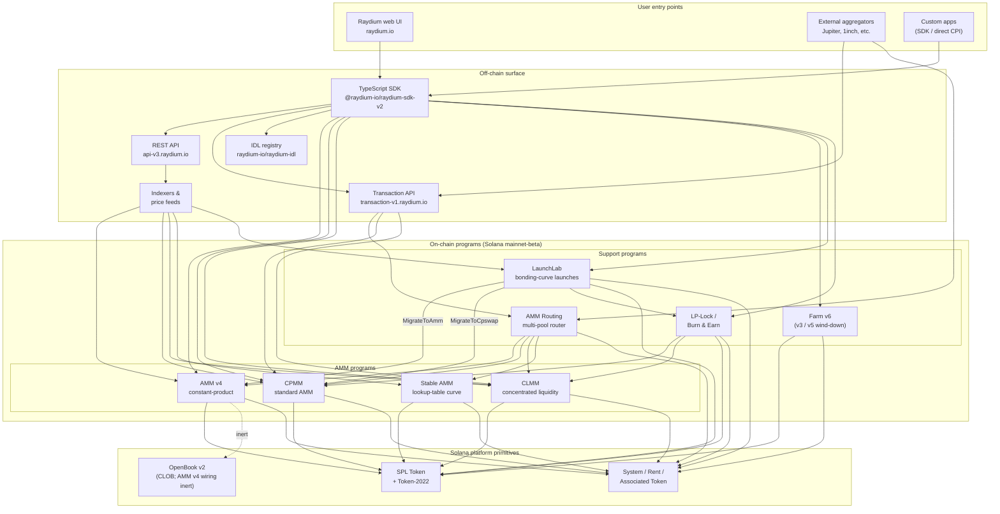

<Info>
  **Esta página fue traducida automáticamente por IA. La versión en inglés es la fuente autorizada.**

  [Ver versión en inglés →](/protocol-overview/architecture)
</Info>

<Info>
  **Esta página es el diagrama de arquitectura canónico único de la documentación.** Todos los demás capítulos remiten aquí en lugar de redibujar el sistema. Los ID de programa no están integrados en esta página — viven en [`reference/program-addresses`](/es/reference/program-addresses) para poder actualizarse en exactamente un lugar.
</Info>

## Qué es realmente Raydium

Raydium **no es un único programa**. Es un conjunto de programas Solana on-chain independientes que comparten una superficie off-chain común (API REST, SDK TypeScript, registro IDL) y un puñado de convenciones (PDAs de autoridad, cuentas de configuración de tasas, multisig de administrador). Una interacción de usuario — un swap, un depósito, una cosecha de granjas — se enruta exactamente a uno de esos programas; la superficie off-chain es lo que hace que se sientan como un único producto.

La huella on-chain se agrupa en cuatro tipos de programas:

1. **Programas AMM** — cuatro programas de pool separados, cada uno con su propio formato y matemática de precios:
   - **AMM v4** — el AMM de producto constante original. Originalmente un diseño híbrido que reflejaba la curva en un mercado OpenBook (anteriormente Serum); la integración con OpenBook se ha desactivado desde entonces y los pools ahora funcionan como AMMs puros contra la curva. Sigue siendo el lugar más profundo para muchos pares principales.
   - **CPMM** — un AMM de producto constante simple (`x · y = k`) construido de forma nativa en Solana, con soporte de primera clase para Token-2022. **El programa recomendado para nuevos pools de producto constante.**
   - **CLMM** — un AMM de liquidez concentrada al estilo Uniswap v3. La liquidez se proporciona en rangos de precios; las tasas se acumulan por posición; el estado se organiza alrededor de ticks y un `sqrt_price_x64`.
   - **Stable AMM** — un programa StableSwap de liquidez delgada (bifurcado de AMM v4 con una curva de precios de tabla de búsqueda) que el enrutador utiliza para pares correlacionados de stablecoins. No se expone como una opción de crear-pool de primera clase en la interfaz de usuario hoy en día.
2. **Distribución de recompensas** — **Farm** (v3 / v5 / v6, siendo v6 la generación activa; v3/v5 están solo en fase de cierre).
3. **Lanzamiento de tokens** — **LaunchLab**, un programa de curva de bonificación. Los lanzamientos exitosos se **gradúan** a un pool AMM v4 o un pool CPMM dependiendo de la configuración del lanzamiento, con el LP envuelto a través del programa LP-Lock.
4. **Primitivas de liquidez** — **Enrutamiento AMM** (el enrutador multi-pool on-chain que CPI en los cuatro programas AMM en una única transacción) y **LP-Lock / Burn & Earn** (bloquea posiciones LP manteniendo abiertos los reclamos de tasas).

Todo lo demás en la pila — las API REST, la API de transacciones, el SDK TypeScript, la interfaz de usuario — es infraestructura off-chain que compone estos programas sobre Solana y SPL Token / Token-2022. La superficie de Perps es una integración separada sobre Orderly Network y no es un programa Raydium on-chain; está excluida de este diagrama.

## Diagrama canónico

Invariantes clave que captura este diagrama:

- **Los programas AMM son pares.** CPMM no llama a CLMM; CLMM no llama a AMM v4; Stable AMM es su propio programa. Un swap directo en un pool toca exactamente un programa AMM. El único programa que compone múltiples AMMs en una única transacción es **AMM Routing**, que CPI en AMM v4 / CPMM / CLMM / Stable AMM según sea necesario cuando una ruta cruza tipos de pool.
- **El SDK y la API de transacciones son capas de composición, no programas.** Cuando la interfaz de usuario web o un agregador construyen una transacción "intercambiar a través de tres pools", el SDK (lado del cliente) o la API de transacciones (lado del servidor) cosen las instrucciones juntas usando cotizaciones obtenidas de la API REST. La cadena ve una única transacción Solana con N instrucciones — ningún programa orquestador posee el flujo completo.
- **El cableado OpenBook de AMM v4 es inerte.** AMM v4 fue el único AMM nunca vinculado a OpenBook, pero la integración ha sido desactivada — los pools ya no comparten liquidez con OpenBook, `MonitorStep` ya no se ejecuta, y una interrupción de OpenBook no tiene impacto en el tráfico de swap actual. Las cuentas de mercado permanecen en `AmmInfo` del pool para compatibilidad hacia atrás pero hacen referencia a estado sin usar. CPMM, CLMM y Stable AMM nunca tuvieron una dependencia de CLOB.
- **LaunchLab se gradúa en uno de dos programas AMM.** Un lanzamiento exitoso llama a `MigrateToAmm` (destino: AMM v4) o `MigrateToCpswap` (destino: CPMM) dependiendo de su `migrate_type`; los lanzamientos de Token-2022 siempre se migran a CPMM. El LP post-graduación se divide mediante `PlatformConfig` y los fragmentos del creador/plataforma se envuelven a través del programa LP-Lock como NFTs de clave de tarifa (el patrón Burn & Earn).
- **LP-Lock es un wrapper, no un quinto AMM.** Mantiene posiciones LP en nombre de los creadores bajo un PDA para que las tasas subyacentes aún puedan reclamarse sin exponer la capacidad de retirar liquidez. Se compone sobre pools CPMM y CLMM.
- **Las superficies off-chain se complementan entre sí.** La API REST es de solo lectura con almacenamiento en caché; la API de transacciones construye transacciones listas para firmar del lado del servidor; el SDK las construye del lado del cliente. Los tres dependen del mismo registro IDL como fuente de verdad del esquema.

## Flujo de datos: un swap CPMM, de principio a fin

Para hacer la imagen concreta, aquí está lo que sucede cuando un usuario intercambia USDC → RAY en un pool CPMM desde la interfaz de usuario de Raydium. (AMM v4 y CLMM difieren en las cuentas que necesitan, no en la forma de alto nivel.)

1. **Solicitud de cotización (off-chain).** La interfaz de usuario llama a `GET https://api-v3.raydium.io/compute/swap-base-in` con el mint de entrada, mint de salida, cantidad y una tolerancia de slippage. La API consulta su indexador, elige una ruta (posiblemente a través de múltiples pools) y devuelve una cotización más la lista de ID de programa, ID de pool y cuentas de tasas que el cliente necesitará.
2. **Construcción de transacción (cliente + SDK).** El cliente pasa la cotización a `raydium-sdk-v2`. El SDK resuelve cada PDA que necesita (PDA de autoridad, estado del pool, observación, vaults — ver [`products/cpmm/accounts`](/es/products/cpmm/accounts)), inyecta las cuentas de token asociadas del usuario (creándolas con el Programa de Token Asociado si faltan) y emite una `Transaction` sin firmar.
3. **Firma de billetera.** La billetera del usuario firma la transacción. Nada específico de Raydium aquí; este es el flujo estándar de billetera de Solana.
4. **Ejecución on-chain.** La transacción firmada llega al **programa CPMM** de Raydium, que (a) valida el estado del pool, (b) aplica la curva de producto constante con la configuración de tasas del pool, (c) mueve tokens entre los ATAs del usuario y los vaults del pool mediante CPI en SPL Token / Token-2022, (d) actualiza la cuenta `observation` para el TWAP, y (e) retorna.
5. **Ingesta del indexador.** El RPC de Solana algunos slots después expone los logs del programa. El indexador de Raydium los analiza, actualiza las reservas del pool, volumen de 24h y APR, y sirve los valores actualizados a la siguiente solicitud `/pools/info/ids`.

Los pasos 2–4 suceden todos dentro de una única transacción de Solana. La API solo está involucrada en el **paso 1** (cotización) y **paso 5** (indexación para la próxima vez). Si la API está caída, un cliente con un SDK vivo y un RPC de Solana aún puede transaccionar — solo tiene que calcular la ruta por sí solo.

## Infraestructura compartida

Varios primitivos son utilizados por cada producto y vale la pena nombrarlos una sola vez para que los capítulos posteriores puedan referirse a ellos sin redefinición. Los detalles viven en [`protocol-overview/shared-infrastructure`](/es/protocol-overview/shared-infrastructure); este es el índice.

| Primitivo | Qué es | Dónde está definido |
|-----------|--------|---------------------|
| **PDA de autoridad** | Un firmante propiedad de programa que realmente controla los vaults de tokens. Los usuarios nunca poseen la autoridad del vault. | Por programa; CPMM usa `vault_and_lp_mint_auth_seed` — ver [`products/cpmm/accounts`](/es/products/cpmm/accounts). |
| **Cuentas de configuración** | Cuentas por programa que contienen tasas de comisión, claves de administrador y destinos de fondo/creador. Indexado por `u16` en CPMM (`amm_config[index]`). | [`reference/program-addresses`](/es/reference/program-addresses) lista los puntos finales de la API que los devuelven. |
| **División de tasa de protocolo/fondo/creador** | Una única tasa de comercio se divide tres (a veces cuatro) formas en liquidación. Mismo patrón en CPMM y CLMM, diferentes parámetros. | [`reference/fee-comparison`](/es/reference/fee-comparison) |
| **Cuenta de observación** | Buffer circular de muestras de precio utilizado para el TWAP. Escrito en cada swap. | [`products/cpmm/accounts`](/es/products/cpmm/accounts), [`products/clmm/accounts`](/es/products/clmm/accounts) |
| **API REST (`api-v3.raydium.io`)** | La única API de lectura pública para metadatos de pool, posiciones, estado de granjas y cálculo de cotización. | [`sdk-api/rest-api`](/es/sdk-api/rest-api) |
| **Registro IDL** | IDLs Anchor para cada programa, reflejados en [`github.com/raydium-io/raydium-idl`](https://github.com/raydium-io/raydium-idl). El SDK e integradores de CPI deserializan contra estos. | [`sdk-api/anchor-idl`](/es/sdk-api/anchor-idl) |

## Superficie off-chain: API vs SDK vs IDL

Estos tres se confunden rutinariamente. Hacen cosas diferentes:

- **API REST** (`api-v3.raydium.io`) es una **vista en caché, mayormente de lectura** del estado on-chain más el **motor de cotización**. Te dice qué pools existen, cuáles son sus reservas, cómo lucen los APRs y cuál es la mejor ruta para un swap. **No** construye transacciones.
- **SDK TypeScript** (`@raydium-io/raydium-sdk-v2`) es un **constructor de transacciones**. Conoce el diseño de cuenta y formato de instrucción de cada programa. Obtiene estado fresco de un RPC (no de la API) antes de componer una instrucción, para poder firmar transacciones precisas. Habla con la API solo cuando necesita una cotización.
- **Registro IDL** es el **esquema** del que ambos dependen. Si estás escribiendo CPIs Rust en un programa Raydium, el IDL es el contrato; si estás escribiendo una integración TS, estás usando IDLs indirectamente a través del SDK.

## Dónde encaja cada capítulo

El diagrama anterior recurre — en forma reducida — a lo largo de la documentación. Aquí está dónde vive el tratamiento completo de cada pieza para que puedas profundizar:

- **Programas on-chain:** un capítulo por producto bajo [`products/`](/es/products). Cada capítulo sigue la misma plantilla (descripción general → cuentas → matemática → instrucciones → tasas → demostraciones de código).
- **Primitivos compartidos entre programas:** [`protocol-overview/shared-infrastructure`](/es/protocol-overview/shared-infrastructure) y [`algorithms/`](/es/algorithms) para la matemática que recurre (producto-constante, liquidez-concentrada, precios de curva).
- **Superficie off-chain:** [`sdk-api/`](/es/sdk-api) tiene la referencia completa de SDK y API REST, más [`sdk-api/anchor-idl`](/es/sdk-api/anchor-idl) y [`sdk-api/rust-cpi`](/es/sdk-api/rust-cpi).
- **Flujos a nivel de usuario (crear un pool, intercambiar, LP, reclamar recompensas, lanzar un token):** [`user-flows/`](/es/user-flows).
- **Patrones de integración para otros equipos (agregadores, billeteras, bots):** [`integration-guides/`](/es/integration-guides).
- **Superficie de seguridad, claves de administrador, riesgos conocidos, auditorías:** [`security/`](/es/security).
- **Cambios versionados y la historia de migración AMM v4 → CPMM / Farm v3 → v6:** [`protocol-overview/versions-and-migration`](/es/protocol-overview/versions-and-migration).

## No-objetivos de este diagrama

Algunas omisiones deliberadas, para que nadie lea más de lo que hay:

- **Sin oráculos de precios.** Raydium no depende de Pyth, Switchboard o ningún oráculo externo para su precios AMM central. Las cotizaciones provienen de reservas on-chain. La cuenta `observation` existe para que **otros** contratos puedan leer un TWAP de Raydium — Raydium mismo no la necesita.
- **Sin programa de votación de tokens on-chain.** Las acciones de administrador como actualizaciones de configuración de tasas y actualizaciones de programas se ejecutan mediante multisig. Las claves de multisig y la política de rotación están en [`security/admin-and-multisig`](/es/security/admin-and-multisig).
- **Sin puentes.** Raydium es nativo de Solana. Los flujos entre cadenas son responsabilidad del integrador y viven fuera de este diagrama.

Fuentes:

- [`reference/program-addresses`](/es/reference/program-addresses) para los ID de programa canónicos referenciados a lo largo de esta página
- [github.com/raydium-io/raydium-sdk-V2](https://github.com/raydium-io/raydium-sdk-V2)
- [github.com/raydium-io/raydium-idl](https://github.com/raydium-io/raydium-idl)
