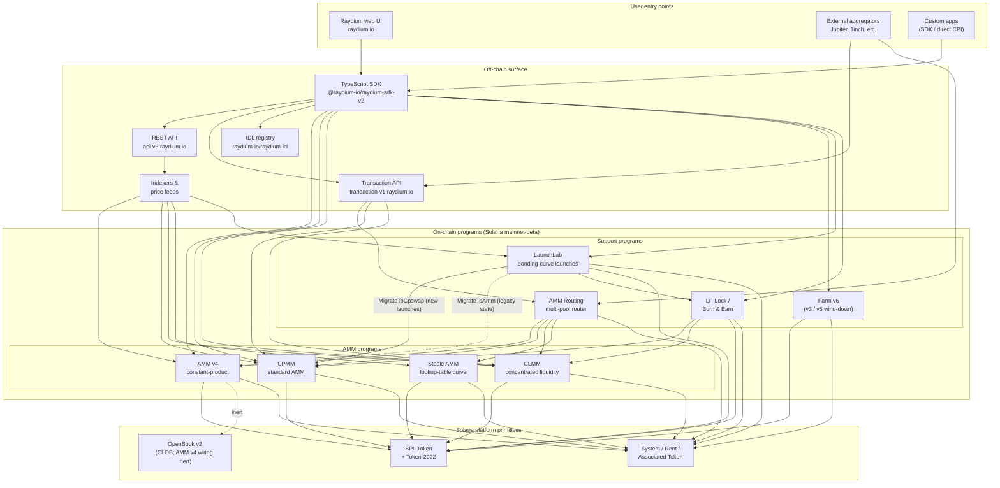

<Info>
  **Esta página fue traducida automáticamente por IA. La versión en inglés es la fuente autorizada.**

  [Ver versión en inglés →](/protocol-overview/architecture)
</Info>

<Info>
  **Esta página es el diagrama de arquitectura canónico único de la documentación.** Todos los demás capítulos enlazan aquí en lugar de redibujar el sistema. Los IDs de programa no están incrustados en esta página — viven en [`reference/program-addresses`](/es/reference/program-addresses) para poder actualizarse en exactamente un lugar.
</Info>

## Qué es realmente Raydium

Raydium **no es un programa**. Es un conjunto de programas independientes de Solana en cadena que comparten una superficie común fuera de cadena (API REST, SDK de TypeScript, registro de IDL) y un puñado de convenciones (PDAs de autoridad, cuentas de configuración de tarifas, multifirma de administrador). Una interacción del usuario — un swap, un depósito, una cosecha de granja — se enruta exactamente a uno de esos programas; la superficie fuera de cadena es lo que los hace parecer un único producto.

La huella en cadena se agrupa en cuatro tipos de programas:

1. **Programas AMM** — cuatro programas de pool separados, cada uno con su propio formato y matemática de precios:
   - **AMM v4** — el AMM de producto constante original. Originalmente un diseño híbrido que reflejaba la curva en un mercado OpenBook (anteriormente Serum); la integración de OpenBook ha sido desactivada desde entonces y los pools ahora operan como AMMs puros contra la curva. Aún el lugar más profundo para muchos pares principales.
   - **CPMM** — un AMM de producto constante simple (`x · y = k`) construido nativamente en Solana, con soporte de primera clase para Token-2022. **El programa recomendado para nuevos pools de producto constante.**
   - **CLMM** — un AMM de liquidez concentrada al estilo Uniswap v3. La liquidez se proporciona en rangos de precios; las tarifas se acumulan por posición; el estado se organiza alrededor de ticks y un `sqrt_price_x64`.
   - **Stable AMM** — un programa de estilo StableSwap de liquidez delgada (bifurcado de AMM v4 con una curva de precios de tabla de búsqueda) que el enrutador usa para pares correlacionados de stablecoins. No se expone como una opción de crear pool de primera clase en la interfaz de usuario hoy.
2. **Distribución de recompensas** — **Farm** (v3 / v5 / v6, siendo v6 la generación activa; v3/v5 solo están en fase de cierre).
3. **Lanzamiento de tokens** — **LaunchLab**, un programa de curva de vinculación. Los lanzamientos recién inicializados **se gradúan** a CPMM. La instrucción de migración heredada de AMM v4 permanece para el estado de lanzamiento existente.
4. **Primitivas de liquidez** — **Enrutamiento AMM** (el enrutador de múltiples pools en cadena que realiza CPI en los cuatro programas AMM en una única transacción) y **LP-Lock / Burn & Earn** (bloquea posiciones de LP mientras mantiene abiertos los reclamos de tarifas).

Todo lo demás en la pila — las APIs REST, la API de Transacciones, el SDK de TypeScript, la interfaz de usuario — es infraestructura fuera de cadena que compone estos programas sobre Solana y SPL Token / Token-2022. La superficie de Perps es una integración separada sobre Orderly Network y no es un programa Raydium en cadena; está excluida de este diagrama.

## Diagrama canónico

```mermaid
flowchart TB
  subgraph user ["User entry points"]
    UI["Raydium web UI<br/>raydium.io"]
    AGG["External aggregators<br/>Jupiter, 1inch, etc."]
    CUST["Custom apps<br/>(SDK / direct CPI)"]
  end

  subgraph offchain ["Off-chain surface"]
    API["REST API<br/>api-v3.raydium.io"]
    TXAPI["Transaction API<br/>transaction-v1.raydium.io"]
    SDK["TypeScript SDK<br/>@raydium-io/raydium-sdk-v2"]
    IDL["IDL registry<br/>raydium-io/raydium-idl"]
    IDX["Indexers &<br/>price feeds"]
  end

  subgraph onchain ["On-chain programs (Solana mainnet-beta)"]
    subgraph amms ["AMM programs"]
      direction TB
      AMM4["AMM v4<br/>constant-product"]
      CPMM["CPMM<br/>standard AMM"]
      CLMM["CLMM<br/>concentrated liquidity"]
      STABLE["Stable AMM<br/>lookup-table curve"]
    end

    subgraph support ["Support programs"]
      direction TB
      ROUTE["AMM Routing<br/>multi-pool router"]
      FARM["Farm v6<br/>(v3 / v5 wind-down)"]
      LAUNCH["LaunchLab<br/>bonding-curve launches"]
      LOCK["LP-Lock /<br/>Burn & Earn"]
    end
  end

  subgraph solana ["Solana platform primitives"]
    TOKEN["SPL Token<br/>+ Token-2022"]
    OB["OpenBook v2<br/>(CLOB; AMM v4 wiring inert)"]
    SYS["System / Rent /<br/>Associated Token"]
  end

  %% Client paths
  UI --> SDK
  CUST --> SDK
  AGG --> TXAPI
  AGG --> ROUTE

  %% Off-chain composition
  SDK --> API
  SDK --> TXAPI
  SDK --> IDL
  SDK --> AMM4
  SDK --> CPMM
  SDK --> CLMM
  SDK --> FARM
  SDK --> LAUNCH
  SDK --> LOCK

  TXAPI --> ROUTE
  TXAPI --> CPMM
  TXAPI --> CLMM

  API --> IDX
  IDX --> AMM4
  IDX --> CPMM
  IDX --> CLMM
  IDX --> STABLE
  IDX --> LAUNCH

  %% Routing → AMM programs (CPI)
  ROUTE --> AMM4
  ROUTE --> CPMM
  ROUTE --> CLMM
  ROUTE --> STABLE

  %% LaunchLab graduation paths
  LAUNCH -- "MigrateToCpswap (new launches)" --> CPMM
  LAUNCH -. "MigrateToAmm (legacy state)" .-> AMM4
  LAUNCH --> LOCK

  %% LP-Lock wraps LP from CPMM / CLMM pools
  LOCK --> CPMM
  LOCK --> CLMM

  %% Programs → SPL Token / Token-2022
  AMM4 --> TOKEN
  CPMM --> TOKEN
  CLMM --> TOKEN
  STABLE --> TOKEN
  FARM --> TOKEN
  LAUNCH --> TOKEN
  LOCK --> TOKEN

  %% AMM v4's historical OpenBook wiring is inert
  AMM4 -. "inert" .-> OB

  %% Programs → System / Rent / ATA
  AMM4 --> SYS
  CPMM --> SYS
  CLMM --> SYS
  STABLE --> SYS
  FARM --> SYS
  LAUNCH --> SYS
  LOCK --> SYS
  ROUTE --> SYS
```

Invariantes clave que este diagrama captura:

- **Los programas AMM son pares.** CPMM no llama a CLMM; CLMM no llama a AMM v4; Stable AMM es su propio programa. Un swap directo en un pool toca exactamente un programa AMM. El único programa que compone múltiples AMMs en una única transacción es **AMM Routing**, que realiza CPI en AMM v4 / CPMM / CLMM / Stable AMM según sea necesario cuando una ruta cruza tipos de pool.
- **El SDK y la API de Transacciones son capas de composición, no programas.** Cuando la interfaz de usuario web o un agregador construye una transacción de "swap a través de tres pools", el SDK (lado del cliente) o la API de Transacciones (lado del servidor) cose las instrucciones juntas usando cotizaciones obtenidas de la API REST. La cadena ve una única transacción de Solana con N instrucciones — ningún programa orquestador posee el flujo completo.
- **El cableado de OpenBook de AMM v4 es inerte.** AMM v4 fue el único AMM jamás vinculado a OpenBook, pero la integración ha sido desactivada — los pools ya no comparten liquidez a OpenBook, `MonitorStep` ya no se ejecuta, y una interrupción de OpenBook no tiene impacto en el tráfico de swap actual. Las cuentas de mercado permanecen en el `AmmInfo` del pool para compatibilidad hacia atrás pero hacen referencia a estado no utilizado. CPMM, CLMM y Stable AMM nunca tuvieron una dependencia de CLOB.
- **Los nuevos pools de LaunchLab se gradúan a CPMM.** La inicialización ahora requiere `migrate_type = CPSWAP`. `MigrateToAmm` permanece para el estado heredado existente. Antes de la actualización del 2026-08-14, la migración de CPMM bloqueaba `creator_scale` por separado para el creador. Las migraciones ejecutadas después combinan con `platform_scale` en una única posición de LP bloqueada propiedad de la plataforma. Las Claves de Tarifa anteriores permanecen sin cambios.
- **LP-Lock es un envoltorio, no un quinto AMM.** Mantiene posiciones de LP en nombre de los creadores bajo una PDA para que las tarifas subyacentes aún puedan reclamarse sin exponer la capacidad de retirar liquidez. Se compone sobre pools CPMM y CLMM.
- **Las superficies fuera de cadena se complementan entre sí.** La API REST es de solo lectura con almacenamiento en caché; la API de Transacciones construye transacciones listas para firmar del lado del servidor; el SDK las construye del lado del cliente. Los tres dependen del mismo registro de IDL como fuente de verdad del esquema.

## Flujo de datos: un swap de CPMM, de extremo a extremo

Para hacer la imagen concreta, aquí es lo que sucede cuando un usuario intercambia USDC → RAY en un pool CPMM desde la interfaz de usuario de Raydium. (AMM v4 y CLMM difieren en las cuentas que necesitan, no en la forma de alto nivel.)

1. **Solicitud de cotización (fuera de cadena).** La interfaz de usuario llama a `GET https://api-v3.raydium.io/compute/swap-base-in` con el mint de entrada, mint de salida, cantidad y tolerancia de deslizamiento. La API consulta su indexador, elige una ruta (posiblemente a través de múltiples pools) y devuelve una cotización más la lista de IDs de programa, IDs de pool y cuentas de tarifa que el cliente necesitará.
2. **Construcción de transacción (cliente + SDK).** El cliente pasa la cotización a `raydium-sdk-v2`. El SDK resuelve cada PDA que necesita (PDA de autoridad, estado del pool, observación, bóvedas — ver [`products/cpmm/accounts`](/es/products/cpmm/accounts)), inyecta las cuentas de token asociadas del usuario (creándolas con el Programa de Token Asociado si faltan) y emite una `Transaction` sin firmar.
3. **Firma de billetera.** La billetera del usuario firma la transacción. Nada específico de Raydium aquí; este es el flujo estándar de billetera de Solana.
4. **Ejecución en cadena.** La transacción firmada llega al **programa CPMM** de Raydium, que (a) valida el estado del pool, (b) aplica la curva de producto constante con la configuración de tarifa del pool, (c) mueve tokens entre los ATAs del usuario y las bóvedas del pool a través de CPI en SPL Token / Token-2022, (d) actualiza la cuenta de `observation` para el TWAP, y (e) retorna.
5. **Ingesta del indexador.** El RPC de Solana unos slots después expone los registros del programa. El indexador de Raydium los analiza, actualiza las reservas del pool, volumen de 24h y APR, y sirve los valores actualizados a la siguiente solicitud de `/pools/info/ids`.

Los cuatro pasos 2–4 suceden dentro de una única transacción de Solana. La API solo está involucrada en el **paso 1** (cotización) y **paso 5** (indexación para la próxima vez). Si la API está caída, un cliente con un SDK activo y un RPC de Solana aún puede realizar transacciones — solo tiene que calcular la ruta por sí mismo.

## Infraestructura compartida

Varios primitivos son utilizados por cada producto y vale la pena nombrarlos una vez para que los capítulos posteriores puedan referirse a ellos sin redefinición. Los detalles viven en [`protocol-overview/shared-infrastructure`](/es/protocol-overview/shared-infrastructure); este es el índice.

| Primitivo | Qué es | Dónde se define |
|-----------|--------|-----------------|
| **PDA de autoridad** | Un firmante propiedad del programa que realmente controla las bóvedas de tokens. Los usuarios nunca tienen autoridad de bóveda. | Por programa; CPMM usa `vault_and_lp_mint_auth_seed` — ver [`products/cpmm/accounts`](/es/products/cpmm/accounts). |
| **Cuentas de configuración** | Cuentas por programa que contienen tasas de tarifa, claves de administrador y destinos de fondo/creador. Indexadas por un `u16` en CPMM (`amm_config[index]`). | [`reference/program-addresses`](/es/reference/program-addresses) enumera los puntos finales de API que las devuelven. |
| **División de tarifa de protocolo/fondo/creador** | Una única tarifa comercial se divide tres (a veces cuatro) formas en la liquidación. El mismo patrón en CPMM y CLMM, diferentes controles. | [`reference/fee-comparison`](/es/reference/fee-comparison) |
| **Cuenta de observación** | Buffer circular de muestras de precios utilizado para el TWAP. Escrito en cada swap. | [`products/cpmm/accounts`](/es/products/cpmm/accounts), [`products/clmm/accounts`](/es/products/clmm/accounts) |
| **API REST (`api-v3.raydium.io`)** | La única API de lectura pública para metadatos de pool, posiciones, estado de granja y cálculo de cotización. | [`sdk-api/rest-api`](/es/sdk-api/rest-api) |
| **Registro de IDL** | IDLs de Anchor para cada programa, reflejados en [`github.com/raydium-io/raydium-idl`](https://github.com/raydium-io/raydium-idl). El SDK e integradores de CPI deserializan contra estos. | [`sdk-api/anchor-idl`](/es/sdk-api/anchor-idl) |

## Superficie fuera de cadena: API vs SDK vs IDL

Estos tres se confunden rutinariamente. Hacen cosas diferentes:

- **API REST** (`api-v3.raydium.io`) es una **vista de estado en cadena mayormente de lectura y almacenada en caché** más el **motor de cotización**. Te dice qué pools existen, cuáles son sus reservas, cómo se ven los APRs y cuál es la mejor ruta para un swap. **No** construye transacciones.
- **SDK de TypeScript** (`@raydium-io/raydium-sdk-v2`) es un **constructor de transacciones**. Conoce el diseño de cuenta y formato de instrucción de cada programa. Obtiene estado fresco de un RPC (no de la API) antes de componer una instrucción, para poder firmar transacciones precisas. Solo habla con la API cuando necesita una cotización.
- **Registro de IDL** es el **esquema** en el que ambos dependen. Si estás escribiendo CPIs de Rust en un programa Raydium, el IDL es el contrato; si estás escribiendo una integración de TS, estás usando IDLs indirectamente a través del SDK.

## Dónde encaja cada capítulo

El diagrama anterior recurre — en forma reducida — a lo largo de la documentación. Aquí es donde vive el tratamiento completo de cada pieza para que puedas profundizar:

- **Programas en cadena:** un capítulo por producto bajo [`products/`](/es/products). Cada capítulo sigue la misma plantilla (descripción general → cuentas → matemática → instrucciones → tarifas → demostraciones de código).
- **Primitivos compartidos entre programas:** [`protocol-overview/shared-infrastructure`](/es/protocol-overview/shared-infrastructure) y [`algorithms/`](/es/algorithms) para la matemática que recurre (producto constante, liquidez concentrada, precios de curva).
- **Superficie fuera de cadena:** [`sdk-api/`](/es/sdk-api) tiene la referencia completa de SDK y API REST, más [`sdk-api/anchor-idl`](/es/sdk-api/anchor-idl) y [`sdk-api/rust-cpi`](/es/sdk-api/rust-cpi).
- **Flujos a nivel de usuario (crear un pool, swap, LP, reclamar recompensas, lanzar un token):** [`user-flows/`](/es/user-flows).
- **Patrones de integración para otros equipos (agregadores, billeteras, bots):** [`integration-guides/`](/es/integration-guides).
- **Superficie de seguridad, claves de administrador, riesgos conocidos, auditorías:** [`security/`](/es/security).
- **Cambios versionados y la historia de migración de AMM v4 → CPMM / Farm v3 → v6:** [`protocol-overview/versions-and-migration`](/es/protocol-overview/versions-and-migration).

## No-objetivos de este diagrama

Algunas omisiones deliberadas, para que nadie lea más de lo que hay:

- **Sin oráculos de precios.** Raydium no depende de Pyth, Switchboard o ningún oráculo externo para su precios de AMM central. Las cotizaciones provienen de reservas en cadena. La cuenta de `observation` existe para que **otros** contratos puedan leer un TWAP de Raydium — Raydium mismo no la necesita.
- **Sin programa de votación de tokens en cadena.** Las acciones de administrador como actualizaciones de configuración de tarifas y actualizaciones de programas se ejecutan mediante una multifirma. Las claves de multifirma y la política de rotación están en [`security/admin-and-multisig`](/es/security/admin-and-multisig).
- **Sin puentes.** Raydium es nativo de Solana. Los flujos entre cadenas son responsabilidad del integrador y viven fuera de este diagrama.

Fuentes:

- [`reference/program-addresses`](/es/reference/program-addresses) para los IDs de programa canónicos referenciados a lo largo de esta página
- [github.com/raydium-io/raydium-sdk-V2](https://github.com/raydium-io/raydium-sdk-V2)
- [github.com/raydium-io/raydium-idl](https://github.com/raydium-io/raydium-idl)
