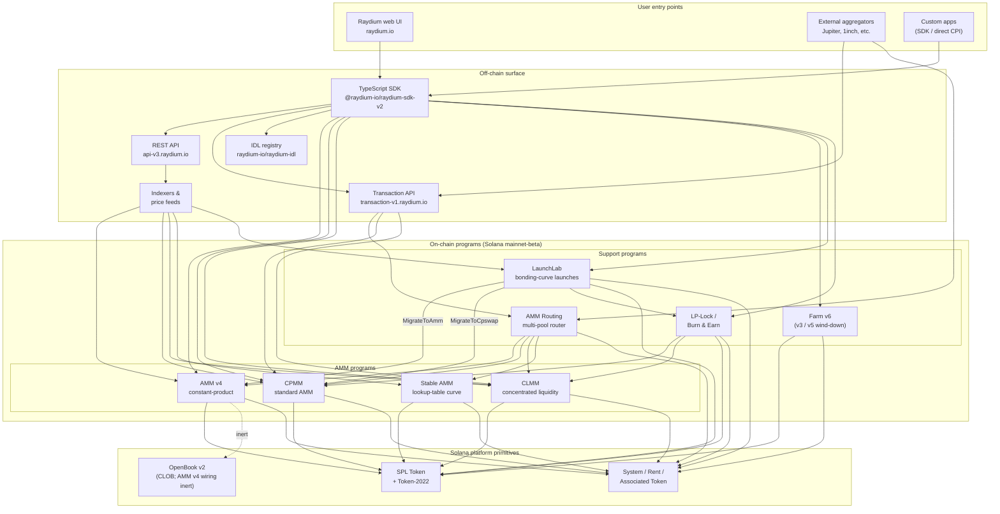

<Info>
  **Cette page est traduite automatiquement par IA. La version anglaise fait foi.**

  [Voir la version anglaise →](/protocol-overview/architecture)
</Info>

<Info>
  **Cette page est le diagramme architectural canonique de la documentation.** Tous les autres chapitres y renvoient plutôt que de redessiner le système. Les identifiants de programme ne sont pas intégrés dans cette page — ils se trouvent dans [`reference/program-addresses`](/fr/reference/program-addresses) pour pouvoir être mis à jour en un seul endroit.
</Info>

## Ce que Raydium est vraiment

Raydium **n'est pas un seul programme**. C'est un ensemble de programmes Solana indépendants on-chain qui partagent une surface off-chain commune (API REST, SDK TypeScript, registre IDL) et quelques conventions (PDAs d'autorité, comptes de configuration des frais, multisig administratif). Une interaction utilisateur — un swap, un dépôt, une récolte de ferme — s'achemine vers exactement un de ces programmes ; la surface off-chain est ce qui les rend transparents pour l'utilisateur, comme s'il s'agissait d'un seul produit.

L'empreinte on-chain se divise en quatre types de programmes :

1. **Programmes AMM** — quatre programmes de pool distincts, chacun avec son propre format et ses propres mathématiques de tarification :
   - **AMM v4** — l'AMM constant-product original. Initialement une conception hybride qui miroir la courbe sur un marché OpenBook (anciennement Serum) ; l'intégration OpenBook a depuis été désactivée et les pools fonctionnent maintenant comme des AMMs purs contre la courbe. Reste la venue la plus profonde pour plusieurs paires majeures.
   - **CPMM** — un AMM constant-product pur (`x · y = k`) construit nativement sur Solana, avec support natif de Token-2022. **Le programme recommandé pour les nouveaux pools constant-product.**
   - **CLMM** — un AMM à liquidité concentrée dans le style Uniswap v3. La liquidité est fournie dans des plages de prix ; les frais s'accumulent par position ; l'état est organisé autour de ticks et d'un `sqrt_price_x64`.
   - **Stable AMM** — un programme StableSwap-style à liquidité fine (forké depuis AMM v4 avec une courbe de tarification basée sur une table de consultation) que le routeur utilise pour les paires stablecoin-corrélées. Non présenté comme une option de création de pool de première classe dans l'interface utilisateur aujourd'hui.
2. **Distribution des récompenses** — **Farm** (v3 / v5 / v6, avec v6 comme génération active ; v3/v5 sont en fermeture progressive uniquement).
3. **Lancement de jeton** — **LaunchLab**, un programme de courbe de liaison. Les lancements réussis **diplôment** dans un pool AMM v4 ou un pool CPMM selon la configuration du lancement, avec la LP enrobée via le programme LP-Lock.
4. **Primitives de liquidité** — **AMM Routing** (le routeur multi-pool on-chain qui effectue des CPIs dans les quatre programmes AMM en une seule transaction) et **LP-Lock / Burn & Earn** (verrouille les positions LP tout en gardant les demandes de frais ouvertes).

Tout le reste de la pile — les API REST, l'API de transaction, le SDK TypeScript, l'interface utilisateur — est une infrastructure off-chain qui compose ces programmes au-dessus de Solana et de SPL Token / Token-2022. La surface Perps est une intégration séparée au-dessus d'Orderly Network et n'est pas un programme Raydium on-chain ; elle est exclue de ce diagramme.

## Diagramme canonique

Les invariants clés que ce diagramme capture :

- **Les programmes AMM sont pairs.** Le CPMM n'appelle pas dans le CLMM ; le CLMM n'appelle pas dans AMM v4 ; le Stable AMM est son propre programme. Un swap direct sur un pool touche exactement un programme AMM. Le seul programme qui compose plusieurs AMMs en une seule transaction est **AMM Routing**, qui effectue des CPIs dans AMM v4 / CPMM / CLMM / Stable AMM au besoin quand une route traverse les types de pool.
- **Le SDK et l'API de transaction sont des couches de composition, pas des programmes.** Quand l'interface utilisateur web ou un agrégateur construit une transaction « swap à travers trois pools », le SDK (côté client) ou l'API de transaction (côté serveur) assemble les instructions en utilisant les cotations extraites de l'API REST. La chaîne voit une seule transaction Solana avec N instructions — aucun programme orchestrateur ne possède tout le flux.
- **Le câblage OpenBook d'AMM v4 est inerte.** AMM v4 était le seul AMM jamais lié à OpenBook, mais l'intégration a été désactivée — les pools ne partagent plus la liquidité avec OpenBook, `MonitorStep` n'est plus exécuté, et une panne OpenBook n'a aucun impact sur le trafic d'échange actuel. Les comptes de marché restent sur le `AmmInfo` du pool pour la compatibilité rétroactive mais référencent un état inutilisé. CPMM, CLMM et Stable AMM n'ont jamais eu de dépendance CLOB.
- **LaunchLab diplôme dans l'un des deux programmes AMM.** Un lancement réussi appelle `MigrateToAmm` (cible : AMM v4) ou `MigrateToCpswap` (cible : CPMM) selon son `migrate_type` ; les lancements Token-2022 migrent toujours vers CPMM. La LP post-diplôme est divisée via `PlatformConfig` et les parts créateur/plateforme sont enrobées via le programme LP-Lock en tant que Fee Key NFTs (le motif Burn & Earn).
- **LP-Lock est un emballage, pas un cinquième AMM.** Il maintient les positions LP au nom des créateurs sous une PDA pour que les frais sous-jacents puissent toujours être réclamés sans exposer la capacité à retirer la liquidité. Il compose sur les pools CPMM et CLMM.
- **Les surfaces off-chain se complètent.** L'API REST est en lecture seule avec mise en cache ; l'API de transaction construit des transactions prêtes à être signées côté serveur ; le SDK les construit côté client. Les trois dépendent du même registre IDL comme source de vérité du schéma.

## Flux de données : un swap CPMM, d'un bout à l'autre

Pour rendre l'image concrète, voici ce qui se passe quand un utilisateur échange USDC → RAY sur un pool CPMM depuis l'interface Raydium. (AMM v4 et CLMM diffèrent dans les comptes dont ils ont besoin, pas dans la forme de haut niveau.)

1. **Demande de cotation (off-chain).** L'interface utilisateur appelle `GET https://api-v3.raydium.io/compute/swap-base-in` avec le mint d'entrée, le mint de sortie, le montant et une tolérance de glissement. L'API consulte son indexeur, choisit une route (possiblement à travers plusieurs pools) et retourne une cotation plus la liste des identifiants de programme, des identifiants de pool et des comptes de frais dont le client aura besoin.
2. **Création de transaction (client + SDK).** Le client transmet la cotation à `raydium-sdk-v2`. Le SDK résout chaque PDA dont il a besoin (PDA d'autorité, état du pool, observation, coffres — voir [`products/cpmm/accounts`](/fr/products/cpmm/accounts)), injecte les comptes de jetons associés de l'utilisateur (les créant avec le Programme de jeton associé s'ils manquent) et émet une `Transaction` non signée.
3. **Signature du portefeuille.** Le portefeuille de l'utilisateur signe la transaction. Rien de spécifique à Raydium ici ; c'est le flux de portefeuille Solana standard.
4. **Exécution on-chain.** La transaction signée arrive au programme **CPMM** Raydium, qui (a) valide l'état du pool, (b) applique la courbe constant-product avec la configuration des frais du pool, (c) déplace les jetons entre les ATAs de l'utilisateur et les coffres du pool via CPI dans SPL Token / Token-2022, (d) met à jour le compte `observation` pour la TWAP, et (e) retourne.
5. **Ingestion de l'indexeur.** Le RPC Solana quelques slots plus tard expose les journaux du programme. L'indexeur de Raydium les analyse, met à jour les réserves du pool, le volume 24h et l'APR, et sert les valeurs mises à jour à la prochaine demande `/pools/info/ids`.

Toutes les étapes 2–4 se font dans une seule transaction Solana. L'API n'est impliquée que dans l'**étape 1** (cotation) et l'**étape 5** (indexation pour la prochaine fois). Si l'API est hors ligne, un client ayant un SDK actif et un RPC Solana peut toujours effectuer une transaction — il doit juste calculer la route lui-même.

## Infrastructure partagée

Plusieurs primitives sont utilisées par chaque produit et méritent d'être nommées une seule fois pour que les chapitres ultérieurs puissent y renvoyer sans redéfinition. Les détails se trouvent dans [`protocol-overview/shared-infrastructure`](/fr/protocol-overview/shared-infrastructure) ; ceci est l'index.

| Primitive | Ce que c'est | Où c'est défini |
|-----------|------------|---------------------|
| **Authority PDA** | Un signataire détenu par le programme qui contrôle réellement les coffres de jetons. Les utilisateurs ne détiennent jamais l'autorité du coffre. | Par programme ; CPMM utilise `vault_and_lp_mint_auth_seed` — voir [`products/cpmm/accounts`](/fr/products/cpmm/accounts). |
| **Comptes de configuration** | Des comptes par programme contenant les taux de frais, les clés administrateur et les destinations de fonds/créateur. Indexés par un `u16` dans CPMM (`amm_config[index]`). | [`reference/program-addresses`](/fr/reference/program-addresses) liste les points de terminaison API qui les retournent. |
| **Division des frais protocole/fonds/créateur** | Les frais d'un seul échange sont divisés de trois (parfois quatre) façons au règlement. Même motif dans CPMM et CLMM, différents paramètres. | [`reference/fee-comparison`](/fr/reference/fee-comparison) |
| **Compte d'observation** | Buffer circulaire d'échantillons de prix utilisés pour la TWAP. Écrit à chaque swap. | [`products/cpmm/accounts`](/fr/products/cpmm/accounts), [`products/clmm/accounts`](/fr/products/clmm/accounts) |
| **API REST (`api-v3.raydium.io`)** | L'API publique de lecture unique pour les métadonnées de pool, les positions, l'état de ferme et le calcul de cotation. | [`sdk-api/rest-api`](/fr/sdk-api/rest-api) |
| **Registre IDL** | Les IDLs Anchor pour chaque programme, mirrorés à [`github.com/raydium-io/raydium-idl`](https://github.com/raydium-io/raydium-idl). Le SDK et les intégrateurs CPI désérialisent par rapport à ceux-ci. | [`sdk-api/anchor-idl`](/fr/sdk-api/anchor-idl) |

## Surface off-chain : API vs SDK vs IDL

Ces trois sont régulièrement confondus. Ils font différentes choses :

- **API REST** (`api-v3.raydium.io`) est une **vue principalement en lecture et mise en cache** de l'état on-chain plus le **moteur de cotation**. Elle vous dit quels pools existent, quelles sont leurs réserves, à quoi ressemblent les APR et quelle est la meilleure route pour un swap. Elle **ne** construit **pas** les transactions.
- **SDK TypeScript** (`@raydium-io/raydium-sdk-v2`) est un **constructeur de transactions**. Il connaît la disposition de chaque compte de programme et le format d'instruction. Il récupère l'état frais d'un RPC (pas de l'API) avant de composer une instruction, pour pouvoir signer des transactions précises. Il ne parle à l'API que quand il a besoin d'une cotation.
- **Registre IDL** est le **schéma** que les deux ci-dessus utilisent. Si vous écrivez des CPIs Rust dans un programme Raydium, l'IDL est le contrat ; si vous écrivez une intégration TS, vous utilisez les IDLs indirectement via le SDK.

## Où chaque chapitre s'inscrit

Le diagramme ci-dessus se répète — sous forme réduite — tout au long de la documentation. Voici où se trouve le traitement complet de chaque pièce pour que vous puissiez explorer :

- **Programmes on-chain :** un chapitre par produit sous [`products/`](/fr/products). Chaque chapitre suit le même modèle (vue d'ensemble → comptes → mathématiques → instructions → frais → démos de code).
- **Primitives partagées inter-programmes :** [`protocol-overview/shared-infrastructure`](/fr/protocol-overview/shared-infrastructure) et [`algorithms/`](/fr/algorithms) pour les mathématiques qui se répètent (constant-product, concentrated-liquidity, pricing des courbes).
- **Surface off-chain :** [`sdk-api/`](/fr/sdk-api) contient la référence complète du SDK et de l'API REST, plus [`sdk-api/anchor-idl`](/fr/sdk-api/anchor-idl) et [`sdk-api/rust-cpi`](/fr/sdk-api/rust-cpi).
- **Flux au niveau utilisateur (créer un pool, swap, LP, réclamer des récompenses, lancer un jeton) :** [`user-flows/`](/fr/user-flows).
- **Motifs d'intégration pour d'autres équipes (agrégateurs, portefeuilles, bots) :** [`integration-guides/`](/fr/integration-guides).
- **Surface de sécurité, clés administrateur, risques connus, audits :** [`security/`](/fr/security).
- **Changements versionnés et l'histoire de migration AMM v4 → CPMM / Farm v3 → v6 :** [`protocol-overview/versions-and-migration`](/fr/protocol-overview/versions-and-migration).

## Non-objectifs de ce diagramme

Quelques omissions délibérées, pour que personne ne tire plus de conclusions que ce qui est présent :

- **Pas d'oracles de prix.** Raydium ne dépend pas de Pyth, Switchboard ou d'un oracle externe pour sa tarification AMM principale. Les cotations proviennent des réserves on-chain. Le compte `observation` existe pour que **d'autres** contrats puissent lire une TWAP Raydium — Raydium elle-même n'en a pas besoin.
- **Pas de programme de vote par jeton on-chain.** Les actions administrateur telles que les mises à jour de configuration des frais et les mises à niveau des programmes sont exécutées par un multisig. Les clés multisig et la politique de rotation se trouvent dans [`security/admin-and-multisig`](/fr/security/admin-and-multisig).
- **Pas de ponts.** Raydium est native de Solana. Les flux inter-chaînes sont le problème de l'intégrateur et se situent en dehors de ce diagramme.

Sources :

- [`reference/program-addresses`](/fr/reference/program-addresses) pour les identifiants de programme canoniques référencés tout au long de cette page
- [github.com/raydium-io/raydium-sdk-V2](https://github.com/raydium-io/raydium-sdk-V2)
- [github.com/raydium-io/raydium-idl](https://github.com/raydium-io/raydium-idl)
