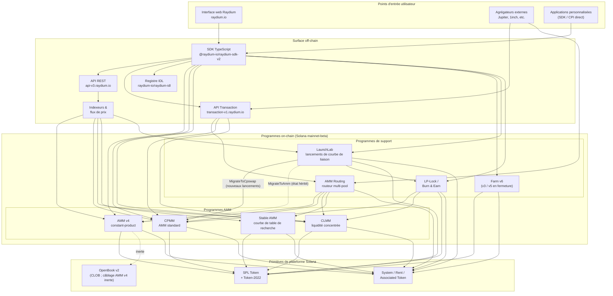

<Info>
  **Cette page est traduite automatiquement par IA. La version anglaise fait foi.**

  [Voir la version anglaise →](/protocol-overview/architecture)
</Info>

<Info>
  **Cette page est le diagramme d'architecture canonique de la documentation.** Tous les autres chapitres y renvoient plutôt que de redessiner le système. Les ID de programme ne sont pas intégrés dans cette page — ils se trouvent dans [`reference/program-addresses`](/fr/reference/program-addresses) pour pouvoir être mis à jour en un seul endroit.
</Info>

## Ce que Raydium est réellement

Raydium n'est **pas un seul programme**. C'est un ensemble de programmes Solana on-chain indépendants qui partagent une surface off-chain commune (API REST, SDK TypeScript, registre IDL) et quelques conventions (PDAs d'autorité, comptes de configuration des frais, multisig administratif). Une interaction utilisateur — un swap, un dépôt, une récolte de ferme — s'achemine vers exactement l'un de ces programmes ; la surface off-chain est ce qui les fait ressembler à un seul produit.

L'empreinte on-chain se divise en quatre types de programmes :

1. **Programmes AMM** — quatre programmes de pool distincts, chacun avec son propre format et sa propre mathématique de tarification :
   - **AMM v4** — l'AMM constant-product original. Initialement une conception hybride qui reflétait la courbe sur un marché OpenBook (anciennement Serum) ; l'intégration OpenBook a depuis été désactivée et les pools fonctionnent maintenant comme des AMMs purs par rapport à la courbe. Toujours le lieu le plus profond pour de nombreuses paires majeures.
   - **CPMM** — un AMM constant-product simple (`x · y = k`) construit nativement sur Solana, avec support de Token-2022 de première classe. **Le programme recommandé pour les nouveaux pools constant-product.**
   - **CLMM** — un AMM à liquidité concentrée dans le style Uniswap v3. La liquidité est fournie dans des plages de prix ; les frais s'accumulent par position ; l'état est organisé autour des ticks et d'un `sqrt_price_x64`.
   - **Stable AMM** — un programme StableSwap-style à liquidité fine (forké d'AMM v4 avec une courbe de tarification par table de recherche) que le routeur utilise pour les paires corrélées aux stablecoins. Non exposé comme une option de création de pool de première classe dans l'interface utilisateur aujourd'hui.
2. **Distribution des récompenses** — **Farm** (v3 / v5 / v6, avec v6 comme génération active ; v3/v5 sont en phase de fermeture uniquement).
3. **Lancement de token** — **LaunchLab**, un programme de courbe de liaison. Les lancements nouvellement initialisés **graduent** vers CPMM. L'instruction de migration AMM v4 héritée reste pour l'état de lancement existant.
4. **Primitives de liquidité** — **AMM Routing** (le routeur multi-pool on-chain qui CPI dans les quatre programmes AMM en une seule transaction) et **LP-Lock / Burn & Earn** (verrouille les positions LP tout en gardant les réclamations de frais ouvertes).

Tout le reste de la pile — les API REST, l'API Transaction, le SDK TypeScript, l'interface utilisateur — est une infrastructure off-chain qui compose ces programmes au-dessus de Solana et SPL Token / Token-2022. La surface Perps est une intégration séparée au-dessus d'Orderly Network et n'est pas un programme Raydium on-chain ; elle est exclue de ce diagramme.

## Diagramme canonique

```mermaid
flowchart TB
  subgraph user ["Points d'entrée utilisateur"]
    UI["Interface web Raydium<br/>raydium.io"]
    AGG["Agrégateurs externes<br/>Jupiter, 1inch, etc."]
    CUST["Applications personnalisées<br/>(SDK / CPI direct)"]
  end

  subgraph offchain ["Surface off-chain"]
    API["API REST<br/>api-v3.raydium.io"]
    TXAPI["API Transaction<br/>transaction-v1.raydium.io"]
    SDK["SDK TypeScript<br/>@raydium-io/raydium-sdk-v2"]
    IDL["Registre IDL<br/>raydium-io/raydium-idl"]
    IDX["Indexeurs &<br/>flux de prix"]
  end

  subgraph onchain ["Programmes on-chain (Solana mainnet-beta)"]
    subgraph amms ["Programmes AMM"]
      direction TB
      AMM4["AMM v4<br/>constant-product"]
      CPMM["CPMM<br/>AMM standard"]
      CLMM["CLMM<br/>liquidité concentrée"]
      STABLE["Stable AMM<br/>courbe de table de recherche"]
    end

    subgraph support ["Programmes de support"]
      direction TB
      ROUTE["AMM Routing<br/>routeur multi-pool"]
      FARM["Farm v6<br/>(v3 / v5 en fermeture)"]
      LAUNCH["LaunchLab<br/>lancements de courbe de liaison"]
      LOCK["LP-Lock /<br/>Burn & Earn"]
    end
  end

  subgraph solana ["Primitives de plateforme Solana"]
    TOKEN["SPL Token<br/>+ Token-2022"]
    OB["OpenBook v2<br/>(CLOB ; câblage AMM v4 inerte)"]
    SYS["System / Rent /<br/>Associated Token"]
  end

  %% Chemins client
  UI --> SDK
  CUST --> SDK
  AGG --> TXAPI
  AGG --> ROUTE

  %% Composition off-chain
  SDK --> API
  SDK --> TXAPI
  SDK --> IDL
  SDK --> AMM4
  SDK --> CPMM
  SDK --> CLMM
  SDK --> FARM
  SDK --> LAUNCH
  SDK --> LOCK

  TXAPI --> ROUTE
  TXAPI --> CPMM
  TXAPI --> CLMM

  API --> IDX
  IDX --> AMM4
  IDX --> CPMM
  IDX --> CLMM
  IDX --> STABLE
  IDX --> LAUNCH

  %% Routage → programmes AMM (CPI)
  ROUTE --> AMM4
  ROUTE --> CPMM
  ROUTE --> CLMM
  ROUTE --> STABLE

  %% Chemins de graduation LaunchLab
  LAUNCH -- "MigrateToCpswap (nouveaux lancements)" --> CPMM
  LAUNCH -. "MigrateToAmm (état hérité)" .-> AMM4
  LAUNCH --> LOCK

  %% LP-Lock enveloppe LP des pools CPMM / CLMM
  LOCK --> CPMM
  LOCK --> CLMM

  %% Programmes → SPL Token / Token-2022
  AMM4 --> TOKEN
  CPMM --> TOKEN
  CLMM --> TOKEN
  STABLE --> TOKEN
  FARM --> TOKEN
  LAUNCH --> TOKEN
  LOCK --> TOKEN

  %% Le câblage OpenBook historique d'AMM v4 est inerte
  AMM4 -. "inerte" .-> OB

  %% Programmes → System / Rent / ATA
  AMM4 --> SYS
  CPMM --> SYS
  CLMM --> SYS
  STABLE --> SYS
  FARM --> SYS
  LAUNCH --> SYS
  LOCK --> SYS
  ROUTE --> SYS
```

Les invariants clés que ce diagramme capture :

- **Les programmes AMM sont des pairs.** CPMM n'appelle pas CLMM ; CLMM n'appelle pas AMM v4 ; Stable AMM est son propre programme. Un swap direct sur un pool touche exactement un programme AMM. Le seul programme qui compose plusieurs AMMs en une seule transaction est **AMM Routing**, qui CPI dans AMM v4 / CPMM / CLMM / Stable AMM selon les besoins quand une route traverse les types de pool.
- **Le SDK et l'API Transaction sont des couches de composition, pas des programmes.** Quand l'interface web ou un agrégateur construit une transaction « swap à travers trois pools », le SDK (côté client) ou l'API Transaction (côté serveur) assemble les instructions en utilisant des devis récupérés de l'API REST. La chaîne voit une seule transaction Solana avec N instructions — aucun programme orchestrateur ne possède le flux entier.
- **Le câblage OpenBook d'AMM v4 est inerte.** AMM v4 était le seul AMM jamais lié à OpenBook, mais l'intégration a été désactivée — les pools ne partagent plus la liquidité avec OpenBook, `MonitorStep` n'est plus cranké, et une panne OpenBook n'a aucun impact sur le trafic de swap actuel. Les comptes de marché restent sur le `AmmInfo` du pool pour la compatibilité rétroactive mais font référence à un état inutilisé. CPMM, CLMM et Stable AMM n'ont jamais eu de dépendance CLOB.
- **Les nouveaux pools LaunchLab graduent vers CPMM.** L'initialisation nécessite maintenant `migrate_type = CPSWAP`. `MigrateToAmm` reste pour l'état hérité existant. Avant la mise à niveau du 2026-08-14, la migration CPMM verrouillait `creator_scale` séparément pour le créateur. Les migrations exécutées après combinent cela avec `platform_scale` en une seule position LP verrouillée appartenant à la plateforme. Les clés de frais antérieures restent inchangées.
- **LP-Lock est un wrapper, pas un cinquième AMM.** Il détient les positions LP au nom des créateurs sous une PDA afin que les frais sous-jacents puissent toujours être réclamés sans exposer la capacité à retirer la liquidité. Il compose sur les pools CPMM et CLMM.
- **Les surfaces off-chain se complètent.** L'API REST est en lecture seule avec mise en cache ; l'API Transaction construit des transactions prêtes à signer côté serveur ; le SDK les construit côté client. Les trois dépendent du même registre IDL comme source de vérité du schéma.

## Flux de données : un swap CPMM, de bout en bout

Pour rendre le tableau concret, voici ce qui se passe quand un utilisateur échange USDC → RAY sur un pool CPMM depuis l'interface Raydium. (AMM v4 et CLMM diffèrent dans les comptes dont ils ont besoin, pas dans la forme de haut niveau.)

1. **Demande de devis (off-chain).** L'interface appelle `GET https://api-v3.raydium.io/compute/swap-base-in` avec le mint d'entrée, le mint de sortie, le montant et une tolérance de slippage. L'API consulte son indexeur, choisit une route (possiblement à travers plusieurs pools) et retourne un devis plus la liste des ID de programme, des ID de pool et des comptes de frais dont le client aura besoin.
2. **Construction de transaction (client + SDK).** Le client transmet le devis à `raydium-sdk-v2`. Le SDK résout chaque PDA dont il a besoin (PDA d'autorité, état du pool, observation, vaults — voir [`products/cpmm/accounts`](/fr/products/cpmm/accounts)), injecte les comptes de token associés de l'utilisateur (les créant avec le programme Associated Token si manquants) et émet une `Transaction` non signée.
3. **Signature du portefeuille.** Le portefeuille de l'utilisateur signe la transaction. Rien de spécifique à Raydium ici ; c'est le flux de portefeuille Solana standard.
4. **Exécution on-chain.** La transaction signée atteint le programme **CPMM** de Raydium, qui (a) valide l'état du pool, (b) applique la courbe constant-product avec la configuration des frais du pool, (c) déplace les tokens entre les ATAs de l'utilisateur et les vaults du pool via CPI dans SPL Token / Token-2022, (d) met à jour le compte `observation` pour le TWAP, et (e) retourne.
5. **Ingestion de l'indexeur.** Le RPC Solana quelques slots plus tard expose les journaux du programme. L'indexeur de Raydium les analyse, met à jour les réserves du pool, le volume 24h et l'APR, et sert les valeurs mises à jour à la prochaine demande `/pools/info/ids`.

Les quatre étapes 2–4 se produisent dans une seule transaction Solana. L'API n'est impliquée que dans l'**étape 1** (devis) et l'**étape 5** (indexation pour la prochaine fois). Si l'API est hors ligne, un client avec un SDK actif et un RPC Solana peut toujours effectuer des transactions — il doit juste calculer la route lui-même.

## Infrastructure partagée

Plusieurs primitives sont utilisées par chaque produit et méritent d'être nommées une fois pour que les chapitres ultérieurs puissent y faire référence sans redéfinition. Les détails se trouvent dans [`protocol-overview/shared-infrastructure`](/fr/protocol-overview/shared-infrastructure) ; ceci est l'index.

| Primitive | Ce que c'est | Où c'est défini |
|-----------|------------|---------------------|
| **PDA d'autorité** | Un signataire appartenant au programme qui contrôle réellement les vaults de tokens. Les utilisateurs ne détiennent jamais l'autorité du vault. | Par programme ; CPMM utilise `vault_and_lp_mint_auth_seed` — voir [`products/cpmm/accounts`](/fr/products/cpmm/accounts). |
| **Comptes de configuration** | Comptes par programme contenant les taux de frais, les clés administrateur et les destinations de fonds/créateur. Indexés par un `u16` dans CPMM (`amm_config[index]`). | [`reference/program-addresses`](/fr/reference/program-addresses) liste les points de terminaison API qui les retournent. |
| **Répartition des frais protocole/fonds/créateur** | Un seul frais commercial est réparti trois (parfois quatre) façons au règlement. Même motif dans CPMM et CLMM, boutons différents. | [`reference/fee-comparison`](/fr/reference/fee-comparison) |
| **Compte d'observation** | Tampon circulaire d'échantillons de prix utilisés pour le TWAP. Écrit à chaque swap. | [`products/cpmm/accounts`](/fr/products/cpmm/accounts), [`products/clmm/accounts`](/fr/products/clmm/accounts) |
| **API REST (`api-v3.raydium.io`)** | L'API publique de lecture unique pour les métadonnées de pool, les positions, l'état de la ferme et le calcul de devis. | [`sdk-api/rest-api`](/fr/sdk-api/rest-api) |
| **Registre IDL** | IDLs Anchor pour chaque programme, mirrorés à [`github.com/raydium-io/raydium-idl`](https://github.com/raydium-io/raydium-idl). Le SDK et les intégrateurs CPI désérialisent par rapport à ceux-ci. | [`sdk-api/anchor-idl`](/fr/sdk-api/anchor-idl) |

## Surface off-chain : API vs SDK vs IDL

Ces trois sont régulièrement confondus. Ils font des choses différentes :

- **API REST** (`api-v3.raydium.io`) est une **vue en lecture seule, mise en cache** de l'état on-chain plus le **moteur de devis**. Elle vous dit quels pools existent, quelles sont leurs réserves, comment les APRs se présentent et quelle est la meilleure route pour un swap. Elle ne construit **pas** les transactions.
- **SDK TypeScript** (`@raydium-io/raydium-sdk-v2`) est un **constructeur de transactions**. Il connaît la disposition de chaque compte de programme et le format d'instruction. Il récupère l'état frais d'un RPC (pas de l'API) avant de composer une instruction, afin qu'il puisse signer des transactions précises. Il parle à l'API uniquement quand il a besoin d'un devis.
- **Registre IDL** est le **schéma** sur lequel les deux ci-dessus dépendent. Si vous écrivez des CPIs Rust dans un programme Raydium, l'IDL est le contrat ; si vous écrivez une intégration TS, vous utilisez les IDLs indirectement via le SDK.

## Où chaque chapitre s'inscrit

Le diagramme ci-dessus réapparaît — sous forme réduite — tout au long de la documentation. Voici où se trouve le traitement complet de chaque pièce pour que vous puissiez approfondir :

- **Programmes on-chain :** un chapitre par produit sous [`products/`](/fr/products). Chaque chapitre suit le même modèle (aperçu → comptes → mathématiques → instructions → frais → démos de code).
- **Primitives partagées entre programmes :** [`protocol-overview/shared-infrastructure`](/fr/protocol-overview/shared-infrastructure) et [`algorithms/`](/fr/algorithms) pour les mathématiques qui réapparaissent (constant-product, liquidité concentrée, tarification de courbe).
- **Surface off-chain :** [`sdk-api/`](/fr/sdk-api) a la référence complète du SDK et de l'API REST, plus [`sdk-api/anchor-idl`](/fr/sdk-api/anchor-idl) et [`sdk-api/rust-cpi`](/fr/sdk-api/rust-cpi).
- **Flux au niveau utilisateur (créer un pool, swapper, LP, réclamer des récompenses, lancer un token) :** [`user-flows/`](/fr/user-flows).
- **Modèles d'intégration pour d'autres équipes (agrégateurs, portefeuilles, bots) :** [`integration-guides/`](/fr/integration-guides).
- **Surface de sécurité, clés administrateur, risques connus, audits :** [`security/`](/fr/security).
- **Changements versionnés et l'histoire de migration AMM v4 → CPMM / Farm v3 → v6 :** [`protocol-overview/versions-and-migration`](/fr/protocol-overview/versions-and-migration).

## Non-objectifs de ce diagramme

Quelques omissions délibérées, pour que personne ne lise plus que ce qui y est :

- **Pas d'oracles de prix.** Raydium ne dépend pas de Pyth, Switchboard ou d'un oracle externe pour sa tarification AMM de base. Les devis proviennent des réserves on-chain. Le compte `observation` existe pour que **d'autres** contrats puissent lire un TWAP Raydium — Raydium lui-même n'en a pas besoin.
- **Pas de programme de vote de token on-chain.** Les actions administrateur telles que les mises à jour de configuration des frais et les mises à niveau de programme sont exécutées par un multisig. Les clés multisig et la politique de rotation se trouvent dans [`security/admin-and-multisig`](/fr/security/admin-and-multisig).
- **Pas de ponts.** Raydium est natif à Solana. Les flux inter-chaînes sont le problème de l'intégrateur et se trouvent en dehors de ce diagramme.

Sources :

- [`reference/program-addresses`](/fr/reference/program-addresses) pour les ID de programme canoniques référencés tout au long de cette page
- [github.com/raydium-io/raydium-sdk-V2](https://github.com/raydium-io/raydium-sdk-V2)
- [github.com/raydium-io/raydium-idl](https://github.com/raydium-io/raydium-idl)
