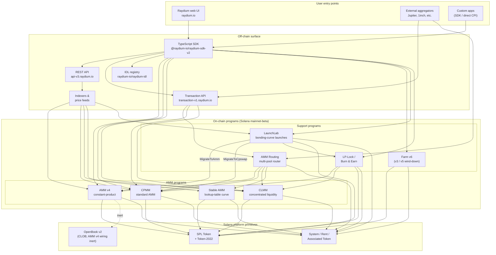

<Info>
  **Halaman ini diterjemahkan secara otomatis oleh AI. Versi bahasa Inggris adalah acuan resmi.**

  [Lihat versi bahasa Inggris →](/protocol-overview/architecture)
</Info>

## Apa Raydium sebenarnya

Raydium **bukan satu program**. Raydium adalah kumpulan program Solana on-chain yang independen namun berbagi permukaan off-chain yang sama (REST API, TypeScript SDK, registri IDL) dan beberapa konvensi (PDA authority, akun fee-config, admin multisig). Interaksi pengguna — sebuah swap, deposit, atau farm-harvest — diarahkan ke tepat satu program tersebut; permukaan off-chain membuatnya terasa seperti satu produk.

Jejak on-chain dikelompokkan menjadi empat jenis program:

1. **Program AMM** — empat program pool terpisah, masing-masing dengan format dan math pricing sendiri:
   - **AMM v4** — AMM constant-product original. Awalnya desain hybrid yang mencerminkan kurva ke pasar OpenBook (dulunya Serum); integrasi OpenBook sejak itu dinonaktifkan dan pool sekarang beroperasi sebagai AMM murni melawan kurva. Masih venue terdalam untuk banyak pasangan utama.
   - **CPMM** — AMM constant-product biasa (`x · y = k`) yang dibangun native di Solana, dengan dukungan first-class Token-2022. **Program yang direkomendasikan untuk pool constant-product baru.**
   - **CLMM** — AMM concentrated-liquidity dalam gaya Uniswap v3. Likuiditas disediakan ke range harga; fee terkumpul per-position; state diorganisir di sekitar tick dan `sqrt_price_x64`.
   - **Stable AMM** — program StableSwap-style thin-liquidity (forked dari AMM v4 dengan kurva pricing lookup-table) yang digunakan router untuk pasangan correlated stablecoin. Tidak ditampilkan sebagai opsi create-pool first-class di UI saat ini.
2. **Reward distribution** — **Farm** (v3 / v5 / v6, dengan v6 sebagai generasi aktif; v3/v5 hanya wind-down).
3. **Token launch** — **LaunchLab**, program bonding-curve. Peluncuran yang sukses **lulus** ke pool AMM v4 atau pool CPMM tergantung konfigurasi peluncuran, dengan LP dibungkus melalui program LP-Lock.
4. **Liquidity primitives** — **AMM Routing** (multi-pool router on-chain yang CPI ke empat program AMM dalam satu transaksi) dan **LP-Lock / Burn & Earn** (mengunci posisi LP sambil membuat klaim fee tetap terbuka).

Segalanya di stack — REST API, Transaction API, TypeScript SDK, UI — adalah infrastruktur off-chain yang mengkomposisi program ini di atas Solana dan SPL Token / Token-2022. Permukaan Perps adalah integrasi terpisah di atas Orderly Network dan bukan program Raydium on-chain; itu dikecualikan dari diagram ini.

## Diagram kanonik

Invariant kunci yang diagram ini tangkap:

- **Program AMM adalah rekan setara.** CPMM tidak memanggil CLMM; CLMM tidak memanggil AMM v4; Stable AMM adalah program sendiri. Swap langsung pada satu pool menyentuh tepat satu program AMM. Satu-satunya program yang mengkomposisi beberapa AMM dalam satu transaksi adalah **AMM Routing**, yang CPI ke AMM v4 / CPMM / CLMM / Stable AMM sesuai kebutuhan ketika rute melintasi tipe pool.
- **SDK dan Transaction API adalah layer komposisi, bukan program.** Ketika web UI atau aggregator membangun transaksi "swap melalui tiga pool", SDK (client-side) atau Transaction API (server-side) menjahit instruksi bersama menggunakan quote yang diambil dari REST API. Chain melihat satu transaksi Solana dengan N instruksi — tidak ada program orchestrator yang memiliki seluruh alur.
- **Wiring OpenBook AMM v4 inert.** AMM v4 adalah satu-satunya AMM yang pernah terikat ke OpenBook, tetapi integrasi telah dinonaktifkan — pool tidak lagi berbagi likuiditas ke OpenBook, `MonitorStep` tidak lagi dikerjakan, dan pemadaman OpenBook tidak berdampak pada traffic swap saat ini. Akun pasar tetap ada di `AmmInfo` pool untuk kompatibilitas mundur tetapi mereferensikan state yang tidak digunakan. CPMM, CLMM, dan Stable AMM tidak pernah memiliki dependensi CLOB.
- **LaunchLab lulus ke satu dari dua program AMM.** Peluncuran yang sukses memanggil `MigrateToAmm` (target: AMM v4) atau `MigrateToCpswap` (target: CPMM) tergantung `migrate_type`-nya; peluncuran Token-2022 selalu bermigrasi ke CPMM. LP pasca-lulus dibagi melalui `PlatformConfig` dan slice creator/platform dibungkus melalui program LP-Lock sebagai Fee Key NFT (pola Burn & Earn).
- **LP-Lock adalah wrapper, bukan AMM kelima.** LP-Lock memegang posisi LP atas nama creator di bawah PDA sehingga fee underlying masih dapat diklaim tanpa membuka kemampuan untuk menarik likuiditas. Ini mengkomposisi di atas pool CPMM dan CLMM.
- **Permukaan off-chain saling melengkapi.** REST API adalah read-only dengan caching; Transaction API membangun transaksi siap-tanda di server-side; SDK membangunnya client-side. Ketiga-tiganya bergantung pada registri IDL yang sama sebagai sumber kebenaran schema.

## Data flow: swap CPMM, end-to-end

Untuk membuat gambar konkret, berikut apa yang terjadi ketika pengguna melakukan swap USDC → RAY di pool CPMM dari UI Raydium. (AMM v4 dan CLMM berbeda dalam akun yang mereka butuhkan, bukan dalam bentuk tingkat tinggi.)

1. **Quote request (off-chain).** UI memanggil `GET https://api-v3.raydium.io/compute/swap-base-in` dengan input mint, output mint, amount, dan toleransi slippage. API berkonsultasi dengan indexer-nya, memilih rute (mungkin melalui beberapa pool), dan mengembalikan quote plus daftar program ID, pool ID, dan akun fee yang akan dibutuhkan client.
2. **Transaction build (client + SDK).** Client meneruskan quote ke `raydium-sdk-v2`. SDK menyelesaikan setiap PDA yang dibutuhkan (authority PDA, pool state, observation, vault — lihat [`products/cpmm/accounts`](/id/products/cpmm/accounts)), menyuntikkan akun token terkait pengguna (membuatnya dengan Associated Token Program jika hilang), dan mengeluarkan `Transaction` yang tidak ditandatangani.
3. **Wallet sign.** Wallet pengguna menandatangani transaksi. Tidak ada yang spesifik Raydium di sini; ini adalah alur wallet Solana standar.
4. **On-chain execution.** Transaksi yang ditandatangani masuk ke program **CPMM** Raydium, yang (a) memvalidasi state pool, (b) menerapkan kurva constant-product dengan fee config pool, (c) memindahkan token antara ATA pengguna dan vault pool via CPI ke SPL Token / Token-2022, (d) memperbarui akun `observation` untuk TWAP, dan (e) kembali.
5. **Indexer ingestion.** RPC Solana beberapa slot kemudian mengekspos log program. Indexer Raydium menguraikannya, memperbarui reserve pool, volume 24h, dan APR, dan melayani nilai yang diperbarui ke permintaan `/pools/info/ids` berikutnya.

Semua empat langkah 2–4 terjadi dalam satu transaksi Solana. API hanya terlibat pada **langkah 1** (quote) dan **langkah 5** (indexing untuk waktu berikutnya). Jika API down, client dengan SDK live dan RPC Solana masih dapat melakukan transaksi — hanya harus menghitung rute sendiri.

## Infrastruktur bersama

Beberapa primitif digunakan oleh setiap produk dan patut dinamai sekali sehingga bab-bab kemudian dapat merujuknya tanpa redefinisi. Detail ada di [`protocol-overview/shared-infrastructure`](/id/protocol-overview/shared-infrastructure); ini adalah indeksnya.

| Primitif | Apa itu | Di mana didefinisikan |
|-----------|------------|---------------------|
| **Authority PDA** | Signer yang dimiliki program yang benar-benar mengontrol vault token. Pengguna tidak pernah memegang authority vault. | Per-program; CPMM menggunakan `vault_and_lp_mint_auth_seed` — lihat [`products/cpmm/accounts`](/id/products/cpmm/accounts). |
| **Config accounts** | Akun per-program yang memegang fee rate, admin key, dan destination fund/creator. Diindeks oleh `u16` di CPMM (`amm_config[index]`). | [`reference/program-addresses`](/id/reference/program-addresses) mencantumkan endpoint API yang mengembalikannya. |
| **Protocol/fund/creator fee split** | Satu fee perdagangan dibagi tiga (kadang empat) cara saat settlement. Pola sama di CPMM dan CLMM, knob berbeda. | [`reference/fee-comparison`](/id/reference/fee-comparison) |
| **Observation account** | Ring buffer dari sampel harga yang digunakan untuk TWAP. Ditulis di setiap swap. | [`products/cpmm/accounts`](/id/products/cpmm/accounts), [`products/clmm/accounts`](/id/products/clmm/accounts) |
| **REST API (`api-v3.raydium.io`)** | API read publik tunggal untuk metadata pool, position, farm state, dan komputasi quote. | [`sdk-api/rest-api`](/id/sdk-api/rest-api) |
| **IDL registry** | Anchor IDL untuk setiap program, dicerminkan di [`github.com/raydium-io/raydium-idl`](https://github.com/raydium-io/raydium-idl). SDK dan integrator CPI melakukan deserialisasi terhadap ini. | [`sdk-api/anchor-idl`](/id/sdk-api/anchor-idl) |

## Permukaan off-chain: API vs SDK vs IDL

Ketiganya sering kali membingungkan. Mereka melakukan hal yang berbeda:

- **REST API** (`api-v3.raydium.io`) adalah **tampilan on-chain state yang read-mostly dan cached** plus **quote engine**. Ia memberi tahu Anda pool mana yang ada, reserve-nya apa, APR-nya terlihat bagaimana, dan rute terbaik apa untuk swap. Ia **tidak** membangun transaksi.
- **TypeScript SDK** (`@raydium-io/raydium-sdk-v2`) adalah **transaction builder**. Ia mengetahui layout akun dan format instruksi setiap program. Ia mengambil state segar dari RPC (bukan dari API) sebelum mengkomposisi instruksi, sehingga dapat menandatangani transaksi akurat. Itu berbicara dengan API hanya ketika membutuhkan quote.
- **IDL registry** adalah **schema** yang keduanya bergantung padanya. Jika Anda menulis Rust CPI ke program Raydium, IDL adalah kontrak; jika Anda menulis integrasi TS, Anda menggunakan IDL secara tidak langsung melalui SDK.

## Di mana setiap bab cocok

Diagram di atas berulang — dalam bentuk tereduksi — sepanjang dokumentasi. Berikut ini adalah tempat pengobatan penuh setiap bagian ada sehingga Anda dapat memperdalam:

- **Program on-chain:** satu bab per produk di bawah [`products/`](/id/products). Setiap bab mengikuti template yang sama (overview → accounts → math → instructions → fees → code demos).
- **Primitif cross-program bersama:** [`protocol-overview/shared-infrastructure`](/id/protocol-overview/shared-infrastructure) dan [`algorithms/`](/id/algorithms) untuk math yang berulang (constant-product, concentrated-liquidity, curve pricing).
- **Permukaan off-chain:** [`sdk-api/`](/id/sdk-api) memiliki referensi SDK dan REST API lengkap, plus [`sdk-api/anchor-idl`](/id/sdk-api/anchor-idl) dan [`sdk-api/rust-cpi`](/id/sdk-api/rust-cpi).
- **Alur tingkat pengguna (buat pool, swap, LP, klaim reward, luncurkan token):** [`user-flows/`](/id/user-flows).
- **Pola integrasi untuk tim lain (aggregator, wallet, bot):** [`integration-guides/`](/id/integration-guides).
- **Permukaan keamanan, admin key, risiko yang diketahui, audit:** [`security/`](/id/security).
- **Perubahan berversi dan cerita migrasi AMM v4 → CPMM / Farm v3 → v6:** [`protocol-overview/versions-and-migration`](/id/protocol-overview/versions-and-migration).

## Non-goals diagram ini

Beberapa penghilangan yang disengaja, jadi tidak ada yang membaca lebih banyak dari yang ada:

- **Tidak ada price oracle.** Raydium tidak bergantung pada Pyth, Switchboard, atau oracle eksternal apa pun untuk pricing AMM inti. Quote datang dari reserve on-chain. Akun `observation` ada sehingga **kontrak lain** dapat membaca Raydium TWAP — Raydium sendiri tidak membutuhkannya.
- **Tidak ada program token-voting on-chain.** Aksi admin seperti update fee-config dan upgrade program dieksekusi oleh multisig. Multisig key dan rotation policy ada di [`security/admin-and-multisig`](/id/security/admin-and-multisig).
- **Tidak ada bridge.** Raydium adalah Solana-native. Alur cross-chain adalah masalah integrator dan hidup di luar diagram ini.

Sumber:

- [`reference/program-addresses`](/id/reference/program-addresses) untuk program ID kanonik yang direferensikan di seluruh halaman ini
- [github.com/raydium-io/raydium-sdk-V2](https://github.com/raydium-io/raydium-sdk-V2)
- [github.com/raydium-io/raydium-idl](https://github.com/raydium-io/raydium-idl)
