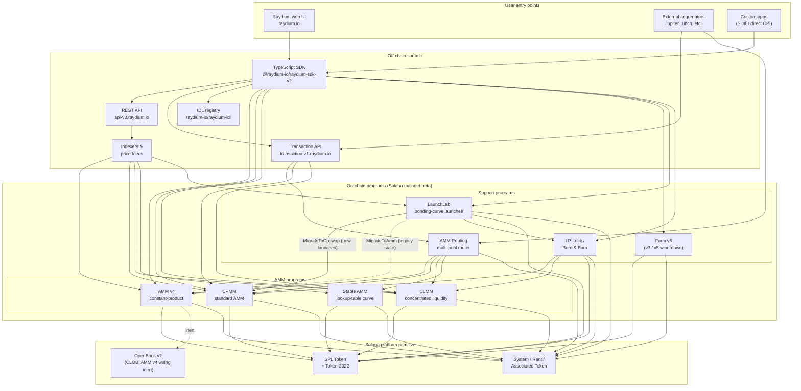

<Info>
  **Halaman ini diterjemahkan secara otomatis oleh AI. Versi bahasa Inggris adalah acuan resmi.**

  [Lihat versi bahasa Inggris →](/protocol-overview/architecture)
</Info>

## Apa sebenarnya Raydium

Raydium **bukan satu program**. Raydium adalah sekumpulan program Solana on-chain independen yang berbagi permukaan off-chain umum (REST API, TypeScript SDK, registri IDL) dan beberapa konvensi (authority PDA, akun fee-config, admin multisig). Interaksi pengguna — swap, deposit, farm-harvest — merutekan ke tepat satu dari program-program tersebut; permukaan off-chain membuat mereka terasa seperti satu produk.

Jejak on-chain dikelompokkan menjadi empat jenis program:

1. **Program AMM** — empat program pool terpisah, masing-masing dengan format dan matematika pricing sendiri:
   - **AMM v4** — AMM constant-product asli. Awalnya desain hybrid yang mencerminkan kurva ke pasar OpenBook (dulunya Serum); integrasi OpenBook sejak itu telah dinonaktifkan dan pool sekarang beroperasi sebagai AMM murni terhadap kurva. Masih venue terdalam untuk banyak pasangan utama.
   - **CPMM** — AMM constant-product biasa (`x · y = k`) yang dibangun secara native di Solana, dengan dukungan Token-2022 kelas satu. **Program yang direkomendasikan untuk pool constant-product baru.**
   - **CLMM** — AMM concentrated-liquidity dalam gaya Uniswap v3. Likuiditas disediakan ke rentang harga; biaya terakumulasi per-posisi; state diorganisir di sekitar tick dan `sqrt_price_x64`.
   - **Stable AMM** — program StableSwap-style thin-liquidity (fork dari AMM v4 dengan kurva pricing lookup-table) yang digunakan router untuk pasangan stablecoin-correlated. Tidak ditampilkan sebagai opsi create-pool kelas satu di UI saat ini.
2. **Distribusi reward** — **Farm** (v3 / v5 / v6, dengan v6 sebagai generasi aktif; v3/v5 hanya wind-down).
3. **Peluncuran token** — **LaunchLab**, program bonding-curve. Peluncuran yang baru diinisialisasi **graduate** ke CPMM. Instruksi migrasi AMM v4 legacy tetap ada untuk state peluncuran yang ada.
4. **Primitif likuiditas** — **AMM Routing** (router multi-pool on-chain yang CPI ke empat program AMM dalam satu transaksi) dan **LP-Lock / Burn & Earn** (mengunci posisi LP sambil membuat klaim biaya tetap terbuka).

Segala sesuatu yang lain dalam stack — REST API, Transaction API, TypeScript SDK, UI — adalah infrastruktur off-chain yang mengkomposisi program-program ini di atas Solana dan SPL Token / Token-2022. Permukaan Perps adalah integrasi terpisah di atas Orderly Network dan bukan program Raydium on-chain; itu dikecualikan dari diagram ini.

## Diagram kanonik

```mermaid
flowchart TB
  subgraph user ["User entry points"]
    UI["Raydium web UI<br/>raydium.io"]
    AGG["External aggregators<br/>Jupiter, 1inch, etc."]
    CUST["Custom apps<br/>(SDK / direct CPI)"]
  end

  subgraph offchain ["Off-chain surface"]
    API["REST API<br/>api-v3.raydium.io"]
    TXAPI["Transaction API<br/>transaction-v1.raydium.io"]
    SDK["TypeScript SDK<br/>@raydium-io/raydium-sdk-v2"]
    IDL["IDL registry<br/>raydium-io/raydium-idl"]
    IDX["Indexers &<br/>price feeds"]
  end

  subgraph onchain ["On-chain programs (Solana mainnet-beta)"]
    subgraph amms ["AMM programs"]
      direction TB
      AMM4["AMM v4<br/>constant-product"]
      CPMM["CPMM<br/>standard AMM"]
      CLMM["CLMM<br/>concentrated liquidity"]
      STABLE["Stable AMM<br/>lookup-table curve"]
    end

    subgraph support ["Support programs"]
      direction TB
      ROUTE["AMM Routing<br/>multi-pool router"]
      FARM["Farm v6<br/>(v3 / v5 wind-down)"]
      LAUNCH["LaunchLab<br/>bonding-curve launches"]
      LOCK["LP-Lock /<br/>Burn & Earn"]
    end
  end

  subgraph solana ["Solana platform primitives"]
    TOKEN["SPL Token<br/>+ Token-2022"]
    OB["OpenBook v2<br/>(CLOB; AMM v4 wiring inert)"]
    SYS["System / Rent /<br/>Associated Token"]
  end

  %% Client paths
  UI --> SDK
  CUST --> SDK
  AGG --> TXAPI
  AGG --> ROUTE

  %% Off-chain composition
  SDK --> API
  SDK --> TXAPI
  SDK --> IDL
  SDK --> AMM4
  SDK --> CPMM
  SDK --> CLMM
  SDK --> FARM
  SDK --> LAUNCH
  SDK --> LOCK

  TXAPI --> ROUTE
  TXAPI --> CPMM
  TXAPI --> CLMM

  API --> IDX
  IDX --> AMM4
  IDX --> CPMM
  IDX --> CLMM
  IDX --> STABLE
  IDX --> LAUNCH

  %% Routing → AMM programs (CPI)
  ROUTE --> AMM4
  ROUTE --> CPMM
  ROUTE --> CLMM
  ROUTE --> STABLE

  %% LaunchLab graduation paths
  LAUNCH -- "MigrateToCpswap (new launches)" --> CPMM
  LAUNCH -. "MigrateToAmm (legacy state)" .-> AMM4
  LAUNCH --> LOCK

  %% LP-Lock wraps LP from CPMM / CLMM pools
  LOCK --> CPMM
  LOCK --> CLMM

  %% Programs → SPL Token / Token-2022
  AMM4 --> TOKEN
  CPMM --> TOKEN
  CLMM --> TOKEN
  STABLE --> TOKEN
  FARM --> TOKEN
  LAUNCH --> TOKEN
  LOCK --> TOKEN

  %% AMM v4's historical OpenBook wiring is inert
  AMM4 -. "inert" .-> OB

  %% Programs → System / Rent / ATA
  AMM4 --> SYS
  CPMM --> SYS
  CLMM --> SYS
  STABLE --> SYS
  FARM --> SYS
  LAUNCH --> SYS
  LOCK --> SYS
  ROUTE --> SYS
```

Invarian kunci yang diagram ini tangkap:

- **Program AMM adalah peer.** CPMM tidak memanggil CLMM; CLMM tidak memanggil AMM v4; Stable AMM adalah program tersendiri. Swap langsung pada satu pool menyentuh tepat satu program AMM. Satu-satunya program yang mengkomposisi beberapa AMM dalam satu transaksi adalah **AMM Routing**, yang CPI ke AMM v4 / CPMM / CLMM / Stable AMM sesuai kebutuhan ketika rute melintasi tipe pool.
- **SDK dan Transaction API adalah lapisan komposisi, bukan program.** Ketika web UI atau aggregator membangun transaksi "swap melalui tiga pool", SDK (client-side) atau Transaction API (server-side) menjahit instruksi bersama menggunakan quote yang diambil dari REST API. Chain melihat satu transaksi Solana dengan N instruksi — tidak ada program orchestrator yang memiliki seluruh alur.
- **Wiring OpenBook AMM v4 tidak aktif.** AMM v4 adalah satu-satunya AMM yang pernah terikat ke OpenBook, tetapi integrasi telah dinonaktifkan — pool tidak lagi berbagi likuiditas ke OpenBook, `MonitorStep` tidak lagi dikerjakan, dan pemadaman OpenBook tidak berdampak pada lalu lintas swap saat ini. Akun pasar tetap ada di `AmmInfo` pool untuk kompatibilitas backward tetapi mereferensikan state yang tidak digunakan. CPMM, CLMM, dan Stable AMM tidak pernah memiliki ketergantungan CLOB.
- **Pool LaunchLab baru graduate ke CPMM.** Inisialisasi sekarang memerlukan `migrate_type = CPSWAP`. `MigrateToAmm` tetap ada untuk state legacy yang ada. Sebelum upgrade 2026-08-17, migrasi CPMM mengunci `creator_scale` secara terpisah untuk kreator. Migrasi yang dieksekusi setelahnya menggabungkannya dengan `platform_scale` menjadi satu posisi LP terkunci milik platform. Fee Key yang lebih awal tetap tidak berubah.
- **LP-Lock adalah wrapper, bukan AMM kelima.** Ini memegang posisi LP atas nama kreator di bawah PDA sehingga biaya yang mendasar masih dapat diklaim tanpa mengekspos kemampuan untuk menarik likuiditas. Ini mengkomposisi di atas pool CPMM dan CLMM.
- **Permukaan off-chain saling melengkapi.** REST API adalah read-only dengan caching; Transaction API membangun transaksi siap-tanda server-side; SDK membangun mereka client-side. Ketiganya bergantung pada registri IDL yang sama sebagai sumber kebenaran skema.

## Alur data: swap CPMM, end to end

Untuk membuat gambar konkret, berikut adalah apa yang terjadi ketika pengguna menukar USDC → RAY di pool CPMM dari Raydium UI. (AMM v4 dan CLMM berbeda dalam akun yang mereka butuhkan, bukan dalam bentuk tingkat tinggi.)

1. **Permintaan quote (off-chain).** UI memanggil `GET https://api-v3.raydium.io/compute/swap-base-in` dengan mint input, mint output, jumlah, dan toleransi slippage. API berkonsultasi dengan indexer-nya, memilih rute (mungkin melalui beberapa pool), dan mengembalikan quote plus daftar ID program, ID pool, dan akun biaya yang akan dibutuhkan klien.
2. **Pembangunan transaksi (klien + SDK).** Klien meneruskan quote ke `raydium-sdk-v2`. SDK menyelesaikan setiap PDA yang dibutuhkannya (authority PDA, pool state, observation, vault — lihat [`products/cpmm/accounts`](/id/products/cpmm/accounts)), menyuntikkan akun token terkait pengguna (membuatnya dengan Associated Token Program jika hilang), dan memancarkan `Transaction` yang tidak ditandatangani.
3. **Tanda tangan wallet.** Wallet pengguna menandatangani transaksi. Tidak ada yang spesifik Raydium di sini; ini adalah alur wallet Solana standar.
4. **Eksekusi on-chain.** Transaksi yang ditandatangani mengenai program **CPMM** Raydium, yang (a) memvalidasi state pool, (b) menerapkan kurva constant-product dengan konfigurasi biaya pool, (c) memindahkan token antara ATA pengguna dan vault pool melalui CPI ke SPL Token / Token-2022, (d) memperbarui akun `observation` untuk TWAP, dan (e) kembali.
5. **Penyerapan indexer.** RPC Solana beberapa slot kemudian mengekspos log program. Indexer Raydium menguraikannya, memperbarui reserve pool, volume 24h, dan APR, dan melayani nilai yang diperbarui ke permintaan `/pools/info/ids` berikutnya.

Keempat langkah 2–4 terjadi dalam satu transaksi Solana. API hanya terlibat dalam **langkah 1** (quote) dan **langkah 5** (indexing untuk waktu berikutnya). Jika API tidak aktif, klien dengan SDK live dan RPC Solana masih dapat bertransaksi — hanya perlu menghitung rute sendiri.

## Infrastruktur bersama

Beberapa primitif digunakan oleh setiap produk dan layak untuk dinamai sekali sehingga bab-bab kemudian dapat merujuknya tanpa redefinisi. Detail hidup di [`protocol-overview/shared-infrastructure`](/id/protocol-overview/shared-infrastructure); ini adalah indeksnya.

| Primitif | Apa itu | Di mana didefinisikan |
|-----------|------------|---------------------|
| **Authority PDA** | Penanda milik program yang benar-benar mengontrol vault token. Pengguna tidak pernah memegang authority vault. | Per-program; CPMM menggunakan `vault_and_lp_mint_auth_seed` — lihat [`products/cpmm/accounts`](/id/products/cpmm/accounts). |
| **Akun konfigurasi** | Akun per-program yang memegang tarif biaya, kunci admin, dan tujuan dana/kreator. Diindeks oleh `u16` di CPMM (`amm_config[index]`). | [`reference/program-addresses`](/id/reference/program-addresses) mencantumkan endpoint API yang mengembalikannya. |
| **Pemisahan biaya protokol/dana/kreator** | Satu biaya perdagangan dibagi tiga (kadang empat) cara pada penyelesaian. Pola yang sama di CPMM dan CLMM, knob berbeda. | [`reference/fee-comparison`](/id/reference/fee-comparison) |
| **Akun observation** | Ring buffer sampel harga yang digunakan untuk TWAP. Ditulis pada setiap swap. | [`products/cpmm/accounts`](/id/products/cpmm/accounts), [`products/clmm/accounts`](/id/products/clmm/accounts) |
| **REST API (`api-v3.raydium.io`)** | API baca publik tunggal untuk metadata pool, posisi, state farm, dan komputasi quote. | [`sdk-api/rest-api`](/id/sdk-api/rest-api) |
| **Registri IDL** | Anchor IDL untuk setiap program, dicerminkan di [`github.com/raydium-io/raydium-idl`](https://github.com/raydium-io/raydium-idl). SDK dan integrator CPI mendeserialisasi terhadap ini. | [`sdk-api/anchor-idl`](/id/sdk-api/anchor-idl) |

## Permukaan off-chain: API vs SDK vs IDL

Ketiganya sering membingungkan. Mereka melakukan hal yang berbeda:

- **REST API** (`api-v3.raydium.io`) adalah **tampilan read-mostly, cached** dari state on-chain plus **mesin quote**. Ini memberi tahu Anda pool mana yang ada, apa reserve mereka, bagaimana APR terlihat, dan apa rute terbaik untuk swap. Ini **tidak** membangun transaksi.
- **TypeScript SDK** (`@raydium-io/raydium-sdk-v2`) adalah **transaction builder**. Ini mengetahui tata letak akun dan format instruksi setiap program. Ini mengambil state segar dari RPC (bukan dari API) sebelum mengkomposisi instruksi, sehingga dapat menandatangani transaksi yang akurat. Ini berbicara dengan API hanya ketika membutuhkan quote.
- **Registri IDL** adalah **skema** yang keduanya bergantung. Jika Anda menulis Rust CPI ke program Raydium, IDL adalah kontrak; jika Anda menulis integrasi TS, Anda menggunakan IDL secara tidak langsung melalui SDK.

## Di mana setiap bab cocok

Diagram di atas berulang — dalam bentuk tereduksi — di seluruh dokumen. Berikut adalah di mana perlakuan lengkap setiap bagian hidup sehingga Anda dapat menggali:

- **Program on-chain:** satu bab per produk di bawah [`products/`](/id/products). Setiap bab mengikuti template yang sama (overview → accounts → math → instructions → fees → code demos).
- **Primitif lintas program bersama:** [`protocol-overview/shared-infrastructure`](/id/protocol-overview/shared-infrastructure) dan [`algorithms/`](/id/algorithms) untuk matematika yang berulang (constant-product, concentrated-liquidity, curve pricing).
- **Permukaan off-chain:** [`sdk-api/`](/id/sdk-api) memiliki referensi SDK dan REST API lengkap, plus [`sdk-api/anchor-idl`](/id/sdk-api/anchor-idl) dan [`sdk-api/rust-cpi`](/id/sdk-api/rust-cpi).
- **Alur tingkat pengguna (buat pool, swap, LP, klaim reward, luncurkan token):** [`user-flows/`](/id/user-flows).
- **Pola integrasi untuk tim lain (aggregator, wallet, bot):** [`integration-guides/`](/id/integration-guides).
- **Permukaan keamanan, kunci admin, risiko yang diketahui, audit:** [`security/`](/id/security).
- **Perubahan versi dan cerita migrasi AMM v4 → CPMM / Farm v3 → v6:** [`protocol-overview/versions-and-migration`](/id/protocol-overview/versions-and-migration).

## Non-tujuan diagram ini

Beberapa penghilangan yang disengaja, sehingga tidak ada yang membaca lebih banyak ke dalamnya daripada yang ada:

- **Tidak ada oracle harga.** Raydium tidak bergantung pada Pyth, Switchboard, atau oracle eksternal apa pun untuk pricing AMM inti. Quote berasal dari reserve on-chain. Akun `observation` ada sehingga **kontrak lain** dapat membaca TWAP Raydium — Raydium sendiri tidak membutuhkannya.
- **Tidak ada program token-voting on-chain.** Tindakan admin seperti pembaruan fee-config dan upgrade program dieksekusi oleh multisig. Kunci multisig dan kebijakan rotasi ada di [`security/admin-and-multisig`](/id/security/admin-and-multisig).
- **Tidak ada bridge.** Raydium adalah native Solana. Alur cross-chain adalah masalah integrator dan hidup di luar diagram ini.

Sumber:

- [`reference/program-addresses`](/id/reference/program-addresses) untuk ID program kanonik yang direferensikan di seluruh halaman ini
- [github.com/raydium-io/raydium-sdk-V2](https://github.com/raydium-io/raydium-sdk-V2)
- [github.com/raydium-io/raydium-idl](https://github.com/raydium-io/raydium-idl)
