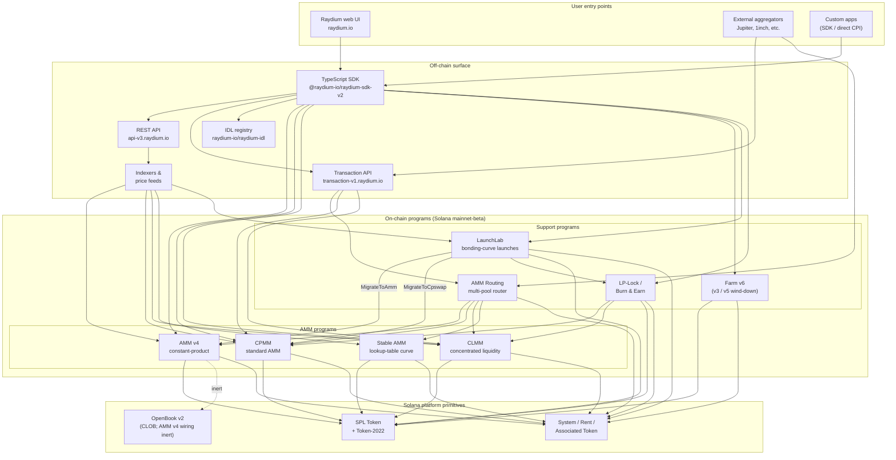

<Info>
  **このページは AI による自動翻訳です。すべての内容は英語版を正とします。**

  [英語版を表示 →](/protocol-overview/architecture)
</Info>

<Info>
  **このページはドキュメントの唯一の正式なアーキテクチャ図です。** 他の章ではすべてここにリンクを戻し、図を再描画しません。プログラム ID はこのページに埋め込まれていません。[`reference/program-addresses`](/ja/reference/program-addresses) に置かれているため、正確に 1 ヶ所で更新できます。
</Info>

## Raydium とは実際のところ何か

Raydium は**単一のプログラムではありません**。これは独立したオンチェーン Solana プログラムのセットであり、共通のオフチェーン・サーフェス（REST API、TypeScript SDK、IDL レジストリ）と少数の規約（オーソリティ PDA、フィー設定アカウント、管理マルチシグ）を共有しています。ユーザー インタラクション（スワップ、デポジット、ファーム・ハーベスト）は正確にこれらのプログラムの 1 つにルーティングされます。オフチェーン・サーフェスがこれらを単一の製品として感じさせます。

オンチェーン・フットプリントは 4 種類のプログラムに分類されます：

1. **AMM プログラム** — 4 つの独立したプール・プログラム。各プログラムは独自の形式と価格計算ロジックを持ちます：
   - **AMM v4** — 元の定数積 AMM。もともとハイブリッド設計で、OpenBook（旧 Serum）マーケットに曲線をミラーリングしていました。OpenBook 統合は非アクティブ化され、プールは現在曲線に対する純粋な AMM として動作します。多くの主要ペアで最も深いベニューです。
   - **CPMM** — Solana にネイティブに構築された単純な定数積 AMM（`x · y = k`）。Token-2022 の第一級サポートを備えています。**新しい定数積プールに推奨されるプログラムです。**
   - **CLMM** — Uniswap v3 スタイルの集中流動性 AMM。流動性は価格範囲に提供されます。フィーはポジション単位で発生します。状態はティックと `sqrt_price_x64` の周りに組織化されます。
   - **Stable AMM** — ルータがステーブルコイン相関ペアに使用するシン・リクイディティ StableSwap スタイル・プログラム（AMM v4 からフォークされ、ルックアップテーブル価格曲線で実装）。現在 UI では第一級のプール作成オプションとして公開されていません。
2. **リワード配布** — **Farm**（v3 / v5 / v6。v6 がアクティブな世代。v3/v5 はウインドダウンのみ）。
3. **トークン・ローンチ** — **LaunchLab**。ボンディング・カーブ・プログラムです。成功したローンチは、ローンチのコンフィグに応じて AMM v4 プールまたは CPMM プールに**卒業**し、LP は LP-Lock プログラムでラップされます。
4. **流動性プリミティブ** — **AMM ルーティング**（4 つの AMM プログラムに単一トランザクションで CPI する オンチェーン・マルチプール・ルータ）と **LP-Lock / Burn & Earn**（LP ポジションをロックしながらフィー請求を開いたままにします）。

スタック内のその他すべて（REST API、Transaction API、TypeScript SDK、UI）は、Solana と SPL Token / Token-2022 の上でこれらのプログラムを構成するオフチェーン・インフラストラクチャです。Perps サーフェスは Orderly Network の上にある別の統合であり、オンチェーン Raydium プログラムではありません。この図から除外されています。

## 正式な図

この図が示す主要な不変条件：

- **AMM プログラムはピア関係です。** CPMM は CLMM に呼び出しません。CLMM は AMM v4 に呼び出しません。Stable AMM は独立したプログラムです。1 つのプールでの直接スワップは正確に 1 つの AMM プログラムにタッチします。複数の AMM を単一トランザクションで構成する唯一のプログラムは **AMM ルーティング**で、ルートがプール・タイプをまたぐときに必要に応じて AMM v4 / CPMM / CLMM / Stable AMM に CPI します。
- **SDK と Transaction API は構成レイヤーであり、プログラムではありません。** Web UI またはアグリゲータが「3 つのプールを通るスワップ」トランザクションを構築するとき、SDK（クライアント側）または Transaction API（サーバー側）は REST API から取得した見積もりを使用して命令を結合します。チェーンは N 個の命令を持つ単一の Solana トランザクションを見ます。オーケストレータ・プログラムがフロー全体を所有することはありません。
- **AMM v4 の OpenBook ワイヤリングは非アクティブです。** AMM v4 は OpenBook にバインドされた唯一の AMM でしたが、統合は非アクティブ化されました。プールはもう OpenBook に流動性を共有しません。`MonitorStep` はもうクランクされません。OpenBook の停止は現在のスワップ トラフィックに影響しません。マーケット・アカウントは下位互換性のためプールの `AmmInfo` に残っていますが、未使用の状態を参照しています。CPMM、CLMM、Stable AMM は CLOB 依存を持っていません。
- **LaunchLab は 2 つの AMM プログラムのいずれかに卒業します。** 成功したローンチは `MigrateToAmm`（ターゲット：AMM v4）または `MigrateToCpswap`（ターゲット：CPMM）をその `migrate_type` に応じて呼び出します。Token-2022 ローンチは常に CPMM に移行します。卒業後の LP は `PlatformConfig` を介して分割され、クリエーター/プラットフォーム スライスは LP-Lock プログラムを通じて Fee Key NFT としてラップされます（Burn & Earn パターン）。
- **LP-Lock はラッパーであり、5 番目の AMM ではありません。** これはクリエーターの代わりに PDA の下に LP ポジションを保持するので、基礎となるフィーはリクイディティ引き出しの能力を露出させることなく請求できます。CPMM と CLMM プールを構成します。
- **オフチェーン・サーフェスは互いに補完します。** REST API はキャッシング付きの読み取り専用です。Transaction API はサーバー側で署名準備完了のトランザクションを構築します。SDK はクライアント側で構築します。すべての 3 つはスキーマの信頼のソースとして同じ IDL レジストリに依存します。

## データフロー：CPMM スワップ、エンドツーエンド

図を具体的にするために、ユーザーが Raydium UI から CPMM プール上で USDC → RAY をスワップするときに何が起こるかを示します。（AMM v4 と CLMM は必要とするアカウントで異なります。高レベルの形状では異なります。）

1. **見積もりリクエスト（オフチェーン）。** UI は入力ミント、出力ミント、金額、スリッページ許容度を含む `GET https://api-v3.raydium.io/compute/swap-base-in` を呼び出します。API はそのインデクサを参照し、ルートを選択し（場合によっては複数のプールを通じて）、クライアントが必要とするプログラム ID、プール ID、およびフィー・アカウントのリストと一緒に見積もりを返します。
2. **トランザクション構築（クライアント + SDK）。** クライアントは見積もりを `raydium-sdk-v2` に渡します。SDK は必要なすべての PDA（オーソリティ PDA、プール状態、オブザベーション、ボルト — [`products/cpmm/accounts`](/ja/products/cpmm/accounts) を参照）を解決し、ユーザーの関連トークン・アカウントを注入します（必要に応じて Associated Token Program で作成）、未署名の `Transaction` を発行します。
3. **ウォレット署名。** ユーザーのウォレットがトランザクションに署名します。ここには Raydium 固有のものはありません。これは標準的な Solana ウォレット・フローです。
4. **オンチェーン実行。** 署名付きトランザクションは Raydium **CPMM プログラム**に送信されます。このプログラムは（a）プール状態を検証し、（b）プールのフィー設定で定数積曲線を適用し、（c）SPL Token / Token-2022 への CPI を使用してユーザーの ATA とプール・ボルト間でトークンを移動し、（d）`observation` アカウントを TWAP 用に更新し、（e）返されます。
5. **インデクサ取り込み。** Solana RPC は数スロット後にプログラム・ログを公開します。Raydium のインデクサはこれらを解析し、プールのリザーブ、24 時間ボリューム、APR を更新し、次の `/pools/info/ids` リクエストに更新された値を提供します。

ステップ 2～4 はすべて単一の Solana トランザクション内で発生します。API はステップ 1（見積もり）とステップ 5（次回のインデックス）にのみ関係します。API がダウンしている場合、ライブ SDK と Solana RPC を持つクライアントでもトランザクション処理できます。ただし、ルート計算自身で行う必要があります。

## 共有インフラストラクチャ

いくつかのプリミティブはすべての製品で使用され、後の章が再定義なしでそれらを参照できるように、1 度で命名する価値があります。詳細は [`protocol-overview/shared-infrastructure`](/ja/protocol-overview/shared-infrastructure) にあります。これはインデックスです。

| プリミティブ | 説明 | 定義場所 |
|-----------|------------|---------------------|
| **オーソリティ PDA** | トークン・ボルトを実際に制御するプログラム所有署名者。ユーザーがボルト・オーソリティを保持することはありません。 | プログラム単位。CPMM は `vault_and_lp_mint_auth_seed` を使用します — [`products/cpmm/accounts`](/ja/products/cpmm/accounts) を参照。 |
| **コンフィグ・アカウント** | フィー率、管理キー、ファンド/クリエータ・デスティネーションを保有するプログラム単位のアカウント。CPMM で `u16` によってインデックス付け（`amm_config[index]`）。 | [`reference/program-addresses`](/ja/reference/program-addresses) はそれらを返す API エンドポイントをリストします。 |
| **プロトコル/ファンド/クリエータ・フィー分割** | 単一トレード・フィーは決済で 3 つ（時々 4 つ）に分割されます。CPMM と CLMM で同じパターン。異なるノブ。 | [`reference/fee-comparison`](/ja/reference/fee-comparison) |
| **オブザベーション・アカウント** | TWAP に使用される価格サンプルのリングバッファ。すべてのスワップで書き込まれます。 | [`products/cpmm/accounts`](/ja/products/cpmm/accounts)、[`products/clmm/accounts`](/ja/products/clmm/accounts) |
| **REST API（`api-v3.raydium.io`）** | プール メタデータ、ポジション、ファーム状態、見積もり計算の単一パブリック読み取り API。 | [`sdk-api/rest-api`](/ja/sdk-api/rest-api) |
| **IDL レジストリ** | すべてのプログラムの Anchor IDL。[`github.com/raydium-io/raydium-idl`](https://github.com/raydium-io/raydium-idl) にミラーリングされています。SDK と CPI 統合者はこれらに対して逆シリアル化されます。 | [`sdk-api/anchor-idl`](/ja/sdk-api/anchor-idl) |

## オフチェーン・サーフェス：API vs SDK vs IDL

これら 3 つはよく混同されます。異なることをします：

- **REST API**（`api-v3.raydium.io`）はオンチェーン状態の**読み取り中心でキャッシュされたビュー**と**見積もりエンジン**です。どのプールが存在するか、そのリザーブが何であるか、APR がどのように見えるか、スワップのベストルートが何であるかを教えてくれます。トランザクションを**構築しません**。
- **TypeScript SDK**（`@raydium-io/raydium-sdk-v2`）は**トランザクション・ビルダー**です。すべてのプログラムのアカウント・レイアウトと命令形式を知っています。命令を構成する前に RPC から新鮮な状態を取得します（API からではなく）。正確なトランザクションに署名できます。見積もりが必要なときにのみ API に話しかけます。
- **IDL レジストリ**は上記両方が依存する**スキーマ**です。Raydium プログラムへの Rust CPI を書いている場合、IDL は契約です。TS 統合を書いている場合、SDK を通じて間接的に IDL を使用しています。

## 各章がどこに適合するか

上記の図は、ドキュメント全体を通じて（縮小形式で）繰り返されます。各部分の完全な処理がどこにあるか、ドリルダウンできるように示します：

- **オンチェーン・プログラム：** [`products/`](/ja/products) の下の製品ごとに 1 つの章。各章は同じテンプレート（概要 → アカウント → 数学 → 命令 → フィー → コード デモ）に従います。
- **共有クロス・プログラム・プリミティブ：** [`protocol-overview/shared-infrastructure`](/ja/protocol-overview/shared-infrastructure) と繰り返される数学用の [`algorithms/`](/ja/algorithms)（定数積、集中流動性、曲線価格）。
- **オフチェーン・サーフェス：** [`sdk-api/`](/ja/sdk-api) は完全な SDK と REST API リファレンス、および [`sdk-api/anchor-idl`](/ja/sdk-api/anchor-idl) と [`sdk-api/rust-cpi`](/ja/sdk-api/rust-cpi) を持ちます。
- **ユーザー・レベル・フロー（プール作成、スワップ、LP、請求報酬、トークン・ローンチ）：** [`user-flows/`](/ja/user-flows)。
- **他のチーム用の統合パターン（アグリゲータ、ウォレット、ボット）：** [`integration-guides/`](/ja/integration-guides)。
- **セキュリティ・サーフェス、管理キー、既知のリスク、監査：** [`security/`](/ja/security)。
- **バージョン付き変更と AMM v4 → CPMM / Farm v3 → v6 マイグレーション・ストーリー：** [`protocol-overview/versions-and-migration`](/ja/protocol-overview/versions-and-migration)。

## この図の非目標

いくつかの意図的な省略があるため、誰もそれ以上に読まないようにしてください：

- **価格オラクルなし。** Raydium はそのコア AMM 価格設定で Pyth、Switchboard、または外部オラクルに依存しません。見積もりはオンチェーン・リザーブから来ます。`observation` アカウントは**他の**契約が Raydium TWAP を読むことができるようにするためのものです。Raydium 自身は必要としません。
- **オンチェーン・トークン投票プログラムなし。** フィー設定更新やプログラム・アップグレードなどの管理アクションはマルチシグによって実行されます。マルチシグキーとローテーション・ポリシーは [`security/admin-and-multisig`](/ja/security/admin-and-multisig) にあります。
- **ブリッジなし。** Raydium は Solana ネイティブです。クロスチェーン・フローは統合者の問題であり、この図の外にあります。

情報源：

- [`reference/program-addresses`](/ja/reference/program-addresses)このページ全体で参照される正式なプログラム ID 用
- [github.com/raydium-io/raydium-sdk-V2](https://github.com/raydium-io/raydium-sdk-V2)
- [github.com/raydium-io/raydium-idl](https://github.com/raydium-io/raydium-idl)
