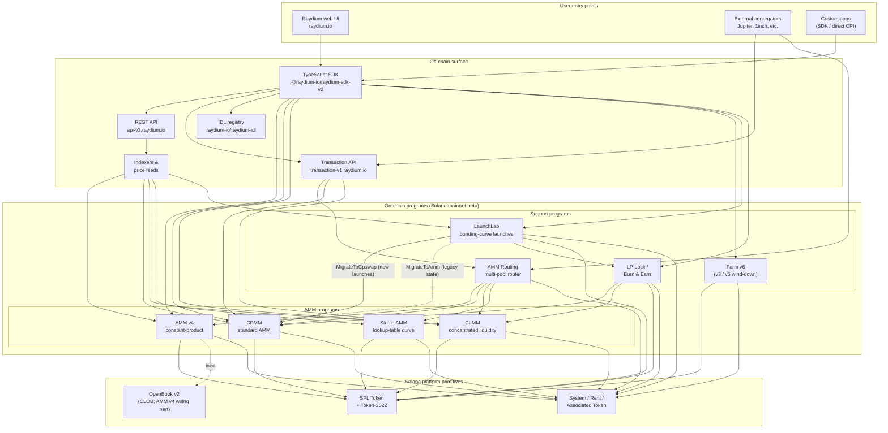

<Info>
  **このページは AI による自動翻訳です。すべての内容は英語版を正とします。**

  [英語版を表示 →](/protocol-overview/architecture)
</Info>

<Info>
  **このページはドキュメントの唯一の正規アーキテクチャ図です。** 他のすべての章はシステムを再描画するのではなく、ここにリンクバックします。プログラムIDはこのページに埋め込まれていません。[`reference/program-addresses`](/ja/reference/program-addresses)に存在するため、正確に1か所で更新できます。
</Info>

## Raydiumの実態

Raydiumは**1つのプログラムではありません**。Solana上の独立したオンチェーンプログラムのセットであり、共通のオフチェーン基盤（REST API、TypeScript SDK、IDLレジストリ）と少数の規約（オーソリティPDA、フィー設定アカウント、管理マルチシグ）を共有しています。ユーザーインタラクション（スワップ、デポジット、ファーム報酬の請求）は、これらのプログラムのいずれか1つにルーティングされます。オフチェーン基盤があるからこそ、それらが1つの製品のように感じられるのです。

オンチェーンフットプリントは4種類のプログラムに分類されます：

1. **AMMプログラム** — 4つの独立したプールプログラム、それぞれ独自のフォーマットと価格設定ロジックを持つ：
   - **AMM v4** — オリジナルの定積AMMです。当初はOpenBook（旧Serum）マーケットにカーブをミラーリングするハイブリッド設計でしたが、OpenBook統合はその後無効化され、プールは現在曲線に対する純粋なAMMとして動作します。多くの主要ペアで最も流動性が深いベニューです。
   - **CPMM** — Solana上にネイティブに構築された単純な定積AMM（`x · y = k`）で、Token-2022の第一級サポートを備えています。**新しい定積プールに推奨されるプログラムです。**
   - **CLMM** — Uniswap v3スタイルの集中流動性AMM。流動性は価格範囲に提供され、フィーはポジションごとに発生し、状態はティックと`sqrt_price_x64`を中心に構成されます。
   - **Stable AMM** — ルーターがステーブルコイン相関ペアに使用する薄い流動性のStableSwapスタイルプログラム（AMM v4からフォークされ、ルックアップテーブル価格曲線を使用）。現在、UIでは第一級のプール作成オプションとして表示されていません。
2. **報酬分配** — **Farm**（v3 / v5 / v6、v6がアクティブ世代、v3/v5は段階的廃止のみ）。
3. **トークンローンチ** — **LaunchLab**、ボンディングカーブプログラム。新しく初期化されたローンチはCPMMに**卒業**します。レガシーAMM v4マイグレーション命令は既存のローンチ状態用に残されています。
4. **流動性プリミティブ** — **AMMルーティング**（4つのAMMプログラムにCPIする単一トランザクション内のオンチェーン複数プールルーター）および**LP-Lock / Burn & Earn**（LPポジションをロックしながらフィー請求を開いたままにする）。

スタック内のその他すべて（REST API、Transaction API、TypeScript SDK、UI）は、これらのプログラムをSolanaおよびSPL Token / Token-2022の上に構成するオフチェーン基盤です。Perps基盤はOrderly Networkの上の別の統合であり、オンチェーンRaydiumプログラムではありません。このダイアグラムから除外されています。

## 正規ダイアグラム

```mermaid
flowchart TB
  subgraph user ["User entry points"]
    UI["Raydium web UI<br/>raydium.io"]
    AGG["External aggregators<br/>Jupiter, 1inch, etc."]
    CUST["Custom apps<br/>(SDK / direct CPI)"]
  end

  subgraph offchain ["Off-chain surface"]
    API["REST API<br/>api-v3.raydium.io"]
    TXAPI["Transaction API<br/>transaction-v1.raydium.io"]
    SDK["TypeScript SDK<br/>@raydium-io/raydium-sdk-v2"]
    IDL["IDL registry<br/>raydium-io/raydium-idl"]
    IDX["Indexers &<br/>price feeds"]
  end

  subgraph onchain ["On-chain programs (Solana mainnet-beta)"]
    subgraph amms ["AMM programs"]
      direction TB
      AMM4["AMM v4<br/>constant-product"]
      CPMM["CPMM<br/>standard AMM"]
      CLMM["CLMM<br/>concentrated liquidity"]
      STABLE["Stable AMM<br/>lookup-table curve"]
    end

    subgraph support ["Support programs"]
      direction TB
      ROUTE["AMM Routing<br/>multi-pool router"]
      FARM["Farm v6<br/>(v3 / v5 wind-down)"]
      LAUNCH["LaunchLab<br/>bonding-curve launches"]
      LOCK["LP-Lock /<br/>Burn & Earn"]
    end
  end

  subgraph solana ["Solana platform primitives"]
    TOKEN["SPL Token<br/>+ Token-2022"]
    OB["OpenBook v2<br/>(CLOB; AMM v4 wiring inert)"]
    SYS["System / Rent /<br/>Associated Token"]
  end

  %% Client paths
  UI --> SDK
  CUST --> SDK
  AGG --> TXAPI
  AGG --> ROUTE

  %% Off-chain composition
  SDK --> API
  SDK --> TXAPI
  SDK --> IDL
  SDK --> AMM4
  SDK --> CPMM
  SDK --> CLMM
  SDK --> FARM
  SDK --> LAUNCH
  SDK --> LOCK

  TXAPI --> ROUTE
  TXAPI --> CPMM
  TXAPI --> CLMM

  API --> IDX
  IDX --> AMM4
  IDX --> CPMM
  IDX --> CLMM
  IDX --> STABLE
  IDX --> LAUNCH

  %% Routing → AMM programs (CPI)
  ROUTE --> AMM4
  ROUTE --> CPMM
  ROUTE --> CLMM
  ROUTE --> STABLE

  %% LaunchLab graduation paths
  LAUNCH -- "MigrateToCpswap (new launches)" --> CPMM
  LAUNCH -. "MigrateToAmm (legacy state)" .-> AMM4
  LAUNCH --> LOCK

  %% LP-Lock wraps LP from CPMM / CLMM pools
  LOCK --> CPMM
  LOCK --> CLMM

  %% Programs → SPL Token / Token-2022
  AMM4 --> TOKEN
  CPMM --> TOKEN
  CLMM --> TOKEN
  STABLE --> TOKEN
  FARM --> TOKEN
  LAUNCH --> TOKEN
  LOCK --> TOKEN

  %% AMM v4's historical OpenBook wiring is inert
  AMM4 -. "inert" .-> OB

  %% Programs → System / Rent / ATA
  AMM4 --> SYS
  CPMM --> SYS
  CLMM --> SYS
  STABLE --> SYS
  FARM --> SYS
  LAUNCH --> SYS
  LOCK --> SYS
  ROUTE --> SYS
```

このダイアグラムが捉えている主要な不変量：

- **AMMプログラムはピアです。** CPMMはCLMMに呼び出しません。CLMMはAMM v4に呼び出しません。Stable AMMは独立したプログラムです。1つのプール上の直接スワップは、正確に1つのAMMプログラムに接触します。複数のAMMを単一トランザクション内で構成する唯一のプログラムは**AMMルーティング**であり、ルートがプールタイプを横切る場合、必要に応じてAMM v4 / CPMM / CLMM / Stable AMMにCPIします。
- **SDKとTransaction APIは構成レイヤーであり、プログラムではありません。** Web UIまたはアグリゲーターが「3つのプールを通じたスワップ」トランザクションを構築する場合、SDK（クライアント側）またはTransaction API（サーバー側）は、REST APIから取得した見積もりを使用して命令を一緒に縫い合わせます。チェーンは、N個の命令を持つ単一のSolanaトランザクションを見ます。オーケストレータープログラムが全体のフローを所有することはありません。
- **AMM v4のOpenBook配線は無効です。** AMM v4はOpenBookにバインドされた唯一のAMMでしたが、統合は無効化されました。プールはもはやOpenBookに流動性を共有せず、`MonitorStep`はもはやクランクされず、OpenBookの停止は現在のスワップトラフィックに影響を与えません。マーケットアカウントは後方互換性のためプールの`AmmInfo`に残りますが、未使用の状態を参照します。CPMM、CLMM、およびStable AMMはCLOB依存性を持ったことがありません。
- **新しいLaunchLabプールはCPMMに卒業します。** 初期化には`migrate_type = CPSWAP`が必要です。`MigrateToAmm`は既存のレガシー状態用に残されています。2026-08-14アップグレード前、CPMMマイグレーションは`creator_scale`をクリエイター用に別途ロックしました。その後に実行されたマイグレーションは、それを`platform_scale`と組み合わせて、1つのプラットフォーム所有のロックLP位置にします。以前のFee Keyは変更されません。
- **LP-Lockはラッパーであり、5番目のAMMではありません。** これはクリエイターの代わりにPDAの下でLPポジションを保持するため、基礎となるフィーは流動性を引き出す能力を公開することなく請求できます。これはCPMMおよびCLMMプール上に構成されます。
- **オフチェーン基盤は相互に補完します。** REST APIはキャッシング付きの読み取り専用です。Transaction APIはサーバー側で署名準備完了トランザクションを構築します。SDKはクライアント側で構築します。3つすべてが同じIDLレジストリをスキーマの真実のソースとして依存しています。

## データフロー：CPMMスワップ、エンドツーエンド

図を具体的にするために、ユーザーがRaydium UIからCPMMプール上でUSDC → RAYをスワップするときに何が起こるかを示します。（AMM v4とCLMMは必要なアカウントが異なりますが、高レベルの形状は異なりません。）

1. **見積もりリクエスト（オフチェーン）。** UIは`GET https://api-v3.raydium.io/compute/swap-base-in`を入力ミント、出力ミント、金額、およびスリッページ許容度で呼び出します。APIはインデクサーを参照し、ルート（複数のプールを通じた可能性がある）を選択し、見積もりとクライアントが必要とするプログラムID、プールID、およびフィーアカウントのリストを返します。
2. **トランザクション構築（クライアント + SDK）。** クライアントは見積もりを`raydium-sdk-v2`に渡します。SDKは必要なすべてのPDA（オーソリティPDA、プール状態、オブザベーション、ボルト — [`products/cpmm/accounts`](/ja/products/cpmm/accounts)を参照）を解決し、ユーザーの関連トークンアカウントを注入し（不足している場合は関連トークンプログラムで作成）、未署名の`Transaction`を発行します。
3. **ウォレット署名。** ユーザーのウォレットがトランザクションに署名します。ここにRaydium固有のものはありません。これは標準的なSolanaウォレットフローです。
4. **オンチェーン実行。** 署名されたトランザクションはRaydium **CPMMプログラム**にヒットします。これは（a）プール状態を検証し、（b）プールのフィー設定で定積曲線を適用し、（c）SPL Token / Token-2022へのCPIを介してユーザーのATAとプールボルト間でトークンを移動し、（d）TWAPの`observation`アカウントを更新し、（e）返します。
5. **インデクサー取り込み。** Solana RPC数スロット後、プログラムログを公開します。Raydiumのインデクサーはそれらを解析し、プールのリザーブ、24時間ボリューム、およびAPRを更新し、更新された値を次の`/pools/info/ids`リクエストに提供します。

ステップ2～4はすべて単一のSolanaトランザクション内で発生します。APIはステップ1（見積もり）とステップ5（次回のインデックス作成）にのみ関与します。APIがダウンしている場合、ライブSDKとSolana RPCを持つクライアントは依然としてトランザクションできます。ルートを自分で計算する必要があるだけです。

## 共有インフラストラクチャ

いくつかのプリミティブはすべての製品で使用され、後の章が再定義なしで参照できるように一度名前を付ける価値があります。詳細は[`protocol-overview/shared-infrastructure`](/ja/protocol-overview/shared-infrastructure)に存在します。これはインデックスです。

| プリミティブ | 説明 | 定義場所 |
|-----------|------------|---------------------|
| **オーソリティPDA** | トークンボルトを実際に制御するプログラム所有の署名者。ユーザーはボルトオーソリティを保持しません。 | プログラムごと。CPMMは`vault_and_lp_mint_auth_seed`を使用します — [`products/cpmm/accounts`](/ja/products/cpmm/accounts)を参照。 |
| **設定アカウント** | フィーレート、管理キー、およびファンド/クリエイター宛先を保持するプログラムごとのアカウント。CPMMの`u16`でインデックス付け（`amm_config[index]`）。 | [`reference/program-addresses`](/ja/reference/program-addresses)はそれらを返すAPIエンドポイントをリストします。 |
| **プロトコル/ファンド/クリエイターフィー分割** | 単一のトレードフィーは決済時に3つ（時々4つ）の方法に分割されます。CPMMとCLMMで同じパターン、異なるノブ。 | [`reference/fee-comparison`](/ja/reference/fee-comparison) |
| **オブザベーションアカウント** | TWAP用に使用される価格サンプルのリングバッファ。すべてのスワップで書き込まれます。 | [`products/cpmm/accounts`](/ja/products/cpmm/accounts)、[`products/clmm/accounts`](/ja/products/clmm/accounts) |
| **REST API（`api-v3.raydium.io`）** | プールメタデータ、ポジション、ファーム状態、および見積もり計算の単一の公開読み取りAPI。 | [`sdk-api/rest-api`](/ja/sdk-api/rest-api) |
| **IDLレジストリ** | すべてのプログラムのAnchor IDL、[`github.com/raydium-io/raydium-idl`](https://github.com/raydium-io/raydium-idl)でミラーリング。SDKとCPI統合者はこれらに対して逆シリアル化します。 | [`sdk-api/anchor-idl`](/ja/sdk-api/anchor-idl) |

## オフチェーン基盤：API vs SDK vs IDL

これら3つはしばしば混同されます。それらは異なることを行います：

- **REST API**（`api-v3.raydium.io`）はオンチェーン状態の**読み取り中心のキャッシュビュー**と**見積もりエンジン**です。どのプールが存在するか、リザーブが何であるか、APRがどのように見えるか、スワップの最適なルートが何であるかを教えてくれます。トランザクションを構築**しません**。
- **TypeScript SDK**（`@raydium-io/raydium-sdk-v2`）は**トランザクションビルダー**です。すべてのプログラムのアカウントレイアウトと命令フォーマットを知っています。命令を構成する前にRPCから新鮮な状態を取得し（APIからではなく）、正確なトランザクションに署名できるようにします。見積もりが必要な場合にのみAPIと通信します。
- **IDLレジストリ**は、上記の両方が依存する**スキーマ**です。Raydiumプログラムへの Rust CPIを書いている場合、IDLは契約です。TS統合を書いている場合、SDKを通じて間接的にIDLを使用しています。

## 各章の位置付け

上記のダイアグラムは、ドキュメント全体で縮小形で繰り返されます。各部分の完全な説明がどこに存在するかを示しているため、詳細に掘り下げることができます：

- **オンチェーンプログラム：** [`products/`](/ja/products)の下の製品ごとに1つの章。各章は同じテンプレートに従います（概要 → アカウント → 数学 → 命令 → フィー → コードデモ）。
- **共有クロスプログラムプリミティブ：** [`protocol-overview/shared-infrastructure`](/ja/protocol-overview/shared-infrastructure)および繰り返される数学用の[`algorithms/`](/ja/algorithms)（定積、集中流動性、曲線価格設定）。
- **オフチェーン基盤：** [`sdk-api/`](/ja/sdk-api)には完全なSDKおよびREST APIリファレンス、および[`sdk-api/anchor-idl`](/ja/sdk-api/anchor-idl)と[`sdk-api/rust-cpi`](/ja/sdk-api/rust-cpi)があります。
- **ユーザーレベルのフロー（プール作成、スワップ、LP、報酬請求、トークンローンチ）：** [`user-flows/`](/ja/user-flows)。
- **他のチーム向けの統合パターン（アグリゲーター、ウォレット、ボット）：** [`integration-guides/`](/ja/integration-guides)。
- **セキュリティ基盤、管理キー、既知のリスク、監査：** [`security/`](/ja/security)。
- **バージョン付き変更とAMM v4 → CPMM / Farm v3 → v6マイグレーションストーリー：** [`protocol-overview/versions-and-migration`](/ja/protocol-overview/versions-and-migration)。

## このダイアグラムの非目標

意図的な省略がいくつかあるため、誰もそこにあるもの以上に読み込みません：

- **価格オラクルなし。** Raydiumはコア AMM価格設定のためにPyth、Switchboard、または外部オラクルに依存しません。見積もりはオンチェーンリザーブから来ます。`observation`アカウントは、**他の**コントラクトがRaydium TWAPを読み取ることができるように存在します。Raydium自体はそれを必要としません。
- **オンチェーントークン投票プログラムなし。** フィー設定更新やプログラムアップグレードなどの管理アクションはマルチシグによって実行されます。マルチシグキーとローテーションポリシーは[`security/admin-and-multisig`](/ja/security/admin-and-multisig)にあります。
- **ブリッジなし。** Raydiumはsolana-nativeです。クロスチェーンフローは統合者の問題であり、このダイアグラムの外に存在します。

ソース：

- [`reference/program-addresses`](/ja/reference/program-addresses)このページ全体で参照される正規プログラムID用
- [github.com/raydium-io/raydium-sdk-V2](https://github.com/raydium-io/raydium-sdk-V2)
- [github.com/raydium-io/raydium-idl](https://github.com/raydium-io/raydium-idl)
