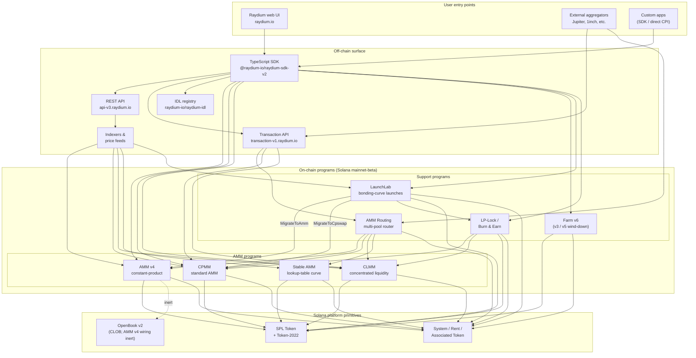

<Info>
  **이 페이지는 AI 자동 번역입니다. 모든 내용은 영문판을 기준으로 합니다.**

  [영문판 보기 →](/protocol-overview/architecture)
</Info>

<Info>
  **이 페이지는 문서 전체의 유일한 정식 아키텍처 다이어그램입니다.** 다른 모든 챕터는 시스템을 재작성하지 않고 여기로 돌아옵니다. 프로그램 ID는 이 페이지에 포함되지 않으며, [`reference/program-addresses`](/ko/reference/program-addresses)에 위치하므로 한 곳에서만 업데이트할 수 있습니다.
</Info>

## Raydium은 실제로 무엇인가

Raydium은 **단일 프로그램이 아닙니다**. 공통된 오프체인 인터페이스(REST API, TypeScript SDK, IDL 레지스트리)와 몇 가지 규약(권한 PDA, 수수료 설정 계정, 관리자 멀티시그)을 공유하는 독립적인 온체인 Solana 프로그램의 집합입니다. 사용자의 상호작용—스왑, 입금, 팜 수확—은 정확히 이 프로그램 중 하나로 라우팅되며, 오프체인 인터페이스가 이들을 하나의 제품처럼 느껴지게 만듭니다.

온체인 풋프린트는 네 가지 종류의 프로그램으로 나뉩니다:

1. **AMM 프로그램** — 각각 고유한 포맷과 가격 설정 수학을 가진 네 개의 별도 풀 프로그램:
   - **AMM v4** — 원래의 상수곱 AMM입니다. 원래는 곡선을 OpenBook(이전 Serum) 마켓에 미러링하는 하이브리드 설계였으며, OpenBook 통합은 이후 비활성화되었고 풀은 이제 곡선 대비 순수 AMM으로 작동합니다. 여전히 많은 주요 페어의 가장 깊은 유동성 공급원입니다.
   - **CPMM** — Solana에 기본적으로 구축된 순수 상수곱 AMM(`x · y = k`)이며, Token-2022를 우선적으로 지원합니다. **새로운 상수곱 풀의 권장 프로그램입니다.**
   - **CLMM** — Uniswap v3 스타일의 집중화된 유동성 AMM입니다. 유동성은 가격 범위로 제공되고, 수수료는 포지션별로 발생하며, 상태는 틱과 `sqrt_price_x64` 중심으로 구성됩니다.
   - **Stable AMM** — 라우터가 스테이블코인 관련 페어에 사용하는 얇은 유동성의 StableSwap 스타일 프로그램(조회 테이블 가격 곡선을 가진 AMM v4에서 포크됨)입니다. 현재 UI에서 일급 풀 생성 옵션으로 노출되지 않습니다.
2. **리워드 분배** — **Farm** (v3 / v5 / v6, v6이 활성 세대; v3/v5는 종료만 가능).
3. **토큰 런칭** — **LaunchLab**, 본딩 곡선 프로그램입니다. 성공한 런칭은 런칭 설정에 따라 AMM v4 풀 또는 CPMM 풀로 **졸업**되며, LP는 LP-Lock 프로그램을 통해 래핑됩니다.
4. **유동성 프리미티브** — **AMM Routing** (단일 트랜잭션에서 네 개의 AMM 프로그램으로 CPI하는 온체인 멀티풀 라우터) 및 **LP-Lock / Burn & Earn** (LP 포지션을 잠금 처리하면서 수수료 청구를 열린 상태로 유지).

스택의 다른 모든 것—REST API, 트랜잭션 API, TypeScript SDK, UI—는 Solana 및 SPL Token / Token-2022 위에 이 프로그램들을 구성하는 오프체인 인프라입니다. Perps 인터페이스는 Orderly Network 위의 별도 통합이며 온체인 Raydium 프로그램이 아닙니다. 이 다이어그램에서는 제외됩니다.

## 정식 다이어그램

이 다이어그램이 포착하는 핵심 불변성:

- **AMM 프로그램은 동등합니다.** CPMM이 CLMM으로 호출하지 않고, CLMM이 AMM v4로 호출하지 않으며, Stable AMM은 자체 프로그램입니다. 하나의 풀에 대한 직접 스왑은 정확히 하나의 AMM 프로그램에 접촉합니다. 단일 트랜잭션에서 여러 AMM을 구성하는 유일한 프로그램은 경로가 풀 유형을 넘을 때 필요에 따라 AMM v4 / CPMM / CLMM / Stable AMM으로 CPI하는 **AMM Routing**입니다.
- **SDK와 트랜잭션 API는 구성 계층이지 프로그램이 아닙니다.** 웹 UI 또는 애그리게이터가 "세 개의 풀을 통한 스왑" 트랜잭션을 구축할 때, SDK(클라이언트 측) 또는 트랜잭션 API(서버 측)는 REST API에서 가져온 견적을 사용하여 명령어를 함께 연결합니다. 체인은 N개의 명령어가 있는 단일 Solana 트랜잭션을 봅니다—전체 흐름을 소유하는 오케스트레이터 프로그램은 없습니다.
- **AMM v4의 OpenBook 배선은 비활성화됩니다.** AMM v4는 OpenBook에 바인딩된 유일한 AMM이었지만, 통합이 비활성화되었습니다—풀은 더 이상 OpenBook에 유동성을 공유하지 않으며, `MonitorStep`은 더 이상 작동하지 않으며, OpenBook 중단은 현재 스왑 트래픽에 영향을 주지 않습니다. 마켓 계정은 역호환성을 위해 풀의 `AmmInfo`에 남아 있지만 사용되지 않는 상태를 참조합니다. CPMM, CLMM 및 Stable AMM은 CLOB 의존성이 없습니다.
- **LaunchLab은 두 개의 AMM 프로그램 중 하나로 졸업합니다.** 성공한 런칭은 `MigrateToAmm`(대상: AMM v4) 또는 `MigrateToCpswap`(대상: CPMM)을 호출하며, 이는 `migrate_type`에 따릅니다. Token-2022 런칭은 항상 CPMM으로 마이그레이션됩니다. 졸업 후 LP는 `PlatformConfig`를 통해 분할되며, 크리에이터/플랫폼 슬라이스는 LP-Lock 프로그램을 통해 Fee Key NFT로 래핑됩니다(Burn & Earn 패턴).
- **LP-Lock은 래퍼이지 다섯 번째 AMM이 아닙니다.** 크리에이터를 대신하여 PDA 아래에 LP 포지션을 보유하므로 기본 수수료를 여전히 청구할 수 있으며 유동성 인출 능력을 노출하지 않습니다. CPMM 및 CLMM 풀 위에 구성됩니다.
- **오프체인 인터페이스는 서로를 보완합니다.** REST API는 캐싱 기능이 있는 읽기 전용입니다. 트랜잭션 API는 서버 측에서 서명 준비 트랜잭션을 구축합니다. SDK는 클라이언트 측에서 구축합니다. 세 가지 모두 스키마 진실 공급원으로서 동일한 IDL 레지스트리에 의존합니다.

## 데이터 흐름: CPMM 스왑, 엔드-투-엔드

그림을 구체적으로 만들기 위해, 사용자가 Raydium UI에서 CPMM 풀에 대해 USDC → RAY를 스왑할 때 발생하는 상황을 보겠습니다. (AMM v4 및 CLMM은 필요한 계정에서 다르지만 고수준 모양은 다르지 않습니다.)

1. **견적 요청 (오프체인).** UI는 입력 민트, 출력 민트, 금액, 슬리피지 허용도를 포함하여 `GET https://api-v3.raydium.io/compute/swap-base-in`을 호출합니다. API는 인덱서를 참조하고, 경로를 선택하며(여러 풀을 통할 수 있음), 클라이언트가 필요한 프로그램 ID, 풀 ID, 수수료 계정 목록과 함께 견적을 반환합니다.
2. **트랜잭션 구축 (클라이언트 + SDK).** 클라이언트는 견적을 `raydium-sdk-v2`에 전달합니다. SDK는 필요한 모든 PDA(권한 PDA, 풀 상태, 옵저베이션, 보관소)를 해결하고, 사용자의 관련 토큰 계정을 주입하며(누락된 경우 Associated Token Program으로 생성), 서명되지 않은 `Transaction`을 내보냅니다.
3. **지갑 서명.** 사용자의 지갑이 트랜잭션에 서명합니다. 여기에 Raydium 관련 사항이 없습니다. 이것은 표준 Solana 지갑 흐름입니다.
4. **온체인 실행.** 서명된 트랜잭션은 Raydium **CPMM 프로그램**에 도달하며, 이는 (a) 풀 상태를 검증하고, (b) 풀의 수수료 설정으로 상수곱 곡선을 적용하고, (c) SPL Token / Token-2022로의 CPI를 통해 사용자의 ATA와 풀 보관소 사이에서 토큰을 이동하고, (d) TWAP를 위해 `observation` 계정을 업데이트하고, (e) 반환합니다.
5. **인덱서 수집.** Solana RPC는 몇 슬롯 뒤에 프로그램 로그를 노출합니다. Raydium의 인덱서는 이를 파싱하고, 풀의 리저브, 24시간 거래량 및 APR을 업데이트하며, 업데이트된 값을 다음 `/pools/info/ids` 요청에 제공합니다.

4단계 모두 2–4는 단일 Solana 트랜잭션 내에서 발생합니다. API는 **1단계**(견적) 및 **5단계**(다음번을 위한 인덱싱)에만 관련됩니다. API가 다운되어도, 라이브 SDK와 Solana RPC가 있는 클라이언트는 여전히 거래할 수 있습니다—경로를 직접 계산해야 할 뿐입니다.

## 공유 인프라

모든 제품이 사용하고 나중 챕터가 재정의 없이 이를 참조할 수 있도록 이름을 지을 가치가 있는 여러 프리미티브가 있습니다. 세부 사항은 [`protocol-overview/shared-infrastructure`](/ko/protocol-overview/shared-infrastructure)에 있으며, 여기는 색인입니다.

| 프리미티브 | 정의 | 정의 위치 |
|-----------|------|---------|
| **Authority PDA** | 토큰 보관소를 실제로 제어하는 프로그램 소유 서명자입니다. 사용자는 절대 보관소 권한을 보유하지 않습니다. | 프로그램별; CPMM은 `vault_and_lp_mint_auth_seed` 사용 — [`products/cpmm/accounts`](/ko/products/cpmm/accounts) 참조. |
| **설정 계정** | 수수료율, 관리자 키, 펀드/크리에이터 목적지를 보유하는 프로그램별 계정입니다. CPMM에서 `u16` 으로 인덱싱됩니다 (`amm_config[index]`). | [`reference/program-addresses`](/ko/reference/program-addresses)는 이들을 반환하는 API 엔드포인트를 나열합니다. |
| **프로토콜/펀드/크리에이터 수수료 분할** | 단일 거래 수수료는 결제 시 3가지(때때로 4가지) 방식으로 분할됩니다. CPMM과 CLMM에서는 동일한 패턴이지만 서로 다른 조정입니다. | [`reference/fee-comparison`](/ko/reference/fee-comparison) |
| **옵저베이션 계정** | TWAP에 사용되는 가격 샘플의 링 버퍼입니다. 모든 스왑에서 작성됩니다. | [`products/cpmm/accounts`](/ko/products/cpmm/accounts), [`products/clmm/accounts`](/ko/products/clmm/accounts) |
| **REST API (`api-v3.raydium.io`)** | 풀 메타데이터, 포지션, 팜 상태, 견적 계산에 대한 단일 공개 읽기 API입니다. | [`sdk-api/rest-api`](/ko/sdk-api/rest-api) |
| **IDL 레지스트리** | 모든 프로그램의 Anchor IDL이며, [`github.com/raydium-io/raydium-idl`](https://github.com/raydium-io/raydium-idl)에서 미러링됩니다. SDK 및 CPI 통합자는 이를 기반으로 역직렬화합니다. | [`sdk-api/anchor-idl`](/ko/sdk-api/anchor-idl) |

## 오프체인 인터페이스: API vs SDK vs IDL

이 세 가지는 자주 혼동됩니다. 서로 다른 일을 수행합니다:

- **REST API** (`api-v3.raydium.io`)는 온체인 상태의 **읽기 위주, 캐시된 뷰**와 **견적 엔진**입니다. 존재하는 풀, 그 리저브, APR 모습, 스왑의 최선의 경로를 알려줍니다. **트랜잭션을 구축하지 않습니다.**
- **TypeScript SDK** (`@raydium-io/raydium-sdk-v2`)는 **트랜잭션 빌더**입니다. 모든 프로그램의 계정 레이아웃과 명령어 포맷을 압니다. 명령어를 구성하기 전에 RPC(API가 아님)에서 신선한 상태를 가져오므로, 정확한 트랜잭션에 서명할 수 있습니다. REST API에서 견적이 필요할 때만 이를 통해 이야기합니다.
- **IDL 레지스트리**는 위의 둘 모두가 의존하는 **스키마**입니다. Raydium 프로그램으로의 Rust CPI를 작성하는 경우, IDL이 계약입니다. TS 통합을 작성하는 경우, SDK를 통해 간접적으로 IDL을 사용하고 있습니다.

## 각 챕터의 위치

위의 다이어그램은 문서 전체에서 축약된 형태로 반복됩니다. 각 부분의 전체 설명이 있는 위치는 다음과 같습니다:

- **온체인 프로그램:** [`products/`](/ko/products) 아래 제품당 한 챕터씩입니다. 각 챕터는 동일한 템플릿을 따릅니다(개요 → 계정 → 수학 → 명령어 → 수수료 → 코드 데모).
- **공유 크로스 프로그램 프리미티브:** [`protocol-overview/shared-infrastructure`](/ko/protocol-overview/shared-infrastructure) 및 [`algorithms/`](/ko/algorithms)에 반복되는 수학(상수곱, 집중화된 유동성, 곡선 가격 책정)이 있습니다.
- **오프체인 인터페이스:** [`sdk-api/`](/ko/sdk-api)에는 전체 SDK 및 REST API 참조가 있으며, [`sdk-api/anchor-idl`](/ko/sdk-api/anchor-idl) 및 [`sdk-api/rust-cpi`](/ko/sdk-api/rust-cpi)가 있습니다.
- **사용자 수준 흐름 (풀 생성, 스왑, LP, 리워드 청구, 토큰 런칭):** [`user-flows/`](/ko/user-flows).
- **다른 팀을 위한 통합 패턴 (애그리게이터, 지갑, 봇):** [`integration-guides/`](/ko/integration-guides).
- **보안 인터페이스, 관리자 키, 알려진 위험, 감사:** [`security/`](/ko/security).
- **버전 관리 변경 사항 및 AMM v4 → CPMM / Farm v3 → v6 마이그레이션 스토리:** [`protocol-overview/versions-and-migration`](/ko/protocol-overview/versions-and-migration).

## 이 다이어그램의 비목표

의도적 생략 사항이므로 아무도 이것 이상으로 읽지 않습니다:

- **가격 오라클이 없습니다.** Raydium은 핵심 AMM 가격 책정을 위해 Pyth, Switchboard 또는 다른 외부 오라클에 의존하지 않습니다. 견적은 온체인 리저브에서 나옵니다. `observation` 계정은 **다른** 계약이 Raydium TWAP을 읽을 수 있도록 존재합니다—Raydium 자체는 이를 필요로 하지 않습니다.
- **온체인 토큰 투표 프로그램이 없습니다.** 수수료 설정 업데이트 및 프로그램 업그레이드와 같은 관리자 작업은 멀티시그에 의해 실행됩니다. 멀티시그 키 및 회전 정책은 [`security/admin-and-multisig`](/ko/security/admin-and-multisig)에 있습니다.
- **브리지가 없습니다.** Raydium은 Solana 기본입니다. 크로스체인 흐름은 통합자의 문제이며 이 다이어그램 외부에 있습니다.

소스:

- [`reference/program-addresses`](/ko/reference/program-addresses) - 이 페이지 전체에서 참조되는 정식 프로그램 ID
- [github.com/raydium-io/raydium-sdk-V2](https://github.com/raydium-io/raydium-sdk-V2)
- [github.com/raydium-io/raydium-idl](https://github.com/raydium-io/raydium-idl)
