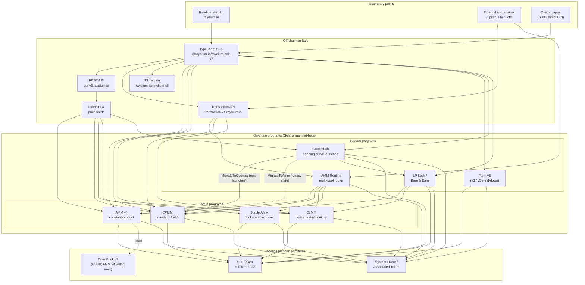

<Info>
  **이 페이지는 AI 자동 번역입니다. 모든 내용은 영문판을 기준으로 합니다.**

  [영문판 보기 →](/protocol-overview/architecture)
</Info>

<Info>
  **이 페이지는 문서의 유일한 정식 아키텍처 다이어그램입니다.** 다른 모든 장에서는 시스템을 다시 그리는 대신 여기로 다시 링크합니다. 프로그램 ID는 이 페이지에 포함되지 않으며, [`reference/program-addresses`](/ko/reference/program-addresses)에 있어서 정확히 한 곳에서만 업데이트할 수 있습니다.
</Info>

## Raydium이 실제로 무엇인가

Raydium은 **하나의 프로그램이 아닙니다**. 공통 오프체인 인터페이스(REST API, TypeScript SDK, IDL 레지스트리)와 몇 가지 규칙(권한 PDA, 수수료 설정 계정, 관리자 멀티시그)을 공유하는 독립적인 온체인 Solana 프로그램 세트입니다. 사용자 상호작용(스왑, 입금, 팜 수확)은 정확히 이러한 프로그램 중 하나로 라우팅되며, 오프체인 인터페이스가 이들을 하나의 제품처럼 느껴지게 만듭니다.

온체인 풋프린트는 네 가지 종류의 프로그램으로 나뉩니다:

1. **AMM 프로그램** — 각각 고유한 형식과 가격 책정 수학을 가진 네 개의 별도 풀 프로그램:
   - **AMM v4** — 원래의 상수곱 AMM입니다. 원래는 OpenBook(이전의 Serum) 마켓에 곡선을 미러링하는 하이브리드 설계였으나, OpenBook 통합은 이후 비활성화되었고 풀은 이제 곡선에 대한 순수 AMM으로 작동합니다. 여전히 많은 주요 쌍의 가장 깊은 거래소입니다.
   - **CPMM** — Solana에 기본적으로 구축된 순수 상수곱 AMM(`x · y = k`)이며, Token-2022를 일급 지원합니다. **새로운 상수곱 풀에 권장되는 프로그램입니다.**
   - **CLMM** — Uniswap v3 스타일의 집중 유동성 AMM입니다. 유동성은 가격 범위로 제공되며, 수수료는 포지션당 발생하고, 상태는 틱과 `sqrt_price_x64` 주위로 구성됩니다.
   - **Stable AMM** — 라우터가 스테이블코인 상관 쌍에 사용하는 얇은 유동성 StableSwap 스타일 프로그램(조회 테이블 가격 책정 곡선을 사용하여 AMM v4에서 포크됨)입니다. 현재 UI에서 일급 풀 생성 옵션으로 노출되지 않습니다.
2. **보상 분배** — **Farm**(v3 / v5 / v6, v6이 활성 세대; v3/v5는 종료만 해당).
3. **토큰 런칭** — **LaunchLab**, 본딩 곡선 프로그램입니다. 새로 초기화된 런칭은 CPMM으로 **졸업**합니다. 레거시 AMM v4 마이그레이션 명령어는 기존 런칭 상태를 위해 남아 있습니다.
4. **유동성 프리미티브** — **AMM 라우팅**(단일 트랜잭션에서 네 개의 AMM 프로그램으로 CPI하는 온체인 다중 풀 라우터)과 **LP-Lock / Burn & Earn**(수수료 청구를 열어두면서 LP 포지션을 잠금).

스택의 다른 모든 것 — REST API, Transaction API, TypeScript SDK, UI — 은 이러한 프로그램을 Solana 및 SPL Token / Token-2022 위에 구성하는 오프체인 인프라입니다. Perps 인터페이스는 Orderly Network 위의 별도 통합이며 온체인 Raydium 프로그램이 아닙니다. 이 다이어그램에서 제외됩니다.

## 정식 다이어그램

```mermaid
flowchart TB
  subgraph user ["User entry points"]
    UI["Raydium web UI<br/>raydium.io"]
    AGG["External aggregators<br/>Jupiter, 1inch, etc."]
    CUST["Custom apps<br/>(SDK / direct CPI)"]
  end

  subgraph offchain ["Off-chain surface"]
    API["REST API<br/>api-v3.raydium.io"]
    TXAPI["Transaction API<br/>transaction-v1.raydium.io"]
    SDK["TypeScript SDK<br/>@raydium-io/raydium-sdk-v2"]
    IDL["IDL registry<br/>raydium-io/raydium-idl"]
    IDX["Indexers &<br/>price feeds"]
  end

  subgraph onchain ["On-chain programs (Solana mainnet-beta)"]
    subgraph amms ["AMM programs"]
      direction TB
      AMM4["AMM v4<br/>constant-product"]
      CPMM["CPMM<br/>standard AMM"]
      CLMM["CLMM<br/>concentrated liquidity"]
      STABLE["Stable AMM<br/>lookup-table curve"]
    end

    subgraph support ["Support programs"]
      direction TB
      ROUTE["AMM Routing<br/>multi-pool router"]
      FARM["Farm v6<br/>(v3 / v5 wind-down)"]
      LAUNCH["LaunchLab<br/>bonding-curve launches"]
      LOCK["LP-Lock /<br/>Burn & Earn"]
    end
  end

  subgraph solana ["Solana platform primitives"]
    TOKEN["SPL Token<br/>+ Token-2022"]
    OB["OpenBook v2<br/>(CLOB; AMM v4 wiring inert)"]
    SYS["System / Rent /<br/>Associated Token"]
  end

  %% Client paths
  UI --> SDK
  CUST --> SDK
  AGG --> TXAPI
  AGG --> ROUTE

  %% Off-chain composition
  SDK --> API
  SDK --> TXAPI
  SDK --> IDL
  SDK --> AMM4
  SDK --> CPMM
  SDK --> CLMM
  SDK --> FARM
  SDK --> LAUNCH
  SDK --> LOCK

  TXAPI --> ROUTE
  TXAPI --> CPMM
  TXAPI --> CLMM

  API --> IDX
  IDX --> AMM4
  IDX --> CPMM
  IDX --> CLMM
  IDX --> STABLE
  IDX --> LAUNCH

  %% Routing → AMM programs (CPI)
  ROUTE --> AMM4
  ROUTE --> CPMM
  ROUTE --> CLMM
  ROUTE --> STABLE

  %% LaunchLab graduation paths
  LAUNCH -- "MigrateToCpswap (new launches)" --> CPMM
  LAUNCH -. "MigrateToAmm (legacy state)" .-> AMM4
  LAUNCH --> LOCK

  %% LP-Lock wraps LP from CPMM / CLMM pools
  LOCK --> CPMM
  LOCK --> CLMM

  %% Programs → SPL Token / Token-2022
  AMM4 --> TOKEN
  CPMM --> TOKEN
  CLMM --> TOKEN
  STABLE --> TOKEN
  FARM --> TOKEN
  LAUNCH --> TOKEN
  LOCK --> TOKEN

  %% AMM v4's historical OpenBook wiring is inert
  AMM4 -. "inert" .-> OB

  %% Programs → System / Rent / ATA
  AMM4 --> SYS
  CPMM --> SYS
  CLMM --> SYS
  STABLE --> SYS
  FARM --> SYS
  LAUNCH --> SYS
  LOCK --> SYS
  ROUTE --> SYS
```

이 다이어그램이 포착하는 핵심 불변식:

- **AMM 프로그램은 동등합니다.** CPMM은 CLMM으로 호출하지 않으며, CLMM은 AMM v4로 호출하지 않으며, Stable AMM은 자체 프로그램입니다. 한 풀에 대한 직접 스왑은 정확히 하나의 AMM 프로그램을 건드립니다. 단일 트랜잭션에서 여러 AMM을 구성하는 유일한 프로그램은 **AMM 라우팅**이며, 라우트가 풀 유형을 교차할 때 필요에 따라 AMM v4 / CPMM / CLMM / Stable AMM으로 CPI합니다.
- **SDK와 Transaction API는 구성 계층이지 프로그램이 아닙니다.** 웹 UI 또는 애그리게이터가 "세 개의 풀을 통한 스왑" 트랜잭션을 구축할 때, SDK(클라이언트 측) 또는 Transaction API(서버 측)는 REST API에서 가져온 견적을 사용하여 명령어를 함께 연결합니다. 체인은 N개의 명령어가 있는 단일 Solana 트랜잭션을 봅니다 — 오케스트레이터 프로그램이 전체 흐름을 소유하지 않습니다.
- **AMM v4의 OpenBook 배선은 비활성입니다.** AMM v4는 OpenBook에 바인딩된 유일한 AMM이었지만, 통합은 비활성화되었습니다 — 풀은 더 이상 OpenBook에 유동성을 공유하지 않으며, `MonitorStep`은 더 이상 크랭크되지 않으며, OpenBook 중단은 현재 스왑 트래픽에 영향을 미치지 않습니다. 마켓 계정은 하위 호환성을 위해 풀의 `AmmInfo`에 남아 있지만 사용되지 않는 상태를 참조합니다. CPMM, CLMM 및 Stable AMM은 CLOB 의존성이 없었습니다.
- **새로운 LaunchLab 풀은 CPMM으로 졸업합니다.** 초기화는 이제 `migrate_type = CPSWAP`을 요구합니다. `MigrateToAmm`은 기존 레거시 상태를 위해 남아 있습니다. 2026-08-14 업그레이드 이전에는 CPMM 마이그레이션이 `creator_scale`을 크리에이터를 위해 별도로 잠갔습니다. 그 이후에 실행된 마이그레이션은 이를 `platform_scale`과 결합하여 하나의 플랫폼 소유 잠금 LP 포지션으로 만듭니다. 이전 수수료 키는 변경되지 않습니다.
- **LP-Lock은 래퍼이지 다섯 번째 AMM이 아닙니다.** 기본 수수료를 여전히 청구할 수 있도록 하면서 유동성 인출 능력을 노출하지 않도록 PDA 아래에서 크리에이터를 대신하여 LP 포지션을 보유합니다. CPMM 및 CLMM 풀 위에 구성됩니다.
- **오프체인 인터페이스는 서로를 보완합니다.** REST API는 캐싱이 있는 읽기 전용입니다. Transaction API는 서버 측에서 서명 준비 트랜잭션을 구축합니다. SDK는 클라이언트 측에서 구축합니다. 세 가지 모두 동일한 IDL 레지스트리에 스키마 소스 진실로 의존합니다.

## 데이터 흐름: CPMM 스왑, 엔드-투-엔드

그림을 구체적으로 만들기 위해, 사용자가 Raydium UI에서 CPMM 풀에서 USDC → RAY를 스왑할 때 무슨 일이 일어나는지 여기 있습니다. (AMM v4 및 CLMM은 필요한 계정에서 다르지만 높은 수준의 형태에서는 다르지 않습니다.)

1. **견적 요청(오프체인).** UI는 입력 민트, 출력 민트, 금액 및 슬리피지 허용치를 사용하여 `GET https://api-v3.raydium.io/compute/swap-base-in`을 호출합니다. API는 인덱서를 참조하고, 라우트를 선택하며(여러 풀을 통할 수 있음), 견적과 클라이언트가 필요할 프로그램 ID, 풀 ID 및 수수료 계정 목록을 반환합니다.
2. **트랜잭션 구축(클라이언트 + SDK).** 클라이언트는 견적을 `raydium-sdk-v2`에 전달합니다. SDK는 필요한 모든 PDA(권한 PDA, 풀 상태, 관찰, 볼트 — [`products/cpmm/accounts`](/ko/products/cpmm/accounts) 참조)를 해결하고, 사용자의 관련 토큰 계정을 주입하며(누락된 경우 Associated Token Program으로 생성), 서명되지 않은 `Transaction`을 내보냅니다.
3. **지갑 서명.** 사용자의 지갑이 트랜잭션에 서명합니다. 여기에는 Raydium 관련 사항이 없습니다. 이것은 표준 Solana 지갑 흐름입니다.
4. **온체인 실행.** 서명된 트랜잭션은 Raydium **CPMM 프로그램**에 도달하며, 이는 (a) 풀 상태를 검증하고, (b) 풀의 수수료 설정으로 상수곱 곡선을 적용하고, (c) SPL Token / Token-2022로 CPI를 통해 사용자의 ATA와 풀 볼트 사이에 토큰을 이동하고, (d) TWAP를 위해 `observation` 계정을 업데이트하고, (e) 반환합니다.
5. **인덱서 수집.** Solana RPC는 몇 슬롯 후에 프로그램 로그를 노출합니다. Raydium의 인덱서는 이를 파싱하고, 풀의 준비금, 24시간 거래량 및 APR을 업데이트하고, 업데이트된 값을 다음 `/pools/info/ids` 요청에 제공합니다.

모든 4단계 2–4는 단일 Solana 트랜잭션 내에서 발생합니다. API는 **단계 1**(견적) 및 **단계 5**(다음 번을 위한 인덱싱)에만 관여합니다. API가 다운되면, 라이브 SDK와 Solana RPC를 가진 클라이언트는 여전히 거래할 수 있습니다 — 라우트를 직접 계산해야 할 뿐입니다.

## 공유 인프라

여러 프리미티브는 모든 제품에서 사용되며 이후 장에서 재정의 없이 참조할 수 있도록 한 번 명명할 가치가 있습니다. 세부 사항은 [`protocol-overview/shared-infrastructure`](/ko/protocol-overview/shared-infrastructure)에 있으며, 이것은 인덱스입니다.

| 프리미티브 | 무엇인가 | 정의된 위치 |
|-----------|------------|---------------------|
| **권한 PDA** | 실제로 토큰 볼트를 제어하는 프로그램 소유 서명자입니다. 사용자는 절대 볼트 권한을 보유하지 않습니다. | 프로그램별; CPMM은 `vault_and_lp_mint_auth_seed`를 사용합니다 — [`products/cpmm/accounts`](/ko/products/cpmm/accounts) 참조. |
| **설정 계정** | 수수료율, 관리자 키 및 펀드/크리에이터 목적지를 보유하는 프로그램별 계정입니다. CPMM에서 `u16`으로 인덱싱됩니다(`amm_config[index]`). | [`reference/program-addresses`](/ko/reference/program-addresses)는 이들을 반환하는 API 엔드포인트를 나열합니다. |
| **프로토콜/펀드/크리에이터 수수료 분할** | 단일 거래 수수료는 정산 시 세 가지(때로는 네 가지) 방식으로 분할됩니다. CPMM 및 CLMM에서 동일한 패턴, 다른 노브. | [`reference/fee-comparison`](/ko/reference/fee-comparison) |
| **관찰 계정** | TWAP에 사용되는 가격 샘플의 링 버퍼입니다. 모든 스왑에서 작성됩니다. | [`products/cpmm/accounts`](/ko/products/cpmm/accounts), [`products/clmm/accounts`](/ko/products/clmm/accounts) |
| **REST API(`api-v3.raydium.io`)** | 풀 메타데이터, 포지션, 팜 상태 및 견적 계산을 위한 단일 공개 읽기 API입니다. | [`sdk-api/rest-api`](/ko/sdk-api/rest-api) |
| **IDL 레지스트리** | 모든 프로그램의 Anchor IDL, [`github.com/raydium-io/raydium-idl`](https://github.com/raydium-io/raydium-idl)에서 미러링됩니다. SDK 및 CPI 통합자는 이에 대해 역직렬화합니다. | [`sdk-api/anchor-idl`](/ko/sdk-api/anchor-idl) |

## 오프체인 인터페이스: API vs SDK vs IDL

이 세 가지는 자주 혼동됩니다. 그들은 다른 일을 합니다:

- **REST API**(`api-v3.raydium.io`)는 온체인 상태의 **읽기 중심, 캐시된 보기**와 **견적 엔진**입니다. 어떤 풀이 존재하는지, 준비금이 무엇인지, APR이 어떻게 보이는지, 스왑을 위한 최적의 라우트가 무엇인지 알려줍니다. 트랜잭션을 구축하지 **않습니다**.
- **TypeScript SDK**(`@raydium-io/raydium-sdk-v2`)는 **트랜잭션 빌더**입니다. 모든 프로그램의 계정 레이아웃과 명령어 형식을 알고 있습니다. 명령어를 구성하기 전에 RPC에서 신선한 상태를 가져오므로(API에서 아님), 정확한 트랜잭션에 서명할 수 있습니다. 견적이 필요할 때만 API와 통신합니다.
- **IDL 레지스트리**는 위의 두 가지가 의존하는 **스키마**입니다. Raydium 프로그램으로 Rust CPI를 작성하는 경우, IDL은 계약입니다. TS 통합을 작성하는 경우, SDK를 통해 간접적으로 IDL을 사용하고 있습니다.

## 각 장이 어디에 맞는지

위의 다이어그램은 축소된 형태로 문서 전체에 반복됩니다. 각 부분의 전체 처리가 어디에 있는지 여기 있으므로 드릴인할 수 있습니다:

- **온체인 프로그램:** [`products/`](/ko/products) 아래의 제품당 하나의 장입니다. 각 장은 동일한 템플릿을 따릅니다(개요 → 계정 → 수학 → 명령어 → 수수료 → 코드 데모).
- **공유 크로스 프로그램 프리미티브:** [`protocol-overview/shared-infrastructure`](/ko/protocol-overview/shared-infrastructure) 및 반복되는 수학을 위한 [`algorithms/`](/ko/algorithms)(상수곱, 집중 유동성, 곡선 가격 책정).
- **오프체인 인터페이스:** [`sdk-api/`](/ko/sdk-api)는 전체 SDK 및 REST API 참조, 그리고 [`sdk-api/anchor-idl`](/ko/sdk-api/anchor-idl) 및 [`sdk-api/rust-cpi`](/ko/sdk-api/rust-cpi)를 가집니다.
- **사용자 수준 흐름(풀 생성, 스왑, LP, 보상 청구, 토큰 런칭):** [`user-flows/`](/ko/user-flows).
- **다른 팀을 위한 통합 패턴(애그리게이터, 지갑, 봇):** [`integration-guides/`](/ko/integration-guides).
- **보안 인터페이스, 관리자 키, 알려진 위험, 감사:** [`security/`](/ko/security).
- **버전 관리 변경 및 AMM v4 → CPMM / Farm v3 → v6 마이그레이션 스토리:** [`protocol-overview/versions-and-migration`](/ko/protocol-overview/versions-and-migration).

## 이 다이어그램의 비목표

의도적인 생략 몇 가지, 따라서 아무도 그것보다 더 많이 읽지 않습니다:

- **가격 오라클 없음.** Raydium은 핵심 AMM 가격 책정을 위해 Pyth, Switchboard 또는 외부 오라클에 의존하지 않습니다. 견적은 온체인 준비금에서 나옵니다. `observation` 계정은 **다른** 계약이 Raydium TWAP를 읽을 수 있도록 존재합니다 — Raydium 자체는 필요하지 않습니다.
- **온체인 토큰 투표 프로그램 없음.** 수수료 설정 업데이트 및 프로그램 업그레이드와 같은 관리자 작업은 멀티시그에 의해 실행됩니다. 멀티시그 키 및 로테이션 정책은 [`security/admin-and-multisig`](/ko/security/admin-and-multisig)에 있습니다.
- **브릿지 없음.** Raydium은 Solana 네이티브입니다. 크로스체인 흐름은 통합자의 문제이며 이 다이어그램 외부에 있습니다.

출처:

- 이 페이지 전체에서 참조되는 정식 프로그램 ID를 위한 [`reference/program-addresses`](/ko/reference/program-addresses)
- [github.com/raydium-io/raydium-sdk-V2](https://github.com/raydium-io/raydium-sdk-V2)
- [github.com/raydium-io/raydium-idl](https://github.com/raydium-io/raydium-idl)
