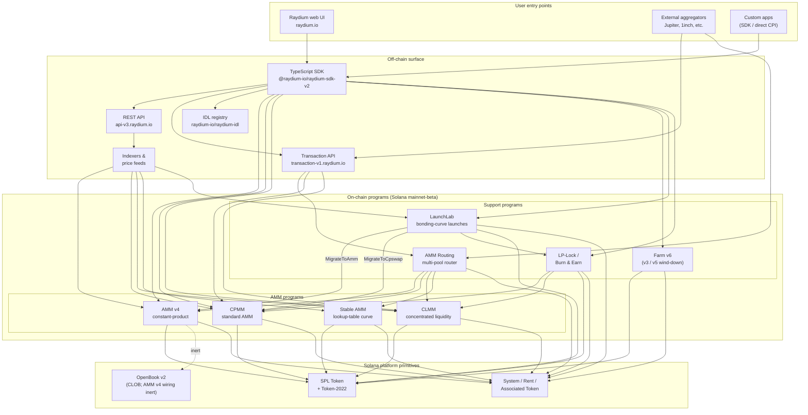

<Info>
  **This page is the single canonical architecture diagram for the docs.** Every other chapter links back here rather than redrawing the system. Program IDs are not embedded in this page — they live in [`reference/program-addresses`](/reference/program-addresses) so they can be updated in exactly one place.
</Info>

## What Raydium actually is

Raydium is **not one program**. It is a set of independent on-chain Solana programs that share a common off-chain surface (REST API, TypeScript SDK, IDL registry) and a handful of conventions (authority PDAs, fee-config accounts, admin multisig). A user interaction — a swap, a deposit, a farm-harvest — routes into exactly one of those programs; the off-chain surface is what makes them feel like a single product.

The on-chain footprint groups into four kinds of programs:

1. **AMM programs** — four separate pool programs, each with its own format and pricing math:
   - **AMM v4** — the original constant-product AMM. Originally a hybrid design that mirrored the curve onto an OpenBook (formerly Serum) market; the OpenBook integration has since been deactivated and pools now operate as pure AMMs against the curve. Still the deepest venue for many major pairs.
   - **CPMM** — a plain constant-product AMM (`x · y = k`) built natively on Solana, with first-class Token-2022 support. **The recommended program for new constant-product pools.**
   - **CLMM** — a concentrated-liquidity AMM in the Uniswap v3 style. Liquidity is provided into price ranges; fees accrue per-position; state is organized around ticks and a `sqrt_price_x64`.
   - **Stable AMM** — a thin-liquidity StableSwap-style program (forked from AMM v4 with a lookup-table pricing curve) that the router uses for stablecoin-correlated pairs. Not surfaced as a first-class create-pool option in the UI today.
2. **Reward distribution** — **Farm** (v3 / v5 / v6, with v6 as the active generation; v3/v5 are wind-down only).
3. **Token launch** — **LaunchLab**, a bonding-curve program. Successful launches **graduate** into either an AMM v4 pool or a CPMM pool depending on the launch's configuration, with the LP wrapped through the LP-Lock program.
4. **Liquidity primitives** — **AMM Routing** (the on-chain multi-pool router that CPIs into the four AMM programs in a single transaction) and **LP-Lock / Burn & Earn** (locks LP positions while keeping fee claims open).

Everything else in the stack — the REST APIs, the Transaction API, the TypeScript SDK, the UI — is off-chain infrastructure that composes these programs on top of Solana and SPL Token / Token-2022. The Perps surface is a separate integration on top of Orderly Network and is not an on-chain Raydium program; it is excluded from this diagram.

## Canonical diagram

Key invariants this diagram captures:

- **AMM programs are peers.** CPMM does not call into CLMM; CLMM does not call into AMM v4; Stable AMM is its own program. A direct swap on one pool touches exactly one AMM program. The only program that composes multiple AMMs in a single transaction is **AMM Routing**, which CPIs into AMM v4 / CPMM / CLMM / Stable AMM as needed when a route crosses pool types.
- **The SDK and the Transaction API are composition layers, not programs.** When the web UI or an aggregator builds a "swap through three pools" transaction, the SDK (client-side) or the Transaction API (server-side) stitches the instructions together using quotes fetched from the REST API. The chain sees a single Solana transaction with N instructions — no orchestrator program owns the whole flow.
- **AMM v4's OpenBook wiring is inert.** AMM v4 was the only AMM ever bound to OpenBook, but the integration has been deactivated — pools no longer share liquidity to OpenBook, `MonitorStep` is no longer cranked, and an OpenBook outage has no impact on current swap traffic. The market accounts remain on the pool's `AmmInfo` for backwards compatibility but reference unused state. CPMM, CLMM, and Stable AMM never had a CLOB dependency.
- **LaunchLab graduates into one of two AMM programs.** A successful launch calls `MigrateToAmm` (target: AMM v4) or `MigrateToCpswap` (target: CPMM) depending on its `migrate_type`; Token-2022 launches always migrate to CPMM. The post-graduation LP is split via `PlatformConfig` and the creator/platform slices are wrapped through the LP-Lock program as Fee Key NFTs (the Burn & Earn pattern).
- **LP-Lock is a wrapper, not a fifth AMM.** It holds LP positions on behalf of creators under a PDA so the underlying fees can still be claimed without exposing the ability to withdraw liquidity. It composes over CPMM and CLMM pools.
- **Off-chain surfaces complement each other.** The REST API is read-only with caching; the Transaction API builds ready-to-sign transactions server-side; the SDK builds them client-side. All three depend on the same IDL registry as the schema source of truth.

## Data flow: a CPMM swap, end to end

To make the picture concrete, here is what happens when a user swaps USDC → RAY on a CPMM pool from the Raydium UI. (AMM v4 and CLMM differ in the accounts they need, not in the high-level shape.)

1. **Quote request (off-chain).** The UI calls `GET https://api-v3.raydium.io/compute/swap-base-in` with the input mint, output mint, amount, and a slippage tolerance. The API consults its indexer, picks a route (possibly through multiple pools), and returns a quote plus the list of program IDs, pool IDs, and fee accounts that the client will need.
2. **Transaction build (client + SDK).** The client passes the quote to `raydium-sdk-v2`. The SDK resolves every PDA it needs (authority PDA, pool state, observation, vaults — see [`products/cpmm/accounts`](/products/cpmm/accounts)), injects the user's associated token accounts (creating them with the Associated Token Program if missing), and emits an unsigned `Transaction`.
3. **Wallet sign.** The user's wallet signs the transaction. Nothing Raydium-specific here; this is the standard Solana wallet flow.
4. **On-chain execution.** The signed transaction hits the Raydium **CPMM program**, which (a) validates the pool state, (b) applies the constant-product curve with the pool's fee config, (c) moves tokens between the user's ATAs and the pool vaults via CPI into SPL Token / Token-2022, (d) updates the `observation` account for the TWAP, and (e) returns.
5. **Indexer ingestion.** The Solana RPC a few slots later exposes the program logs. Raydium's indexer parses them, updates the pool's reserves, 24h volume, and APR, and serves the updated values to the next `/pools/info/ids` request.

All four steps 2–4 happen within a single Solana transaction. The API is only involved in **step 1** (quote) and **step 5** (indexing for next time). If the API is down, a client with a live SDK and a Solana RPC can still transact — it just has to compute the route itself.

## Shared infrastructure

Several primitives are used by every product and are worth naming once so later chapters can refer to them without redefinition. Details live in [`protocol-overview/shared-infrastructure`](/protocol-overview/shared-infrastructure); this is the index.

| Primitive | What it is | Where it is defined |
|-----------|------------|---------------------|
| **Authority PDA** | A program-owned signer that actually controls the token vaults. Users never hold vault authority. | Per-program; CPMM uses `vault_and_lp_mint_auth_seed` — see [`products/cpmm/accounts`](/products/cpmm/accounts). |
| **Config accounts** | Per-program accounts holding fee rates, admin keys, and fund/creator destinations. Indexed by a `u16` in CPMM (`amm_config[index]`). | [`reference/program-addresses`](/reference/program-addresses) lists the API endpoints that return them. |
| **Protocol/fund/creator fee split** | A single trade fee is split three (sometimes four) ways at settlement. Same pattern in CPMM and CLMM, different knobs. | [`reference/fee-comparison`](/reference/fee-comparison) |
| **Observation account** | Ring buffer of price samples used for the TWAP. Written on every swap. | [`products/cpmm/accounts`](/products/cpmm/accounts), [`products/clmm/accounts`](/products/clmm/accounts) |
| **REST API (`api-v3.raydium.io`)** | The single public read API for pool metadata, positions, farm state, and quote computation. | [`sdk-api/rest-api`](/sdk-api/rest-api) |
| **IDL registry** | Anchor IDLs for every program, mirrored at [`github.com/raydium-io/raydium-idl`](https://github.com/raydium-io/raydium-idl). The SDK and CPI integrators deserialize against these. | [`sdk-api/anchor-idl`](/sdk-api/anchor-idl) |

## Off-chain surface: API vs SDK vs IDL

These three are routinely confused. They do different things:

- **REST API** (`api-v3.raydium.io`) is a **read-mostly, cached view** of on-chain state plus the **quote engine**. It tells you which pools exist, what their reserves are, how APRs look, and what the best route is for a swap. It does **not** build transactions.
- **TypeScript SDK** (`@raydium-io/raydium-sdk-v2`) is a **transaction builder**. It knows every program's account layout and instruction format. It fetches fresh state from an RPC (not from the API) before composing an instruction, so it can sign accurate transactions. It talks to the API only when it needs a quote.
- **IDL registry** is the **schema** both of the above depend on. If you are writing Rust CPIs into a Raydium program, the IDL is the contract; if you are writing a TS integration, you are using IDLs indirectly through the SDK.

## Where each chapter fits

The diagram above recurs — in reduced form — throughout the docs. Here is where the full treatment of each piece lives so you can drill in:

- **On-chain programs:** one chapter per product under [`products/`](/products). Each chapter follows the same template (overview → accounts → math → instructions → fees → code demos).
- **Shared cross-program primitives:** [`protocol-overview/shared-infrastructure`](/protocol-overview/shared-infrastructure) and [`algorithms/`](/algorithms) for the math that recurs (constant-product, concentrated-liquidity, curve pricing).
- **Off-chain surface:** [`sdk-api/`](/sdk-api) has the full SDK and REST API reference, plus [`sdk-api/anchor-idl`](/sdk-api/anchor-idl) and [`sdk-api/rust-cpi`](/sdk-api/rust-cpi).
- **User-level flows (create a pool, swap, LP, claim rewards, launch a token):** [`user-flows/`](/user-flows).
- **Integration patterns for other teams (aggregators, wallets, bots):** [`integration-guides/`](/integration-guides).
- **Security surface, admin keys, known risks, audits:** [`security/`](/security).
- **Versioned changes and the AMM v4 → CPMM / Farm v3 → v6 migration story:** [`protocol-overview/versions-and-migration`](/protocol-overview/versions-and-migration).

## Non-goals of this diagram

A few deliberate omissions, so no one reads more into it than is there:

- **No price oracles.** Raydium does not depend on Pyth, Switchboard, or any external oracle for its core AMM pricing. Quotes come from on-chain reserves. The `observation` account exists so **other** contracts can read a Raydium TWAP — Raydium itself does not need it.
- **No on-chain token-voting program.** Admin actions such as fee-config updates and program upgrades are executed by a multisig. The multisig keys and rotation policy are in [`security/admin-and-multisig`](/security/admin-and-multisig).
- **No bridges.** Raydium is Solana-native. Cross-chain flows are the integrator's problem and live outside this diagram.

Sources:

- [`reference/program-addresses`](/reference/program-addresses) for the canonical program IDs referenced throughout this page
- [github.com/raydium-io/raydium-sdk-V2](https://github.com/raydium-io/raydium-sdk-V2)
- [github.com/raydium-io/raydium-idl](https://github.com/raydium-io/raydium-idl)
