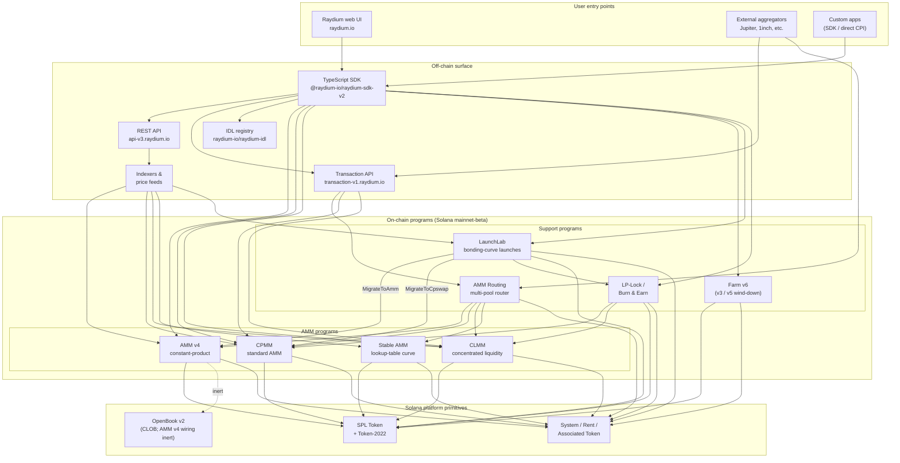

<Info>
  **Esta página foi traduzida automaticamente por IA. A versão em inglês é a fonte oficial.**

  [Ver versão em inglês →](/protocol-overview/architecture)
</Info>

<Info>
  **Esta página é o diagrama de arquitetura canônico único da documentação.** Todos os outros capítulos vinculam de volta aqui em vez de redesenhar o sistema. Os IDs dos programas não estão incorporados nesta página — eles vivem em [`reference/program-addresses`](/pt/reference/program-addresses) para que possam ser atualizados em exatamente um lugar.
</Info>

## O que o Raydium realmente é

Raydium **não é um programa**. É um conjunto de programas independentes do Solana que compartilham uma superfície off-chain comum (REST API, SDK TypeScript, registro IDL) e um punhado de convenções (PDAs de autoridade, contas de configuração de taxa, multisig administrativo). Uma interação do usuário — um swap, um depósito, uma colheita de farm — é roteada para exatamente um desses programas; a superfície off-chain é o que os faz parecer um único produto.

A presença on-chain se agrupa em quatro tipos de programas:

1. **Programas AMM** — quatro programas de pool separados, cada um com seu próprio formato e matemática de precificação:
   - **AMM v4** — o AMM de produto constante original. Originalmente um design híbrido que espelhava a curva em um mercado OpenBook (anteriormente Serum); a integração com OpenBook foi desativada desde então e os pools agora operam como AMMs puros contra a curva. Ainda o venue mais profundo para muitos pares principais.
   - **CPMM** — um AMM de produto constante simples (`x · y = k`) construído nativamente no Solana, com suporte de primeira classe para Token-2022. **O programa recomendado para novos pools de produto constante.**
   - **CLMM** — um AMM de liquidez concentrada no estilo Uniswap v3. A liquidez é fornecida em faixas de preço; as taxas se acumulam por posição; o estado é organizado em torno de ticks e um `sqrt_price_x64`.
   - **Stable AMM** — um programa StableSwap de liquidez fina (derivado do AMM v4 com uma curva de precificação por tabela de consulta) que o roteador usa para pares correlacionados com stablecoins. Não é exposto como uma opção de criar pool de primeira classe na interface do usuário hoje.
2. **Distribuição de recompensas** — **Farm** (v3 / v5 / v6, com v6 como a geração ativa; v3/v5 apenas encerramento).
3. **Lançamento de token** — **LaunchLab**, um programa de curva de vínculo. Lançamentos bem-sucedidos **evoluem** para um pool AMM v4 ou um pool CPMM dependendo da configuração do lançamento, com o LP envolvido através do programa LP-Lock.
4. **Primitivos de liquidez** — **AMM Routing** (o roteador multi-pool on-chain que faz CPI nos quatro programas AMM em uma única transação) e **LP-Lock / Burn & Earn** (bloqueia posições LP mantendo reivindicações de taxas abertas).

Tudo mais na pilha — as REST APIs, a Transaction API, o SDK TypeScript, a interface do usuário — é infraestrutura off-chain que compõe esses programas no topo do Solana e SPL Token / Token-2022. A superfície Perps é uma integração separada no topo da Orderly Network e não é um programa Raydium on-chain; está excluído deste diagrama.

## Diagrama canônico

Invariantes-chave que este diagrama captura:

- **Os programas AMM são pares.** CPMM não chama CLMM; CLMM não chama AMM v4; Stable AMM é seu próprio programa. Um swap direto em um pool toca exatamente um programa AMM. O único programa que compõe múltiplos AMMs em uma única transação é o **AMM Routing**, que faz CPI nos programas AMM v4 / CPMM / CLMM / Stable AMM conforme necessário quando uma rota cruza tipos de pool.
- **O SDK e a Transaction API são camadas de composição, não programas.** Quando a interface web ou um agregador constrói uma transação "swap através de três pools", o SDK (lado do cliente) ou a Transaction API (lado do servidor) costura as instruções usando cotações obtidas da REST API. A cadeia vê uma única transação Solana com N instruções — nenhum programa orquestrador possui o fluxo inteiro.
- **O wiring OpenBook do AMM v4 é inerte.** AMM v4 foi o único AMM já vinculado ao OpenBook, mas a integração foi desativada — os pools não compartilham mais liquidez com OpenBook, `MonitorStep` não é mais executado, e uma indisponibilidade do OpenBook não afeta o tráfego de swap atual. As contas de mercado permanecem no `AmmInfo` do pool para compatibilidade com versões anteriores, mas fazem referência a estado não utilizado. CPMM, CLMM e Stable AMM nunca tiveram uma dependência de CLOB.
- **LaunchLab evolui para um de dois programas AMM.** Um lançamento bem-sucedido chama `MigrateToAmm` (alvo: AMM v4) ou `MigrateToCpswap` (alvo: CPMM) dependendo de seu `migrate_type`; lançamentos Token-2022 sempre migram para CPMM. O LP pós-evolução é dividido via `PlatformConfig` e as fatias de criador/plataforma são envolvidas através do programa LP-Lock como NFTs de Chave de Taxa (o padrão Burn & Earn).
- **LP-Lock é um invólucro, não um quinto AMM.** Ele mantém posições LP em nome dos criadores sob um PDA para que as taxas subjacentes ainda possam ser reivindicadas sem expor a capacidade de retirar liquidez. Ele compõe sobre pools CPMM e CLMM.
- **As superfícies off-chain se complementam.** A REST API é apenas leitura com cache; a Transaction API constrói transações prontas para assinar no lado do servidor; o SDK as constrói no lado do cliente. Os três dependem do mesmo registro IDL como fonte de verdade de esquema.

## Fluxo de dados: um swap CPMM, de ponta a ponta

Para tornar a imagem concreta, aqui está o que acontece quando um usuário faz swap de USDC → RAY em um pool CPMM a partir da interface Raydium. (AMM v4 e CLMM diferem nas contas que precisam, não na forma de alto nível.)

1. **Solicitação de cotação (off-chain).** A interface chama `GET https://api-v3.raydium.io/compute/swap-base-in` com a mint de entrada, mint de saída, quantidade e tolerância de slippage. A API consulta seu indexador, escolhe uma rota (possivelmente através de múltiplos pools) e retorna uma cotação mais a lista de IDs de programas, IDs de pools e contas de taxa que o cliente precisará.
2. **Construção de transação (cliente + SDK).** O cliente passa a cotação para `raydium-sdk-v2`. O SDK resolve todo PDA que precisa (PDA de autoridade, estado do pool, observação, vaults — veja [`products/cpmm/accounts`](/pt/products/cpmm/accounts)), injeta as contas de token associado do usuário (criando-as com o Associated Token Program se estiverem faltando) e emite uma `Transaction` não assinada.
3. **Assinatura da wallet.** A wallet do usuário assina a transação. Nada específico do Raydium aqui; este é o fluxo padrão da wallet Solana.
4. **Execução on-chain.** A transação assinada atinge o programa Raydium **CPMM**, que (a) valida o estado do pool, (b) aplica a curva de produto constante com a configuração de taxa do pool, (c) move tokens entre os ATAs do usuário e os vaults do pool via CPI no SPL Token / Token-2022, (d) atualiza a conta `observation` para o TWAP e (e) retorna.
5. **Ingestão do indexador.** O RPC Solana alguns slots depois expõe os logs do programa. O indexador Raydium analisa-os, atualiza as reservas do pool, volume de 24h e APR, e serve os valores atualizados para a próxima solicitação `/pools/info/ids`.

Todos os quatro passos 2–4 acontecem dentro de uma única transação Solana. A API está envolvida apenas no **passo 1** (cotação) e **passo 5** (indexação para a próxima vez). Se a API estiver inativa, um cliente com um SDK ativo e um RPC Solana ainda pode fazer transações — ele apenas precisa calcular a rota por si mesmo.

## Infraestrutura compartilhada

Vários primitivos são usados por cada produto e valem a pena nomear uma vez para que os capítulos posteriores possam se referir a eles sem redefinição. Os detalhes vivem em [`protocol-overview/shared-infrastructure`](/pt/protocol-overview/shared-infrastructure); este é o índice.

| Primitivo | O que é | Onde está definido |
|-----------|------------|---------------------|
| **Authority PDA** | Um signatário controlado por programa que realmente controla os vaults de token. Os usuários nunca possuem autoridade de vault. | Por programa; CPMM usa `vault_and_lp_mint_auth_seed` — veja [`products/cpmm/accounts`](/pt/products/cpmm/accounts). |
| **Contas de configuração** | Contas por programa mantendo taxas, chaves de admin e destinos de fundo/criador. Indexado por um `u16` em CPMM (`amm_config[index]`). | [`reference/program-addresses`](/pt/reference/program-addresses) lista os endpoints da API que os retornam. |
| **Divisão de taxa de protocolo/fundo/criador** | Uma única taxa de negociação é dividida três (às vezes quatro) maneiras na liquidação. Mesmo padrão em CPMM e CLMM, botões diferentes. | [`reference/fee-comparison`](/pt/reference/fee-comparison) |
| **Conta de observação** | Buffer circular de amostras de preço usado para o TWAP. Escrito em cada swap. | [`products/cpmm/accounts`](/pt/products/cpmm/accounts), [`products/clmm/accounts`](/pt/products/clmm/accounts) |
| **REST API (`api-v3.raydium.io`)** | A única API de leitura pública para metadados de pool, posições, estado de farm e cálculo de cotação. | [`sdk-api/rest-api`](/pt/sdk-api/rest-api) |
| **Registro IDL** | Âncoras IDL para cada programa, espelhadas em [`github.com/raydium-io/raydium-idl`](https://github.com/raydium-io/raydium-idl). O SDK e integradores CPI desserializam contra essas. | [`sdk-api/anchor-idl`](/pt/sdk-api/anchor-idl) |

## Superfície off-chain: API vs SDK vs IDL

Esses três são rotineiramente confundidos. Eles fazem coisas diferentes:

- **REST API** (`api-v3.raydium.io`) é uma **visão em cache, principalmente de leitura** do estado on-chain mais o **mecanismo de cotação**. Ele diz a você quais pools existem, quais são suas reservas, como as APRs parecem e qual é a melhor rota para um swap. Ele **não** constrói transações.
- **TypeScript SDK** (`@raydium-io/raydium-sdk-v2`) é um **construtor de transações**. Ele conhece o layout de conta e o formato de instrução de cada programa. Ele busca estado fresco de um RPC (não da API) antes de compor uma instrução, para que possa assinar transações precisas. Ele fala com a API apenas quando precisa de uma cotação.
- **Registro IDL** é o **esquema** em que ambos dependem. Se você está escrevendo CPIs Rust em um programa Raydium, o IDL é o contrato; se você está escrevendo uma integração TS, você está usando IDLs indiretamente através do SDK.

## Onde cada capítulo se encaixa

O diagrama acima recorre — em forma reduzida — em toda a documentação. Aqui está onde o tratamento completo de cada peça vive para que você possa aprofundar:

- **Programas on-chain:** um capítulo por produto em [`products/`](/pt/products). Cada capítulo segue o mesmo modelo (visão geral → contas → matemática → instruções → taxas → demos de código).
- **Primitivos compartilhados entre programas:** [`protocol-overview/shared-infrastructure`](/pt/protocol-overview/shared-infrastructure) e [`algorithms/`](/pt/algorithms) para a matemática que recorre (produto constante, liquidez concentrada, precificação de curva).
- **Superfície off-chain:** [`sdk-api/`](/pt/sdk-api) tem a referência completa do SDK e REST API, além de [`sdk-api/anchor-idl`](/pt/sdk-api/anchor-idl) e [`sdk-api/rust-cpi`](/pt/sdk-api/rust-cpi).
- **Fluxos de nível de usuário (criar um pool, swap, LP, reivindicar recompensas, lançar um token):** [`user-flows/`](/pt/user-flows).
- **Padrões de integração para outros times (agregadores, wallets, bots):** [`integration-guides/`](/pt/integration-guides).
- **Superfície de segurança, chaves de admin, riscos conhecidos, auditorias:** [`security/`](/pt/security).
- **Mudanças versionadas e a história de migração AMM v4 → CPMM / Farm v3 → v6:** [`protocol-overview/versions-and-migration`](/pt/protocol-overview/versions-and-migration).

## Não-objetivos deste diagrama

Algumas omissões deliberadas, para que ninguém leia mais do que há:

- **Sem oráculos de preço.** Raydium não depende de Pyth, Switchboard ou qualquer oráculo externo para sua precificação AMM principal. As cotações vêm das reservas on-chain. A conta `observation` existe para que **outros** contratos leiam um TWAP Raydium — o próprio Raydium não precisa dela.
- **Nenhum programa de votação de token on-chain.** Ações de admin como atualizações de configuração de taxa e upgrades de programa são executadas por um multisig. As chaves multisig e a política de rotação estão em [`security/admin-and-multisig`](/pt/security/admin-and-multisig).
- **Sem pontes.** Raydium é nativo do Solana. Fluxos entre cadeias são problema do integrador e vivem fora deste diagrama.

Fontes:

- [`reference/program-addresses`](/pt/reference/program-addresses) para os IDs de programa canônicos referenciados em toda esta página
- [github.com/raydium-io/raydium-sdk-V2](https://github.com/raydium-io/raydium-sdk-V2)
- [github.com/raydium-io/raydium-idl](https://github.com/raydium-io/raydium-idl)
