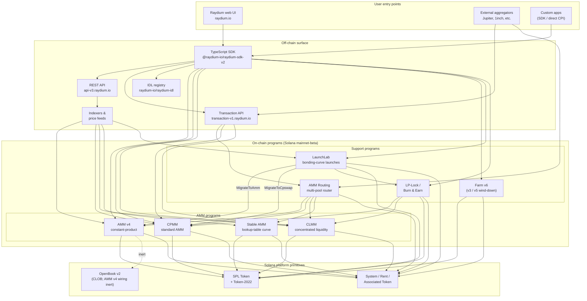

<Info>
  **Эта страница переведена с помощью ИИ. За эталон принимается английская версия.**

  [Открыть английскую версию →](/protocol-overview/architecture)
</Info>

## Что такое Raydium на самом деле

Raydium — это **не одна программа**. Это набор независимых on-chain программ Solana, которые используют общую off-chain поверхность (REST API, TypeScript SDK, реестр IDL) и несколько общих соглашений (authority PDA, конфиг-аккаунты с комиссиями, admin мультиподпись). Действие пользователя — swap, депозит, сбор фарма — маршрутизируется ровно в одну из этих программ; off-chain поверхность делает их похожими на единый продукт.

On-chain структура группируется в четыре типа программ:

1. **AMM программы** — четыре отдельные программы пулов, каждая со своей структурой и формулой ценообразования:
   - **AMM v4** — исходная constant-product AMM. Первоначально это был гибридный дизайн, отражавший кривую на рынке OpenBook (ранее Serum); интеграция с OpenBook с тех пор отключена, и пулы работают как чистые AMM против кривой. По-прежнему самая ликвидная площадка для многих крупных пар.
   - **CPMM** — простая constant-product AMM (`x · y = k`), построенная нативно на Solana с первоклассной поддержкой Token-2022. **Рекомендуемая программа для новых constant-product пулов.**
   - **CLMM** — сконцентрированная AMM в стиле Uniswap v3. Ликвидность предоставляется в диапазоны цен; комиссии начисляются за позицию; состояние организовано вокруг тиков и `sqrt_price_x64`.
   - **Stable AMM** — тонкая StableSwap-подобная программа (форк AMM v4 с кривой поиска) для стабилкоин-коррелированных пар. Не представлена как основной вариант создания пула в UI.
2. **Распределение вознаграждений** — **Farm** (v3 / v5 / v6, с v6 как активная версия; v3/v5 только на выводе).
3. **Запуск токена** — **LaunchLab**, программа bonding-curve. Успешные запуски **переходят** в либо AMM v4 пул, либо CPMM пул в зависимости от конфигурации запуска, с LP, завёрнутой через программу LP-Lock.
4. **Примитивы ликвидности** — **AMM Routing** (on-chain многопульный маршрутизатор, который использует CPI к четырём AMM программам в одной транзакции) и **LP-Lock / Burn & Earn** (блокирует LP позиции, сохраняя возможность собирать комиссии).

Всё остальное в стеке — REST API, Transaction API, TypeScript SDK, UI — это off-chain инфраструктура, которая компонует эти программы поверх Solana и SPL Token / Token-2022. Поверхность Perps — это отдельная интеграция поверх Orderly Network и не является on-chain программой Raydium; она исключена из этой диаграммы.

## Каноническая диаграмма

Ключевые инварианты, которые фиксирует эта диаграмма:

- **AMM программы — это равноправные объекты.** CPMM не вызывает CLMM; CLMM не вызывает AMM v4; Stable AMM — это отдельная программа. Прямой swap на одном пуле касается ровно одной AMM программы. Единственная программа, которая компонует несколько AMM в одной транзакции — это **AMM Routing**, которая использует CPI в AMM v4 / CPMM / CLMM / Stable AMM по мере необходимости, когда маршрут пересекает типы пулов.
- **SDK и Transaction API — это слои композиции, не программы.** Когда web UI или агрегатор создают транзакцию «swap через три пула», SDK (на клиенте) или Transaction API (на сервере) собирают инструкции вместе, используя котировки, полученные из REST API. Цепь видит одну Solana транзакцию с N инструкциями — ни одна программа-оркестратор не владеет всем потоком.
- **Проводка OpenBook в AMM v4 неактивна.** AMM v4 была единственной AMM, когда-либо привязанной к OpenBook, но интеграция была отключена — пулы больше не делят ликвидность с OpenBook, `MonitorStep` больше не запускается, и сбой OpenBook не влияет на текущий трафик swap. Аккаунты рынков остаются на `AmmInfo` пула для обратной совместимости, но ссылаются на неиспользуемое состояние. CPMM, CLMM и Stable AMM никогда не зависели от CLOB.
- **LaunchLab переходит в одну из двух AMM программ.** Успешный запуск вызывает `MigrateToAmm` (цель: AMM v4) или `MigrateToCpswap` (цель: CPMM) в зависимости от `migrate_type`; запуски Token-2022 всегда мигрируют в CPMM. Post-graduation LP разделяется через `PlatformConfig` и срезы создателя/платформы завёртываются через программу LP-Lock как Fee Key NFT (паттерн Burn & Earn).
- **LP-Lock — это обёртка, не пятая AMM.** Она удерживает LP позиции от имени создателей под PDA, чтобы базовые комиссии всё ещё могли быть собраны без экспозиции возможности вывода ликвидности. Она компонует поверх пулов CPMM и CLMM.
- **Off-chain поверхности дополняют друг друга.** REST API — это только чтение с кешированием; Transaction API строит готовые к подписанию транзакции на сервере; SDK строит их на клиенте. Все три зависят от одного и того же реестра IDL как источника истины для схемы.

## Поток данных: CPMM swap от начала до конца

Чтобы сделать картину конкретной, вот что происходит, когда пользователь меняет USDC → RAY на пуле CPMM из Raydium UI. (AMM v4 и CLMM отличаются в нужных им аккаунтах, а не в общей структуре.)

1. **Запрос котировки (off-chain).** UI вызывает `GET https://api-v3.raydium.io/compute/swap-base-in` с входящей монетой, выходящей монетой, суммой и допуском проскальзывания. API консультирует свой индексатор, выбирает маршрут (возможно, через несколько пулов) и возвращает котировку плюс список ID программ, ID пулов и конфиг-аккаунтов комиссий, которые потребуются клиенту.
2. **Построение транзакции (клиент + SDK).** Клиент передаёт котировку в `raydium-sdk-v2`. SDK разрешает каждый PDA, который ему нужен (authority PDA, состояние пула, наблюдение, своды — см. [`products/cpmm/accounts`](/ru/products/cpmm/accounts)), внедряет связанные аккаунты токенов пользователя (создавая их через Associated Token Program при необходимости) и выдаёт неподписанную `Transaction`.
3. **Подпись кошельком.** Кошелёк пользователя подписывает транзакцию. Здесь нет ничего специфичного для Raydium; это стандартный поток кошелька Solana.
4. **On-chain выполнение.** Подписанная транзакция попадает в программу Raydium **CPMM**, которая (a) валидирует состояние пула, (b) применяет constant-product кривую с конфиг комиссией пула, (c) движет токены между ATA пользователя и своды пула через CPI в SPL Token / Token-2022, (d) обновляет аккаунт `observation` для TWAP, и (e) возвращается.
5. **Ingestion индексатора.** Solana RPC несколько слотов позже раскрывает логи программы. Индексатор Raydium парсит их, обновляет резервы пула, объём за 24ч и APR, и сервирует обновлённые значения на следующий запрос `/pools/info/ids`.

Все четыре шага 2–4 происходят в одной Solana транзакции. API участвует только в **шаге 1** (котировка) и **шаге 5** (индексирование для следующего раза). Если API недоступен, клиент с живым SDK и Solana RPC всё ещё может совершать транзакции — ему просто нужно вычислить маршрут самостоятельно.

## Общая инфраструктура

Несколько примитивов используются каждым продуктом и стоят упоминания один раз, чтобы последующие главы могли ссылаться на них без переопределения. Детали живут в [`protocol-overview/shared-infrastructure`](/ru/protocol-overview/shared-infrastructure); это индекс.

| Примитив | Что это | Где это определено |
|-----------|------------|---------------------|
| **Authority PDA** | Программо-владеемый подписант, который фактически контролирует своды токенов. Пользователи никогда не держат authority свода. | Per-program; CPMM использует `vault_and_lp_mint_auth_seed` — см. [`products/cpmm/accounts`](/ru/products/cpmm/accounts). |
| **Конфиг-аккаунты** | Per-program аккаунты, содержащие ставки комиссий, ключи админов, направления фондов/создателей. Индексируются по `u16` в CPMM (`amm_config[index]`). | [`reference/program-addresses`](/ru/reference/program-addresses) перечисляет API endpoints, которые их возвращают. |
| **Разделение комиссии protocol/fund/creator** | Единая комиссия за трейд разделяется тремя (иногда четырьмя) способами при расчёте. Одинаковый паттерн в CPMM и CLMM, различные параметры. | [`reference/fee-comparison`](/ru/reference/fee-comparison) |
| **Observation account** | Ring buffer образцов цены, используемый для TWAP. Записывается при каждом swap. | [`products/cpmm/accounts`](/ru/products/cpmm/accounts), [`products/clmm/accounts`](/ru/products/clmm/accounts) |
| **REST API (`api-v3.raydium.io`)** | Единственный публичный API для чтения метаданных пула, позиций, состояния фарма и вычисления котировок. | [`sdk-api/rest-api`](/ru/sdk-api/rest-api) |
| **Реестр IDL** | Anchor IDL для каждой программы, зеркалированы на [`github.com/raydium-io/raydium-idl`](https://github.com/raydium-io/raydium-idl). SDK и CPI интеграторы десериализуют против этих. | [`sdk-api/anchor-idl`](/ru/sdk-api/anchor-idl) |

## Off-chain поверхность: API vs SDK vs IDL

Эти три часто путают. Они делают разные вещи:

- **REST API** (`api-v3.raydium.io`) — это **в основном read, кешированный вид** on-chain состояния плюс **движок котировок**. Он рассказывает вам, какие пулы существуют, какие их резервы, как выглядят APR и какой лучший маршрут для swap. Он **не** строит транзакции.
- **TypeScript SDK** (`@raydium-io/raydium-sdk-v2`) — это **построитель транзакций**. Он знает layout аккаунтов и формат инструкций каждой программы. Он получает свежее состояние из RPC (не из API) перед композицией инструкции, чтобы мочь подписывать точные транзакции. Он разговаривает с API только когда нужна котировка.
- **Реестр IDL** — это **схема**, на которую опираются оба вышеперечисленные. Если вы пишете Rust CPI в программу Raydium, IDL — это контракт; если вы пишете TS интеграцию, вы используете IDL косвенно через SDK.

## Где каждая глава находится

Диаграмма выше повторяется — в сокращённом виде — на протяжении всей документации. Вот где живёт полное изложение каждого куска, чтобы вы могли углубиться:

- **On-chain программы:** одна глава на продукт под [`products/`](/ru/products). Каждая глава следует одному шаблону (overview → accounts → math → instructions → fees → code demos).
- **Общие кросс-программные примитивы:** [`protocol-overview/shared-infrastructure`](/ru/protocol-overview/shared-infrastructure) и [`algorithms/`](/ru/algorithms) для мата, который повторяется (constant-product, concentrated-liquidity, curve pricing).
- **Off-chain поверхность:** [`sdk-api/`](/ru/sdk-api) содержит полный SDK и REST API reference, плюс [`sdk-api/anchor-idl`](/ru/sdk-api/anchor-idl) и [`sdk-api/rust-cpi`](/ru/sdk-api/rust-cpi).
- **Потоки уровня пользователя (создать пул, swap, LP, собрать награды, запустить токен):** [`user-flows/`](/ru/user-flows).
- **Паттерны интеграции для других команд (агрегаторы, кошельки, боты):** [`integration-guides/`](/ru/integration-guides).
- **Поверхность безопасности, ключи админов, известные риски, аудиты:** [`security/`](/ru/security).
- **Версионные изменения и история миграции AMM v4 → CPMM / Farm v3 → v6:** [`protocol-overview/versions-and-migration`](/ru/protocol-overview/versions-and-migration).

## Что не входит в эту диаграмму

Несколько намеренных пропусков, чтобы никто не читал больше, чем есть:

- **Нет ценовых оракулов.** Raydium не зависит от Pyth, Switchboard или каких-либо внешних оракулов для своего ценообразования основной AMM. Котировки поступают из on-chain резервов. Аккаунт `observation` существует, чтобы **другие** контракты могли читать Raydium TWAP — сам Raydium его не нужен.
- **Нет on-chain программы token-voting.** Админ-действия, такие как обновления конфиг комиссий и апгрейды программ, выполняются мультиподписью. Ключи мультиподписи и политика ротации находятся в [`security/admin-and-multisig`](/ru/security/admin-and-multisig).
- **Нет мостов.** Raydium — это Solana-нативно. Кросс-цепные потоки — это проблема интегратора и живут вне этой диаграммы.

Источники:

- [`reference/program-addresses`](/ru/reference/program-addresses) для канонических ID программ, упомянутых на всей этой странице
- [github.com/raydium-io/raydium-sdk-V2](https://github.com/raydium-io/raydium-sdk-V2)
- [github.com/raydium-io/raydium-idl](https://github.com/raydium-io/raydium-idl)
