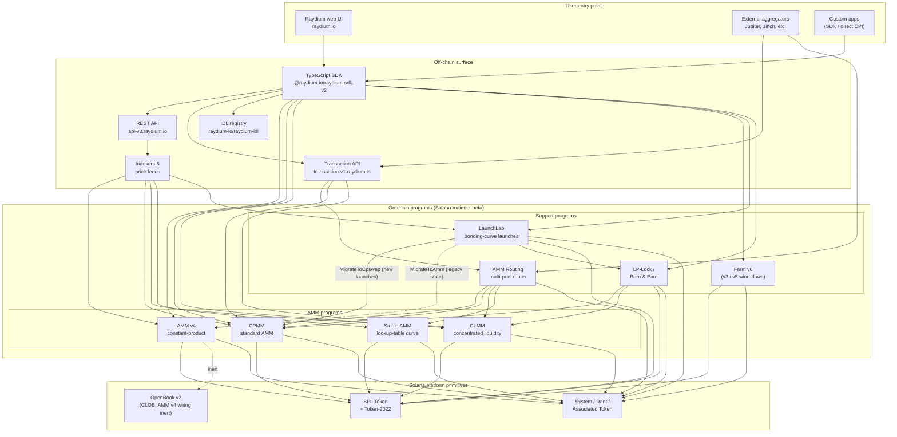

<Info>
  **Эта страница переведена с помощью ИИ. За эталон принимается английская версия.**

  [Открыть английскую версию →](/protocol-overview/architecture)
</Info>

## Что такое Raydium на самом деле

Raydium — это **не одна программа**. Это набор независимых on-chain программ Solana, которые используют общую off-chain поверхность (REST API, TypeScript SDK, реестр IDL) и несколько соглашений (authority PDA, fee-config аккаунты, admin multisig). Взаимодействие пользователя — свап, депозит, сбор вознаграждений — маршрутизируется в одну из этих программ; off-chain поверхность создаёт впечатление единого продукта.

On-chain footprint разбивается на четыре типа программ:

1. **AMM программы** — четыре отдельные программы пулов, каждая со своим форматом и математикой ценообразования:
   - **AMM v4** — оригинальный constant-product AMM. Изначально гибридный дизайн, отражавший кривую на рынке OpenBook (ранее Serum); интеграция с OpenBook с тех пор деактивирована, и пулы теперь работают как чистые AMM против кривой. По-прежнему самая глубокая площадка для многих крупных пар.
   - **CPMM** — простой constant-product AMM (`x · y = k`), построенный нативно на Solana, с первоклассной поддержкой Token-2022. **Рекомендуемая программа для новых constant-product пулов.**
   - **CLMM** — concentrated-liquidity AMM в стиле Uniswap v3. Ликвидность предоставляется в диапазоны цен; комиссии начисляются за позицию; состояние организовано вокруг тиков и `sqrt_price_x64`.
   - **Stable AMM** — тонкая программа в стиле StableSwap (форк AMM v4 с кривой поиска по таблице), которую маршрутизатор использует для пар, коррелирующих со стейблкоинами. Сегодня не представлена как первоклассный вариант создания пула в UI.
2. **Распределение вознаграждений** — **Farm** (v3 / v5 / v6, где v6 — активное поколение; v3/v5 только для завершения).
3. **Запуск токена** — **LaunchLab**, программа bonding-curve. Новые инициализированные запуски **переходят** в CPMM. Инструкция миграции legacy AMM v4 остаётся для существующего состояния запуска.
4. **Примитивы ликвидности** — **AMM Routing** (on-chain маршрутизатор мультипула, который CPI в четыре AMM программы в одной транзакции) и **LP-Lock / Burn & Earn** (блокирует LP позиции, сохраняя возможность получения комиссий).

Всё остальное в стеке — REST API, Transaction API, TypeScript SDK, UI — это off-chain инфраструктура, которая компонует эти программы поверх Solana и SPL Token / Token-2022. Поверхность Perps — это отдельная интеграция поверх Orderly Network и не является on-chain программой Raydium; она исключена из этой диаграммы.

## Каноническая диаграмма

```mermaid
flowchart TB
  subgraph user ["User entry points"]
    UI["Raydium web UI<br/>raydium.io"]
    AGG["External aggregators<br/>Jupiter, 1inch, etc."]
    CUST["Custom apps<br/>(SDK / direct CPI)"]
  end

  subgraph offchain ["Off-chain surface"]
    API["REST API<br/>api-v3.raydium.io"]
    TXAPI["Transaction API<br/>transaction-v1.raydium.io"]
    SDK["TypeScript SDK<br/>@raydium-io/raydium-sdk-v2"]
    IDL["IDL registry<br/>raydium-io/raydium-idl"]
    IDX["Indexers &<br/>price feeds"]
  end

  subgraph onchain ["On-chain programs (Solana mainnet-beta)"]
    subgraph amms ["AMM programs"]
      direction TB
      AMM4["AMM v4<br/>constant-product"]
      CPMM["CPMM<br/>standard AMM"]
      CLMM["CLMM<br/>concentrated liquidity"]
      STABLE["Stable AMM<br/>lookup-table curve"]
    end

    subgraph support ["Support programs"]
      direction TB
      ROUTE["AMM Routing<br/>multi-pool router"]
      FARM["Farm v6<br/>(v3 / v5 wind-down)"]
      LAUNCH["LaunchLab<br/>bonding-curve launches"]
      LOCK["LP-Lock /<br/>Burn & Earn"]
    end
  end

  subgraph solana ["Solana platform primitives"]
    TOKEN["SPL Token<br/>+ Token-2022"]
    OB["OpenBook v2<br/>(CLOB; AMM v4 wiring inert)"]
    SYS["System / Rent /<br/>Associated Token"]
  end

  %% Client paths
  UI --> SDK
  CUST --> SDK
  AGG --> TXAPI
  AGG --> ROUTE

  %% Off-chain composition
  SDK --> API
  SDK --> TXAPI
  SDK --> IDL
  SDK --> AMM4
  SDK --> CPMM
  SDK --> CLMM
  SDK --> FARM
  SDK --> LAUNCH
  SDK --> LOCK

  TXAPI --> ROUTE
  TXAPI --> CPMM
  TXAPI --> CLMM

  API --> IDX
  IDX --> AMM4
  IDX --> CPMM
  IDX --> CLMM
  IDX --> STABLE
  IDX --> LAUNCH

  %% Routing → AMM programs (CPI)
  ROUTE --> AMM4
  ROUTE --> CPMM
  ROUTE --> CLMM
  ROUTE --> STABLE

  %% LaunchLab graduation paths
  LAUNCH -- "MigrateToCpswap (new launches)" --> CPMM
  LAUNCH -. "MigrateToAmm (legacy state)" .-> AMM4
  LAUNCH --> LOCK

  %% LP-Lock wraps LP from CPMM / CLMM pools
  LOCK --> CPMM
  LOCK --> CLMM

  %% Programs → SPL Token / Token-2022
  AMM4 --> TOKEN
  CPMM --> TOKEN
  CLMM --> TOKEN
  STABLE --> TOKEN
  FARM --> TOKEN
  LAUNCH --> TOKEN
  LOCK --> TOKEN

  %% AMM v4's historical OpenBook wiring is inert
  AMM4 -. "inert" .-> OB

  %% Programs → System / Rent / ATA
  AMM4 --> SYS
  CPMM --> SYS
  CLMM --> SYS
  STABLE --> SYS
  FARM --> SYS
  LAUNCH --> SYS
  LOCK --> SYS
  ROUTE --> SYS
```

Ключевые инварианты, которые фиксирует эта диаграмма:

- **AMM программы — равноправные.** CPMM не вызывает CLMM; CLMM не вызывает AMM v4; Stable AMM — это отдельная программа. Прямой своп на одном пуле касается ровно одной AMM программы. Единственная программа, которая компонует несколько AMM в одной транзакции — это **AMM Routing**, которая CPI в AMM v4 / CPMM / CLMM / Stable AMM по мере необходимости, когда маршрут пересекает типы пулов.
- **SDK и Transaction API — это слои композиции, не программы.** Когда web UI или агрегатор строит транзакцию «своп через три пула», SDK (на клиенте) или Transaction API (на сервере) сшивают инструкции вместе, используя котировки, полученные из REST API. Цепь видит одну транзакцию Solana с N инструкциями — никакая программа-оркестратор не владеет всем потоком.
- **Проводка OpenBook в AMM v4 неактивна.** AMM v4 была единственной AMM, когда-либо привязанной к OpenBook, но интеграция была деактивирована — пулы больше не делятся ликвидностью с OpenBook, `MonitorStep` больше не запускается, и сбой OpenBook не влияет на текущий трафик свопов. Аккаунты рынка остаются на `AmmInfo` пула для обратной совместимости, но ссылаются на неиспользуемое состояние. CPMM, CLMM и Stable AMM никогда не имели зависимости от CLOB.
- **Новые пулы LaunchLab переходят в CPMM.** Инициализация теперь требует `migrate_type = CPSWAP`. `MigrateToAmm` остаётся для существующего legacy состояния. До обновления 2026-08-14 миграция CPMM блокировала `creator_scale` отдельно для создателя. Миграции, выполненные после этого, объединяют его с `platform_scale` в одну позицию locked-LP, принадлежащую платформе. Более ранние Fee Keys остаются без изменений.
- **LP-Lock — это обёртка, не пятая AMM.** Она держит LP позиции от имени создателей под PDA, чтобы базовые комиссии всё ещё могли быть получены без предоставления возможности вывести ликвидность. Она компонует пулы CPMM и CLMM.
- **Off-chain поверхности дополняют друг друга.** REST API — это read-only с кешированием; Transaction API строит готовые к подписанию транзакции на сервере; SDK строит их на клиенте. Все три зависят от одного реестра IDL как источника истины для схемы.

## Поток данных: своп CPMM от начала до конца

Чтобы сделать картину конкретной, вот что происходит, когда пользователь свопит USDC → RAY на пуле CPMM из Raydium UI. (AMM v4 и CLMM отличаются аккаунтами, которые им нужны, но не высокоуровневой формой.)

1. **Запрос котировки (off-chain).** UI вызывает `GET https://api-v3.raydium.io/compute/swap-base-in` с входящим минтом, выходящим минтом, суммой и допуском проскальзывания. API консультирует свой индексер, выбирает маршрут (возможно, через несколько пулов) и возвращает котировку плюс список ID программ, ID пулов и fee аккаунтов, которые понадобятся клиенту.
2. **Построение транзакции (клиент + SDK).** Клиент передаёт котировку в `raydium-sdk-v2`. SDK разрешает каждый PDA, который ему нужен (authority PDA, состояние пула, observation, хранилища — см. [`products/cpmm/accounts`](/ru/products/cpmm/accounts)), внедряет associated token аккаунты пользователя (создавая их с Associated Token Program, если они отсутствуют), и выдаёт неподписанную `Transaction`.
3. **Подпись кошелька.** Кошелёк пользователя подписывает транзакцию. Здесь нет ничего специфичного для Raydium; это стандартный поток кошелька Solana.
4. **On-chain выполнение.** Подписанная транзакция попадает в программу **CPMM** Raydium, которая (a) валидирует состояние пула, (b) применяет constant-product кривую с fee конфигом пула, (c) перемещает токены между ATA пользователя и хранилищами пула через CPI в SPL Token / Token-2022, (d) обновляет аккаунт `observation` для TWAP, и (e) возвращается.
5. **Ingestion индексером.** Solana RPC несколько слотов спустя раскрывает логи программы. Индексер Raydium их парсит, обновляет резервы пула, 24h объём и APR, и служит обновленными значениями следующему запросу `/pools/info/ids`.

Все четыре шага 2–4 происходят в одной транзакции Solana. API задействован только на **шаге 1** (котировка) и **шаге 5** (индексирование для следующего раза). Если API недоступен, клиент с живым SDK и Solana RPC всё ещё может совершать транзакции — ему просто нужно самому вычислить маршрут.

## Общая инфраструктура

Несколько примитивов используются каждым продуктом и стоит назвать их один раз, чтобы последующие главы могли на них ссылаться без переопределения. Детали находятся в [`protocol-overview/shared-infrastructure`](/ru/protocol-overview/shared-infrastructure); это индекс.

| Примитив | Что это | Где определено |
|-----------|------------|---------------------|
| **Authority PDA** | Программе-принадлежащий подписант, который фактически контролирует хранилища токенов. Пользователи никогда не держат authority хранилища. | Per-program; CPMM использует `vault_and_lp_mint_auth_seed` — см. [`products/cpmm/accounts`](/ru/products/cpmm/accounts). |
| **Config аккаунты** | Per-program аккаунты, содержащие fee ставки, admin ключи и направления fund/creator. Индексируются по `u16` в CPMM (`amm_config[index]`). | [`reference/program-addresses`](/ru/reference/program-addresses) перечисляет API endpoints, которые их возвращают. |
| **Protocol/fund/creator fee split** | Одна fee торговли разбивается три (иногда четыре) способа при расчёте. Одинаковый паттерн в CPMM и CLMM, разные параметры. | [`reference/fee-comparison`](/ru/reference/fee-comparison) |
| **Observation аккаунт** | Ring buffer образцов цены, используемый для TWAP. Записывается при каждом свопе. | [`products/cpmm/accounts`](/ru/products/cpmm/accounts), [`products/clmm/accounts`](/ru/products/clmm/accounts) |
| **REST API (`api-v3.raydium.io`)** | Единственный публичный read API для метаданных пула, позиций, состояния фермы и вычисления котировок. | [`sdk-api/rest-api`](/ru/sdk-api/rest-api) |
| **IDL реестр** | Anchor IDL для каждой программы, зеркалированный на [`github.com/raydium-io/raydium-idl`](https://github.com/raydium-io/raydium-idl). SDK и CPI интеграторы десериализуют против них. | [`sdk-api/anchor-idl`](/ru/sdk-api/anchor-idl) |

## Off-chain поверхность: API vs SDK vs IDL

Эти три часто путают. Они делают разные вещи:

- **REST API** (`api-v3.raydium.io`) — это **read-mostly, кешированный вид** on-chain состояния плюс **engine котировок**. Он говорит вам, какие пулы существуют, каковы их резервы, как выглядят APR и какой лучший маршрут для свопа. Он **не** строит транзакции.
- **TypeScript SDK** (`@raydium-io/raydium-sdk-v2`) — это **builder транзакций**. Он знает layout аккаунтов и формат инструкций каждой программы. Он получает свежее состояние из RPC (не из API) перед композицией инструкции, чтобы подписать точные транзакции. Он говорит с API только когда ему нужна котировка.
- **IDL реестр** — это **схема**, от которой зависят оба вышеперечисленных. Если вы пишете Rust CPI в программу Raydium, IDL — это контракт; если вы пишете TS интеграцию, вы используете IDL косвенно через SDK.

## Где находится каждая глава

Диаграмма выше повторяется — в сокращённой форме — по всей документации. Вот где находится полное описание каждого куска, чтобы вы могли углубиться:

- **On-chain программы:** одна глава на продукт под [`products/`](/ru/products). Каждая глава следует одному шаблону (обзор → аккаунты → математика → инструкции → комиссии → примеры кода).
- **Общие cross-program примитивы:** [`protocol-overview/shared-infrastructure`](/ru/protocol-overview/shared-infrastructure) и [`algorithms/`](/ru/algorithms) для математики, которая повторяется (constant-product, concentrated-liquidity, curve pricing).
- **Off-chain поверхность:** [`sdk-api/`](/ru/sdk-api) имеет полный SDK и REST API reference, плюс [`sdk-api/anchor-idl`](/ru/sdk-api/anchor-idl) и [`sdk-api/rust-cpi`](/ru/sdk-api/rust-cpi).
- **User-level потоки (создать пул, своп, LP, получить вознаграждения, запустить токен):** [`user-flows/`](/ru/user-flows).
- **Паттерны интеграции для других команд (агрегаторы, кошельки, боты):** [`integration-guides/`](/ru/integration-guides).
- **Поверхность безопасности, admin ключи, известные риски, аудиты:** [`security/`](/ru/security).
- **Версионные изменения и история миграции AMM v4 → CPMM / Farm v3 → v6:** [`protocol-overview/versions-and-migration`](/ru/protocol-overview/versions-and-migration).

## Не-цели этой диаграммы

Несколько намеренных пропусков, чтобы никто не читал больше, чем там есть:

- **Нет price oracles.** Raydium не зависит от Pyth, Switchboard или любого внешнего oracle для своего основного AMM ценообразования. Котировки поступают из on-chain резервов. Аккаунт `observation` существует, чтобы **другие** контракты могли читать Raydium TWAP — сам Raydium его не нужен.
- **Нет on-chain token-voting программы.** Admin действия, такие как обновления fee-config и обновления программ, выполняются multisig. Ключи multisig и политика ротации находятся в [`security/admin-and-multisig`](/ru/security/admin-and-multisig).
- **Нет мостов.** Raydium — это Solana-native. Cross-chain потоки — это проблема интегратора и находятся вне этой диаграммы.

Источники:

- [`reference/program-addresses`](/ru/reference/program-addresses) для канонических ID программ, упомянутых на этой странице
- [github.com/raydium-io/raydium-sdk-V2](https://github.com/raydium-io/raydium-sdk-V2)
- [github.com/raydium-io/raydium-idl](https://github.com/raydium-io/raydium-idl)
