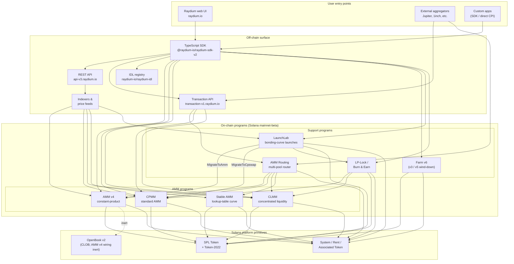

<Info>
  **Bu sayfa yapay zekâ tarafından otomatik olarak çevrilmiştir. İngilizce sürüm esas alınır.**

  [İngilizce sürümü görüntüle →](/protocol-overview/architecture)
</Info>

<Info>
  **Bu sayfa, belgeler için tek kanonial mimari diyagramdır.** Diğer tüm bölümler sistemi yeniden çizmek yerine buraya bağlantı verir. Program kimlikleri bu sayfaya gömülü değildir — [`reference/program-addresses`](/tr/reference/program-addresses) içinde yaşarlar, böylece tam olarak bir yerde güncellenebilirler.
</Info>

## Raydium aslında nedir?

Raydium **tek bir program değildir**. Ortak bir zincir dışı araç (REST API, TypeScript SDK, IDL kayıt defteri) ve bir avuç kural (authority PDA'ları, ücret yapılandırması hesapları, yönetici multisig) paylaşan bağımsız zincir üzerinde Solana programlarının bir setidir. Bir kullanıcı etkileşimi — swap, yatırma, farm hasat — tam olarak bu programlardan birinin içine yönlendirilir; zincir dışı araç onları tek bir ürün gibi hissettirir.

Zincir üzerinde ayakkabı izi dört tür programa ayrılır:

1. **AMM programları** — her biri kendi formata ve fiyatlandırma matematiğine sahip dört ayrı pool programı:
   - **AMM v4** — orijinal sabit-ürün AMM'i. Başlangıçta eğriyi bir OpenBook (eski adıyla Serum) piyasasına yansıtan bir hibrit tasarımdı; OpenBook entegrasyonu o zamandan beri devre dışı bırakılmıştır ve poollar artık eğriye karşı saf AMM'ler olarak çalışır. Yine de birçok büyük çiftin en derin mekanı.
   - **CPMM** — Solana'da yerel olarak oluşturulmuş sade sabit-ürün AMM (`x · y = k`), birinci sınıf Token-2022 desteği ile. **Yeni sabit-ürün poolları için önerilen program.**
   - **CLMM** — Uniswap v3 tarzında yoğunlaştırılmış likidite AMM'i. Likidite fiyat aralıklarına sağlanır; ücretler pozisyon başına tahakkuk eder; durum tick'ler ve `sqrt_price_x64` etrafında organize edilir.
   - **Stable AMM** — yönlendiricinin stabilcoin korelasyonlu çiftler için kullandığı ince likidite StableSwap tarzı program (AMM v4'ten bir arama tablosu fiyatlandırma eğrisi ile fork edilmiş). Bugün UI'da birinci sınıf pool oluştur seçeneği olarak gösterilmez.
2. **Ödül dağıtımı** — **Farm** (v3 / v5 / v6, v6 aktif kuşak olarak; v3/v5 yalnızca kapatma aşamasında).
3. **Token başlatma** — **LaunchLab**, bonding-curve programı. Başarılı başlatmalar launch'ın yapılandırmasına bağlı olarak **gradüe olur** — AMM v4 pool'una veya CPMM pool'una — LP, LP-Lock programı aracılığıyla sarılmış durumda.
4. **Likidite primitifleri** — **AMM Yönlendirmesi** (dört AMM programına tek bir işlemde CPI yapan zincir üzerinde multi-pool yönlendiricisi) ve **LP-Lock / Burn & Earn** (LP pozisyonlarını kilitler, ücret taleplerini açık tutar).

Yığındaki her şey — REST API'ları, Transaction API, TypeScript SDK, UI — bu programları Solana ve SPL Token / Token-2022'nin üzerinde oluşturan zincir dışı altyapıdır. Perps araçları, Orderly Network'ün üzerinde ayrı bir entegrasyon olup, zincir üzerinde Raydium programı değildir; bu diyagramdan hariç tutulmuştur.

## Kanonial diyagram

Bu diyagramın yakaladığı anahtar değişmezler:

- **AMM programları eşittir.** CPMM, CLMM'ye çağırı yapmaz; CLMM, AMM v4'e çağırı yapmaz; Stable AMM kendi programıdır. Bir pool'da doğrudan swap tam olarak bir AMM programını teğet eder. Birden fazla AMM'yi tek işlemde oluşturan tek program, route pool türlerini geçerken gerektiği gibi AMM v4 / CPMM / CLMM / Stable AMM'ye CPI yapan **AMM Yönlendirmesi**dir.
- **SDK ve Transaction API'si bileşim katmanlarıdır, programlar değildir.** Web UI veya toplayıcı "üç pool'dan geçen bir swap" işlemi oluşturduğunda, SDK (istemci tarafı) veya Transaction API'si (sunucu tarafı) REST API'sinden getirilen alıntıları kullanarak talimatları birleştirir. Zincir, N talimatı olan tek bir Solana işlemini görür — hiçbir yönetici programı tüm akışa sahip değildir.
- **AMM v4'ün OpenBook kablolama atalıdır.** AMM v4, OpenBook'a bağlanan tek AMM'ydi, ancak entegrasyon devre dışı bırakılmıştır — poollar artık OpenBook'a likidite paylaşmaz, `MonitorStep` artık çalıştırılmaz ve OpenBook'un bir kesintisi mevcut swap trafiğine hiçbir etki yapmaz. Pazar hesapları geriye dönük uyumluluk için pool'un `AmmInfo`'sunda kalır ancak kullanılmayan duruma başvurur. CPMM, CLMM ve Stable AMM hiçbir zaman CLOB bağımlılığına sahip olmadı.
- **LaunchLab iki AMM programından birine gradüe olur.** Başarılı bir başlatma, `migrate_type`'ına bağlı olarak `MigrateToAmm` (hedef: AMM v4) veya `MigrateToCpswap` (hedef: CPMM) çağırır; Token-2022 başlatmaları her zaman CPMM'ye göç eder. Gradüe sonrası LP, `PlatformConfig` aracılığıyla bölünür ve yaratıcı/platform dilimleri LP-Lock programı aracılığıyla Fee Key NFT'leri olarak sarılır (Burn & Earn paterni).
- **LP-Lock bir sarıcıdır, beşinci AMM değildir.** LP pozisyonlarını yaratıcılar adına bir PDA altında tutar, böylece alttaki ücretler likidite geri çekme yeteneğini açığa çıkarmadan talep edilebilir. CPMM ve CLMM poolları üzerinde oluşturulur.
- **Zincir dışı araçlar birbirini tamamlar.** REST API, `mi` başlı olmayan zincir dışı altyapının okunmasıdır; Transaction API'si sunucu tarafında hazır imzalanabilir işlemler oluşturur; SDK istemci tarafında oluşturur. Üçü de aynı IDL kayıt defterine şema kaynağı olarak doğru güvendir.

## Veri akışı: Uçtan uca CPMM swap'ı

Resmi somutlaştırmak için, bir kullanıcı Raydium UI'sından bir CPMM pool'unda USDC → RAY swap'ı yaptığında ne olacağı aşağıda verilmiştir. (AMM v4 ve CLMM ihtiyaç duydukları hesaplarda farklılık gösterir, üst düzey şekilde değil.)

1. **Alıntı isteği (zincir dışı).** UI, `GET https://api-v3.raydium.io/compute/swap-base-in` öğesini giriş mint'i, çıkış mint'i, tutarı ve kayma toleransı ile çağırır. API indeksleyicisine danışır, bir rota seçer (muhtemelen birden fazla pool'dan geçerek) ve istemcinin ihtiyaç duyacağı bir alıntı artı program kimliklerinin, pool kimliklerinin ve ücret hesaplarının listesini döndürür.
2. **İşlem oluşturma (istemci + SDK).** İstemci alıntıyı `raydium-sdk-v2`'ye geçirir. SDK ihtiyaç duyduğu her PDA'yı çözer (authority PDA, pool durumu, gözlem, vault'lar — bkz. [`products/cpmm/accounts`](/tr/products/cpmm/accounts)), kullanıcının ilişkili token hesaplarını yerleştirir (eksikse Associated Token Program ile oluşturur) ve işaretsiz bir `Transaction` yayar.
3. **Cüzdan imzası.** Kullanıcının cüzdanı işlemi imzalar. Burada Raydium'a özgü hiçbir şey yoktur; bu standart Solana cüzdan akışıdır.
4. **Zincir üzerinde yürütme.** İmzalı işlem Raydium **CPMM programı**'na isabet eder; bu, (a) pool durumunu doğrular, (b) pool'un ücret yapılandırması ile sabit-ürün eğrisini uygular, (c) tokenları kullanıcının ATA'ları ile pool vault'ları arasında SPL Token / Token-2022'ye CPI aracılığıyla hareket ettirir, (d) TWAP için `observation` hesabını günceller ve (e) döndürür.
5. **Indeksleyici alımı.** Solana RPC birkaç slot sonra program günlüklerini ortaya çıkarır. Raydium'un indeksleyicisi onları ayrıştırır, pool'un rezervlerini, 24 saatlik hacmini ve APR'sini günceller ve güncellenmiş değerleri sonraki `/pools/info/ids` isteğine sunar.

4–4 adımlarının tümü tek bir Solana işleminde gerçekleşir. API yalnızca **adım 1** (alıntı) ve **adım 5** (sonraki zaman için indeksleme) ile ilgilidir. API kapalıysa, canlı SDK ve Solana RPC'si olan bir istemci yine de işlem yapabilir — sadece rotayı kendi başına hesaplamak zorundadır.

## Paylaşılan altyapı

Birkaç temel, her ürün tarafından kullanılır ve daha sonraki bölümler bunları yeniden tanımlamadan buna başvurabileceği şekilde adlandırmaya değer. Ayrıntılar [`protocol-overview/shared-infrastructure`](/tr/protocol-overview/shared-infrastructure)'de yaşarlar; bu endekstir.

| Temel | Ne olduğu | Tanımı nerede |
|-----------|------------|---------------------|
| **Authority PDA** | Gerçekten token vault'larını kontrol eden program tarafından sahip olunan bir imzalayan. Kullanıcılar asla vault authority tutmazlar. | Program başına; CPMM `vault_and_lp_mint_auth_seed` kullanır — bkz. [`products/cpmm/accounts`](/tr/products/cpmm/accounts). |
| **Yapılandırma hesapları** | Ücret oranlarını, yönetici anahtarlarını ve fon/yaratıcı hedeflerini tutan program başına hesaplar. CPMM'de bir `u16` ile indekslenir (`amm_config[index]`). | [`reference/program-addresses`](/tr/reference/program-addresses) bunları döndüren API uç noktalarını listeler. |
| **Protokol/fon/yaratıcı ücret bölüne** | Tek bir işlem ücreti, ödeme sırasında üç (bazen dört) yola bölünür. CPMM ve CLMM'de aynı desen, farklı kontroller. | [`reference/fee-comparison`](/tr/reference/fee-comparison) |
| **Gözlem hesabı** | TWAP için kullanılan fiyat örneklerinin halka tampon'u. Her swap'ta yazılır. | [`products/cpmm/accounts`](/tr/products/cpmm/accounts), [`products/clmm/accounts`](/tr/products/clmm/accounts) |
| **REST API (`api-v3.raydium.io`)** | Pool metadata'sı, pozisyonları, farm durumunu ve alıntı hesaplamasını sağlayan tek kamu okuma API'si. | [`sdk-api/rest-api`](/tr/sdk-api/rest-api) |
| **IDL kayıt defteri** | Her program için Anchor IDL'leri, [`github.com/raydium-io/raydium-idl`](https://github.com/raydium-io/raydium-idl) adresinde yansıtılmış. SDK ve CPI entegratörleri bunlara karşı seri kaldırma işlemi yaparlar. | [`sdk-api/anchor-idl`](/tr/sdk-api/anchor-idl) |

## Zincir dışı araç: API vs SDK vs IDL

Bunlar sıklıkla kafa karıştırılır. Farklı şeyler yapırlar:

- **REST API** (`api-v3.raydium.io`) zincir üzerinde durumun **esas olarak okunan, önbelleğe alınan bir görünümü** artı **alıntı motorudur**. Size hangi pool'ların mevcut olduğunu, rezervlerinin ne olduğunu, APR'lerin nasıl göründüğünü ve bir swap için en iyi rotanın ne olduğunu söyler. **İşlemler oluşturmaz.**
- **TypeScript SDK** (`@raydium-io/raydium-sdk-v2`) bir **işlem oluşturucusudur**. Her programın hesap düzenini ve talimat formatını bilir. Talimat oluşturmadan önce bir RPC'den taze durumu getirir (API'den değil), böylece doğru işlemleri imzalayabilir. API'si ile yalnızca bir alıntıya ihtiyaç duyduğunda konuşur.
- **IDL kayıt defteri** yukarıdakinin her ikisinin de bağlı olduğu **şemadır**. Bir Raydium programına Rust CPI'leri yazıyorsanız, IDL sözleşmedir; TS entegrasyonu yazıyorsanız, IDL'leri SDK aracılığıyla dolaylı olarak kullanırsınız.

## Her bölüm nerede uyar?

Yukarıdaki diyagram — indirgenen form olarak — belgeler genelinde tekrar görünür. Tam tedavinin her parçasının yaşadığı yer:

- **Zincir üzerinde programlar:** [`products/`](/tr/products) altında ürün başına bir bölüm. Her bölüm aynı şablonları takip eder (genel bakış → hesaplar → matematik → talimatlar → ücretler → kod demoları).
- **Paylaşılan program arası temel'ler:** [`protocol-overview/shared-infrastructure`](/tr/protocol-overview/shared-infrastructure) ve [`algorithms/`](/tr/algorithms) tekrar eden matematik için (sabit-ürün, yoğunlaştırılmış likidite, eğri fiyatlandırması).
- **Zincir dışı araç:** [`sdk-api/`](/tr/sdk-api) tam SDK ve REST API başvurusu, artı [`sdk-api/anchor-idl`](/tr/sdk-api/anchor-idl) ve [`sdk-api/rust-cpi`](/tr/sdk-api/rust-cpi).
- **Kullanıcı düzeyinde akışlar (pool oluştur, swap, LP, ödüller talep et, token başlat):** [`user-flows/`](/tr/user-flows).
- **Diğer takımlar için entegrasyon desenleri (toplayıcılar, cüzdanlar, botlar):** [`integration-guides/`](/tr/integration-guides).
- **Güvenlik araçları, yönetici anahtarları, bilinen riskler, denetimler:** [`security/`](/tr/security).
- **Sürümlenmiş değişiklikler ve AMM v4 → CPMM / Farm v3 → v6 göç hikayesi:** [`protocol-overview/versions-and-migration`](/tr/protocol-overview/versions-and-migration).

## Bu diyagramın hedefleri değil

Birkaç kasıtlı atlama, böylece kimse bundan daha fazlasını okumamasın:

- **Fiyat oraklı yoktur.** Raydium, temel AMM fiyatlandırması için Pyth, Switchboard veya herhangi bir dış orakele bağlı değildir. Alıntılar zincir üzerinde rezervlerden gelir. `observation` hesabı, **diğer** sözleşmelerin Raydium TWAP'sini okuyabilmesi için var — Raydium'un kendisine ihtiyacı yoktur.
- **Zincir üzerinde token-voting programı yoktur.** Ücret-config güncellemeleri ve program yükseltmeleri gibi yönetici işlemleri bir multisig tarafından yürütülür. Multisig anahtarları ve rotasyon politikası [`security/admin-and-multisig`](/tr/security/admin-and-multisig) içindedir.
- **Köprüler yoktur.** Raydium Solana-doğaldır. Zincir arası akışlar entegratörün sorunu ve bu diyagramın dışında yaşarlar.

Kaynaklar:

- [`reference/program-addresses`](/tr/reference/program-addresses) bu sayfa genelinde başvurulan kanonial program kimlikleri için
- [github.com/raydium-io/raydium-sdk-V2](https://github.com/raydium-io/raydium-sdk-V2)
- [github.com/raydium-io/raydium-idl](https://github.com/raydium-io/raydium-idl)
