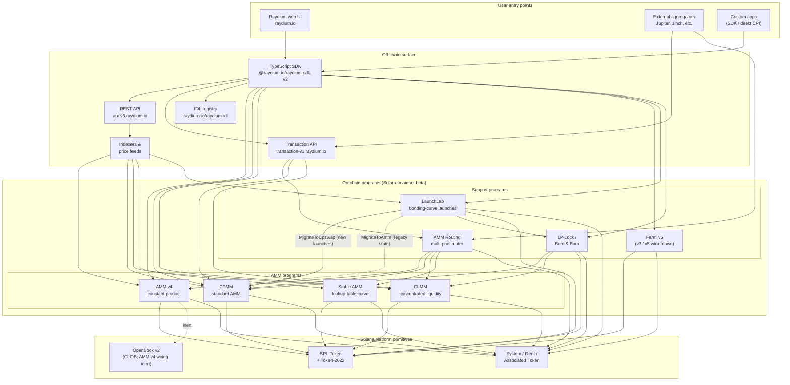

<Info>
  **Bu sayfa yapay zekâ tarafından otomatik olarak çevrilmiştir. İngilizce sürüm esas alınır.**

  [İngilizce sürümü görüntüle →](/protocol-overview/architecture)
</Info>

<Info>
  **Bu sayfa, dokümentasyonun tek kanonik mimari diyagramıdır.** Diğer tüm bölümler sistemi yeniden çizmek yerine buraya geri bağlantı verir. Program ID'leri bu sayfaya gömülü değildir — [`reference/program-addresses`](/tr/reference/program-addresses) içinde yer alır, böylece tam olarak bir yerde güncellenebilirler.
</Info>

## Raydium aslında nedir?

Raydium **tek bir program değildir**. Ortak bir zincir dışı yüzey (REST API, TypeScript SDK, IDL kayıt defteri) ve birkaç kural (authority PDA'ları, ücret yapılandırması hesapları, yönetici multisig) paylaşan bağımsız zincir üstü Solana programlarının bir setidir. Bir kullanıcı etkileşimi — bir swap, bir yatırma, bir farm-harvest — tam olarak bu programlardan birine yönlendirilir; zincir dışı yüzey onları tek bir ürün gibi hissettirir.

Zincir üstü ayak izi dört tür programa ayrılır:

1. **AMM programları** — dört ayrı pool programı, her biri kendi formatı ve fiyatlandırma matematiğine sahip:
   - **AMM v4** — orijinal sabit-ürün AMM'si. Başlangıçta eğriyi bir OpenBook (eski adıyla Serum) piyasasına yansıtan hibrit bir tasarım; OpenBook entegrasyonu o zamandan beri devre dışı bırakılmış ve pool'lar artık eğriye karşı saf AMM'ler olarak çalışır. Hala birçok büyük çift için en derin mekan.
   - **CPMM** — Solana'da yerel olarak inşa edilmiş sade bir sabit-ürün AMM (`x · y = k`), birinci sınıf Token-2022 desteği ile. **Yeni sabit-ürün pool'ları için önerilen program.**
   - **CLMM** — Uniswap v3 tarzında yoğunlaştırılmış-likidite AMM'si. Likidite fiyat aralıklarına sağlanır; ücretler pozisyon başına tahakkuk eder; durum tick'ler ve `sqrt_price_x64` etrafında organize edilir.
   - **Stable AMM** — yönlendirici tarafından stablecoin-korelasyonlu çiftler için kullanılan ince-likidite StableSwap tarzı program (AMM v4'ten çatallanmış, arama tablosu fiyatlandırma eğrisi ile). Bugün UI'de birinci sınıf pool oluşturma seçeneği olarak sunulmamıştır.
2. **Ödül dağıtımı** — **Farm** (v3 / v5 / v6, v6 aktif nesil olarak; v3/v5 yalnızca kapatılıyor).
3. **Token başlatma** — **LaunchLab**, bir bağlama eğrisi programı. Yeni başlatılan başlatmalar **CPMM'ye geçer**. Eski AMM v4 geçiş talimatı mevcut başlatma durumu için kalır.
4. **Likidite ilkelleri** — **AMM Yönlendirmesi** (dört AMM programına CPI yapan zincir üstü çok-pool yönlendiricisi, tek bir işlemde) ve **LP-Lock / Burn & Earn** (ücret talepleri açık tutarken LP pozisyonlarını kilitler).

Yığındaki diğer her şey — REST API'ları, İşlem API'sı, TypeScript SDK'sı, UI — bu programları Solana ve SPL Token / Token-2022 üzerinde oluşturan zincir dışı altyapıdır. Perps yüzeyi, Orderly Network üzerinde ayrı bir entegrasyondur ve zincir üstü Raydium programı değildir; bu diyagramdan hariç tutulmuştur.

## Kanonik diyagram

```mermaid
flowchart TB
  subgraph user ["User entry points"]
    UI["Raydium web UI<br/>raydium.io"]
    AGG["External aggregators<br/>Jupiter, 1inch, etc."]
    CUST["Custom apps<br/>(SDK / direct CPI)"]
  end

  subgraph offchain ["Off-chain surface"]
    API["REST API<br/>api-v3.raydium.io"]
    TXAPI["Transaction API<br/>transaction-v1.raydium.io"]
    SDK["TypeScript SDK<br/>@raydium-io/raydium-sdk-v2"]
    IDL["IDL registry<br/>raydium-io/raydium-idl"]
    IDX["Indexers &<br/>price feeds"]
  end

  subgraph onchain ["On-chain programs (Solana mainnet-beta)"]
    subgraph amms ["AMM programs"]
      direction TB
      AMM4["AMM v4<br/>constant-product"]
      CPMM["CPMM<br/>standard AMM"]
      CLMM["CLMM<br/>concentrated liquidity"]
      STABLE["Stable AMM<br/>lookup-table curve"]
    end

    subgraph support ["Support programs"]
      direction TB
      ROUTE["AMM Routing<br/>multi-pool router"]
      FARM["Farm v6<br/>(v3 / v5 wind-down)"]
      LAUNCH["LaunchLab<br/>bonding-curve launches"]
      LOCK["LP-Lock /<br/>Burn & Earn"]
    end
  end

  subgraph solana ["Solana platform primitives"]
    TOKEN["SPL Token<br/>+ Token-2022"]
    OB["OpenBook v2<br/>(CLOB; AMM v4 wiring inert)"]
    SYS["System / Rent /<br/>Associated Token"]
  end

  %% Client paths
  UI --> SDK
  CUST --> SDK
  AGG --> TXAPI
  AGG --> ROUTE

  %% Off-chain composition
  SDK --> API
  SDK --> TXAPI
  SDK --> IDL
  SDK --> AMM4
  SDK --> CPMM
  SDK --> CLMM
  SDK --> FARM
  SDK --> LAUNCH
  SDK --> LOCK

  TXAPI --> ROUTE
  TXAPI --> CPMM
  TXAPI --> CLMM

  API --> IDX
  IDX --> AMM4
  IDX --> CPMM
  IDX --> CLMM
  IDX --> STABLE
  IDX --> LAUNCH

  %% Routing → AMM programs (CPI)
  ROUTE --> AMM4
  ROUTE --> CPMM
  ROUTE --> CLMM
  ROUTE --> STABLE

  %% LaunchLab graduation paths
  LAUNCH -- "MigrateToCpswap (new launches)" --> CPMM
  LAUNCH -. "MigrateToAmm (legacy state)" .-> AMM4
  LAUNCH --> LOCK

  %% LP-Lock wraps LP from CPMM / CLMM pools
  LOCK --> CPMM
  LOCK --> CLMM

  %% Programs → SPL Token / Token-2022
  AMM4 --> TOKEN
  CPMM --> TOKEN
  CLMM --> TOKEN
  STABLE --> TOKEN
  FARM --> TOKEN
  LAUNCH --> TOKEN
  LOCK --> TOKEN

  %% AMM v4's historical OpenBook wiring is inert
  AMM4 -. "inert" .-> OB

  %% Programs → System / Rent / ATA
  AMM4 --> SYS
  CPMM --> SYS
  CLMM --> SYS
  STABLE --> SYS
  FARM --> SYS
  LAUNCH --> SYS
  LOCK --> SYS
  ROUTE --> SYS
```

Bu diyagramın yakaladığı temel değişmezler:

- **AMM programları eşittir.** CPMM, CLMM'ye çağrı yapmaz; CLMM, AMM v4'e çağrı yapmaz; Stable AMM kendi programıdır. Bir pool'da doğrudan swap tam olarak bir AMM programına dokunur. Tek bir işlemde birden fazla AMM'yi oluşturan program **AMM Yönlendirmesi**'dir; bu, bir rota pool türlerini geçtiğinde AMM v4 / CPMM / CLMM / Stable AMM'ye gerektiği gibi CPI yapar.
- **SDK ve İşlem API'sı bileşim katmanlarıdır, programlar değildir.** Web UI veya bir toplayıcı "üç pool'dan geçen swap" işlemi oluşturduğunda, SDK (istemci tarafı) veya İşlem API'sı (sunucu tarafı) REST API'sından alınan fiyatlar kullanarak talimatları birleştirir. Zincir, N talimatı olan tek bir Solana işlemini görür — hiçbir orkestratör programı tüm akışa sahip değildir.
- **AMM v4'ün OpenBook bağlantısı inert'tir.** AMM v4, OpenBook'a bağlanan tek AMM'ydi, ancak entegrasyon devre dışı bırakılmıştır — pool'lar artık OpenBook'a likidite paylaşmaz, `MonitorStep` artık çalıştırılmaz ve OpenBook kesintisi mevcut swap trafiğine hiçbir etkisi yoktur. Pazar hesapları geriye dönük uyumluluk için pool'un `AmmInfo`'sunda kalır ancak kullanılmayan duruma başvurur. CPMM, CLMM ve Stable AMM hiçbir zaman CLOB bağımlılığına sahip olmamıştır.
- **Yeni LaunchLab pool'ları CPMM'ye geçer.** Başlatma artık `migrate_type = CPSWAP` gerektirir. `MigrateToAmm` mevcut eski durum için kalır. 2026-08-14 yükseltmesinden önce, CPMM geçişi `creator_scale`'i ayrı olarak kilitlemişti. Bundan sonra yürütülen geçişler bunu `platform_scale` ile tek bir platform'a ait kilitli-LP pozisyonunda birleştirir. Önceki Ücret Anahtarları değişmeden kalır.
- **LP-Lock bir sarmalayıcıdır, beşinci bir AMM değildir.** Temel ücretler hala talep edilebilsin diye likiditeyi geri çekme yeteneğini ortaya çıkarmadan LP pozisyonlarını bir PDA altında yaratıcılar adına tutar. CPMM ve CLMM pool'ları üzerinde oluşturulur.
- **Zincir dışı yüzeyler birbirini tamamlar.** REST API, önbelleğe alınmış salt okunurdur; İşlem API'sı sunucu tarafında imzaya hazır işlemler oluşturur; SDK bunları istemci tarafında oluşturur. Üçü de aynı IDL kayıt defterine şema gerçeği kaynağı olarak bağlıdır.

## Veri akışı: uçtan uca CPMM swap'ı

Resmi somutlaştırmak için, bir kullanıcı Raydium UI'sinden bir CPMM pool'unda USDC → RAY swap'ı yaptığında ne olduğu aşağıda verilmiştir. (AMM v4 ve CLMM, ihtiyaç duydukları hesaplarda farklılık gösterir, yüksek seviye şekilde değil.)

1. **Fiyat talebi (zincir dışı).** UI, `GET https://api-v3.raydium.io/compute/swap-base-in` çağrısı yapar; giriş mint'i, çıkış mint'i, tutarı ve slippage toleransını iletir. API, dizinleyicisine danışır, bir rota seçer (muhtemelen birden fazla pool'dan geçer) ve istemcinin ihtiyaç duyacağı fiyat artı program ID'leri, pool ID'leri ve ücret hesaplarının listesini döndürür.
2. **İşlem oluşturma (istemci + SDK).** İstemci, fiyatı `raydium-sdk-v2`'ye iletir. SDK, ihtiyaç duyduğu her PDA'yı çözer (authority PDA, pool durumu, gözlem, vault'lar — [`products/cpmm/accounts`](/tr/products/cpmm/accounts) bölümüne bakın), kullanıcının ilişkili token hesaplarını enjekte eder (eksikse Associated Token Program'ı kullanarak oluşturur) ve imzasız bir `Transaction` yayınlar.
3. **Cüzdan imzası.** Kullanıcının cüzdanı işlemi imzalar. Burada Raydium'a özgü bir şey yoktur; bu standart Solana cüzdan akışıdır.
4. **Zincir üstü yürütme.** İmzalı işlem Raydium **CPMM programına** ulaşır; bu program (a) pool durumunu doğrular, (b) pool'un ücret yapılandırması ile sabit-ürün eğrisini uygular, (c) SPL Token / Token-2022'ye CPI aracılığıyla kullanıcının ATA'ları ile pool vault'ları arasında token'ları hareket ettirir, (d) TWAP için `observation` hesabını günceller ve (e) döner.
5. **Dizinleyici alımı.** Solana RPC birkaç slot sonra program günlüklerini ortaya çıkarır. Raydium'un dizinleyicisi bunları ayrıştırır, pool'un rezervlerini, 24s hacmini ve APR'sini günceller ve güncellenmiş değerleri sonraki `/pools/info/ids` isteğine sunar.

Tüm dört adım 2–4 tek bir Solana işlemi içinde gerçekleşir. API yalnızca **adım 1** (fiyat) ve **adım 5** (sonraki kez için dizinleme) içinde yer alır. API kapalıysa, canlı SDK ve Solana RPC'si olan bir istemci yine de işlem yapabilir — sadece rotayı kendisi hesaplaması gerekir.

## Paylaşılan altyapı

Birkaç ilkel her ürün tarafından kullanılır ve sonraki bölümlerin bunları yeniden tanımlamadan başvurabileceği şekilde bir kez adlandırılmaya değerdir. Ayrıntılar [`protocol-overview/shared-infrastructure`](/tr/protocol-overview/shared-infrastructure) içinde yer alır; bu dizindir.

| İlkel | Ne olduğu | Nerede tanımlandığı |
|-----------|------------|---------------------|
| **Authority PDA** | Token vault'larını gerçekten kontrol eden programa ait bir imzalayıcı. Kullanıcılar hiçbir zaman vault authority'sine sahip değildir. | Program başına; CPMM, `vault_and_lp_mint_auth_seed` kullanır — [`products/cpmm/accounts`](/tr/products/cpmm/accounts) bölümüne bakın. |
| **Yapılandırma hesapları** | Ücret oranları, yönetici anahtarları ve fon/yaratıcı hedeflerini tutan programa özgü hesaplar. CPMM'de bir `u16` tarafından dizine alınır (`amm_config[index]`). | [`reference/program-addresses`](/tr/reference/program-addresses), bunları döndüren API uç noktalarını listeler. |
| **Protokol/fon/yaratıcı ücret bölünmesi** | Tek bir işlem ücreti, kapatmada üç (bazen dört) yola bölünür. CPMM ve CLMM'de aynı desen, farklı kontroller. | [`reference/fee-comparison`](/tr/reference/fee-comparison) |
| **Gözlem hesabı** | TWAP için kullanılan fiyat örneklerinin halka arabelleği. Her swap'ta yazılır. | [`products/cpmm/accounts`](/tr/products/cpmm/accounts), [`products/clmm/accounts`](/tr/products/clmm/accounts) |
| **REST API (`api-v3.raydium.io`)** | Pool meta verileri, pozisyonlar, farm durumu ve fiyat hesaplaması için tek genel okuma API'sı. | [`sdk-api/rest-api`](/tr/sdk-api/rest-api) |
| **IDL kayıt defteri** | Her program için Anchor IDL'leri, [`github.com/raydium-io/raydium-idl`](https://github.com/raydium-io/raydium-idl) adresinde yansıtılmıştır. SDK ve CPI entegratörleri bunlara karşı seri durumdan çıkarırlar. | [`sdk-api/anchor-idl`](/tr/sdk-api/anchor-idl) |

## Zincir dışı yüzey: API vs SDK vs IDL

Bu üçü sık sık karıştırılır. Farklı şeyler yaparlar:

- **REST API** (`api-v3.raydium.io`), zincir üstü durumun **çoğunlukla okunur, önbelleğe alınmış görünümü** artı **fiyat motoru**'dur. Size hangi pool'ların var olduğunu, rezervlerinin ne olduğunu, APR'lerin nasıl göründüğünü ve bir swap için en iyi rotanın ne olduğunu söyler. İşlem **oluşturmaz**.
- **TypeScript SDK** (`@raydium-io/raydium-sdk-v2`), bir **işlem oluşturucusu**'dur. Her programın hesap düzenini ve talimat biçimini bilir. Bir talimat oluşturmadan önce bir RPC'den taze durumu alır (API'den değil), böylece doğru işlemleri imzalayabilir. Yalnızca bir fiyata ihtiyaç duyduğunda API'ye konuşur.
- **IDL kayıt defteri**, her ikisinin de bağlı olduğu **şema**'dır. Rust CPI'ları bir Raydium programına yazıyorsanız, IDL sözleşmedir; TS entegrasyonu yazıyorsanız, IDL'leri SDK aracılığıyla dolaylı olarak kullanıyorsunuz.

## Her bölüm nereye uyuyor

Yukarıdaki diyagram — indirgenmiş biçimde — dokümentasyon boyunca tekrar eder. Her parçanın tam işleminin nerede yaşadığı, böylece detaya inebileceğiniz aşağıda verilmiştir:

- **Zincir üstü programlar:** [`products/`](/tr/products) altında ürün başına bir bölüm. Her bölüm aynı şablonu izler (genel bakış → hesaplar → matematik → talimatlar → ücretler → kod demoları).
- **Paylaşılan çapraz program ilkelleri:** [`protocol-overview/shared-infrastructure`](/tr/protocol-overview/shared-infrastructure) ve tekrar eden matematik için [`algorithms/`](/tr/algorithms) (sabit-ürün, yoğunlaştırılmış-likidite, eğri fiyatlandırması).
- **Zincir dışı yüzey:** [`sdk-api/`](/tr/sdk-api), tam SDK ve REST API referansı, artı [`sdk-api/anchor-idl`](/tr/sdk-api/anchor-idl) ve [`sdk-api/rust-cpi`](/tr/sdk-api/rust-cpi).
- **Kullanıcı seviyesi akışlar (pool oluştur, swap, LP, ödülleri talep et, token başlat):** [`user-flows/`](/tr/user-flows).
- **Diğer takımlar için entegrasyon desenleri (toplayıcılar, cüzdanlar, botlar):** [`integration-guides/`](/tr/integration-guides).
- **Güvenlik yüzeyi, yönetici anahtarları, bilinen riskler, denetimler:** [`security/`](/tr/security).
- **Sürümlenmiş değişiklikler ve AMM v4 → CPMM / Farm v3 → v6 geçiş hikayesi:** [`protocol-overview/versions-and-migration`](/tr/protocol-overview/versions-and-migration).

## Bu diyagramın hedefleri dışında

Hiç kimse bundan daha fazlasını okumaması için birkaç kasıtlı ihmal:

- **Fiyat oracle'ları yok.** Raydium, çekirdek AMM fiyatlandırması için Pyth, Switchboard veya herhangi bir harici oracle'a bağlı değildir. Fiyatlar zincir üstü rezervlerden gelir. `observation` hesabı, **diğer** sözleşmelerin Raydium TWAP'ını okuyabilmesi için var — Raydium'un kendisinin buna ihtiyacı yoktur.
- **Zincir üstü token-oylama programı yok.** Ücret yapılandırması güncellemeleri ve program yükseltmeleri gibi yönetici eylemleri bir multisig tarafından yürütülür. Multisig anahtarları ve döndürme politikası [`security/admin-and-multisig`](/tr/security/admin-and-multisig) içindedir.
- **Köprüler yok.** Raydium, Solana'ya özgüdür. Çapraz zincir akışları entegratörün sorunu ve bu diyagramın dışında yaşar.

Kaynaklar:

- [`reference/program-addresses`](/tr/reference/program-addresses), bu sayfa boyunca başvurulan kanonik program ID'leri için
- [github.com/raydium-io/raydium-sdk-V2](https://github.com/raydium-io/raydium-sdk-V2)
- [github.com/raydium-io/raydium-idl](https://github.com/raydium-io/raydium-idl)
