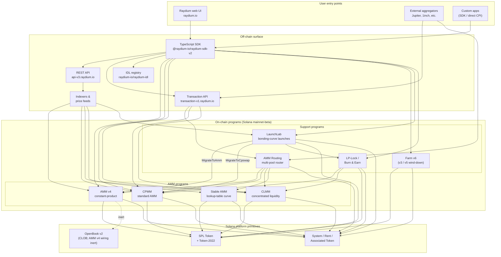

<Info>
  **Trang này được dịch tự động bằng AI. Phiên bản tiếng Anh là bản chính thức.**

  [Xem bản tiếng Anh →](/protocol-overview/architecture)
</Info>

## Raydium thực sự là gì

Raydium **không phải là một chương trình duy nhất**. Nó là một tập hợp các chương trình Solana on-chain độc lập với nhau mà chia sẻ một bề mặt off-chain chung (REST API, TypeScript SDK, IDL registry) và một vài quy ước (authority PDA, fee-config accounts, admin multisig). Một tương tác của người dùng — một swap, một deposit, một farm-harvest — được định tuyến vào đúng một trong những chương trình đó; bề mặt off-chain là những gì làm cho chúng trông giống như một sản phẩm duy nhất.

Dấu chân on-chain được chia thành bốn loại chương trình:

1. **Chương trình AMM** — bốn chương trình pool riêng biệt, mỗi chương trình có định dạng và toán học giá riêng:
   - **AMM v4** — AMM constant-product ban đầu. Ban đầu là thiết kế lai phản ánh đường cong lên một thị trường OpenBook (trước đây là Serum); tích hợp OpenBook đã bị hủy kích hoạt kể từ đó và các pool hiện hoạt động như AMM thuần khiết chống lại đường cong. Vẫn là sân giao dịch sâu nhất cho nhiều cặp chính.
   - **CPMM** — một AMM constant-product đơn giản (`x · y = k`) được xây dựng riêng trên Solana, với hỗ trợ Token-2022 first-class. **Chương trình được khuyến nghị cho các pool constant-product mới.**
   - **CLMM** — một AMM concentrated-liquidity theo kiểu Uniswap v3. Tính thanh khoản được cung cấp vào các khoảng giá; phí tích lũy theo vị trí; trạng thái được tổ chức xung quanh tick và `sqrt_price_x64`.
   - **Stable AMM** — một chương trình kiểu StableSwap thin-liquidity (fork từ AMM v4 với đường cong giá lookup-table) mà router sử dụng cho các cặp stablecoin tương quan. Không được cung cấp như một tùy chọn create-pool first-class trong UI ngày hôm nay.
2. **Phân phối phần thưởng** — **Farm** (v3 / v5 / v6, với v6 là phiên bản hoạt động; v3/v5 chỉ dành cho wind-down).
3. **Token launch** — **LaunchLab**, một chương trình bonding-curve. Các launch thành công **graduate** vào một pool AMM v4 hoặc pool CPMM tùy thuộc vào cấu hình `migrate_type` của launch, với LP được bao bọc qua chương trình LP-Lock.
4. **Nguyên thủy tính thanh khoản** — **AMM Routing** (router multi-pool on-chain CPI vào bốn chương trình AMM trong một giao dịch duy nhất) và **LP-Lock / Burn & Earn** (khóa các vị trí LP trong khi giữ các yêu cầu phí mở).

Mọi thứ khác trong stack — REST API, Transaction API, TypeScript SDK, UI — là cơ sở hạ tầng off-chain soạn thảo các chương trình này trên Solana và SPL Token / Token-2022. Bề mặt Perps là một tích hợp riêng biệt trên Orderly Network và không phải là một chương trình Raydium on-chain; nó bị loại khỏi sơ đồ này.

## Sơ đồ chính

Các bất biến chính mà sơ đồ này ghi lại:

- **Các chương trình AMM là ngang hàng.** CPMM không gọi vào CLMM; CLMM không gọi vào AMM v4; Stable AMM là chương trình riêng của nó. Một swap trực tiếp trên một pool chạm vào đúng một chương trình AMM. Chương trình duy nhất soạn thảo nhiều AMM trong một giao dịch duy nhất là **AMM Routing**, nó CPIs vào AMM v4 / CPMM / CLMM / Stable AMM khi cần thiết khi một route vượt qua các loại pool.
- **SDK và Transaction API là lớp soạn thảo, không phải chương trình.** Khi web UI hoặc một aggregator xây dựng giao dịch "swap qua ba pool", SDK (phía client) hoặc Transaction API (phía server) may dây các chỉ thị lại với nhau bằng cách sử dụng báo giá được tìm nạp từ REST API. Chuỗi thấy một giao dịch Solana duy nhất với N chỉ thị — không có chương trình orchestrator nào sở hữu toàn bộ luồng.
- **Dây OpenBook của AMM v4 không hoạt động.** AMM v4 là AMM duy nhất bao giờ được liên kết với OpenBook, nhưng tích hợp đã bị hủy kích hoạt — các pool không còn chia sẻ tính thanh khoản với OpenBook, `MonitorStep` không còn được crank, và một sự cố OpenBook không ảnh hưởng đến lưu lượng swap hiện tại. Các tài khoản thị trường vẫn tồn tại trên `AmmInfo` của pool để tương thích ngược nhưng tham chiếu trạng thái không sử dụng. CPMM, CLMM, và Stable AMM không bao giờ có phụ thuộc CLOB.
- **LaunchLab graduate vào một trong hai chương trình AMM.** Một launch thành công gọi `MigrateToAmm` (mục tiêu: AMM v4) hoặc `MigrateToCpswap` (mục tiêu: CPMM) tùy thuộc vào `migrate_type` của nó; các launch Token-2022 luôn chuyển đến CPMM. Post-graduation LP được chia qua `PlatformConfig` và các lát tạo tác/nền tảng được bao bọc qua chương trình LP-Lock dưới dạng NFT Fee Key (mẫu Burn & Earn).
- **LP-Lock là một trình bao bọc, không phải AMM thứ năm.** Nó giữ các vị trí LP thay mặt những người tạo dưới một PDA để phí cơ bản vẫn có thể được yêu cầu mà không cần tiếp xúc với khả năng rút thanh khoản. Nó soạn thảo qua các pool CPMM và CLMM.
- **Các bề mặt off-chain bổ sung cho nhau.** REST API là read-only có bộ nhớ cache; Transaction API xây dựng các giao dịch sẵn sàng ký phía server; SDK xây dựng chúng phía client. Cả ba đều phụ thuộc vào IDL registry giống nhau như nguồn schema sự thật.

## Luồng dữ liệu: một swap CPMM, end-to-end

Để làm cho bức tranh cụ thể, đây là những gì xảy ra khi người dùng swap USDC → RAY trên pool CPMM từ Raydium UI. (AMM v4 và CLMM khác nhau về các tài khoản mà chúng cần, không phải về hình dạng cấp cao.)

1. **Yêu cầu báo giá (off-chain).** UI gọi `GET https://api-v3.raydium.io/compute/swap-base-in` với mint đầu vào, mint đầu ra, số tiền và độ chịu đựng slippage. API tham khảo indexer của nó, chọn một route (có thể qua nhiều pool), và trả lại một báo giá cùng với danh sách ID chương trình, ID pool và tài khoản phí mà client sẽ cần.
2. **Xây dựng giao dịch (client + SDK).** Client chuyển báo giá đến `raydium-sdk-v2`. SDK giải quyết mọi PDA mà nó cần (authority PDA, pool state, observation, vaults — xem [`products/cpmm/accounts`](/vi/products/cpmm/accounts)), tiêm các tài khoản token liên kết của người dùng (tạo chúng bằng Chương trình Token liên kết nếu bị thiếu), và phát ra một `Transaction` không được ký.
3. **Ký ví.** Ví của người dùng ký giao dịch. Không có gì cụ thể Raydium ở đây; đây là luồng ví Solana tiêu chuẩn.
4. **Thực thi on-chain.** Giao dịch được ký hit chương trình **CPMM** của Raydium, chương trình này (a) xác thực trạng thái pool, (b) áp dụng đường cong constant-product với cấu hình phí của pool, (c) di chuyển mã thông báo giữa ATA của người dùng và vault pool thông qua CPI vào SPL Token / Token-2022, (d) cập nhật tài khoản `observation` cho TWAP, và (e) trở lại.
5. **Tiêu thụ indexer.** Solana RPC một vài slot sau đó tiếp xúc các log chương trình. Indexer của Raydium phân tích chúng, cập nhật dự trữ, khối lượng 24h và APR của pool, và phục vụ các giá trị được cập nhật cho yêu cầu `/pools/info/ids` tiếp theo.

Tất cả bốn bước 2–4 xảy ra trong một giao dịch Solana duy nhất. API chỉ được liên quan trong **bước 1** (báo giá) và **bước 5** (lập chỉ mục cho lần tiếp theo). Nếu API không hoạt động, một client có SDK trực tiếp và RPC Solana vẫn có thể thực hiện giao dịch — nó chỉ phải tự tính toán route.

## Cơ sở hạ tầng chia sẻ

Một số nguyên thủy được sử dụng bởi mọi sản phẩm và xứng đáng được đặt tên một lần để các chương sau có thể tham chiếu chúng mà không cần định nghĩa lại. Chi tiết sống trong [`protocol-overview/shared-infrastructure`](/vi/protocol-overview/shared-infrastructure); đây là chỉ mục.

| Nguyên thủy | Nó là gì | Nó được định nghĩa ở đâu |
|-----------|------------|---------------------|
| **Authority PDA** | Một người ký sở hữu chương trình thực sự kiểm soát các vault mã thông báo. Người dùng không bao giờ giữ quyền vault. | Per-program; CPMM sử dụng `vault_and_lp_mint_auth_seed` — xem [`products/cpmm/accounts`](/vi/products/cpmm/accounts). |
| **Tài khoản cấu hình** | Các tài khoản per-program giữ tỷ lệ phí, chìa khóa admin và điểm đến quỹ/tạo tác. Được lập chỉ mục bằng `u16` trong CPMM (`amm_config[index]`). | [`reference/program-addresses`](/vi/reference/program-addresses) liệt kê các điểm cuối API trả lại chúng. |
| **Phân chia phí giao thức/quỹ/tạo tác** | Một phí giao dịch duy nhất được chia thành ba (đôi khi bốn) cách tại giải quyết. Cùng một mẫu trong CPMM và CLMM, những chiếc đòn khác nhau. | [`reference/fee-comparison`](/vi/reference/fee-comparison) |
| **Tài khoản quan sát** | Vòng đệm các mẫu giá được sử dụng cho TWAP. Viết trên mỗi swap. | [`products/cpmm/accounts`](/vi/products/cpmm/accounts), [`products/clmm/accounts`](/vi/products/clmm/accounts) |
| **REST API (`api-v3.raydium.io`)** | Đơn API đọc công cộng duy nhất cho siêu dữ liệu pool, vị trí, trạng thái farm và tính toán báo giá. | [`sdk-api/rest-api`](/vi/sdk-api/rest-api) |
| **Bộ đăng ký IDL** | Anchor IDLs cho mọi chương trình, được phản chiếu tại [`github.com/raydium-io/raydium-idl`](https://github.com/raydium-io/raydium-idl). SDK và người tích hợp CPI deserialize chống lại các chương trình này. | [`sdk-api/anchor-idl`](/vi/sdk-api/anchor-idl) |

## Bề mặt off-chain: API vs SDK vs IDL

Ba cái này thường bị nhầm lẫn. Họ làm những điều khác nhau:

- **REST API** (`api-v3.raydium.io`) là **chế độ xem read-mostly, cached** của trạng thái on-chain cộng với **công cụ trích dẫn**. Nó cho bạn biết pool nào tồn tại, dự trữ của chúng là gì, APR trông như thế nào, và route tốt nhất cho swap là gì. Nó **không** xây dựng giao dịch.
- **TypeScript SDK** (`@raydium-io/raydium-sdk-v2`) là **trình xây dựng giao dịch**. Nó biết bố cục tài khoản và định dạng hướng dẫn của mỗi chương trình. Nó tìm nạp trạng thái mới từ RPC (không phải từ API) trước khi soạn thảo một hướng dẫn, vì vậy nó có thể ký các giao dịch chính xác. Nó chỉ nói chuyện với API khi nó cần một báo giá.
- **Bộ đăng ký IDL** là **lược đồ** cả hai ở trên phụ thuộc vào. Nếu bạn đang viết Rust CPI vào chương trình Raydium, IDL là hợp đồng; nếu bạn đang viết tích hợp TS, bạn đang sử dụng IDLs gián tiếp thông qua SDK.

## Mỗi chương được lắp ở đâu

Sơ đồ ở trên xuất hiện — ở dạng rút gọn — trong suốt tài liệu. Đây là nơi xử lý đầy đủ của mỗi phần sống để bạn có thể khoan sâu:

- **Chương trình on-chain:** một chương cho mỗi sản phẩm dưới [`products/`](/vi/products). Mỗi chương tuân theo cùng một mẫu (overview → accounts → math → instructions → fees → code demos).
- **Nguyên thủy chia sẻ cross-program:** [`protocol-overview/shared-infrastructure`](/vi/protocol-overview/shared-infrastructure) và [`algorithms/`](/vi/algorithms) cho toán học lặp lại (constant-product, concentrated-liquidity, curve pricing).
- **Bề mặt off-chain:** [`sdk-api/`](/vi/sdk-api) có tham chiếu SDK và REST API đầy đủ, cộng với [`sdk-api/anchor-idl`](/vi/sdk-api/anchor-idl) và [`sdk-api/rust-cpi`](/vi/sdk-api/rust-cpi).
- **Luồng cấp người dùng (tạo pool, swap, LP, yêu cầu phần thưởng, khởi chạy token):** [`user-flows/`](/vi/user-flows).
- **Mẫu tích hợp cho các nhóm khác (aggregators, ví, bot):** [`integration-guides/`](/vi/integration-guides).
- **Bề mặt bảo mật, chìa khóa admin, rủi ro đã biết, kiểm toán:** [`security/`](/vi/security).
- **Các thay đổi có phiên bản và câu chuyện di chuyển AMM v4 → CPMM / Farm v3 → v6:** [`protocol-overview/versions-and-migration`](/vi/protocol-overview/versions-and-migration).

## Non-goals của sơ đồ này

Một vài lược bỏ cố ý, vì vậy không ai đọc thêm vào nó hơn những gì ở đó:

- **Không có lịch sử giá.** Raydium không phụ thuộc vào Pyth, Switchboard hoặc bất kỳ nhà tiên tri bên ngoài nào cho giá AMM cốt lõi của nó. Báo giá đến từ dự trữ on-chain. Tài khoản `observation` tồn tại để các hợp đồng **khác** có thể đọc Raydium TWAP — Raydium chính nó không cần nó.
- **Không có chương trình voting token on-chain.** Các hành động quản trị như cập nhật cấu hình phí và nâng cấp chương trình được thực hiện bởi một multisig. Các chìa khóa multisig và chính sách xoay vòng nằm trong [`security/admin-and-multisig`](/vi/security/admin-and-multisig).
- **Không có cầu nối.** Raydium là Solana-native. Luồng cross-chain là vấn đề của người tích hợp và sống bên ngoài sơ đồ này.

Nguồn:

- [`reference/program-addresses`](/vi/reference/program-addresses) cho các ID chương trình chính tắc được tham chiếu trong suốt trang này
- [github.com/raydium-io/raydium-sdk-V2](https://github.com/raydium-io/raydium-sdk-V2)
- [github.com/raydium-io/raydium-idl](https://github.com/raydium-io/raydium-idl)
