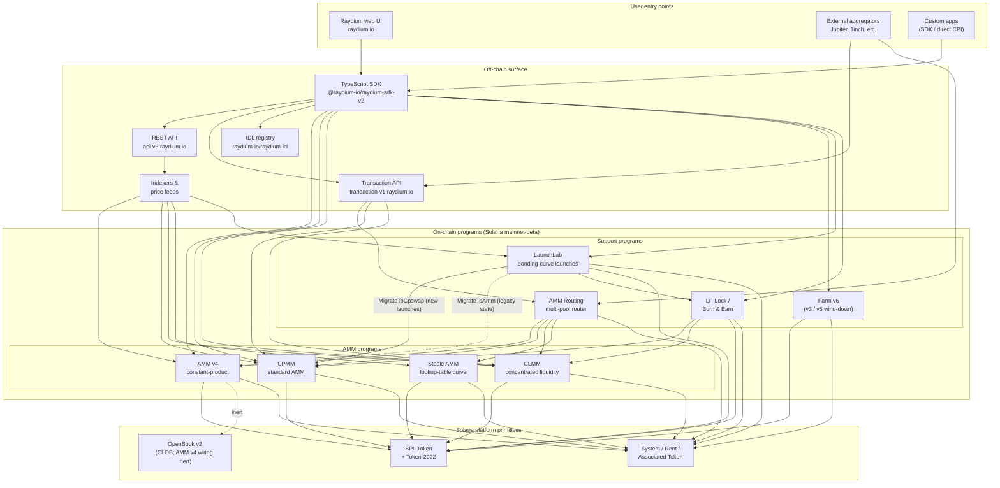

<Info>
  **Trang này được dịch tự động bằng AI. Phiên bản tiếng Anh là bản chính thức.**

  [Xem bản tiếng Anh →](/protocol-overview/architecture)
</Info>

## Raydium thực sự là gì

Raydium **không phải là một chương trình duy nhất**. Nó là một tập hợp các chương trình Solana on-chain độc lập chia sẻ một bề mặt off-chain chung (REST API, TypeScript SDK, IDL registry) và một số quy ước (authority PDA, fee-config accounts, admin multisig). Một tương tác của người dùng — một swap, một deposit, một farm-harvest — được định tuyến vào chính xác một trong những chương trình đó; bề mặt off-chain là những gì làm cho chúng cảm thấy như một sản phẩm duy nhất.

Dấu chân on-chain được chia thành bốn loại chương trình:

1. **Các chương trình AMM** — bốn chương trình pool riêng biệt, mỗi chương trình có định dạng và toán học định giá riêng:
   - **AMM v4** — AMM constant-product ban đầu. Ban đầu là một thiết kế hybrid phản chiếu đường cong lên một thị trường OpenBook (trước đây là Serum); tích hợp OpenBook đã bị vô hiệu hóa và các pool hiện hoạt động như các AMM thuần túy so với đường cong. Vẫn là địa điểm sâu nhất cho nhiều cặp chính.
   - **CPMM** — một AMM constant-product đơn giản (`x · y = k`) được xây dựng natively trên Solana, với hỗ trợ Token-2022 hạng nhất. **Chương trình được khuyến nghị cho các pool constant-product mới.**
   - **CLMM** — một AMM concentrated-liquidity theo kiểu Uniswap v3. Thanh khoản được cung cấp vào các khoảng giá; phí tích lũy theo vị trí; trạng thái được tổ chức xung quanh các tick và `sqrt_price_x64`.
   - **Stable AMM** — một chương trình StableSwap-style thin-liquidity (fork từ AMM v4 với đường cong định giá lookup-table) mà router sử dụng cho các cặp stablecoin-correlated. Hiện không được hiển thị như một tùy chọn create-pool hạng nhất trong UI.
2. **Phân phối phần thưởng** — **Farm** (v3 / v5 / v6, với v6 là thế hệ hoạt động; v3/v5 chỉ dành cho wind-down).
3. **Token launch** — **LaunchLab**, một chương trình bonding-curve. Các launch mới được khởi tạo **graduate** vào CPMM. Hướng dẫn di chuyển AMM v4 kế thừa vẫn tồn tại cho trạng thái launch hiện có.
4. **Các nguyên thủy thanh khoản** — **AMM Routing** (router multi-pool on-chain CPI vào bốn chương trình AMM trong một giao dịch duy nhất) và **LP-Lock / Burn & Earn** (khóa các vị trí LP trong khi giữ các yêu cầu phí mở).

Mọi thứ khác trong stack — các REST API, Transaction API, TypeScript SDK, UI — là cơ sở hạ tầng off-chain soạn các chương trình này trên Solana và SPL Token / Token-2022. Bề mặt Perps là một tích hợp riêng biệt trên Orderly Network và không phải là một chương trình Raydium on-chain; nó bị loại khỏi sơ đồ này.

## Sơ đồ chính tắc

```mermaid
flowchart TB
  subgraph user ["User entry points"]
    UI["Raydium web UI<br/>raydium.io"]
    AGG["External aggregators<br/>Jupiter, 1inch, etc."]
    CUST["Custom apps<br/>(SDK / direct CPI)"]
  end

  subgraph offchain ["Off-chain surface"]
    API["REST API<br/>api-v3.raydium.io"]
    TXAPI["Transaction API<br/>transaction-v1.raydium.io"]
    SDK["TypeScript SDK<br/>@raydium-io/raydium-sdk-v2"]
    IDL["IDL registry<br/>raydium-io/raydium-idl"]
    IDX["Indexers &<br/>price feeds"]
  end

  subgraph onchain ["On-chain programs (Solana mainnet-beta)"]
    subgraph amms ["AMM programs"]
      direction TB
      AMM4["AMM v4<br/>constant-product"]
      CPMM["CPMM<br/>standard AMM"]
      CLMM["CLMM<br/>concentrated liquidity"]
      STABLE["Stable AMM<br/>lookup-table curve"]
    end

    subgraph support ["Support programs"]
      direction TB
      ROUTE["AMM Routing<br/>multi-pool router"]
      FARM["Farm v6<br/>(v3 / v5 wind-down)"]
      LAUNCH["LaunchLab<br/>bonding-curve launches"]
      LOCK["LP-Lock /<br/>Burn & Earn"]
    end
  end

  subgraph solana ["Solana platform primitives"]
    TOKEN["SPL Token<br/>+ Token-2022"]
    OB["OpenBook v2<br/>(CLOB; AMM v4 wiring inert)"]
    SYS["System / Rent /<br/>Associated Token"]
  end

  %% Client paths
  UI --> SDK
  CUST --> SDK
  AGG --> TXAPI
  AGG --> ROUTE

  %% Off-chain composition
  SDK --> API
  SDK --> TXAPI
  SDK --> IDL
  SDK --> AMM4
  SDK --> CPMM
  SDK --> CLMM
  SDK --> FARM
  SDK --> LAUNCH
  SDK --> LOCK

  TXAPI --> ROUTE
  TXAPI --> CPMM
  TXAPI --> CLMM

  API --> IDX
  IDX --> AMM4
  IDX --> CPMM
  IDX --> CLMM
  IDX --> STABLE
  IDX --> LAUNCH

  %% Routing → AMM programs (CPI)
  ROUTE --> AMM4
  ROUTE --> CPMM
  ROUTE --> CLMM
  ROUTE --> STABLE

  %% LaunchLab graduation paths
  LAUNCH -- "MigrateToCpswap (new launches)" --> CPMM
  LAUNCH -. "MigrateToAmm (legacy state)" .-> AMM4
  LAUNCH --> LOCK

  %% LP-Lock wraps LP from CPMM / CLMM pools
  LOCK --> CPMM
  LOCK --> CLMM

  %% Programs → SPL Token / Token-2022
  AMM4 --> TOKEN
  CPMM --> TOKEN
  CLMM --> TOKEN
  STABLE --> TOKEN
  FARM --> TOKEN
  LAUNCH --> TOKEN
  LOCK --> TOKEN

  %% AMM v4's historical OpenBook wiring is inert
  AMM4 -. "inert" .-> OB

  %% Programs → System / Rent / ATA
  AMM4 --> SYS
  CPMM --> SYS
  CLMM --> SYS
  STABLE --> SYS
  FARM --> SYS
  LAUNCH --> SYS
  LOCK --> SYS
  ROUTE --> SYS
```

Các bất biến chính mà sơ đồ này nắm bắt:

- **Các chương trình AMM là ngang hàng.** CPMM không gọi vào CLMM; CLMM không gọi vào AMM v4; Stable AMM là chương trình riêng của nó. Một swap trực tiếp trên một pool chạm vào chính xác một chương trình AMM. Chương trình duy nhất soạn nhiều AMM trong một giao dịch duy nhất là **AMM Routing**, nó CPI vào AMM v4 / CPMM / CLMM / Stable AMM khi cần thiết khi một route vượt qua các loại pool.
- **SDK và Transaction API là các lớp soạn, không phải chương trình.** Khi web UI hoặc một aggregator xây dựng một giao dịch "swap qua ba pool", SDK (phía client) hoặc Transaction API (phía server) khâu các hướng dẫn lại với nhau bằng cách sử dụng các báo giá được tìm nạp từ REST API. Chuỗi thấy một giao dịch Solana duy nhất với N hướng dẫn — không có chương trình orchestrator nào sở hữu toàn bộ luồng.
- **Dây OpenBook của AMM v4 không hoạt động.** AMM v4 là AMM duy nhất từng bị ràng buộc với OpenBook, nhưng tích hợp đã bị vô hiệu hóa — các pool không còn chia sẻ thanh khoản với OpenBook, `MonitorStep` không còn được crank, và một sự cố OpenBook không ảnh hưởng đến lưu lượng swap hiện tại. Các tài khoản thị trường vẫn tồn tại trên `AmmInfo` của pool để tương thích ngược nhưng tham chiếu trạng thái không sử dụng. CPMM, CLMM và Stable AMM không bao giờ có phụ thuộc CLOB.
- **Các pool LaunchLab mới graduate vào CPMM.** Khởi tạo hiện yêu cầu `migrate_type = CPSWAP`. `MigrateToAmm` vẫn tồn tại cho trạng thái kế thừa hiện có. Trước bản nâng cấp 2026-08-17, di chuyển CPMM đã khóa `creator_scale` riêng cho người tạo. Các di chuyển được thực hiện sau đó kết hợp nó với `platform_scale` thành một vị trí LP được khóa do nền tảng sở hữu. Các Fee Key trước đó vẫn không thay đổi.
- **LP-Lock là một wrapper, không phải AMM thứ năm.** Nó giữ các vị trí LP thay mặt cho những người tạo dưới một PDA để các phí cơ bản vẫn có thể được yêu cầu mà không phơi bày khả năng rút thanh khoản. Nó soạn trên các pool CPMM và CLMM.
- **Các bề mặt off-chain bổ sung cho nhau.** REST API là read-only với caching; Transaction API xây dựng các giao dịch sẵn sàng ký phía server; SDK xây dựng chúng phía client. Cả ba đều phụ thuộc vào cùng một IDL registry làm nguồn sự thật của schema.

## Luồng dữ liệu: một swap CPMM, end to end

Để làm cho bức tranh cụ thể, đây là những gì xảy ra khi một người dùng swap USDC → RAY trên một pool CPMM từ Raydium UI. (AMM v4 và CLMM khác nhau ở các tài khoản mà chúng cần, không phải ở hình dạng cấp cao.)

1. **Yêu cầu báo giá (off-chain).** UI gọi `GET https://api-v3.raydium.io/compute/swap-base-in` với mint đầu vào, mint đầu ra, số tiền và dung sai slippage. API tham khảo indexer của nó, chọn một route (có thể thông qua nhiều pool), và trả về một báo giá cộng với danh sách các ID chương trình, ID pool và tài khoản phí mà client sẽ cần.
2. **Xây dựng giao dịch (client + SDK).** Client chuyển báo giá tới `raydium-sdk-v2`. SDK giải quyết mọi PDA mà nó cần (authority PDA, pool state, observation, vaults — xem [`products/cpmm/accounts`](/vi/products/cpmm/accounts)), tiêm các tài khoản token liên kết của người dùng (tạo chúng bằng Associated Token Program nếu thiếu), và phát ra một `Transaction` không ký.
3. **Ký ví.** Ví của người dùng ký giao dịch. Không có gì cụ thể của Raydium ở đây; đây là luồng ví Solana tiêu chuẩn.
4. **Thực thi on-chain.** Giao dịch đã ký nhấn chương trình **CPMM** của Raydium, nó (a) xác thực trạng thái pool, (b) áp dụng đường cong constant-product với cấu hình phí của pool, (c) di chuyển token giữa ATA của người dùng và vault của pool thông qua CPI vào SPL Token / Token-2022, (d) cập nhật tài khoản `observation` cho TWAP, và (e) trả về.
5. **Tiêu thụ indexer.** RPC Solana vài slot sau đó hiển thị các nhật ký chương trình. Indexer của Raydium phân tích chúng, cập nhật dự trữ, khối lượng 24h và APR của pool, và phục vụ các giá trị được cập nhật cho yêu cầu `/pools/info/ids` tiếp theo.

Tất cả bốn bước 2–4 xảy ra trong một giao dịch Solana duy nhất. API chỉ liên quan đến **bước 1** (báo giá) và **bước 5** (indexing cho lần tiếp theo). Nếu API bị down, một client có SDK live và RPC Solana vẫn có thể giao dịch — nó chỉ phải tính toán route cho chính nó.

## Cơ sở hạ tầng được chia sẻ

Một số nguyên thủy được sử dụng bởi mọi sản phẩm và đáng được đặt tên một lần để các chương sau có thể tham chiếu mà không cần định nghĩa lại. Chi tiết nằm trong [`protocol-overview/shared-infrastructure`](/vi/protocol-overview/shared-infrastructure); đây là chỉ mục.

| Nguyên thủy | Nó là gì | Nơi nó được định nghĩa |
|-----------|------------|---------------------|
| **Authority PDA** | Một signer do chương trình sở hữu thực sự kiểm soát các vault token. Người dùng không bao giờ giữ quyền vault. | Per-program; CPMM sử dụng `vault_and_lp_mint_auth_seed` — xem [`products/cpmm/accounts`](/vi/products/cpmm/accounts). |
| **Config accounts** | Các tài khoản per-program giữ tỷ lệ phí, khóa admin và điểm đích fund/creator. Được lập chỉ mục bằng `u16` trong CPMM (`amm_config[index]`). | [`reference/program-addresses`](/vi/reference/program-addresses) liệt kê các điểm cuối API trả về chúng. |
| **Chia tách phí Protocol/fund/creator** | Một phí giao dịch duy nhất được chia thành ba (đôi khi bốn) cách tại settlement. Cùng một mẫu trong CPMM và CLMM, các knob khác nhau. | [`reference/fee-comparison`](/vi/reference/fee-comparison) |
| **Observation account** | Ring buffer của các mẫu giá được sử dụng cho TWAP. Được viết trên mọi swap. | [`products/cpmm/accounts`](/vi/products/cpmm/accounts), [`products/clmm/accounts`](/vi/products/clmm/accounts) |
| **REST API (`api-v3.raydium.io`)** | API đọc công khai duy nhất cho siêu dữ liệu pool, vị trí, trạng thái farm và tính toán báo giá. | [`sdk-api/rest-api`](/vi/sdk-api/rest-api) |
| **IDL registry** | Anchor IDL cho mọi chương trình, được phản chiếu tại [`github.com/raydium-io/raydium-idl`](https://github.com/raydium-io/raydium-idl). SDK và các tích hợp CPI deserialize so với những cái này. | [`sdk-api/anchor-idl`](/vi/sdk-api/anchor-idl) |

## Bề mặt off-chain: API vs SDK vs IDL

Ba cái này thường bị nhầm lẫn. Chúng làm những điều khác nhau:

- **REST API** (`api-v3.raydium.io`) là một **chế độ xem cached, read-mostly** của trạng thái on-chain cộng với **engine báo giá**. Nó cho bạn biết những pool nào tồn tại, dự trữ của chúng là gì, APR trông như thế nào và route tốt nhất cho một swap là gì. Nó **không** xây dựng giao dịch.
- **TypeScript SDK** (`@raydium-io/raydium-sdk-v2`) là một **transaction builder**. Nó biết bố cục tài khoản và định dạng hướng dẫn của mọi chương trình. Nó tìm nạp trạng thái tươi từ một RPC (không phải từ API) trước khi soạn một hướng dẫn, vì vậy nó có thể ký các giao dịch chính xác. Nó chỉ nói chuyện với API khi nó cần một báo giá.
- **IDL registry** là **schema** mà cả hai cái trên phụ thuộc vào. Nếu bạn đang viết Rust CPI vào một chương trình Raydium, IDL là hợp đồng; nếu bạn đang viết một tích hợp TS, bạn đang sử dụng IDL một cách gián tiếp thông qua SDK.

## Mỗi chương nằm ở đâu

Sơ đồ trên tái xuất hiện — ở dạng rút gọn — trong suốt các tài liệu. Đây là nơi xử lý đầy đủ của mỗi phần nằm để bạn có thể khoan sâu:

- **Các chương trình on-chain:** một chương cho mỗi sản phẩm dưới [`products/`](/vi/products). Mỗi chương theo cùng một mẫu (overview → accounts → math → instructions → fees → code demos).
- **Các nguyên thủy cross-program được chia sẻ:** [`protocol-overview/shared-infrastructure`](/vi/protocol-overview/shared-infrastructure) và [`algorithms/`](/vi/algorithms) cho toán học tái xuất hiện (constant-product, concentrated-liquidity, curve pricing).
- **Bề mặt off-chain:** [`sdk-api/`](/vi/sdk-api) có tham chiếu SDK và REST API đầy đủ, cộng với [`sdk-api/anchor-idl`](/vi/sdk-api/anchor-idl) và [`sdk-api/rust-cpi`](/vi/sdk-api/rust-cpi).
- **Luồng cấp người dùng (tạo pool, swap, LP, yêu cầu phần thưởng, khởi chạy token):** [`user-flows/`](/vi/user-flows).
- **Các mẫu tích hợp cho các nhóm khác (aggregators, wallets, bots):** [`integration-guides/`](/vi/integration-guides).
- **Bề mặt bảo mật, khóa admin, rủi ro đã biết, audits:** [`security/`](/vi/security).
- **Các thay đổi được phiên bản và câu chuyện di chuyển AMM v4 → CPMM / Farm v3 → v6:** [`protocol-overview/versions-and-migration`](/vi/protocol-overview/versions-and-migration).

## Mục tiêu không phải của sơ đồ này

Một vài bỏ qua cố ý, vì vậy không ai đọc nhiều hơn những gì có ở đó:

- **Không có oracle giá.** Raydium không phụ thuộc vào Pyth, Switchboard hoặc bất kỳ oracle bên ngoài nào cho định giá AMM cốt lõi của nó. Báo giá đến từ dự trữ on-chain. Tài khoản `observation` tồn tại để các hợp đồng **khác** có thể đọc TWAP của Raydium — Raydium tự nó không cần nó.
- **Không có chương trình token-voting on-chain.** Các hành động admin như cập nhật fee-config và nâng cấp chương trình được thực hiện bởi một multisig. Các khóa multisig và chính sách xoay vòng nằm trong [`security/admin-and-multisig`](/vi/security/admin-and-multisig).
- **Không có cầu nối.** Raydium là Solana-native. Các luồng cross-chain là vấn đề của integrator và nằm ngoài sơ đồ này.

Nguồn:

- [`reference/program-addresses`](/vi/reference/program-addresses) cho các ID chương trình chính tắc được tham chiếu trong suốt trang này
- [github.com/raydium-io/raydium-sdk-V2](https://github.com/raydium-io/raydium-sdk-V2)
- [github.com/raydium-io/raydium-idl](https://github.com/raydium-io/raydium-idl)
