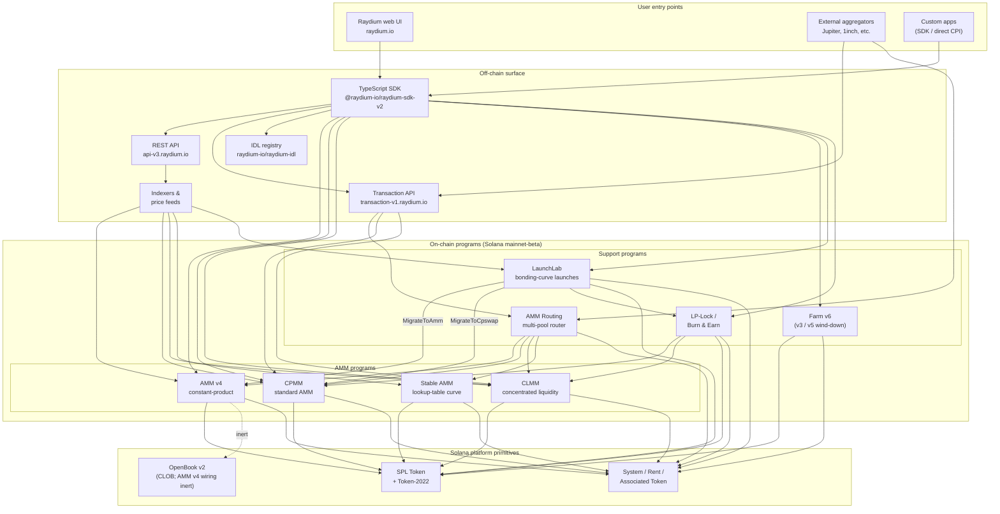

<Info>
  **本頁內容由 AI 自動翻譯，所有內容以英文版本為準。**

  [查看英文版 →](/protocol-overview/architecture)
</Info>

<Info>
  **本頁是文件中唯一的規範性架構圖。** 其他章節都連結回這裡，而不是重繪整個系統。程式 ID 不嵌入此頁面——它們存放在 [`reference/program-addresses`](/zh-Hant/reference/program-addresses)，以便在一個地方更新。
</Info>

## Raydium 實際上是什麼

Raydium **不是單一程式**。它是一組獨立的 Solana 鏈上程式，共享同一個鏈下表面（REST API、TypeScript SDK、IDL 登錄）和一些共通慣例（授權 PDA、費用設定帳戶、管理者多簽）。使用者的互動——一次交換、一次存入、一次獲得農場獎勵——會路由到那些程式中的恰好一個；鏈下表面使它們看起來像一個單一產品。

鏈上的佔用空間分為四種程式：

1. **AMM 程式**——四個獨立的流動性池程式，各自有自己的格式和定價數學：
   - **AMM v4**——原始的恆定乘積 AMM。最初是一個混合設計，將曲線映射到 OpenBook（原名 Serum）市場；OpenBook 整合已被停用，池現在作為純 AMM 針對曲線運作。仍然是許多主要交易對最深層的交易場所。
   - **CPMM**——在 Solana 上原生構建的純恆定乘積 AMM（`x · y = k`），具有一級 Token-2022 支持。**推薦用於新的恆定乘積池的程式。**
   - **CLMM**——類似 Uniswap v3 風格的集中流動性 AMM。流動性提供到價格範圍內；費用按位置計算；狀態以 tick 和 `sqrt_price_x64` 組織。
   - **Stable AMM**——薄流動性的 StableSwap 風格程式（從 AMM v4 分叉，具有查找表定價曲線），路由器用於穩定幣相關交易對。目前在 UI 中未作為一級創建池選項展示。
2. **獎勵分配**——**Farm**（v3 / v5 / v6，v6 為活躍版本；v3/v5 僅用於逐步淘汰）。
3. **代幣啟動**——**LaunchLab**，一個債券曲線程式。成功的啟動會根據啟動的配置**升級**到 AMM v4 池或 CPMM 池之一，LP 透過 LP-Lock 程式包裝。
4. **流動性原始物**——**AMM 路由**（在單個交易中 CPI 進入四個 AMM 程式的鏈上多池路由器）和 **LP-Lock / Burn & Earn**（鎖定 LP 位置同時保持費用索賠開啟）。

堆疊中其他一切——REST API、Transaction API、TypeScript SDK、UI——都是鏈下基礎設施，在 Solana 和 SPL Token / Token-2022 之上組合這些程式。Perps 表面是 Orderly Network 之上的單獨整合，不是 Raydium 鏈上程式；它被排除在此圖之外。

## 規範架構圖

此圖捕捉的關鍵不變量：

- **AMM 程式是對等的。** CPMM 不呼叫 CLMM；CLMM 不呼叫 AMM v4；Stable AMM 是自己的程式。一個池上的直接交換恰好觸及一個 AMM 程式。在單個交易中組合多個 AMM 的唯一程式是 **AMM 路由**，當路由跨越池類型時，它根據需要 CPI 進入 AMM v4 / CPMM / CLMM / Stable AMM。
- **SDK 和 Transaction API 是組合層，不是程式。** 當網頁 UI 或聚合器構建「通過三個池的交換」交易時，SDK（用戶端）或 Transaction API（伺服器端）使用從 REST API 獲取的報價將指令拼接在一起。鏈看到的是一個 Solana 交易，有 N 個指令——沒有編排程式擁有整個流程。
- **AMM v4 的 OpenBook 連線是惰性的。** AMM v4 是唯一曾綁定到 OpenBook 的 AMM，但整合已被停用——池不再與 OpenBook 共享流動性，`MonitorStep` 不再被執行，OpenBook 中斷對當前交換流量沒有影響。市場帳戶仍保留在池的 `AmmInfo` 中以實現向後相容，但參考未使用的狀態。CPMM、CLMM 和 Stable AMM 從未有過 CLOB 依賴。
- **LaunchLab 升級到兩個 AMM 程式之一。** 成功的啟動會根據其 `migrate_type` 呼叫 `MigrateToAmm`（目標：AMM v4）或 `MigrateToCpswap`（目標：CPMM）；Token-2022 啟動總是遷移到 CPMM。升級後的 LP 透過 `PlatformConfig` 分割，創作者/平台切片透過 LP-Lock 程式包裝為費用密鑰 NFT（Burn & Earn 模式）。
- **LP-Lock 是包裝器，不是第五個 AMM。** 它在 PDA 下代表創作者持有 LP 位置，以便基礎費用仍可被索賠，而不暴露提現流動性的能力。它在 CPMM 和 CLMM 池上組合。
- **鏈下表面相互補充。** REST API 是唯讀的且有快取；Transaction API 在伺服器端構建已簽署的交易；SDK 在用戶端構建。所有三者都依賴相同的 IDL 登錄作為架構真實來源。

## 資料流：一個 CPMM 交換，端到端

為了使圖景具體化，以下是當使用者在 Raydium UI 上的 CPMM 池上交換 USDC → RAY 時發生的情況。（AMM v4 和 CLMM 在它們需要的帳戶中有所不同，但在高層形狀上並無差異。）

1. **報價請求（鏈下）。** UI 呼叫 `GET https://api-v3.raydium.io/compute/swap-base-in`，帶有輸入鑄幣、輸出鑄幣、金額和滑點容限。API 查詢其索引器，選擇一條路由（可能通過多個池），並返回報價加上用戶端將需要的程式 ID、池 ID 和費用帳戶列表。
2. **交易構建（用戶端 + SDK）。** 用戶端將報價傳遞給 `raydium-sdk-v2`。SDK 解決它需要的每個 PDA（授權 PDA、池狀態、觀察、保管庫——見 [`products/cpmm/accounts`](/zh-Hant/products/cpmm/accounts)），注入使用者的相關代幣帳戶（如果缺失則用相關代幣程式建立），並發出無簽署的 `Transaction`。
3. **錢包簽署。** 使用者的錢包簽署交易。這裡沒有 Raydium 特有的內容；這是標準 Solana 錢包流程。
4. **鏈上執行。** 簽署的交易進入 Raydium **CPMM 程式**，該程式（a）驗證池狀態，（b）應用具有池費用配置的恆定乘積曲線，（c）透過 CPI 進入 SPL Token / Token-2022 在使用者的 ATA 和池保管庫之間移動代幣，（d）更新 TWAP 的 `observation` 帳戶，（e）返回。
5. **索引器攝取。** Solana RPC 在幾個槽後公開程式日誌。Raydium 的索引器解析它們，更新池的準備金、24 小時成交量和 APR，並將更新的值服務於下一個 `/pools/info/ids` 請求。

所有四個步驟 2-4 發生在單個 Solana 交易中。API 只涉及**步驟 1**（報價）和**步驟 5**（為下一次索引）。如果 API 關閉，具有活動 SDK 和 Solana RPC 的用戶端仍可進行交易——它只需自己計算路由。

## 共享基礎設施

有幾個原始物被每個產品使用，值得命名一次，以便後面的章節可以參考它們而無需重新定義。詳細資訊位於 [`protocol-overview/shared-infrastructure`](/zh-Hant/protocol-overview/shared-infrastructure)；這是索引。

| 原始物 | 它是什麼 | 定義位置 |
|-----------|------------|---------------------|
| **授權 PDA** | 實際控制代幣保管庫的程式所有簽署人。使用者從不持有保管庫授權。 | 每個程式；CPMM 使用 `vault_and_lp_mint_auth_seed`——見 [`products/cpmm/accounts`](/zh-Hant/products/cpmm/accounts)。 |
| **設定帳戶** | 每個程式帳戶持有費率、管理員密鑰和基金/創作者目標。在 CPMM 中由 `u16` 索引（`amm_config[index]`）。 | [`reference/program-addresses`](/zh-Hant/reference/program-addresses) 列出返回它們的 API 端點。 |
| **協議/基金/創作者費用分割** | 單個交易費用在結算時分成三（有時四）種方式。CPMM 和 CLMM 中的相同模式，參數不同。 | [`reference/fee-comparison`](/zh-Hant/reference/fee-comparison) |
| **觀察帳戶** | 用於 TWAP 的價格樣本環形緩衝區。在每次交換時寫入。 | [`products/cpmm/accounts`](/zh-Hant/products/cpmm/accounts)、[`products/clmm/accounts`](/zh-Hant/products/clmm/accounts) |
| **REST API（`api-v3.raydium.io`）** | 單一公開讀 API，用於池元資料、位置、農場狀態和報價計算。 | [`sdk-api/rest-api`](/zh-Hant/sdk-api/rest-api) |
| **IDL 登錄** | 每個程式的 Anchor IDL，鏡像在 [`github.com/raydium-io/raydium-idl`](https://github.com/raydium-io/raydium-idl)。SDK 和 CPI 整合器針對這些反序列化。 | [`sdk-api/anchor-idl`](/zh-Hant/sdk-api/anchor-idl) |

## 鏈下表面：API 與 SDK 與 IDL

這三個常常被混淆。它們做不同的事情：

- **REST API**（`api-v3.raydium.io`）是鏈上狀態的**大多讀取、快取檢視**加上**報價引擎**。它告訴你哪些池存在、它們的準備金是什麼、APR 看起來如何、以及交換的最佳路由是什麼。它**不**構建交易。
- **TypeScript SDK**（`@raydium-io/raydium-sdk-v2`）是一個**交易構建器**。它知道每個程式的帳戶佈局和指令格式。在組合指令前，它從 RPC（不是從 API）獲取新鮮狀態，以便它能簽署準確的交易。它只在需要報價時與 API 交談。
- **IDL 登錄**是上述兩者依賴的**架構**。如果你正在寫 Rust CPI 進入 Raydium 程式，IDL 就是契約；如果你正在寫 TS 整合，你間接地透過 SDK 使用 IDL。

## 每章的位置

上面的圖——以縮小的形式——在整個文件中重複。以下是每個部分的完整處理位置，以便你可以深入了解：

- **鏈上程式：** 在 [`products/`](/zh-Hant/products) 下每個產品一章。每章遵循相同的範本（概述 → 帳戶 → 數學 → 指令 → 費用 → 代碼示例）。
- **共享跨程式原始物：** [`protocol-overview/shared-infrastructure`](/zh-Hant/protocol-overview/shared-infrastructure) 和 [`algorithms/`](/zh-Hant/algorithms) 用於重複出現的數學（恆定乘積、集中流動性、曲線定價）。
- **鏈下表面：** [`sdk-api/`](/zh-Hant/sdk-api) 有完整的 SDK 和 REST API 參考，加上 [`sdk-api/anchor-idl`](/zh-Hant/sdk-api/anchor-idl) 和 [`sdk-api/rust-cpi`](/zh-Hant/sdk-api/rust-cpi)。
- **使用者級別的流程（創建池、交換、LP、索賠獎勵、啟動代幣）：** [`user-flows/`](/zh-Hant/user-flows)。
- **其他團隊的整合模式（聚合器、錢包、機器人）：** [`integration-guides/`](/zh-Hant/integration-guides)。
- **安全表面、管理員密鑰、已知風險、審計：** [`security/`](/zh-Hant/security)。
- **版本化變更和 AMM v4 → CPMM / Farm v3 → v6 遷移故事：** [`protocol-overview/versions-and-migration`](/zh-Hant/protocol-overview/versions-and-migration)。

## 此圖的非目標

一些刻意的遺漏，以便沒有人讀得超過圖表本身包含的內容：

- **無價格預言。** Raydium 不依賴 Pyth、Switchboard 或任何外部預言進行其核心 AMM 定價。報價來自鏈上準備金。`observation` 帳戶的存在是為了讓**其他**合約可以讀取 Raydium TWAP——Raydium 本身不需要它。
- **無鏈上代幣投票程式。** 管理員操作，如費用配置更新和程式升級，由多簽執行。多簽密鑰和輪換政策在 [`security/admin-and-multisig`](/zh-Hant/security/admin-and-multisig)。
- **無橋。** Raydium 是 Solana 原生。跨鏈流程是整合者的問題，位於此圖之外。

資料來源：

- [`reference/program-addresses`](/zh-Hant/reference/program-addresses) 用於此頁面中參考的規範程式 ID
- [github.com/raydium-io/raydium-sdk-V2](https://github.com/raydium-io/raydium-sdk-V2)
- [github.com/raydium-io/raydium-idl](https://github.com/raydium-io/raydium-idl)
