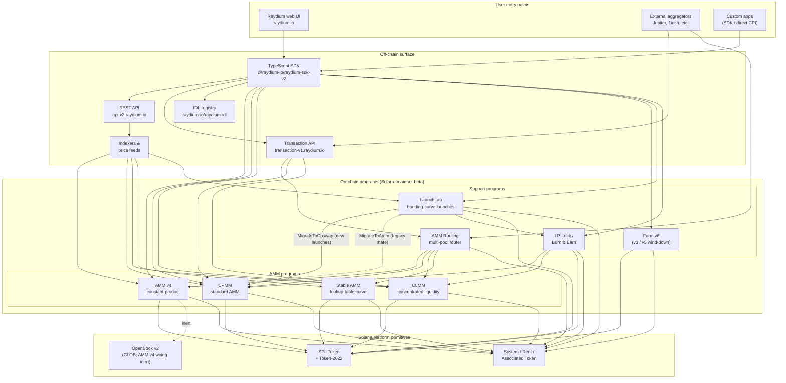

<Info>
  **本頁內容由 AI 自動翻譯，所有內容以英文版本為準。**

  [查看英文版 →](/protocol-overview/architecture)
</Info>

<Info>
  **本頁是文件中唯一的規範架構圖。** 其他章節都連結回此處，而不是重新繪製系統。程式 ID 不嵌入本頁 — 它們位於 [`reference/program-addresses`](/zh-Hant/reference/program-addresses)，以便在一個地方更新。
</Info>

## Raydium 實際上是什麼

Raydium **不是一個程式**。它是一組獨立的鏈上 Solana 程式，共享一個通用的鏈下介面（REST API、TypeScript SDK、IDL 登錄）和一些約定（授權 PDA、費用設定帳戶、管理員多簽）。使用者互動 — 交換、存入、農場收穫 — 路由到這些程式中的恰好一個；鏈下介面使它們看起來像一個單一產品。

鏈上足跡分為四種程式：

1. **AMM 程式** — 四個獨立的流動性池程式，各有自己的格式和定價數學：
   - **AMM v4** — 原始的恆定乘積 AMM。最初是一個混合設計，將曲線鏡像到 OpenBook（前身為 Serum）市場；OpenBook 整合已被停用，池現在作為純 AMM 對曲線運作。仍然是許多主要交易對最深的場所。
   - **CPMM** — 在 Solana 上原生構建的純恆定乘積 AMM（`x · y = k`），具有一流的 Token-2022 支援。**推薦用於新的恆定乘積池的程式。**
   - **CLMM** — Uniswap v3 風格的集中流動性 AMM。流動性提供到價格範圍；費用按位置累積；狀態圍繞 tick 和 `sqrt_price_x64` 組織。
   - **Stable AMM** — 一個薄流動性 StableSwap 風格程式（從 AMM v4 分叉，具有查詢表定價曲線），路由器用於穩定幣相關交易對。目前在 UI 中未作為一流的建立池選項呈現。
2. **獎勵分配** — **Farm**（v3 / v5 / v6，v6 為活躍版本；v3/v5 僅用於風險管理）。
3. **代幣啟動** — **LaunchLab**，一個結合曲線程式。新初始化的啟動 **升級** 到 CPMM。舊版 AMM v4 遷移指令保留用於現有啟動狀態。
4. **流動性原語** — **AMM 路由**（在單個交易中 CPI 到四個 AMM 程式的鏈上多池路由器）和 **LP-Lock / Burn & Earn**（鎖定 LP 位置同時保持費用索賠開放）。

堆棧中的其他所有內容 — REST API、交易 API、TypeScript SDK、UI — 是鏈下基礎設施，在 Solana 和 SPL Token / Token-2022 之上組合這些程式。Perps 介面是 Orderly Network 之上的單獨整合，不是鏈上 Raydium 程式；它被排除在此圖之外。

## 規範圖

```mermaid
flowchart TB
  subgraph user ["User entry points"]
    UI["Raydium web UI<br/>raydium.io"]
    AGG["External aggregators<br/>Jupiter, 1inch, etc."]
    CUST["Custom apps<br/>(SDK / direct CPI)"]
  end

  subgraph offchain ["Off-chain surface"]
    API["REST API<br/>api-v3.raydium.io"]
    TXAPI["Transaction API<br/>transaction-v1.raydium.io"]
    SDK["TypeScript SDK<br/>@raydium-io/raydium-sdk-v2"]
    IDL["IDL registry<br/>raydium-io/raydium-idl"]
    IDX["Indexers &<br/>price feeds"]
  end

  subgraph onchain ["On-chain programs (Solana mainnet-beta)"]
    subgraph amms ["AMM programs"]
      direction TB
      AMM4["AMM v4<br/>constant-product"]
      CPMM["CPMM<br/>standard AMM"]
      CLMM["CLMM<br/>concentrated liquidity"]
      STABLE["Stable AMM<br/>lookup-table curve"]
    end

    subgraph support ["Support programs"]
      direction TB
      ROUTE["AMM Routing<br/>multi-pool router"]
      FARM["Farm v6<br/>(v3 / v5 wind-down)"]
      LAUNCH["LaunchLab<br/>bonding-curve launches"]
      LOCK["LP-Lock /<br/>Burn & Earn"]
    end
  end

  subgraph solana ["Solana platform primitives"]
    TOKEN["SPL Token<br/>+ Token-2022"]
    OB["OpenBook v2<br/>(CLOB; AMM v4 wiring inert)"]
    SYS["System / Rent /<br/>Associated Token"]
  end

  %% Client paths
  UI --> SDK
  CUST --> SDK
  AGG --> TXAPI
  AGG --> ROUTE

  %% Off-chain composition
  SDK --> API
  SDK --> TXAPI
  SDK --> IDL
  SDK --> AMM4
  SDK --> CPMM
  SDK --> CLMM
  SDK --> FARM
  SDK --> LAUNCH
  SDK --> LOCK

  TXAPI --> ROUTE
  TXAPI --> CPMM
  TXAPI --> CLMM

  API --> IDX
  IDX --> AMM4
  IDX --> CPMM
  IDX --> CLMM
  IDX --> STABLE
  IDX --> LAUNCH

  %% Routing → AMM programs (CPI)
  ROUTE --> AMM4
  ROUTE --> CPMM
  ROUTE --> CLMM
  ROUTE --> STABLE

  %% LaunchLab graduation paths
  LAUNCH -- "MigrateToCpswap (new launches)" --> CPMM
  LAUNCH -. "MigrateToAmm (legacy state)" .-> AMM4
  LAUNCH --> LOCK

  %% LP-Lock wraps LP from CPMM / CLMM pools
  LOCK --> CPMM
  LOCK --> CLMM

  %% Programs → SPL Token / Token-2022
  AMM4 --> TOKEN
  CPMM --> TOKEN
  CLMM --> TOKEN
  STABLE --> TOKEN
  FARM --> TOKEN
  LAUNCH --> TOKEN
  LOCK --> TOKEN

  %% AMM v4's historical OpenBook wiring is inert
  AMM4 -. "inert" .-> OB

  %% Programs → System / Rent / ATA
  AMM4 --> SYS
  CPMM --> SYS
  CLMM --> SYS
  STABLE --> SYS
  FARM --> SYS
  LAUNCH --> SYS
  LOCK --> SYS
  ROUTE --> SYS
```

此圖捕捉的關鍵不變量：

- **AMM 程式是對等的。** CPMM 不呼叫 CLMM；CLMM 不呼叫 AMM v4；Stable AMM 是自己的程式。一個池上的直接交換恰好接觸一個 AMM 程式。唯一在單個交易中組合多個 AMM 的程式是 **AMM 路由**，當路由跨越池類型時，它根據需要 CPI 到 AMM v4 / CPMM / CLMM / Stable AMM。
- **SDK 和交易 API 是組合層，不是程式。** 當 web UI 或聚合器構建「通過三個池交換」交易時，SDK（客戶端）或交易 API（伺服器端）使用從 REST API 獲取的報價將指令拼接在一起。鏈看到一個具有 N 個指令的單個 Solana 交易 — 沒有協調器程式擁有整個流程。
- **AMM v4 的 OpenBook 接線是惰性的。** AMM v4 是唯一與 OpenBook 綁定的 AMM，但整合已被停用 — 池不再與 OpenBook 共享流動性，`MonitorStep` 不再被啟動，OpenBook 中斷對當前交換流量沒有影響。市場帳戶保留在池的 `AmmInfo` 上以實現向後相容性，但參考未使用的狀態。CPMM、CLMM 和 Stable AMM 從未有過 CLOB 依賴。
- **新的 LaunchLab 池升級到 CPMM。** 初始化現在需要 `migrate_type = CPSWAP`。`MigrateToAmm` 保留用於現有舊版狀態。在 2026-08-14 升級之前，CPMM 遷移為創建者單獨鎖定 `creator_scale`。之後執行的遷移將其與 `platform_scale` 組合為一個平台擁有的鎖定 LP 位置。早期費用鍵保持不變。
- **LP-Lock 是包裝器，不是第五個 AMM。** 它代表創建者在 PDA 下持有 LP 位置，以便基礎費用仍可被索賠，而不暴露提取流動性的能力。它在 CPMM 和 CLMM 池上組合。
- **鏈下介面相互補充。** REST API 是唯讀的並帶有快取；交易 API 在伺服器端構建準備簽署的交易；SDK 在客戶端構建它們。所有三個都依賴相同的 IDL 登錄作為架構真實來源。

## 數據流：CPMM 交換，端到端

為了使圖片具體化，以下是使用者從 Raydium UI 在 CPMM 池上交換 USDC → RAY 時發生的情況。（AMM v4 和 CLMM 在它們需要的帳戶中有所不同，而不是在高級形狀中。）

1. **報價請求（鏈下）。** UI 使用輸入 mint、輸出 mint、金額和滑點容限呼叫 `GET https://api-v3.raydium.io/compute/swap-base-in`。API 查詢其索引器，選擇路由（可能通過多個池），並返回報價加上客戶端需要的程式 ID、池 ID 和費用帳戶列表。
2. **交易構建（客戶端 + SDK）。** 客戶端將報價傳遞給 `raydium-sdk-v2`。SDK 解析它需要的每個 PDA（授權 PDA、池狀態、觀察、保管庫 — 見 [`products/cpmm/accounts`](/zh-Hant/products/cpmm/accounts)），注入使用者的關聯代幣帳戶（如果缺失，使用關聯代幣程式建立它們），並發出未簽署的 `Transaction`。
3. **錢包簽署。** 使用者的錢包簽署交易。這裡沒有 Raydium 特定的內容；這是標準的 Solana 錢包流程。
4. **鏈上執行。** 簽署的交易進入 Raydium **CPMM 程式**，它（a）驗證池狀態，（b）使用池的費用設定應用恆定乘積曲線，（c）通過 CPI 到 SPL Token / Token-2022 在使用者的 ATA 和池保管庫之間移動代幣，（d）更新 `observation` 帳戶以用於 TWAP，以及（e）返回。
5. **索引器攝取。** Solana RPC 幾個 slot 後暴露程式日誌。Raydium 的索引器解析它們，更新池的儲備、24 小時交易量和 APR，並將更新的值提供給下一個 `/pools/info/ids` 請求。

所有四個步驟 2–4 發生在單個 Solana 交易內。API 僅涉及 **步驟 1**（報價）和 **步驟 5**（為下次索引）。如果 API 關閉，具有實時 SDK 和 Solana RPC 的客戶端仍可交易 — 它只需自己計算路由。

## 共享基礎設施

幾個原語被每個產品使用，值得命名一次，以便後續章節可以參考它們而無需重新定義。詳細資訊位於 [`protocol-overview/shared-infrastructure`](/zh-Hant/protocol-overview/shared-infrastructure)；這是索引。

| 原語 | 它是什麼 | 定義位置 |
|-----------|------------|---------------------|
| **授權 PDA** | 一個程式擁有的簽署者，實際控制代幣保管庫。使用者從不持有保管庫授權。 | 每個程式；CPMM 使用 `vault_and_lp_mint_auth_seed` — 見 [`products/cpmm/accounts`](/zh-Hant/products/cpmm/accounts)。 |
| **設定帳戶** | 每個程式帳戶持有費率、管理員鑰匙和基金/創建者目的地。在 CPMM 中由 `u16` 索引（`amm_config[index]`）。 | [`reference/program-addresses`](/zh-Hant/reference/program-addresses) 列出返回它們的 API 端點。 |
| **協議/基金/創建者費用分割** | 單個交易費用在結算時分為三（有時四）種方式。CPMM 和 CLMM 中的相同模式，不同的旋鈕。 | [`reference/fee-comparison`](/zh-Hant/reference/fee-comparison) |
| **觀察帳戶** | 用於 TWAP 的價格樣本環形緩衝區。在每次交換時寫入。 | [`products/cpmm/accounts`](/zh-Hant/products/cpmm/accounts)、[`products/clmm/accounts`](/zh-Hant/products/clmm/accounts) |
| **REST API（`api-v3.raydium.io`）** | 用於池元數據、位置、農場狀態和報價計算的單一公共讀 API。 | [`sdk-api/rest-api`](/zh-Hant/sdk-api/rest-api) |
| **IDL 登錄** | 每個程式的 Anchor IDL，鏡像在 [`github.com/raydium-io/raydium-idl`](https://github.com/raydium-io/raydium-idl)。SDK 和 CPI 整合器根據這些反序列化。 | [`sdk-api/anchor-idl`](/zh-Hant/sdk-api/anchor-idl) |

## 鏈下介面：API vs SDK vs IDL

這三個經常被混淆。它們做不同的事情：

- **REST API**（`api-v3.raydium.io`）是鏈上狀態的 **讀取為主、快取視圖** 加上 **報價引擎**。它告訴你哪些池存在、它們的儲備是什麼、APR 看起來如何，以及交換的最佳路由是什麼。它 **不** 構建交易。
- **TypeScript SDK**（`@raydium-io/raydium-sdk-v2`）是一個 **交易構建器**。它知道每個程式的帳戶佈局和指令格式。它在組合指令之前從 RPC 獲取新鮮狀態（不是從 API），以便它可以簽署準確的交易。它僅在需要報價時與 API 交談。
- **IDL 登錄** 是上述兩者依賴的 **架構**。如果你正在編寫 Rust CPI 到 Raydium 程式，IDL 是合約；如果你正在編寫 TS 整合，你通過 SDK 間接使用 IDL。

## 每章適合的位置

上面的圖表在整個文件中以縮減形式重複出現。以下是每個部分的完整處理位置，以便你可以深入了解：

- **鏈上程式：** [`products/`](/zh-Hant/products) 下每個產品一章。每章遵循相同的範本（概述 → 帳戶 → 數學 → 指令 → 費用 → 程式碼演示）。
- **共享跨程式原語：** [`protocol-overview/shared-infrastructure`](/zh-Hant/protocol-overview/shared-infrastructure) 和 [`algorithms/`](/zh-Hant/algorithms) 用於重複出現的數學（恆定乘積、集中流動性、曲線定價）。
- **鏈下介面：** [`sdk-api/`](/zh-Hant/sdk-api) 有完整的 SDK 和 REST API 參考，加上 [`sdk-api/anchor-idl`](/zh-Hant/sdk-api/anchor-idl) 和 [`sdk-api/rust-cpi`](/zh-Hant/sdk-api/rust-cpi)。
- **使用者級流程（建立池、交換、LP、索賠獎勵、啟動代幣）：** [`user-flows/`](/zh-Hant/user-flows)。
- **其他團隊的整合模式（聚合器、錢包、機器人）：** [`integration-guides/`](/zh-Hant/integration-guides)。
- **安全介面、管理員鑰匙、已知風險、審計：** [`security/`](/zh-Hant/security)。
- **版本化更改和 AMM v4 → CPMM / Farm v3 → v6 遷移故事：** [`protocol-overview/versions-and-migration`](/zh-Hant/protocol-overview/versions-and-migration)。

## 此圖的非目標

一些刻意的遺漏，所以沒有人讀取超過其中的內容：

- **沒有價格預言機。** Raydium 不依賴 Pyth、Switchboard 或任何外部預言機來進行其核心 AMM 定價。報價來自鏈上儲備。`observation` 帳戶存在，以便 **其他** 合約可以讀取 Raydium TWAP — Raydium 本身不需要它。
- **沒有鏈上代幣投票程式。** 管理員操作（如費用設定更新和程式升級）由多簽執行。多簽鑰匙和輪換政策位於 [`security/admin-and-multisig`](/zh-Hant/security/admin-and-multisig)。
- **沒有橋接。** Raydium 是 Solana 原生的。跨鏈流程是整合者的問題，位於此圖之外。

來源：

- [`reference/program-addresses`](/zh-Hant/reference/program-addresses) 用於本頁引用的規範程式 ID
- [github.com/raydium-io/raydium-sdk-V2](https://github.com/raydium-io/raydium-sdk-V2)
- [github.com/raydium-io/raydium-idl](https://github.com/raydium-io/raydium-idl)
