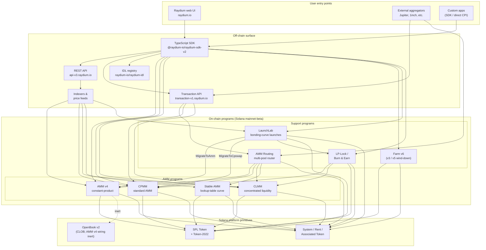

<Info>
  **本页内容由 AI 自动翻译，所有内容以英文版本为准。**

  [查看英文版 →](/protocol-overview/architecture)
</Info>

<Info>
  **这是文档的唯一规范架构图。** 其他章节都链接回这里，而不是重新绘制系统。程序 ID 不嵌入本页 — 它们位于 [`reference/program-addresses`](/zh/reference/program-addresses)，以便在一个位置进行更新。
</Info>

## Raydium 实际上是什么

Raydium **不是一个程序**。它是一组独立的链上 Solana 程序，共享一个通用的链下接口（REST API、TypeScript SDK、IDL 注册表）和一些约定（权限 PDA、费用配置账户、管理员多签）。用户交互 — 交换、存款、收获农场 — 路由到恰好其中一个程序；链下接口使它们看起来像一个单一的产品。

链上足迹分为四种程序：

1. **AMM 程序** — 四个独立的流动性池程序，各有自己的格式和定价数学：
   - **AMM v4** — 原始的恒定乘积 AMM。最初是一种混合设计，它将曲线镜像到 OpenBook（以前是 Serum）市场；OpenBook 集成已被停用，池现在作为针对曲线的纯 AMM 运行。仍然是许多主要交易对的最深流动性场所。
   - **CPMM** — 在 Solana 上本地构建的普通恒定乘积 AMM（`x · y = k`），具有一级 Token-2022 支持。**推荐用于新的恒定乘积池的程序。**
   - **CLMM** — Uniswap v3 风格的集中流动性 AMM。流动性被提供到价格范围；费用按头寸累积；状态围绕 tick 和 `sqrt_price_x64` 组织。
   - **Stable AMM** — 一个薄流动性的 StableSwap 风格程序（从 AMM v4 分叉，具有查找表定价曲线），路由器用于稳定币相关交易对。目前未在 UI 中作为第一类创建池选项公开。
2. **奖励分发** — **Farm**（v3 / v5 / v6，其中 v6 是活跃版本；v3/v5 仅用于风险转移）。
3. **代币启动** — **LaunchLab**，一个绑定曲线程序。成功的启动会根据启动的配置**升级**到 AMM v4 池或 CPMM 池，LP 通过 LP-Lock 程序包装。
4. **流动性原语** — **AMM 路由**（在单个交易中 CPI 到四个 AMM 程序的链上多池路由器）和 **LP-Lock / Burn & Earn**（锁定 LP 头寸同时保持费用索赔开放）。

堆栈中的所有其他内容 — REST API、Transaction API、TypeScript SDK、UI — 都是链下基础设施，在 Solana 和 SPL Token / Token-2022 之上组合这些程序。Perps 接口是在 Orderly Network 之上的独立集成，不是链上 Raydium 程序；它被排除在本图之外。

## 规范图

本图捕获的关键不变量：

- **AMM 程序是对等的。** CPMM 不会调用 CLMM；CLMM 不会调用 AMM v4；Stable AMM 是其自己的程序。一个池上的直接交换恰好涉及一个 AMM 程序。唯一在单个交易中组合多个 AMM 的程序是 **AMM 路由**，它根据需要 CPI 到 AMM v4 / CPMM / CLMM / Stable AMM，当路由跨越池类型时。
- **SDK 和 Transaction API 是组合层，不是程序。** 当 Web UI 或聚合器构建"通过三个池的交换"交易时，SDK（客户端）或 Transaction API（服务器端）使用从 REST API 获取的报价将指令拼接在一起。链看到一个具有 N 条指令的单个 Solana 交易 — 没有协调器程序拥有整个流程。
- **AMM v4 的 OpenBook 接线已停用。** AMM v4 是唯一绑定到 OpenBook 的 AMM，但集成已被停用 — 池不再与 OpenBook 共享流动性，`MonitorStep` 不再被执行，OpenBook 中断对当前交换流量没有影响。市场账户仍然在池的 `AmmInfo` 上保持向后兼容性，但引用未使用的状态。CPMM、CLMM 和 Stable AMM 从未有过 CLOB 依赖。
- **LaunchLab 升级到两个 AMM 程序之一。** 成功的启动调用 `MigrateToAmm`（目标：AMM v4）或 `MigrateToCpswap`（目标：CPMM），取决于其 `migrate_type`；Token-2022 启动总是迁移到 CPMM。升级后的 LP 通过 `PlatformConfig` 拆分，创建者/平台切片通过 LP-Lock 程序包装为 Fee Key NFT（Burn & Earn 模式）。
- **LP-Lock 是一个包装器，不是第五个 AMM。** 它代表创建者在 PDA 下持有 LP 头寸，以便仍然可以索赔基础费用，而无需暴露提取流动性的能力。它组合 CPMM 和 CLMM 池。
- **链下接口相互补充。** REST API 是只读的且缓存的；Transaction API 在服务器端构建准备签署的交易；SDK 在客户端构建它们。三者都依赖同一个 IDL 注册表作为架构的真实来源。

## 数据流：一个 CPMM 交换，端到端

为了使图形具体化，以下是用户从 Raydium UI 在 CPMM 池上交换 USDC → RAY 时发生的情况。（AMM v4 和 CLMM 在所需的账户上有所不同，而不是高层形状。）

1. **报价请求（链下）。** UI 调用 `GET https://api-v3.raydium.io/compute/swap-base-in`，带有输入铸币、输出铸币、金额和滑点容差。API 查询其索引器，选择一条路由（可能通过多个池），并返回报价加上客户端需要的程序 ID、池 ID 和费用账户的列表。
2. **交易构建（客户端 + SDK）。** 客户端将报价传递给 `raydium-sdk-v2`。SDK 解析它需要的每个 PDA（权限 PDA、池状态、观察、vault — 见 [`products/cpmm/accounts`](/zh/products/cpmm/accounts)），注入用户的关联代币账户（如果缺失则使用关联代币程序创建），并发出未签署的 `Transaction`。
3. **钱包签署。** 用户的钱包签署交易。这里没有 Raydium 特定的东西；这是标准的 Solana 钱包流程。
4. **链上执行。** 签署的交易进入 Raydium **CPMM 程序**，它（a）验证池状态，（b）使用池的费用配置应用恒定乘积曲线，（c）通过 CPI 进入 SPL Token / Token-2022 在用户的 ATA 和池 vault 之间移动代币，（d）更新 TWAP 的 `observation` 账户，以及（e）返回。
5. **索引器接收。** Solana RPC 几个 slot 后公开程序日志。Raydium 的索引器解析它们，更新池的准备金、24 小时交易量和 APR，并将更新的值提供给下一个 `/pools/info/ids` 请求。

所有四个步骤 2–4 在单个 Solana 交易中发生。API 仅涉及 **步骤 1**（报价）和 **步骤 5**（为下一次索引）。如果 API 宕机，具有实时 SDK 和 Solana RPC 的客户端仍然可以交易 — 它只需要自己计算路由。

## 共享基础设施

几个原语被每个产品使用，值得命名一次，以便后续章节可以参考而无需重新定义。详细信息位于 [`protocol-overview/shared-infrastructure`](/zh/protocol-overview/shared-infrastructure)；这是索引。

| 原语 | 它是什么 | 在哪里定义 |
|-----------|------------|---------------------|
| **权限 PDA** | 一个程序拥有的签署者，实际上控制代币 vault。用户从不持有 vault 权限。 | 每个程序；CPMM 使用 `vault_and_lp_mint_auth_seed` — 见 [`products/cpmm/accounts`](/zh/products/cpmm/accounts)。 |
| **配置账户** | 每个程序账户持有费率、管理员密钥和基金/创建者目的地。在 CPMM 中由 `u16` 索引（`amm_config[index]`）。 | [`reference/program-addresses`](/zh/reference/program-addresses) 列出了返回它们的 API 端点。 |
| **协议/基金/创建者费用拆分** | 单一交易费用在结算时拆分为三个（有时四个）方式。CPMM 和 CLMM 中的相同模式，不同的旋钮。 | [`reference/fee-comparison`](/zh/reference/fee-comparison) |
| **观察账户** | 用于 TWAP 的价格样本环形缓冲区。在每次交换时写入。 | [`products/cpmm/accounts`](/zh/products/cpmm/accounts), [`products/clmm/accounts`](/zh/products/clmm/accounts) |
| **REST API（`api-v3.raydium.io`）** | 池元数据、头寸、农场状态和报价计算的单一公共读 API。 | [`sdk-api/rest-api`](/zh/sdk-api/rest-api) |
| **IDL 注册表** | 每个程序的 Anchor IDL，在 [`github.com/raydium-io/raydium-idl`](https://github.com/raydium-io/raydium-idl) 镜像。SDK 和 CPI 集成者针对这些反序列化。 | [`sdk-api/anchor-idl`](/zh/sdk-api/anchor-idl) |

## 链下接口：API 对比 SDK 对比 IDL

这三个经常被混淆。它们做不同的事情：

- **REST API**（`api-v3.raydium.io`）是链上状态的**读取为主、缓存视图**加上**报价引擎**。它告诉你哪些池存在，它们的准备金是多少，APR 看起来如何，以及交换的最佳路由是什么。它**不**构建交易。
- **TypeScript SDK**（`@raydium-io/raydium-sdk-v2`）是一个**交易构建器**。它知道每个程序的账户布局和指令格式。在组合指令之前，它从 RPC 获取新鲜状态（而不是从 API），因此可以签署准确的交易。它只在需要报价时与 API 通话。
- **IDL 注册表**是两者都依赖的**架构**。如果你正在编写 Rust CPI 到 Raydium 程序，IDL 是合同；如果你正在编写 TS 集成，你通过 SDK 间接使用 IDL。

## 每一章的位置

上面的图表以简化的形式在整个文档中重复出现。以下是每个部分的完整处理所在的位置，以便你可以深入了解：

- **链上程序：** [`products/`](/zh/products) 下每个产品一章。每一章都遵循相同的模板（概述 → 账户 → 数学 → 指令 → 费用 → 代码演示）。
- **共享跨程序原语：** [`protocol-overview/shared-infrastructure`](/zh/protocol-overview/shared-infrastructure) 和 [`algorithms/`](/zh/algorithms) 用于重复出现的数学（恒定乘积、集中流动性、曲线定价）。
- **链下接口：** [`sdk-api/`](/zh/sdk-api) 有完整的 SDK 和 REST API 参考，加上 [`sdk-api/anchor-idl`](/zh/sdk-api/anchor-idl) 和 [`sdk-api/rust-cpi`](/zh/sdk-api/rust-cpi)。
- **用户级流程（创建池、交换、LP、索赔奖励、启动代币）：** [`user-flows/`](/zh/user-flows)。
- **其他团队的集成模式（聚合器、钱包、机器人）：** [`integration-guides/`](/zh/integration-guides)。
- **安全表面、管理员密钥、已知风险、审计：** [`security/`](/zh/security)。
- **版本化的变化和 AMM v4 → CPMM / Farm v3 → v6 迁移故事：** [`protocol-overview/versions-and-migration`](/zh/protocol-overview/versions-and-migration)。

## 本图的非目标

一些刻意的遗漏，所以没有人会过度解读：

- **没有价格预言机。** Raydium 不依赖 Pyth、Switchboard 或任何外部预言机进行其核心 AMM 定价。报价来自链上准备金。`observation` 账户存在所以**其他**合约可以读取 Raydium TWAP — Raydium 本身不需要它。
- **没有链上代币投票程序。** 管理员操作（如费用配置更新和程序升级）由多签执行。多签密钥和轮换策略在 [`security/admin-and-multisig`](/zh/security/admin-and-multisig)。
- **没有桥。** Raydium 是 Solana 原生的。跨链流程是集成者的问题，位于本图之外。

来源：

- [`reference/program-addresses`](/zh/reference/program-addresses) 用于本页面引用的规范程序 ID
- [github.com/raydium-io/raydium-sdk-V2](https://github.com/raydium-io/raydium-sdk-V2)
- [github.com/raydium-io/raydium-idl](https://github.com/raydium-io/raydium-idl)
