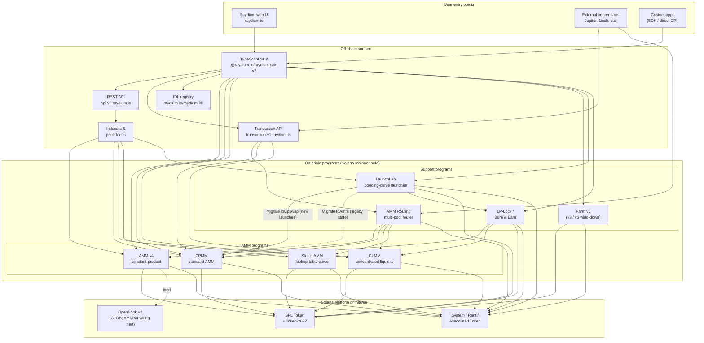

<Info>
  **本页内容由 AI 自动翻译，所有内容以英文版本为准。**

  [查看英文版 →](/protocol-overview/architecture)
</Info>

<Info>
  **本页是文档中唯一的规范架构图。** 其他每一章都链接回这里，而不是重新绘制系统。程序 ID 不嵌入本页 — 它们位于 [`reference/program-addresses`](/zh/reference/program-addresses)，以便在一个地方更新。
</Info>

## Raydium 实际上是什么

Raydium **不是一个程序**。它是一组独立的链上 Solana 程序，共享一个通用的链下接口（REST API、TypeScript SDK、IDL 注册表）和一些约定（权限 PDA、费用配置账户、管理员多签）。用户交互 — 交换、存入、收获农场 — 路由到这些程序中的一个；链下接口使它们看起来像一个单一产品。

链上足迹分为四类程序：

1. **AMM 程序** — 四个独立的池程序，每个都有自己的格式和定价数学：
   - **AMM v4** — 原始的恒定乘积 AMM。最初是一个混合设计，将曲线镜像到 OpenBook（原 Serum）市场；OpenBook 集成已被停用，池现在作为纯 AMM 对曲线运行。仍然是许多主要交易对最深的场所。
   - **CPMM** — 在 Solana 上原生构建的普通恒定乘积 AMM（`x · y = k`），具有一流的 Token-2022 支持。**推荐用于新的恒定乘积池的程序。**
   - **CLMM** — Uniswap v3 风格的集中流动性 AMM。流动性提供到价格范围；费用按头寸累积；状态围绕 tick 和 `sqrt_price_x64` 组织。
   - **Stable AMM** — 一个薄流动性 StableSwap 风格的程序（从 AMM v4 分叉，带有查找表定价曲线），路由器用于稳定币相关交易对。目前在 UI 中不作为一流的创建池选项呈现。
2. **奖励分配** — **Farm**（v3 / v5 / v6，v6 为活跃版本；v3/v5 仅用于风险管理）。
3. **代币启动** — **LaunchLab**，一个绑定曲线程序。新初始化的启动 **毕业** 到 CPMM。遗留 AMM v4 迁移指令保留用于现有启动状态。
4. **流动性原语** — **AMM 路由**（在单个交易中 CPI 到四个 AMM 程序的链上多池路由器）和 **LP-Lock / Burn & Earn**（锁定 LP 头寸，同时保持费用索赔开放）。

堆栈中的其他所有内容 — REST API、Transaction API、TypeScript SDK、UI — 是链下基础设施，在 Solana 和 SPL Token / Token-2022 之上组合这些程序。Perps 接口是 Orderly Network 之上的单独集成，不是链上 Raydium 程序；它被排除在此图之外。

## 规范图

```mermaid
flowchart TB
  subgraph user ["User entry points"]
    UI["Raydium web UI<br/>raydium.io"]
    AGG["External aggregators<br/>Jupiter, 1inch, etc."]
    CUST["Custom apps<br/>(SDK / direct CPI)"]
  end

  subgraph offchain ["Off-chain surface"]
    API["REST API<br/>api-v3.raydium.io"]
    TXAPI["Transaction API<br/>transaction-v1.raydium.io"]
    SDK["TypeScript SDK<br/>@raydium-io/raydium-sdk-v2"]
    IDL["IDL registry<br/>raydium-io/raydium-idl"]
    IDX["Indexers &<br/>price feeds"]
  end

  subgraph onchain ["On-chain programs (Solana mainnet-beta)"]
    subgraph amms ["AMM programs"]
      direction TB
      AMM4["AMM v4<br/>constant-product"]
      CPMM["CPMM<br/>standard AMM"]
      CLMM["CLMM<br/>concentrated liquidity"]
      STABLE["Stable AMM<br/>lookup-table curve"]
    end

    subgraph support ["Support programs"]
      direction TB
      ROUTE["AMM Routing<br/>multi-pool router"]
      FARM["Farm v6<br/>(v3 / v5 wind-down)"]
      LAUNCH["LaunchLab<br/>bonding-curve launches"]
      LOCK["LP-Lock /<br/>Burn & Earn"]
    end
  end

  subgraph solana ["Solana platform primitives"]
    TOKEN["SPL Token<br/>+ Token-2022"]
    OB["OpenBook v2<br/>(CLOB; AMM v4 wiring inert)"]
    SYS["System / Rent /<br/>Associated Token"]
  end

  %% Client paths
  UI --> SDK
  CUST --> SDK
  AGG --> TXAPI
  AGG --> ROUTE

  %% Off-chain composition
  SDK --> API
  SDK --> TXAPI
  SDK --> IDL
  SDK --> AMM4
  SDK --> CPMM
  SDK --> CLMM
  SDK --> FARM
  SDK --> LAUNCH
  SDK --> LOCK

  TXAPI --> ROUTE
  TXAPI --> CPMM
  TXAPI --> CLMM

  API --> IDX
  IDX --> AMM4
  IDX --> CPMM
  IDX --> CLMM
  IDX --> STABLE
  IDX --> LAUNCH

  %% Routing → AMM programs (CPI)
  ROUTE --> AMM4
  ROUTE --> CPMM
  ROUTE --> CLMM
  ROUTE --> STABLE

  %% LaunchLab graduation paths
  LAUNCH -- "MigrateToCpswap (new launches)" --> CPMM
  LAUNCH -. "MigrateToAmm (legacy state)" .-> AMM4
  LAUNCH --> LOCK

  %% LP-Lock wraps LP from CPMM / CLMM pools
  LOCK --> CPMM
  LOCK --> CLMM

  %% Programs → SPL Token / Token-2022
  AMM4 --> TOKEN
  CPMM --> TOKEN
  CLMM --> TOKEN
  STABLE --> TOKEN
  FARM --> TOKEN
  LAUNCH --> TOKEN
  LOCK --> TOKEN

  %% AMM v4's historical OpenBook wiring is inert
  AMM4 -. "inert" .-> OB

  %% Programs → System / Rent / ATA
  AMM4 --> SYS
  CPMM --> SYS
  CLMM --> SYS
  STABLE --> SYS
  FARM --> SYS
  LAUNCH --> SYS
  LOCK --> SYS
  ROUTE --> SYS
```

此图捕获的关键不变量：

- **AMM 程序是对等的。** CPMM 不调用 CLMM；CLMM 不调用 AMM v4；Stable AMM 是自己的程序。一个池上的直接交换恰好接触一个 AMM 程序。唯一在单个交易中组合多个 AMM 的程序是 **AMM 路由**，当路由跨越池类型时，它根据需要 CPI 到 AMM v4 / CPMM / CLMM / Stable AMM。
- **SDK 和 Transaction API 是组合层，不是程序。** 当 Web UI 或聚合器构建"通过三个池交换"交易时，SDK（客户端）或 Transaction API（服务器端）使用从 REST API 获取的报价将指令拼接在一起。链看到一个 Solana 交易，有 N 条指令 — 没有编排程序拥有整个流程。
- **AMM v4 的 OpenBook 接线是惯性的。** AMM v4 是唯一与 OpenBook 绑定的 AMM，但集成已被停用 — 池不再与 OpenBook 共享流动性，`MonitorStep` 不再被激活，OpenBook 中断对当前交换流量没有影响。市场账户保留在池的 `AmmInfo` 上以实现向后兼容性，但引用未使用的状态。CPMM、CLMM 和 Stable AMM 从未有过 CLOB 依赖。
- **新的 LaunchLab 池毕业到 CPMM。** 初始化现在需要 `migrate_type = CPSWAP`。`MigrateToAmm` 保留用于现有遗留状态。在 2026-08-17 升级之前，CPMM 迁移为创建者单独锁定 `creator_scale`。之后执行的迁移将其与 `platform_scale` 合并为一个平台拥有的锁定 LP 头寸。早期费用密钥保持不变。
- **LP-Lock 是包装器，不是第五个 AMM。** 它在 PDA 下代表创建者持有 LP 头寸，以便可以在不暴露提取流动性能力的情况下仍然索赔基础费用。它在 CPMM 和 CLMM 池上组合。
- **链下接口相互补充。** REST API 是只读的，带有缓存；Transaction API 在服务器端构建准备签名的交易；SDK 在客户端构建它们。所有三个都依赖相同的 IDL 注册表作为模式的真实来源。

## 数据流：CPMM 交换，端到端

为了使图片具体化，以下是用户从 Raydium UI 在 CPMM 池上交换 USDC → RAY 时发生的情况。（AMM v4 和 CLMM 在它们需要的账户中有所不同，而不是在高级形状中。）

1. **报价请求（链下）。** UI 调用 `GET https://api-v3.raydium.io/compute/swap-base-in`，带有输入 mint、输出 mint、金额和滑点容限。API 查询其索引器，选择一条路由（可能通过多个池），并返回报价加上客户端需要的程序 ID、池 ID 和费用账户列表。
2. **交易构建（客户端 + SDK）。** 客户端将报价传递给 `raydium-sdk-v2`。SDK 解析它需要的每个 PDA（权限 PDA、池状态、观察、保险库 — 见 [`products/cpmm/accounts`](/zh/products/cpmm/accounts)），注入用户的关联代币账户（如果缺失，使用关联代币程序创建），并发出未签名的 `Transaction`。
3. **钱包签名。** 用户的钱包签署交易。这里没有 Raydium 特定的内容；这是标准的 Solana 钱包流程。
4. **链上执行。** 签署的交易进入 Raydium **CPMM 程序**，它（a）验证池状态，（b）使用池的费用配置应用恒定乘积曲线，（c）通过 CPI 到 SPL Token / Token-2022 在用户的 ATA 和池保险库之间移动代币，（d）更新 TWAP 的 `observation` 账户，（e）返回。
5. **索引器摄入。** Solana RPC 几个 slot 后暴露程序日志。Raydium 的索引器解析它们，更新池的储备、24h 交易量和 APR，并将更新的值提供给下一个 `/pools/info/ids` 请求。

所有四个步骤 2–4 都在单个 Solana 交易中发生。API 仅涉及 **步骤 1**（报价）和 **步骤 5**（为下次索引）。如果 API 关闭，具有实时 SDK 和 Solana RPC 的客户端仍然可以交易 — 它只需要自己计算路由。

## 共享基础设施

几个原语被每个产品使用，值得命名一次，以便后续章节可以引用它们而无需重新定义。详细信息位于 [`protocol-overview/shared-infrastructure`](/zh/protocol-overview/shared-infrastructure)；这是索引。

| 原语 | 它是什么 | 定义位置 |
|-----------|------------|---------------------|
| **权限 PDA** | 一个程序拥有的签名者，实际控制代币保险库。用户从不持有保险库权限。 | 每个程序；CPMM 使用 `vault_and_lp_mint_auth_seed` — 见 [`products/cpmm/accounts`](/zh/products/cpmm/accounts)。 |
| **配置账户** | 每个程序的账户，持有费率、管理员密钥和基金/创建者目的地。在 CPMM 中由 `u16` 索引（`amm_config[index]`）。 | [`reference/program-addresses`](/zh/reference/program-addresses) 列出返回它们的 API 端点。 |
| **协议/基金/创建者费用分割** | 单个交易费用在结算时分为三（有时四）种方式。CPMM 和 CLMM 中的相同模式，不同的旋钮。 | [`reference/fee-comparison`](/zh/reference/fee-comparison) |
| **观察账户** | 用于 TWAP 的价格样本的环形缓冲区。在每次交换时写入。 | [`products/cpmm/accounts`](/zh/products/cpmm/accounts)、[`products/clmm/accounts`](/zh/products/clmm/accounts) |
| **REST API（`api-v3.raydium.io`）** | 池元数据、头寸、农场状态和报价计算的单一公共读 API。 | [`sdk-api/rest-api`](/zh/sdk-api/rest-api) |
| **IDL 注册表** | 每个程序的 Anchor IDL，镜像在 [`github.com/raydium-io/raydium-idl`](https://github.com/raydium-io/raydium-idl)。SDK 和 CPI 集成者针对这些反序列化。 | [`sdk-api/anchor-idl`](/zh/sdk-api/anchor-idl) |

## 链下接口：API vs SDK vs IDL

这三个经常被混淆。它们做不同的事情：

- **REST API**（`api-v3.raydium.io`）是链上状态的 **读取为主、缓存视图** 加上 **报价引擎**。它告诉你哪些池存在、它们的储备是什么、APR 看起来如何，以及交换的最佳路由是什么。它 **不** 构建交易。
- **TypeScript SDK**（`@raydium-io/raydium-sdk-v2`）是一个 **交易构建器**。它知道每个程序的账户布局和指令格式。它在组合指令之前从 RPC 获取新鲜状态（不是从 API），以便它可以签署准确的交易。它仅在需要报价时与 API 通话。
- **IDL 注册表** 是上述两者都依赖的 **模式**。如果你正在编写 Rust CPI 到 Raydium 程序，IDL 是合约；如果你正在编写 TS 集成，你通过 SDK 间接使用 IDL。

## 每一章适合的位置

上面的图表以缩小的形式在整个文档中重复出现。以下是每个部分的完整处理位置，以便你可以深入了解：

- **链上程序：** [`products/`](/zh/products) 下每个产品一章。每章遵循相同的模板（概述 → 账户 → 数学 → 指令 → 费用 → 代码演示）。
- **共享跨程序原语：** [`protocol-overview/shared-infrastructure`](/zh/protocol-overview/shared-infrastructure) 和 [`algorithms/`](/zh/algorithms) 用于重复出现的数学（恒定乘积、集中流动性、曲线定价）。
- **链下接口：** [`sdk-api/`](/zh/sdk-api) 有完整的 SDK 和 REST API 参考，加上 [`sdk-api/anchor-idl`](/zh/sdk-api/anchor-idl) 和 [`sdk-api/rust-cpi`](/zh/sdk-api/rust-cpi)。
- **用户级流程（创建池、交换、LP、索赔奖励、启动代币）：** [`user-flows/`](/zh/user-flows)。
- **其他团队的集成模式（聚合器、钱包、机器人）：** [`integration-guides/`](/zh/integration-guides)。
- **安全接口、管理员密钥、已知风险、审计：** [`security/`](/zh/security)。
- **版本化更改和 AMM v4 → CPMM / Farm v3 → v6 迁移故事：** [`protocol-overview/versions-and-migration`](/zh/protocol-overview/versions-and-migration)。

## 此图的非目标

一些故意的遗漏，所以没有人读取超过其中的内容：

- **没有价格预言机。** Raydium 不依赖 Pyth、Switchboard 或任何外部预言机来进行其核心 AMM 定价。报价来自链上储备。`observation` 账户存在，以便 **其他** 合约可以读取 Raydium TWAP — Raydium 本身不需要它。
- **没有链上代币投票程序。** 管理员操作，如费用配置更新和程序升级，由多签执行。多签密钥和轮换策略在 [`security/admin-and-multisig`](/zh/security/admin-and-multisig)。
- **没有桥接。** Raydium 是 Solana 原生的。跨链流程是集成者的问题，位于此图之外。

来源：

- [`reference/program-addresses`](/zh/reference/program-addresses) 用于本页引用的规范程序 ID
- [github.com/raydium-io/raydium-sdk-V2](https://github.com/raydium-io/raydium-sdk-V2)
- [github.com/raydium-io/raydium-idl](https://github.com/raydium-io/raydium-idl)
